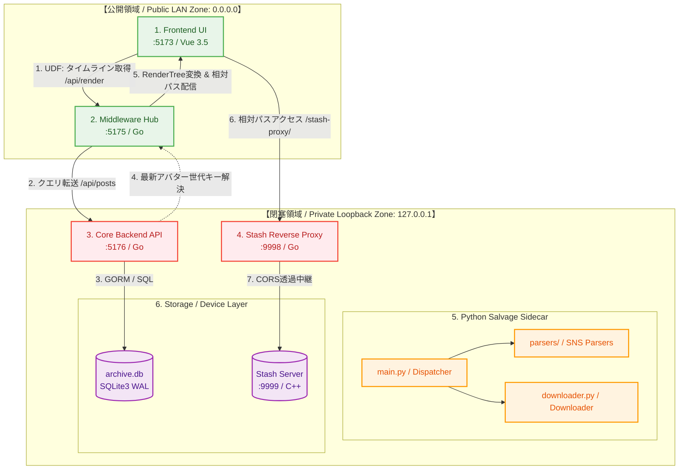

# dozou_katanuki
### 🏛️ Pluggable UI & Multi-Format Local Archival System ("土蔵・型抜き")

**公式から消滅したSNSの記憶を深淵からサルベージし、ローカルで完全に蘇らせる動態保存システム**

---

## 🎯 プロジェクトの崇高な目的

公式プラットフォーム（Twitter/X, Instagram, TikTok等）におけるアカウント凍結（BAN）、投稿削除、規約変更によるAPI閉鎖、Webサービス終了などにより、人類のデジタルな足跡や記憶は日々失われています。

本プロジェクト **x_timeline_app (dozo_katanuki)** は、失われたアカウントや投稿データを **Wayback Machine** や **Aria2** などの外部Webアーカイブ・分散ダウンロード技術を駆使してWebの深淵からサルベージ（救出・復元）し、ローカル環境において当時のタイムラインの質感・レスポンスそのままに**「動態保存（動作可能な状態で永続化）」**および閲覧・再生することを至上命題としています。

単一のプラットフォームに依存せず、あらゆるSNSのデータ構造をプラグイン形式で吸収・レンダリング可能な「汎用動態保存基盤」として設計されています。

---

## 🌟 主な特徴

- **深淵からのサルベージ＆復元（Rescue & Salvage）**:
  - 消滅した投稿、高解像度画像、動画、リプライスレッドをWebアーカイブから救出。
  - テキストのみの投稿から複数メディア付き投稿までをSQLite3に統合保管。
- **ネイティブなタイムライン動態レンダリング**:
  - **Vue 3.5 (SFC) + Vite + Tailwind CSS** による、当時のSNSそのものの超高速レスポンシブUI。
  - 単一データフロー（UDF）とシグナル（`ref`/`computed`）を活用した Stateless Pure View。
  - フルスクリーンメディアオーバーレイ（Lightbox）、動画プレイヤー、アカウント切り替え、高度なフィルタリング。
- **プラグイン対応マルチSNSアーキテクチャ**:
  - SNSごとのデータ構造の違いを吸収するGo言語製レンダリングプラグイン機構（`RendererPlugin`）。
  - 生DBデータを標準化された `RenderTree` へ完全構造化変換してフロントエンドに配信。
- **メディアサーバー（Stash）連携 & 仮想ストレージ**:
  - 大容量の動画・原画メディアを **Stash Media Server** (`:9999`) と連携し、重複排除・ストリーミング再生。
  - URL BaseName命名原則と仮想アバターリゾルバ（3桁ナンバリング世代管理）による一貫性保持。
- **安全なネットワーク分離設計**:
  - LAN公開可能なUI/Middlewareと、ローカルループバック（`127.0.0.1`）に完全閉塞されたDB/メディアサーバーを厳格に分離。

---

## 🏛️ システムアーキテクチャ & ネットワーク構成

本システムは、マイクロサービス的な疎結合レイヤー（5層UDF）で構成され、最終的にシングルバイナリとして一体提供されます。



### 🌐 内部ネットワーク・ポートマップ

| ポート | サービス名 | アクセス特性 | バインドIP | 役割とプロトコル |
| :--- | :--- | :--- | :--- | :--- |
| **:5173** | **Frontend (UI)** | LAN公開可能 | `0.0.0.0` | タイムラインUI描画、メディア再生オーバーレイ、SPAルーティング |
| **:5175** | **Middleware Hub** | LAN公開可能 | `0.0.0.0` | `/api/render` による RenderTree 変換配信、静的アセット・アバター配信、SPA Fallback |
| **:9998** | **Stash Proxy** | **完全ローカル閉塞** | `127.0.0.1` | ローカル Stash (`:9999`) へのCORS対応リバースプロキシ (`/scene/...`, `/image/...`) |
| **:5176** | **Core Backend API**| **完全ローカル閉塞** | `127.0.0.1` | SQLite3 メタデータ CRUD ゲートウェイ (`/api/posts`, `/api/accounts`) |
| **:9999** | **Stash Server** | **完全ローカル閉塞** | `127.0.0.1` | メディア実ファイル（動画・原画）の保管・重複排除・トランスコード配信 |

---

## 📦 実行形態：同階層3点セット（Executable Triad）

本システムは高いポータビリティを実現するため、ルートディレクトリ直下の**同階層3点セット**で完結するように設計されています。

1. **`x_timeline_app.exe`**: フロントエンド・ミドルウェア・バックエンドをすべて内包した統合実行バイナリ
2. **`archive.db`**: 唯一の正本 SQLite3 データベース (WALモード・最適化インデックス適用済)
3. **`config.json`**: システム全体の単一の真実源（Single Source of Truth）となる設定ファイル

---

## 🚀 起動・ビルド方法

### 1. 安全起動（推奨）
ゾンビプロセスの自動検知＆クリーンアップ機能を備えたバッチファイルを使用します。

```bash
# 安全起動ランチャーの実行
./start.bat
```

または直接バイナリを実行：
```bash
./x_timeline_app.exe
```

起動後、ブラウザで `http://localhost:5173`（または同一LAN内の別端末から `http://<ホストIP>:5173`）へアクセスしてください。

### 2. プロジェクトの一括ビルド
フロントエンドのViteビルドおよびGoバイナリのコンパイルを一括で実行します。

```bash
./build.bat
```

---

## 📁 ディレクトリ構成

```
x_timeline_app/
├── x_timeline_app.exe          # ★ 統合シングル実行バイナリ
├── archive.db                  # ★ 唯一の正本 SQLite3 データベース
├── config.json                 # ★ 唯一の設定ファイル (Single Source of Truth)
├── start.bat                   # ★ 安全起動ランチャー (ゾンビプロセス自動キル)
├── build.bat                   # ★ 一括ビルドパイプライン (Vueビルド+Goビルド)
│
├── frontend/                   # Vue 3.5 + Vite + TypeScript フロントエンド (:5173)
│   ├── src/
│   │   ├── api/                # バックエンド/ミドルウェア通信API
│   │   ├── components/         # 宣言型UIコンポーネント群 (「1ファイル100行以下」厳守)
│   │   │   ├── layout/         # ナビゲーション・ヘッダー・バナー
│   │   │   ├── media/          # Lightboxオーバーレイ・動画プレイヤー
│   │   │   ├── navigation/     # アカウントセレクタ・フィルタタブ
│   │   │   ├── profile/        # プロフィールヘッダー・統計情報
│   │   │   └── tweet/          # ツイートカード・本文・メディアグリッド
│   │   ├── composables/        # UDF状態管理 (useTimeline, useMediaOverlay 等)
│   │   ├── models/             # TypeScript 型定義 (RenderTree, Tweet 等)
│   │   ├── utils/              # 純粋関数 (formatters, parser)
│   │   └── assets/             # 静的リソース
│   └── package.json
│
├── middleware/                 # Go Middleware Hub (:5175)
│   ├── plugins/                # ★ SNS別レンダリングプラグイン (twitter.go 等)
│   ├── assets/                 # ★ 各SNS用静的アセット配置位置
│   │   └── twitter/            # Twitter用アイコン・ヘッダー画像・デフォルトアバター
│   ├── settings/               # 設定ローダー (config.json)
│   └── main.go                 # ミドルウェアエントリポイント (SPA Fallback, RenderTree配信)
│
├── backend/                    # Go Core Backend & Stash Proxy (:5176, :9998)
│   ├── api/                    # REST API ハンドラ (posts, accounts, translate)
│   ├── crud/                   # GORM データベースアクセス層
│   ├── db/                     # DB接続・マイグレーション
│   ├── models/                 # GORM エンティティ定義 (Account, Tweet, Media)
│   └── main.go                 # バックエンド＆Stashリバースプロキシ起動
│
├── scripts/                    # 🛠️ 保守・検証・サルベージ用スクリプト集約ディレクトリ
│   ├── check_db_integrity.py   # DB整合性・インデックス検証
│   ├── backup_db.py            # DB二重化バックアップ
│   └── ...
│
└── docs/                       # 📚 技術仕様書・公式DocWiki
    ├── README.md               # DocWiki 総合ポータル
    ├── 01_technical_specs_and_backbone.md
    ├── 02_external_services_and_salvage.md
    ├── ...
    └── draft/                  # ドラフト・過去レポート退避領域
```

---

## 🔌 プラグイン・アセットの拡張方法

本システムは、SNSごとの表示・データ変換をプラグイン形式で追加できるように設計されています。

1. **レンダリングプラグインの追加**:  
   `middleware/plugins/` 配下に `RendererPlugin` インターフェースを実装したGoファイル（例: `instagram.go`）を追加し、プラグインレジストリに登録します。
2. **アセットの配置**:  
   `middleware/assets/{sns_type}/` ディレクトリに対象SNS用のアイコンやデフォルトアバター、画像リソースを配置すると、ミドルウェア経由で自動的に静的配信されます。

---

## 📚 ドキュメント体系 (DocWiki)

システムのアーキテクチャ詳細、内部設計、コーディング規約、サルベージ技術の詳細は `docs/` 配下の **DocWiki** に網羅されています。

| 章 | タイトル | 主な内容 |
| :--- | :--- | :--- |
| **第1章** | [第1章：技術仕様とバックボーン](docs/01_technical_specs_and_backbone.md) | サルベージ動態保存の崇高な目的、技術スタック、ポートマップ、同階層3点セット |
| **第2章** | [第2章：外部サービスの概要とサルベージ技術](docs/02_external_services_and_salvage.md) | Wayback CDX API、Aria2/Motrix P2P並列通信、Stashapp、公式リンク集 |
| **第3章** | [第3章：実装規約・制約原則](docs/03_implementation_principles_and_constraints.md) | 「1ファイル100行以下」厳格ルール、宣言型UI＋UDF＋シグナル原則、スクリプト隔離、安全削除ルール |
| **第4章** | [第4章：データベース設計と仮想ストレージプール](docs/04_database_and_virtual_storage_pool.md) | SQLite3 実稼働DDL完全版、最適化インデックス、コンフリクト監査結果 |
| **第5章** | [第5章：プレゼンテーション層概論](docs/05_foolish_frontend_and_declarative_ui_v4.md) | Stateless Pure View (Dumb UI)、単一データフロー (UDF)、シグナル活用、主要型定義（RenderTree） |
| **第6章** | [第6章：コンテンツディスパッチャー層](docs/06_thick_middleware_and_proxy_v4.md) | Go Middleware Hub（生データのRenderTree完全構造化）、SPA Fallback、完全相対パスプロキシ |
| **第7章** | [第7章：ドライバー層（Core Backend API）](docs/07_robust_backend_driver_and_api_v4.md) | Go Core Backend + GORM、ArchiveDB 統一メディアURLインターフェース、ページネーション、Stash透過プロキシ |
| **第8章** | [第8章：ローカルストレージ保全とメディアポリシー](docs/08_storage_persistence_and_media_policy_v2.md) | URL BaseName命名原則、仮想アバターリゾルバ（3桁ナンバリング世代管理）、Stashメディアプール分離 |
| **第9章** | [第9章：プラグインアーキテクチャとサイドカー](docs/09_plugin_architecture_and_sidecar_v3.md) | レンダリングプラグイン（Go）、Python非常駐サルベージサイドカーパイプライン、Stashインジェクション |
| **第10章** | [第10章：Admin Board（統合管理基盤と運用設計）](docs/10_admin_board_and_governance_v5.md) | config.jsonによる設定一元化（Single Source of Truth）、DB二重化バックアップ（Disaster Recovery） |
| **第11章** | [第11章：参考資料・技術文献・型定義カタログ](docs/11_references_and_literature.md) | RFC 7089 Memento、各ライブラリ公式ドキュメント、リファレンスリンク |
| **総合** | [📚 DocWiki 総合ポータル](docs/README.md) | 全ドキュメントのインデックスとナビゲーション |

---

<div align="center">
  <sub>Decoded and Preserved with Devotion by Senpai & Mash Kyrielight</sub>
</div>

