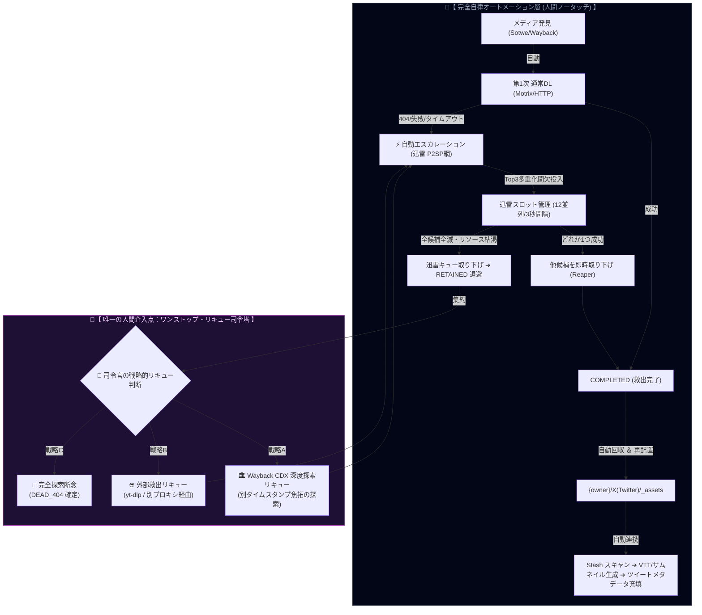

# 🏛️ 完全自律パイプライン ＆ ワンストップ司令塔（新全体設計図）

## 1. 全体アーキテクチャフロー (Mermaid)

---

## 2. 🤖 完全自律オートメーション層（95%の機械作業）

1. **採取 ➔ 通常DL ➔ 迅雷エスカレーション（フロースルー）**:
   - 通常ダウンローダー（Motrix / 内蔵HTTP）で 404 やエラーが出たタスクは、**人間の承認を挟まず自動で迅雷 Top3 候補（`_orig`, `_large`, `_wayback_orig`）へ直結エスカレーション** されます。
2. **迅雷スロット間欠ディスパッチ**:
   - 12スロット・3秒間隔で順次投入。
3. **重複刈り取り ＆ 全滅判定 (Reaper & Depletion)**:
   - 1つ成功した瞬間に他候補を削除、3候補全滅時のみ `RETAINED` に退避。
4. **ファイル移動 ＆ Stash 完全連携**:
   - アカウントフォルダ配置 ➔ Stash スキャン ➔ VTT/サムネイル生成 ➔ ツイートメタデータ充填まで完全自律。

---

## 3. 👑 唯一の人間介入点：ワンストップ・リキュー司令塔（5%の意思決定）

通常手段でも迅雷 P2SP 網でも落ちてこなかった **「真の難関メディア（`RETAINED`）」だけ** が司令塔に集約されます。
司令官（人間）は、以下の **3大戦略からワンクリックでリキューを指示するだけ** です：

| 戦略 | 戦略名 | 実行アクション | 対象シナリオ |
| :--- | :--- | :--- | :--- |
| **戦略 A** | **🏛️ Wayback CDX 深度探索** | Wayback の全タイムスタンプ履歴（CDX API）を総当たり検索してリキュー | 過去に魚拓が存在した可能性が高いメディア |
| **戦略 B** | **🌐 外部救出 / プロキシリキュー** | yt-dlp や別拠点プロキシを経由して強制取得 | リージョン制限や別CDNに隔離された動画 |
| **戦略 C** | **🛑 完全探索断念 (DEAD_404)** | ステータスを `DEAD_404` に確定して探索を完全終了 | オリジン完全消滅・魚拓皆無を確認済み |
