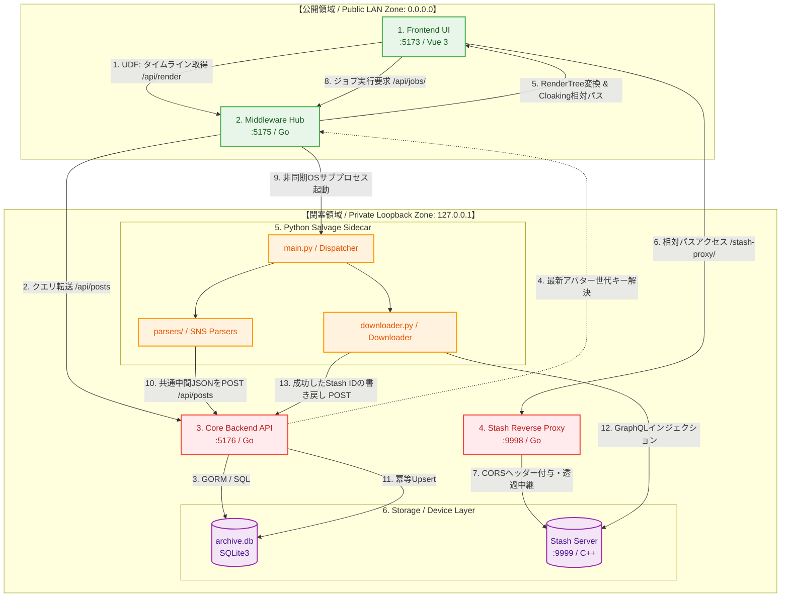

### 第1章：技術仕様とバックボーン (Technical Specs & Backbone)
**プロジェクト名** : dozou_katanuki (Pluggable UI & Multi-Format Local Archival System "土蔵・型抜き") Pluggable UI & Multi-Format Archival System)  
**ドキュメントID** : SPEC-BACKBONE-001  
**バージョン** : 3.1.0  
**作成日** : 2026-08-17  
**ステータス** : 正式仕様（5層UDF・バインドIP分離・ポート9998・Mermaid接続マップ統合）

**Navigation** : [← DocWiki ポータル](README.md) | [📚 目次 (Home)](README.md) | [次の章: 第2章：外部サービスの概要とサルベージ技術 →](02_external_services_and_salvage.md)

--------------------------------------------------------------------------------

#### 1.1 プロジェクトの崇高な目的（動態保存・サルベージ）
公式プラットフォーム（Twitter/X, Instagram, TikTok等）におけるアカウント凍結（BAN）、投稿削除、規約変更によるAPI閉鎖、Webサービス自体の終了などにより、人類のデジタルな足跡や記憶は日々失われています [1]。

本プロジェクト **dozo_katanuki** は、失われたアカウントや投稿を **Wayback Machine** や **Aria2** などの外部アーカイブ技術・分散ダウンロード技術を駆使してWebの深淵からサルベージ（救出・復元）し、ローカル環境において当時のタイムラインの質感・レスポンスそのままに**「動態保存（動作可能な状態で永続化）」**することを至上命題としています [1]。将来的には特定のプラットフォームに依存せず、あらゆる SNS にプラグイン形式で対応可能な「汎用動態保存基盤」を目指します [1]。

--------------------------------------------------------------------------------

#### 1.2 システムスタックと技術選定
マイクロサービス的な疎結合レイヤー分離を行いながら、最終的に単一バイナリにパッキング可能な技術スタックを採用しています [2]。

| レイヤー | 採用技術 / バージョン | 役割・責務 | バインドIP / アクセス制御 |
| ------ | ------ | ------ | ------ |
| **1. Presentation** | Vue 3.5.40 (SFC) + Vite 8.2.0 + TS + Tailwind CSS | Stateless Pure View (Dumb UI / 宣言型UI)、シグナルベース高速描画 [2, 31, 32] | **0.0.0.0 (LAN公開可)** スマートフォン等からアクセス可能 [67] |
| **2. State & Action** | Vue Composition API (ref, reactive, computed) | UDF Composable（状態・一方向データフローの保持） [2, 33, 99] | **0.0.0.0 (LAN公開可)** ブラウザローカルで完結 [67] |
| **3. Middleware** | Go 1.22+ (net/http, RendererPlugin) | **システム全体の頭脳。** Pythonプロセスの直接キック・監視、生DBデータの RenderTree 変換配信 [2, 63] | **0.0.0.0 (LAN公開可)** 他端末への配信を仲介 [67] |
| **4. Core Backend / Driver** | Go 1.22+ + GORM + go-sqlite3 + ReverseProxy | **ピュア・ストレージドライバ。** SQLite3 メタデータ CRUD、Stash リバースプロキシ [2, 42, 63] | **127.0.0.1 (ローカル閉塞)** 外部からの不正DB操作を100%遮断 [67] |
| **5. Salvage Sidecar** | Python 3.10+ (requests, warcio, GraphQL) | オンデマンド実行のサルベージ・インジェクションパイプライン（非常駐） [2, 64] | **Loopback (非同期OSプロセス)** Middleware から直接起動 [63, 69] |
| **6. Storage / Media** | SQLite3 (WALモード) + Stash Media Server (:9999) | メタデータ高速クエリ & メディア（動画・原画）重複排除・ストリーミング [2, 7] | **127.0.0.1 (ローカル閉塞)** セキュリティ認証不要化・透過中継 [50, 67] |

--------------------------------------------------------------------------------

#### 1.3 ポートマップと内部通信フロー
システムは、ポータビリティの高い近傍連番ポートを使用しながらも、外部に公開して良い「公開ポート」と、ローカルループバック（`127.0.0.1`）に厳重に閉じ込めるべき「内部閉塞ポート」を厳格に分離することで、マルチデバイス運用の利便性とベストプラクティス水準の安全性を両立します [67]。

##### 1. ポート割り当て仕様
| ポート | サービス名 | アクセス特性 | バインドIP | 役割とプロトコル |
| ------ | ------ | ------ | ------ | ------ |
| **:5173** | **Frontend (UI)** | LAN公開可能 | `0.0.0.0` | タイムラインUI、メディア再生オーバーレイ、SPAルーティング [3, 67] |
| **:5175** | **Middleware Hub** | LAN公開可能 | `0.0.0.0` | `/api/render` による JSON 変換配信、アセット・アバター配信、Pythonプロセス制御 [3, 67, 69] |
| **:9998** | **Stash Proxy** | **完全ローカル閉塞** | `127.0.0.1` | ローカル Stash (:9999) への CORS 対応リバースプロキシ (/scene/..., /image/...) [41, 50, 67] |
| **:5176** | **Core Backend API** | **完全ローカル閉塞** | `127.0.0.1` | SQLite3 メタデータ CRUD ゲートウェイ (/api/posts, /api/accounts) [3, 41, 67] |
| **:9999** | **Stash Server** | **完全ローカル閉塞** | `127.0.0.1` | メディア実ファイル（動画・原画）の保管・重複排除・トランスコード・HLS配信 [3, 7, 67] |

##### 2. 内部通信ネットワーク構造マップ (Mermaid Diagram)
従来のプレーンテキストグラフを、ネットワーク境界（公開/閉塞領域）およびデータの UDF（一方向データフロー）関係がひと目でわかる Mermaid 接続構成図へと大幅にアップデートしました。

--------------------------------------------------------------------------------

#### 1.4 シングルバイナリ＆同階層3点セット（Single Source of Truth）
システムを起動・運用する際、**「同一ディレクトリに存在する以下の3点セット」**が唯一絶対のマスター（Single Source of Truth: SSOT）となります [4, 16]：

1.  **`dozo_katanuki.exe`** (リリース時にMiddleware・Core API・Frontendアセットを1つに内包した実行バイナリ) [16]
2.  **`archive.db`** (整合性チェックをクリアした実稼働 SQLite3 データベース) [16, 29]
3.  **`config.json`** (システムポートおよびバインドIP・ストレージパスを統治する一元設定ファイル) [16, 67]

##### この原則がもたらすメリット：
*   **開発時と本番時の完全一致** : 開発時もリリース時も全く同じ相対関係で動作し、データベースの散逸やゾンビプロセスによるポート競合、不整合を根本から排除します [4]。
*   **ゼロコンフィグポータビリティ** : バイナリが存在するルートパスからの動的相対パス解決により、フォルダごとUSBメモリや別のPCに移動させるだけで、一切の設定変更なしにそのまま即座に起動・動態保存タイムラインを閲覧可能です [68]。
*   **バッチによる一元制御（start.bat）** :
    起動時は、個別手動での起動を厳禁とします [17]。必ずルート直下の `start.bat` をキックすることで、メモリ上に残存している前回のゾンビプロセスを自動でゾンビキルし、ポート競合のないクリーンな状態で各サービスを一元起動させ、ブラウザを自動起動して安全なデバッグ環境を提供します [17]。

--------------------------------------------------------------------------------

**Navigation** : [← DocWiki ポータル](README.md) | [📚 目次 (Home)](README.md) | [次の章: 第2章：外部サービスの概要とサルベージ技術 →](02_external_services_and_salvage.md)
