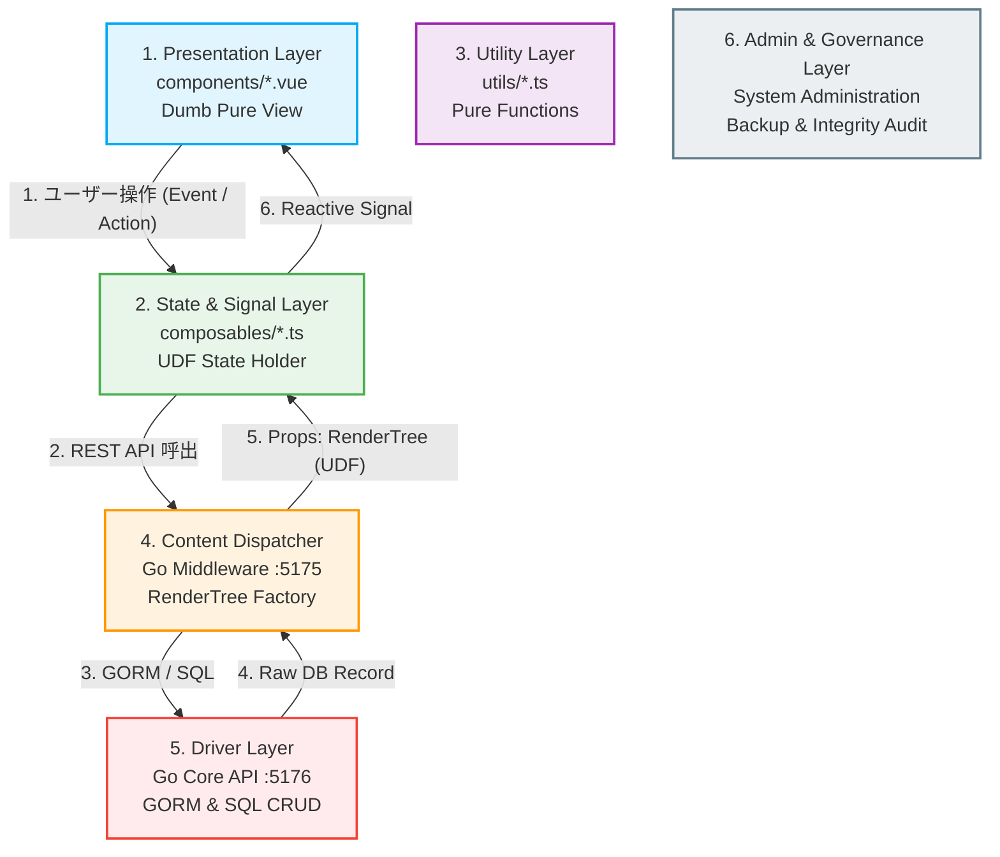

### 第3章：実装規約・制約原則（宣言型UI・UDF・AI駆動開発と開発者リファレンス）
**プロジェクト名** : dozou_katanuki (Pluggable UI & Multi-Format Local Archival System "土蔵・型抜き") Pluggable UI & Multi-Format Archival System)
**ドキュメントID** : SPEC-PRINCIPLE-001
**バージョン** : 3.0.0
**作成日** : 2026-08-17
**ステータス** : 正式仕様（宣言型UI・UDF・シグナル完全準拠、AI暴走防止規約統合）

**Navigation** : [← 前の章: 第2章：外部サービスの概要とサルベージ技術](02_external_services_and_salvage.md) | [📚 目次 (Home)](README.md) | [次の章: 第4章：データベース設計と仮想ストレージプール →](04_database_and_virtual_storage_pool.md)

--------------------------------------------------------------------------------

#### 3.1 「1ファイル 100行以下」の絶対ルール (Strict Rule)
AIエージェントおよび開発者がコードを生成・保守する際、コンポーネントおよびモジュールは **極限まで単一責任に細分化** し、1ファイルのソースコードは空行を含めて「100行以下」を絶対的な制約とします。

##### 1. なぜ「100行以下」なのか？（AI駆動開発におけるメリット）
*   **コンテキスト爆発（Context Explosion）の完全回避** : AIが作業する際、コードベース全体を走査させるとトークンが枯渇し、AIのハルシネーション（暴走）を引き起こします [91]。ファイルサイズを極小に保つことで、トークン消費を抑え、1回のやり取り（極小コンテキスト）で100%正確なコードを生成できます [36, 37]。
*   **テスト容易性とバグ混入率の低下** : モジュールが単一責任に閉じているため、ユニットテストが極めて容易になり、リファクタリング時に意図しないデグレードを100%防止できます。

##### 2. 100行を超過しそうな場合の対処フロー
ファイルが100行に達しそうな、あるいは超えてしまった場合、開発者は以下のステップに沿って機械的に分割を適用しなければなりません [10, 103]：
1.  **スタイル（CSS）の排除** : Tailwind CSS ユーティリティクラスを最大限活用するか、共通の `design.css` へスタイル記述を退避させます。
2.  **純粋計算・文字列操作の切り出し** : 日付フォーマットやテキストの改行処理といった描画以外のビジネスロジックは、すべて `frontend/src/utils/` 配下に定義する **副作用のない純粋関数（Pure Function）** として外出しします。
3.  **状態・API通信の切り出し** : コンポーネント内のAPIフェッチや `ref`/`reactive` 等の状態管理は、すべて `frontend/src/composables/` の Composable（状態ホルダー）へと逃がします。
4.  **UIパーツのサブコンポーネント化（コンポーネント分割）** :
    *   *分割例* : タイムライン表示用カード `TweetCard.vue` が肥大化した場合、`TweetAuthor.vue` (著者ヘッダー), `TweetBody.vue` (本文), `TweetStats.vue` (各種エンゲージメント統計), `MediaGrid.vue` (メディア表示枠) に細分化して結合します。

--------------------------------------------------------------------------------

#### 3.2 レイヤー別 責責境界（宣言型UI ＋ 単一データフロー UDF 原則）
システムアーキテクチャの5つの階層における「言葉の定義」と「責務境界（やって良いこと、絶対にやってはならないこと）」を厳格に規定します。これに反するコードの記述は、AIの暴走を招くため厳格に禁止されます。

##### 1. Presentation層（components/*.vue）- Stateless Pure View（Dumb UI） [105]
*   **責務** : Composableから受領した Props（`RenderTree` または状態シグナル）に基づき、該当する画面状態を宣言的テンプレート（`<template>`）で描画する。ユーザー操作は単にイベント（`emit` または呼び出し）として上位にエスカレーションする [107, 110]。
*   **禁止事項** :
    *   **自律的な状態（独自State）の保持禁止** : コンポーネント内部で独自のリアクティブなローカル状態（APIからのフェッチデータなど）を直接保持しない。
    *   **ロジックの混入禁止** : API通信の直接呼び出し、相対パスの組み立て（StashProxyのURL結合やアバターアセットパスの生成など）、日付フォーマット変換、テキストパース処理などは1行たりとも書いてはならない [109]。これらはすべて下位レイヤーが解決した状態（Props）で受領しなければならない。
    *   **双方向バインディングによる状態変更の禁止** : `v-model` 等によるProps値の暗黙的な逆流・書き換えを禁止する。

##### 2. Composable層（composables/*.ts）- State & Signal Layer [106]
*   **責務** : `ref`/`reactive`/`computed` を使用した **シグナルベースの細粒度リアクティブ状態ホルダー** [110]。一方向データフロー（UDF）に則り、Middleware API から一方向にフェッチしたデータを格納し、Presentation層（View）へ Props として安全に流し込む [106]。
*   **禁止事項** :
    *   **DOM直接操作の禁止** : HTMLエレメントの直接制御、`document.querySelector` などのDOM依存コードを記述してはならない [108]。
    *   **HTMLマークアップの混入禁止** : Composable内に `<template>` や Raw HTML、Tailwindクラスなどのプレゼンテーション要素を含めてはならない [108]。

##### 3. Utility層（utils/*.ts）- Pure Utility Layer
*   **責務** : 同一の入力引数に対して常に全く同一の戻り値を返却し、いかなる外部状態（副作用）も変更しない **「数学的純粋関数（Pure Function）」** のみを配置する [110]。日付変換、文字列切り出し、数式計算、データのキー名マッピング等。
*   **禁止事項** :
    *   **グローバル状態の破壊禁止** : Utility関数の内部でグローバル変数やCookie、LocalStorageなどの変更を伴う副作用を発生させてはならない。

##### 4. Middleware層（Go Middleware :5175）- Content Dispatcher [106]
*   **責務** : フロントエンドに表示ロジックが漏れ出して肥大化するのを防ぐ「インテリジェント・ハブ」 [109]。Core Backend (:5176) の生データ（Raw Model）をフロント側が描画するだけの完成されたデータ構造 **`RenderTree`**（アバターの仮想リゾルバ解決、Stashプロキシへの相対パスURL解決、翻訳、テキストの改行・リンク整形等がすべて完了したフラットなデータ）へ変換して配信する [109]。
*   **禁止事項** :
    *   **永続層（SQLite3）への直接SQL呼出の禁止** : SQLite3に対する低レベルクエリやマイグレーション処理を直接ミドルウェアで書いてはならない。データベース操作は、必ず型安全な Core Backend API（Driver層）経由で実行されなければならない。

##### 5. Driver層（Go Core API :5176）- Driver & Data Abstraction [22]
*   **責務** : SQLite3（`archive.db`）へのGORMを用いた型安全な CRUD 操作、およびローカル Stashapp (:9999) への GraphQL アクセスのカプセル化 [22]。上位レイヤーからの書き込み（POST/PUT）要求を受けて冪等性を保ちながらDBを更新・upsertするデータアクセス層としての役割を全うする。
*   **禁止事項** :
    *   **UIプレゼンテーション要素の関与禁止** : タイムラインの表示レイアウト情報（スキンプラグインの layout.yaml スキーマ等）や画面描画に関するメタロジックに一切関与してはならない。

##### 6. Admin & Governance層（Controller / Administration）- システム管理・設定・保守
*   **責務** : プロジェクトルート直下の `config.json` に基づくシステム全体の環境・ポート設定の動的ロード [32]、データベースの健全性・整合性監査（PRAGMAの実行など）、および「SQLiteバイナクスナップショット（Layer 1）」と「WARC / JSON生データダンプ（Layer 2）」による **二重化バックアップ（Dual-Source Disaster Recovery）** の実行・統制 [32, 51]。
*   **禁止事項** :
    *   **実行制御ロジック（Controller）という呼称による誤用・ルーティング記述の禁止** : 本レイヤーは「設定・運用・ガバナンス」を司る層であり、ウェブのルーティングロジックやAPIハンドラーは絶対にここに記述してはならない（ルーティング・データ制御は第4層のコンテンツディスパッチャーが担当する）。

--------------------------------------------------------------------------------

#### 3.3 データフローとファイル配置の黄金律 (Same Source, Same Flow)
システムが稼働する上で、データベース散逸、ゾンビプロセスによる不整合、およびデータの無秩序な汚染を防ぐための絶対的な規律です。

##### 1. 同階層3点セット（Single Source of Truth: SSOT）の原則
開発時およびプロダクション（本番時）運用にかかわらず、システムのルートディレクトリ直下に存在する以下の **「3点セット」のみを唯一無二のマスター** とします [4, 11, 32]：
1.  **`dozo_katanuki.exe`** (実行バイナリ)
2.  **`archive.db`** (実稼働 SQLite3 データベース)
3.  **`config.json`** (システム全体の一元設定ファイル)

開発・本番でデータベースを個別に作ったり、絶対パスで散逸させたりすることを厳密に禁止します。常に同じ相対関係で動作させることで、DBパス解決の破綻を根絶します [4]。

##### 2. スクリプト隔離原則
開発・テスト・検証・データパージ等、一時的あるいは管理者向けに作成したすべてのスクリプト（Python, Batch, Bash等）は、**絶対にプロジェクトルートに放置してはなりません** [11, 103]。
必ず **`./scripts/`** または該当するバッチ用フォルダ（`wayback_tweet_rescure/` 等）の配下に完全に隔離・分類して保存してください [11, 101, 103]。

##### 3. ファイル安全削除原則
開発作業において、不要ファイルを削除する際は `rm` コマンドや `os.remove` などの完全な破壊的削除を行わず、必ずOSのゴミ箱（Recycle Bin）への移動を仲介するか、`.bak` サフィックスを付与して一時退避させることで、不測のデータ全損事故を防ぎ、100%の復旧可能性を担保します [11]。

##### 4. 一括ビルド・一括起動の徹底（個別手動起動の厳禁）
AIエージェントや開発者が、勝手に複数のターミナルウィンドウを開いて `npm run dev` や `go run`、`python` スクリプトをバラバラに個別手動起動し、ポートの競合やバックグラウンドゾンビプロセスを発生させる行為を厳重に禁じます [104]。
*   **ビルド** : 必ずルート直下の **`build.bat`** を通じて一括ビルド・アセットパッキングを実施する [4, 104]。
*   **起動・動作確認** : 必ずルート直下の **`start.bat`** をキックして起動する。このスクリプトは、起動前にすでにメモリ上に残存しているゾンビプロセスを自動でゾンビキルし、ポート競合のないクリーンな状態で各サービスを一元起動させ、ブラウザを自動起動して安全なデバッグ環境を提供します [4, 104]。

--------------------------------------------------------------------------------

**Navigation** : [← 前の章: 第2章：外部サービスの概要とサルベージ技術](02_external_services_and_salvage.md) | [📚 目次 (Home)](README.md) | [次の章: 第4章：データベース設計と仮想ストレージプール →](04_database_and_virtual_storage_pool.md)
