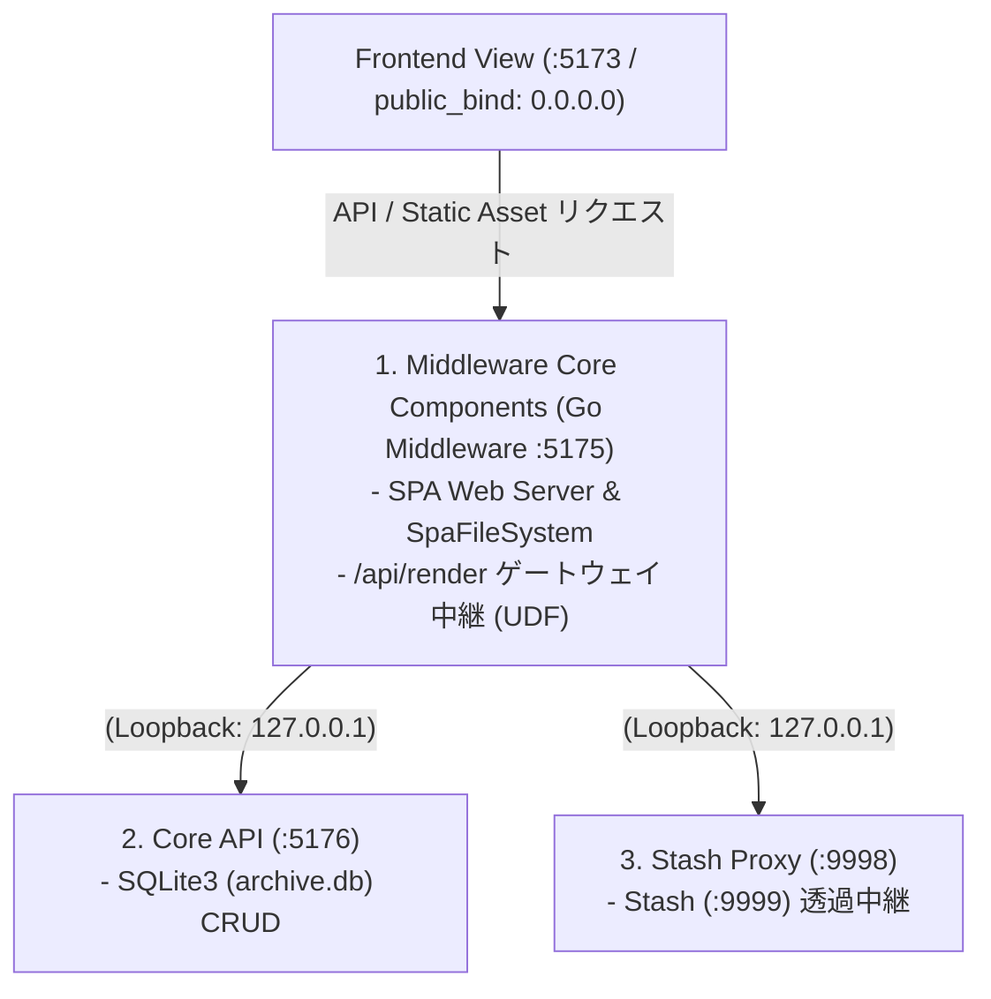
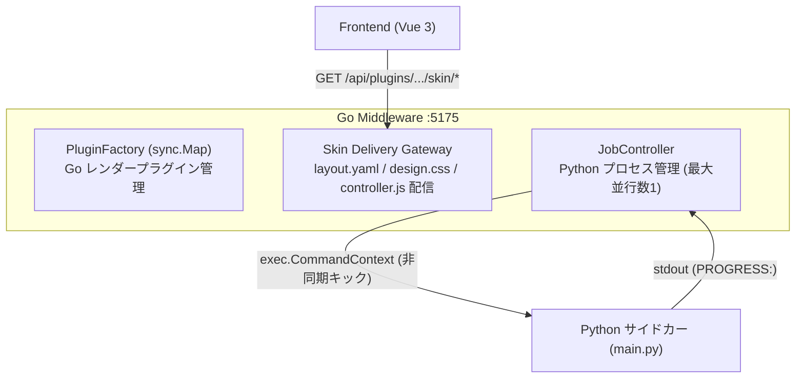

### 第6章：コンテンツディスパッチャー層（Middleware Hub & Plug-In Orchestrator）
**プロジェクト名** : dozou_katanuki (Pluggable UI & Multi-Format Local Archival System "土蔵・型抜き")  
**ドキュメントID** : SPEC-MIDDLEWARE-001  
**バージョン** : 3.6.0  
**作成日** : 2026-08-17  
**ステータス** : 正式仕様（4章節化細分化・Stash Side Loader 統合・多言語デコレーション・統合プラグイン plugins/ 統治、完全 Mermaid 接続図移行完了）  

**Navigation** : [← 前の章: 第5章：プレゼンテーション層概論（Foolish Frontend & 宣言型UI）](05_foolish_frontend_and_declarative_ui_v4.md) | [📚 目次 (Home)](README.md) | [次の章: 第7章：ドライバー層（Core Backend API） →](07_robust_backend_driver_and_api_v4.md)

---

### 6.1 第1節：Middleware Core Components（中継 ⇄ 接続 ⇄ ルーティング）

ミドルウェア層（第2層：Middleware Hub :5175）は、Dumb UIとしてのプレゼンテーション層（:5173）と、純粋なデータアクセスに特化したドライバー層（:5176）および Stashapp（:9999）の間に立ち、システム全体のインテリジェンスとオーケストレーションを司る「インテリジェント・ハブ」です [2, 110]。

本節では、フロントエンドからのAPI中継、静的Webサーバー機能、およびブラウザのF5リロードを保護する「SPA Fallback」ハンドラーを中心とした、ミドルウェアの中核コアコンポーネント仕様を規定します [39, 43]。



#### 1. タイムラインクエリ（GET /api/render）の中継・検証仕様
フロントエンド（`useTimeline.ts`）から送信される、特定のプラットフォームおよびアカウントに対するタイムライン取得要求（`GET /api/render`）を受け取り、クレンジング・検証を施した上でドライバー層（:5176）の `GET /api/articles` へ安全にリクエストをバトンリレー（中継）します [51, 67]。

*   **入力パラメータ検証（MIddlewareレベル）**：
    *   `platform`（必須）：`"twitter" | "instagram" | "tiktok"` などの有効なプラグイン識別子であることを検証。
    *   `account_id`（必須）：numeric_id または統合タイムラインを示す `\"all\"` であることを監査。
    *   `filter`（任意）：`\"all\" | \"reposts\" | \"media\" | \"bookmarks\"` の完全一致を強制。
    *   `limit`（任意）：最大 `50` 件までにクリップし、メモリバーストを防止。
    *   `offset`（任意）：`0` 以上の整数にキャストしてSQLインジェクション対策。

#### 2. SPA Fallback ハンドラー実装規約（Go）
ユーザーがブラウザ上で `http://localhost:5173/twitter/msluo14/status/187938...` などの仮想詳細URLを直打ち入力してアクセスしたり、画面上でF5キーを押してリロードした際、静的ファイルは物理的に存在しないため通常404エラーが発生します [58]。
これを100%回避し、フロントエンドの Vue Router にルーティングの主導権を安全に引き渡す（Fallback）ため、Go製の型安全な `SpaFileSystem` 構造体を適用します [58]。

```go
package server

import (
	"net/http"
	"os"
	"path/filepath"
)

// SpaFileSystem はSPAの仮想ルーティングを保護するためのカスタムファイルシステムです
type SpaFileSystem struct {
	StaticRoot string
}

// Open はリクエストされたファイルが存在しない場合、一律で index.html を返却します (SPA Fallback)
func (fs SpaFileSystem) Open(name string) (http.File, error) {
	// 1. 静的アセットファイルの物理的なフルパスを構築
	path := filepath.Join(fs.StaticRoot, name)
	file, err := os.Open(path)
	if err == nil {
		// 物理ディスク上にファイルが正常に存在する場合はそのままサーブ
		return file, nil
	}

	// 2. ファイルが見つからない（Vue Routerの仮想パスや直打ちエラー）の場合
	// ディレクトリ配下の一意な index.html を強制的にオープンしてレスポンスする
	fallbackPath := filepath.Join(fs.StaticRoot, "index.html")
	fallbackFile, err := os.Open(fallbackPath)
	if err != nil {
		return nil, err // index.html自体が存在しないシステム構成エラーのみエラーを返す
	}
	return fallbackFile, nil
}
```

---

### 6.2 第2節：Stash Side Loader（9998 Reverse Proxy 仕様）

フロントエンド（:5173）およびミドルウェア（:5175）が、ローカルで常時稼働している Stashapp（:9999）に対して動画（m3u8）のストリーミングや高解像度静止画を直接要求した際、ブラウザの極めて厳格な **CORS（Cross-Origin Resource Sharing）制約** によって読み込みや再生が強制ブロックされる致命的バグが発生します [68]。

本システムでは、このCORS競合を完全に中和・保護し、かつ安全なループバック空間（`127.0.0.1`）から外部ネットワークへのアクセス情報を漏洩させないため、ミドルウェアがホストするポート **`:9998`** で動作する透過型リバースプロキシコンポーネント **「Stash Side Loader」** を提供します [3, 61, 68]。

#### 1. CORS回避レスポンスヘッダー強制注入（オーバーライド）仕様
Stash Side Loader (:9998) は、Stashapp 本体 (:9999) から受け取った再生バイナリおよびストリームレスポンスをクライアント（ブラウザ）へ透過転送する際、以下のCORS関連ヘッダーを**レスポンスヘッダーへ強制的に上書き・オーバーライド**し、ブラウザによる再生阻害を物理的に100%遮断します [70]。

```go
// Stash Reverse Proxy (:9998) レンスポンスヘッダー強制オーバーライド規約
w.Header().Set("Access-Control-Allow-Origin", "*")
w.Header().Set("Access-Control-Allow-Methods", "GET, OPTIONS, HEAD")
w.Header().Set("Access-Control-Allow-Headers", "Range, Content-Type, Authorization")
w.Header().Set("Access-Control-Expose-Headers", "Content-Range, Content-Length, Accept-Ranges")

// ブラウザからの動画ストリーミング（シーク、部分フェッチ）に不可欠な Range / 部分応答への完全追従
if r.Method == "OPTIONS" {
	w.WriteHeader(http.StatusNoContent)
	return
}
```

#### 2. プロキシルーティング・パス定義マッピング
フロントエンドからプロキシポート :9998（Stash Side Loader）にアクセスした際、プロキシは `config.json` から動的にロードされた `stash_port`（デフォルト: `9999`）のローカルホスト（`http://127.0.0.1:9999`）に対してのみ透過的にリクエストを中継します [69, 110]。

| サービスパス | 中継先物理 Stashapp API URL | 役割・用途 |
| ------ | ------ | ------ |
| **`/stash-proxy/scene/{id}/m3u8`** | `http://127.0.0.1:9999/api/scenes/{id}/playlist.m3u8` | 動画 HLS アダプティブ再生用メインプレイリスト [69] |
| **`/stash-proxy/scene/{id}/stream`** | `http://127.0.0.1:9999/api/scenes/{id}/stream` | 動画直接取得ストリーミング（Range Request 対応、MP4フォールバック） [69] |
| **`/stash-proxy/scene/{id}/preview`** | `http://127.0.0.1:9999/api/scenes/{id}/preview` | ホバープレビューおよび進捗カード用縮小動画 [69] |
| **`/stash-proxy/image/{id}/image`** | `http://127.0.0.1:9999/api/images/{id}/image` | 静止画 Lightbox 表示用 フル解像度原画ファイル [69] |
| **`/stash-proxy/image/{id}/thumbnail`** | `http://127.0.0.1:9999/api/images/{id}/thumbnail` | タイムライングリッド一覧表示用 高速軽量サムネイル画像 [69] |

---

### 6.3 第3節：Data Decorator（データデコレーション・多言語解決）

ミドルウェア（:5175）は、Core Backend (:5176) から受領したデータベースの生データ（Raw Models）に対して、フロントエンド（Vue 3）側での描画オーバーヘッドを限りなくゼロに抑え込み、サクサクとしたゼロレイテンシ高速スクロールを実現するため、以下の**「3大データデコレーション」**を施した完成済みの **`RenderTree`** データ構造を組み立てて一方向に供給します [22, 51, 131]。

#### 1. 仮想アバターリゾルバ（Avatar URL Resolver）
外部SNSサーバーの凍結やアカウントサスペンド時の「割れたアバター画像」の発生を100%防止するため、アセット隔離領域（`middleware/assets/`）に保存された0埋め3桁世代管理アセットへと動的に解決します [74, 118]。

*   **解決のアルゴリズム**：
    1. 各記事（`article`）の投稿日時（`articles.created_at`）を取得 [76]。
    2. 投稿者（`accounts`）に紐付けられた `account_profile_history`（プロフィール履歴）のレコード群を、観測日時（`observed_at`）の降順でスキャン [76]。
    3. **判定**：
        $$\text{TargetSeq} = \max \left\{ \text{seq} \mid \text{history.observed\_at} \le \text{article.created\_at} \right\}$$
        に該当する、投稿日時に最も近い（過去の）世代履歴のアバターキー `{username}_avatar_{seq:03d}`（例: `msluo14_avatar_002`）を動的に割り当てます [64, 76]。
    4. フロントエンドへ渡される `RenderTree.author.avatar_url` プロパティには、生URL（`avatar_original_url`に退避）を完全に隠蔽した完全相対パス **/assets/{platform}/{username}_avatar_002.jpg** のみをセットしてクローキング配信（露出隠蔽）を実施します [54, 75]。

#### 2. テキスト・短縮URL・ハッシュタグ変換器（DOM/HTML生成器）
フロントエンド側の自律的な正規表現による重たいテキストパース（描画時の足かせ・バグの温床）を全廃するため、ミドルウェア側で事前に安全にサニタイズされた HTML リンクを組み立て、`RenderTree.content.original` および翻訳フィールドへ格納して渡します [56]。

*   **URL展開**：`url_redirects` テーブルから逆引き解決された expanded_url（短縮展開後のオリジナルURL）を取得し、テキスト内の短縮リンクをフルリンクへ置換。
*   **ハッシュタグリンク化**：`#(\\w+)` ➔ `<a href=\"/:platform/search?q=$1\" class=\"hashtag-link\">#$1</a>`
*   **メンションリンク化**：`@([a-zA-Z0-9_]+)` ➔ `<a href=\"/:platform/$1\" class=\"mention-link\">@$1</a>`
*   **改行解決**：`\\n` ➔ `<br/>` の安全なDOM展開コード化。

#### 3. 3大主要言語（日・英・中）の「事前翻訳キャッシュ」バインド
インポート時の Python サイドカー（Mutatorフェーズ）によってあらかじめ翻訳され、SQLite3の `articles` テーブルにキャッシュ保存されている `full_text_ja`, `full_text_en`, `full_text_zh` を読み込み、`RenderTree` の `content` 多言語ハッシュオブジェクトへバインドします [111]。

```go
// Goミドルウェアでの多言語 content オブジェクトの動的整形マッピング
renderTree.Content = map[string]string{
	"original": sanitizeAndLinkText(article.FullText),                // 生の原本テキスト (HTMLリンク化済)
	"ja":       sanitizeAndLinkText(article.FullTextJA.String),         // 日本語キャッシュ
	"en":       sanitizeAndLinkText(article.FullTextEN.String),         // 英語キャッシュ
	"zh":       sanitizeAndLinkText(article.FullTextZH.String),         // 中国語キャッシュ
}
```

これにより、フロントエンド（Vue 3）側は、現在選択されているグローバル言語シグナルが切り替わった際、ネットワーク API 通信を1ミリ秒も走らせることなく、**完全ローカル・オフラインでミリ秒単位の言語表示トグル** をアコンプリッシュできます [37, 51, 131]。

---

### 6.4 第4節：Plugin Architecture Overview（パッケージ統治 ＆ プロセス制御）

ミドルウェア層は、各プラットフォーム固有の差異を1つのディレクトリに密閉する **「統合プラグイン（Unified Plugin Package）」** のロード・配信を司る管理ファームウェアであると同時に、Python 非常駐サイドカープロセスを安全に起動・管理する **ジョブオーケストレーター** です [50, 56]。



#### 1. レンダープラグイン（`RendererPlugin`）ロードと Plugin Factory
起動時、ミドルウェアは `plugins/` ディレクトリ配下を走査し、検出されたプラットフォーム名と `RendererPlugin` の実体を読み込み、スレッドセーフな `sync.Map`（Plugin Factory）にバインド登録して管理します [52]。

#### 2. スキンアセット（Skin Delivery）の中継配信ゲートウェイ
フロントシェルからの動的なスキン要請を受け、`plugins/{platform}/skin/` ディレクトリ直下の以下のファイルを透過的にサーブします [52]。

*   `GET /api/plugins/{platform}/skin/layout` ➔ `skin/layout.yaml` をそのまま中継（詳細なJSON Schemaおよびマッピング仕様は [第9章の9.3節] を SSOT として参照） [53]。
*   `GET /api/plugins/{platform}/skin/design` ➔ `skin/design.css` (MIME: `text/css`) を配信 [53]。
*   `GET /api/plugins/{platform}/skin/controller` ➔ `skin/controller.js` (MIME: `application/javascript`) を配信 [53]。

#### 3. Pythonサイドカー（Scraper/Downloader）の非同期OSプロセス直接管理仕様
多重起動によるネットワークパンクやCPUバーストを完璧に防ぐため、ミドルウェア内部の `JobController` は最大並行数 **`1`** の簡易キュー・スレッドプールで Python プロセスを管理します [94]。

##### subprocess.Run によるノンブロッキングキックコード
```go
// 統合プラグイン配下の Python エントリポイントをノンブロッキングな OS サブプロセスとしてキック
cmdPath := fmt.Sprintf("plugins/%s/scraper/main.py", platform)
cmd := exec.CommandContext(ctx, "python", append([]string{cmdPath}, args...)...)

stdout, _ := cmd.StdoutPipe()
cmd.Start() // ノンブロッキング実行
```

##### PROGRESS: 進捗インターセプトスキャンアルゴリズム
Pythonサイドカーは処理進行ごとに `PROGRESS: {current_index}/{total_count} | {message}` の標準出力（stdout）をフラッシュ出力する契約を結びます [57, 94]。
ミドルウェアはこの StdoutPipe を非同期スレッドで常時スキャンし、リアルタイム進捗率（%）および最新メッセージをオンメモリに蓄積し、フロントエンドのポーリング（`GET /api/jobs/status`）に対してミリ秒で即答します [57, 94, 115]。

---

**Navigation** : [← 前の章: 第5章：プレゼンテーション層概論（Foolish Frontend & Vue 3）](05_foolish_frontend_and_declarative_ui_v4.md) | [📚 目次 (Home)](README.md) | [次の章: 第7章：ドライバー層（Core Backend API） →](07_robust_backend_driver_and_api_v4.md)