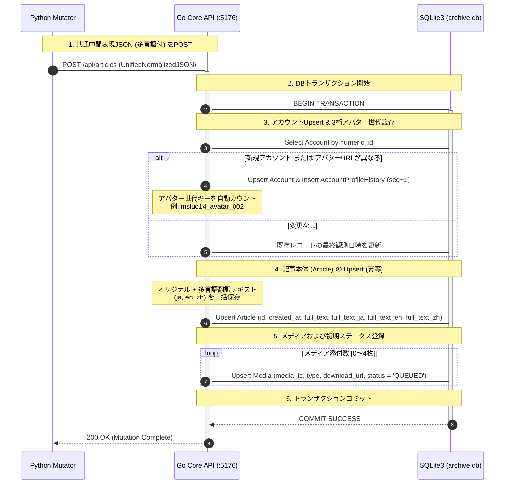

### 第7章：ドライバー層（Core Backend & Data Abstraction）
**プロジェクト名** : dozou_katanuki (SNS Timeline, Pluggable UI & Multi-Format Archival System)  
**ドキュメントID** : SPEC-DRIVER-001  
**バージョン** : 3.5.0  
**作成日** : 2026-08-17  
**ステータス** : 正式仕様（GORMモデル完全一般化・多言語事前翻訳カラム・:9998プロキシ仕様の第6章完全移管・純粋ストレージドライバ純化）  

**Navigation** : [← 前の章: 第6章：コンテンツディスパッチャー層（Middleware Hub & Proxy）](06_thick_middleware_and_proxy_v3.md) | [📚 目次 (Home)](README.md) | [次の章: 第8章：ローカルストレージ保全とメディアポリシー →](08_storage_persistence_and_media_policy_v2.md)

---

#### 7.1 ドライバー層の構造と役割・責務

ドライバー層（Core Backend Layer）は、ポート **:5176** (Core Backend API) で常時稼働する、Go製システムの中核データベースおよび物理メディアハンドラカプセル化レイヤーです [2, 3]。

本レイヤーは、データの永続化を担う **SQLite3（接続論理名: ArchiveDB、ファイル名: `archive.db`）** [4.1] および大容量バイナリ保全を担う **Stashapp**（:9999） [2.4] への低レベルな物理I/Oアクセスをカプセル化（抽象化）し、上位レイヤー（Middleware Hub :5175）および外部ツール（Pythonサイドカー）に対して型安全かつ一意なデータ書き込み/読み込みプロトコル（REST API 契約）を提供します [2, 14, 61]。

##### 1. ドライバー層の主要な責務
*   **共通中間JSON (Unified Normalized JSON) の完全受入と冪等な一括登録 (POST /api/articles)** [61, 66]：
    *   Python非常駐サイドカー（Mutator）から `POST /api/articles` 経由で送信される共通中間表現JSONを完全にデシリアライズし、トランザクション整合性を担保して ArchiveDB へUpsert（更新・挿入）します [61, 66]。
*   **GORMによるデータモデル抽象化 (DBMSの完全隠蔽)** [61]：
    *   生SQLを排除したオブジェクトリレーショナルマッピング。GORMタグを用いて自動インデックス、外部キー制約、プリロード（Eager Loading）関係を型安全に統治します [61]。
*   **多言語事前翻訳テキストおよびオリジナル言語判定（lang）の永続化保管** [4.2]：
    *   インポート時にMutator側で翻訳された 3大主要言語（`full_text_ja`, `full_text_en`, `full_text_zh`）を、不変のキャッシュテキストとして物理カラムに安全に書き込み、保存します [4.2]。
*   **Stashapp UUID の自動紐付け（Reconciliation）と GORM 書き戻し** [15, 61]：
    *   メディアテーブルの `stash_scene_id` や `stash_image_id` を回収し、SQLite3 に書き戻すための自動バインドAPI（`POST /api/articles/bind-media`）の提供 [15, 61, 66]。

##### 2. 厳格な禁止事項 (ハルシネーション・暴走防止)
*   **UIプレゼンテーション要素・表示用スキン仕様（layout.yaml）への一切の関与禁止** [23, 62]：
    *   ドライバー層は純粋な「データアクセス（GORM / I/O）」に100%徹する必要があります [23, 62]。各SNS固有の表示レイアウトのパースや、スキンプラグインの配信エンドポイント、フロント用描画状態（CSS/JS）の制御を行ってはなりません [23, 62]。これらはすべて第2層（Middleware Hub）の責務です [23, 62]。
*   **CORSリバースプロキシ中継仕様（ポート :9998）の完全排除（第6章へ移管）** [68]：
    *   以前の設計でドライバー層に含まれていた、Stashappからのメディアストリームや画像をブラウザへ透過中継する「リバースプロキシ（:9998）」は、システム全体の実行制御を統治する **Go Middleware (:5175) 内の「Stash Side Loader」として完全移管・一元化されました** [68]。
    *   本レイヤーがプロキシルーティング、CORS回避ヘッダーの付与、または動画ストリームの中継制御に関与することは一切禁止（パージ）します [23]。
*   **フロントエンドとの直接通信の禁止** [62]：
    *   フロントエンド（Dumb UI :5173）が、ミドルウェア（:5175）を介さずにこのポート :5176 へ直接アクセスすることは厳禁です [62]。フロントからのクエリは必ずミドルウェア（:5175）を経由して一方向データフロー（UDF）に則って安全に中継・変換（RenderTree）されます [62, 131]。

---

#### 7.2 データベース書き込み(POST)トランザクション ＆ リレーション解決シーケンス

Python非常駐サイドカーの Mutator が、解析および多言語事前翻訳に成功した共通中間JSONを `POST /api/articles` に送信した際の、Core Backend (:5176) 内部のトランザクションシーケンスを以下に示します [63, 66]。



---

#### 7.3 GORM モデル定義 (GORM Models Schema & Structs)

データベース `archive.db` と完全マッピングされ、GORMによる自動マイグレーションに対応した、型安全なGo構造体定義です [2, 14, 105]。

```go
package models

import (
	"database/sql"
	"time"
)

// Account represents accounts table (SSOT Profile Raw Data)
type Account struct {
	NumericID   string    `gorm:"primaryKey;column:numeric_id;type:text"`
	Username    string    `gorm:"index;column:username;type:text;not null"`
	DisplayName string    `gorm:"column:display_name;type:text;not null"`
	AvatarURL   string    `gorm:"column:avatar_url;type:text;not null"` // オリジナルの本家生URL
	UpdatedAt   time.Time `gorm:"column:updated_at;type:datetime;not null"`
	
	// Relationships
	ProfileHistory []AccountProfileHistory `gorm:"foreignKey:AccountID;references:NumericID"`
	Articles       []Article               `gorm:"foreignKey:AccountID;references:NumericID"`
}

// AccountProfileHistory represents account_profile_history table
type AccountProfileHistory struct {
	ID               uint      `gorm:"primaryKey;autoIncrement;column:id"`
	AccountID        string    `gorm:"index;column:account_id;type:text;not null"`
	DisplayName      string    `gorm:"column:display_name;type:text;not null"`
	AvatarOriginalURL string    `gorm:"column:avatar_original_url;type:text;not null"` // その世代のオリジナルアバター生URL
	AvatarSeq        int       `gorm:"column:avatar_seq;type:integer;not null"`        // 3桁世代キーのシリアル値 (1, 2, 3...)
	AvatarVirtualKey string    `gorm:"column:avatar_virtual_key;type:text;not null"`  // 解決済みキー (msluo14_avatar_001)
	ObservedAt       time.Time `gorm:"column:observed_at;type:datetime;not null"`
}

// Article represents articles table (Generic Timeline Item Specification)
type Article struct {
	ID             string         `gorm:"primaryKey;column:id;type:text"`
	AccountID      string         `gorm:"index;column:account_id;type:text;not null"`
	ConversationID string         `gorm:"index;column:conversation_id;type:text;not null"`
	ReplyToID      sql.NullString `gorm:"column:reply_to_id;type:text"`                // 返信先（親）アセットID
	ReplyToHandle  sql.NullString `gorm:"column:reply_to_handle;type:text"`            // 返信先（親）ハンドル名 (@スクリーンネーム)
	CreatedAt      time.Time      `gorm:"index;column:created_at;type:datetime;not null"`
	FullText       string         `gorm:"column:full_text;type:text;not null"`         // オリジナル原本本文
	Lang           string         `gorm:"column:lang;type:text;not null;default:'ja'"` // 元のオリジナル言語コード
	FullTextJA     sql.NullString `gorm:"column:full_text_ja;type:text"`               // 【キャッシュ】日本語訳本文
	FullTextEN     sql.NullString `gorm:"column:full_text_en;type:text"`               // 【キャッシュ】英語訳本文
	FullTextZH     sql.NullString `gorm:"column:full_text_zh;type:text"`               // 【キャッシュ】中国語訳本文
	Via            string         `gorm:"column:via;type:text;not null"`
	IsRepost       bool           `gorm:"column:is_repost;type:boolean;not null;default:false"` // 転載・リポストフラグ
	IsLiked        bool           `gorm:"index;column:is_liked;type:boolean;not null;default:false"` // ブックマーク（お気に入り）フラグ
	WaybackURL     string         `gorm:"column:wayback_url;type:text;not null"`

	// Relationships
	Account Account `gorm:"foreignKey:AccountID;references:NumericID"`
	Media   []Media `gorm:"foreignKey:ArticleID;references:ID"`
}

// Media represents media table (Stashapp Mapping and 3-Stage Recovery status)
type Media struct {
	MediaID        string         `gorm:"primaryKey;column:media_id;type:text"` // URL BaseName (eb7ymRi-pfsx5FJH)
	ArticleID      string         `gorm:"index;column:article_id;type:text;not null"`
	Type           string         `gorm:"column:type;type:text;not null"` // "image" | "video" | "gif"
	DownloadURL    string         `gorm:"column:download_url;type:text;not null"` // オリジナルメディアURL
	Width          int            `gorm:"column:width;type:integer;not null"`
	Height         int            `gorm:"column:height;type:integer;not null"`
	DownloadStatus string         `gorm:"column:download_status;type:text;not null;default:'QUEUED'"` // QUEUED | COMPLETED | DEAD_404 | OUTSOURCED | RETAINED
	FailedReason   sql.NullString `gorm:"column:failed_reason;type:text"`             // 失敗時のエラー原因テキスト
	StashSceneID   sql.NullString `gorm:"uniqueIndex;column:stash_scene_id;type:text"` // Stash Scene UUID (動画)
	StashImageID   sql.NullString `gorm:"uniqueIndex;column:stash_image_id;type:text"` // Stash Image UUID (静止画)
}

// UrlRedirect represents url_redirects table (Short URL resolution mapping)
type UrlRedirect struct {
	ShortURL    string `gorm:"primaryKey;column:short_url;type:text"`
	ExpandedURL string `gorm:"column:expanded_url;type:text;not null"`
	ArticleID   string `gorm:"index;column:article_id;type:text;not null"`
}

// Whitelist represents whitelist table
type Whitelist struct {
	ID       uint   `gorm:"primaryKey;autoIncrement;column:id"`
	Type     string `gorm:"column:type;type:text;not null"`             // "account" | "keyword"
	Value    string `gorm:"uniqueIndex;column:value;type:text;not null"` // アカウントスクリーンネーム
	IsActive bool   `gorm:"column:is_active;type:boolean;not null;default:true"`
}
```

---

#### 7.4 アバター保全 ＆ 3桁ナンバリング世代管理ロジック

本システムでは、外部SNSサーバーの凍結や削除、ネットワーク非接続状態（オフライン）でもアバター画像が「破れたイメージ」として非表示になるのを防ぐため、**「アバター保全・3桁ナンバリング世代管理（Avatar Gen Resolution）」**をバックエンドGORMモデル層において監査・解決します [46, 86]。

##### 1. 新規インポート(POST)時の世代判定と自動ナンバリング
`POST /api/articles` のトランザクション中、GORMフックまたはCRUDメソッド（`article.go`）において以下のアバター履歴の比較監査を自動実行します [64, 66]。

*   **監査フロー**:
    1. 送信された共通中間JSON内のアバターオリジナルURL（`account.avatar_url`）を取得します [64]。
    2. SQLite3 の `account_profile_history` から該当アカウントの最大 `avatar_seq` を検索します [64]。
    3.  **判定**:
        *   履歴が全く存在しない場合、または最後の履歴に記録された `avatar_url` と今回のURLが異なる場合：
            *   ➔ **新世代のアバターとして検知！**
            *   ➔ 最大 `avatar_seq` + 1（初回は `1`）を採番します [64]。
            *   ➔ `avatar_seq` を用いて、Goバックエンド内部で**「仮想アバター世代キー（`{username}_avatar_{seq:03d}`）」**を解決・決定します（例: `msluo14_avatar_002`） [46, 64, 86]。
            *   ➔ `AccountProfileHistory` テーブルに、最新の `DisplayName`、オリジナルの `AvatarURL`、決定された `AvatarSeq`（数値型）、および現在日時を不変の履歴レコードとして追加保存します [64, 81, 86]。
        *   アバターURLが前回の記録と完全に一致する場合：
            *   ➔ 履歴レコードは追加せず、最終観測日時（`Account.UpdatedAt`）のみを更新します [64]。

##### 2. データフェッチ(GET)時の仮想アバターキーの解決
ミドルウェア（Go :5175）または管理画面が `GET /api/account` や `GET /api/articles` を呼び出した際、バックエンド（Core Backend）は Account 構造体に対して、以下のロジックでアバター表示用キーを自動解決して返却します [65]。

*   **Go解決コード（イメージ）**:
    ```go
    // GetLatestAvatarKey はアカウントの最新アバター世代キーを解決して返します
    func (a *Account) GetLatestAvatarKey(db *gorm.DB) string {
        var latestHistory AccountProfileHistory
        // 該当アカウントの最新履歴を取得
        err := db.Where("account_id = ?", a.NumericID).Order("avatar_seq DESC").First(&latestHistory).Error
        if err != nil {
            // 万が一履歴がない場合はフォールバックとしてseq=1で解決
            return fmt.Sprintf("%s_avatar_001", a.Username)
        }
        return fmt.Sprintf("%s_avatar_%03d", a.Username, latestHistory.AvatarSeq)
    }
    ```
*   **返却されるJSON**:
    *   本APIが上位レイヤー（Middleware Hub）へ返すアカウント情報のJSONレスポンスにおいて、生の `https://pbs.twimg.com/...` などのオリジナルアバターURLは `avatar_original_url` に退避（基礎データとして保全）されます [65]。
    *   表示に利用される `avatar_url` プロパティには、上記メソッドで動的に解決された **`{username}_avatar_{seq:03d}`** のみが安全にセットされて応答されます [65]。

---

#### 7.5 API エンドポイント詳細仕様

##### 1. POST /api/articles (共通中間JSONの書き込み・Upsert)
Python非常駐サイドカー（Mutator）または手動WARCインポートバッチが、共通中間JSONをデータベースに冪等にUpsert登録するための書き込み専用エンドポイントです [66]。
*   **Method**: `POST`
*   **URI**: `/api/articles`
*   **認証**: 不要（ローカルホスト完結）
*   **リクエスト JSON**: 共通中間JSON形式 (Unified Normalized JSON)
*   **内部トランザクション処理ルール**:
    1. 送信された `account` 情報をもとに、`accounts` テーブルへ Upsert を試みます。このとき、アバターURLが変更されていた場合は自動で `account_profile_history` の `avatar_seq` をカウントアップして挿入します [64, 66]。
    2. `post` 情報をもとに、`articles` テーブルへ Upsert（挿入、存在する場合は無視または更新）を実行します [66, 81]。
    3. `media` リストを展開し、`media_id`（URL BaseName）を主キーとして `media` テーブルへ Upsert を実行します [66, 81]。Stash ID（`stash_scene_id` / `stash_image_id`）が既に含まれる場合はリレーションIDの書き戻しを実施します [66]。
*   **レスポンス JSON (200 OK)**:
    ```json
    {
      "status": "success",
      "message": "Mutation completed successfully",
      "article_id": "1879382757924868404",
      "media_processed": 1
    }
    ```

##### 2. GET /api/articles (投稿タイムライン取得 - ページネーション)
特定アカウントまたは統合タイムライン（`all`）の投稿を、指定されたフィルタ条件と Limit/Offset に基づいて時系列に高速取得します [67]。
*   **Method**: `GET`
*   **URI**: `/api/articles`
*   **リクエストパラメータ**:

| パラメータ名 | 型 | 必須 | デフォルト値 | 説明 |
| ------ | ------ | ------ | ------ | ------ |
| `account_id` | string | **必須** | - | アカウントID（numeric_id）または `"all"`（統合タイムライン） |
| `filter` | string | 任意 | `"all"` | `"all"` (通常), `"reposts"` (旧RTのみ), `"media"` (メディア付のみ), `"bookmarks"` (いいねした投稿のみ) |
| `limit` | int | 任意 | `50` | 最大取得件数（最大50） |
| `offset` | int | 任意 | `0` | ページネーション開始位置（オフセット） |

*   **データベース最適化クエリ (GORM) ＆ 統治フィルタリング**:
    *   **外向きリツイート（Outbound Retweet）のSQLレベル排除**:
        *   whitelist内のアカウントがwhitelist外のユーザーの投稿をリツイートした場合、タイムラインのノイズとなるため、クエリ段階で排除（`is_repost = false OR reply_to_handle IN (SELECT value FROM whitelists WHERE is_active = true)`）します。
        *   これにより、ミドルウェアやUI側での件数欠落を防ぎ、50件固定のページネーション整合性を100%維持します。
    *   **whitelist外アカウントのメディア直引き（ダウンロード回避）ポリシー**:
        *   whitelist外の投稿（または未保全メディア）は Stash へのダウンロードを回避し、原本/Wayback CDX 等の外部URLを直引き（Direct External Proxy）することでローカルストレージ消費を最小化します。
    ```go
    // GORMクエリの構築例
    query := db.Model(&models.Article{}).
        Preload("Account").
        Preload("Account.ProfileHistory").
        Preload("Media").
        Order("created_at DESC")

    // 外向きリツイートの排除
    query = query.Where("is_repost = ? OR reply_to_handle IN (SELECT value FROM whitelists WHERE is_active = ?)", false, true)

    if accountID != "all" {
        query = query.Where("account_id = ?", accountID)
    }
    switch filter {
    case "reposts":
        query = query.Where("is_repost = ?", true)
    case "media":
        query = query.Joins("JOIN media ON media.article_id = articles.id").Group("articles.id")
    case "bookmarks":
        query = query.Where("is_liked = ?", true)
    }
    var articles []models.Article
    err := query.Limit(limit).Offset(offset).Find(&articles).Error
    ```
*   **レスポンス JSON スキーマ (200 OK)**:
    ```json
    [
      {
        "id": "1879382757924868404",
        "conversation_id": "1879382757924868404",
        "reply_to_id": null,
        "reply_to_handle": null,
        "created_at": "2026-08-17T12:00:00Z",
        "full_text": "Past log automatic archival test complete! #memory",
        "lang": "en",
        "full_text_ja": "過去ログの自動アーカイブテスト完了！ #memory",
        "full_text_en": "Past log automatic archival test complete! #memory",
        "full_text_zh": "过去日志自动归档测试完成！ #memory",
        "via": "Twitter for Web",
        "is_repost": false,
        "is_liked": true,
        "wayback_url": "https://web.archive.org/web/.../https://twitter.com/msluo14/status/1879382757924868404",
        "account": {
          "numeric_id": "1234567890123456789",
          "username": "msluo14",
          "display_name": "Yike Luo",
          "avatar_original_url": "https://pbs.twimg.com/profile_images/9Kx_8Y7z_400x400.jpg",
          "avatar_url": "msluo14_avatar_001"
        },
        "media": [
          {
            "media_id": "eb7ymRi-pfsx5FJH",
            "type": "video",
            "download_url": "https://video.twimg.com/ext_tw_video/.../eb7ymRi-pfsx5FJH.mp4",
            "width": 1920,
            "height": 1080,
            "download_status": "COMPLETED",
            "failed_reason": null,
            "stash_scene_id": "99b3a7a9-bf0c-4389-9a72-f19b8849646b",
            "stash_image_id": null
          }
        ]
      }
    ]
    ```

##### 3. GET /api/account (単一アカウント詳細取得)
指定された numeric_id のアカウントプロフィール情報を取得します。`account_profile_history` の最新観測レコード（表示名やBioなど）が自動でマージ解決されます [42, 68]。
*   **Method**: `GET`
*   **URI**: `/api/account`
*   **パラメータ**: `id={numeric_id}` (必須)
*   **レスポンス JSON (200 OK)**:
    ```json
    {
      "numeric_id": "1234567890123456789",
      "username": "msluo14",
      "display_name": "Yike Luo",
      "avatar_url": "msluo14_avatar_001",
      "avatar_original_url": "https://pbs.twimg.com/profile_images/9Kx_8Y7z_400x400.jpg",
      "bio": "デジタルアーカイブと宣言型UIを好むエンジニア。",
      "updated_at": "2026-08-17T15:58:27Z"
    }
    ```

---

**Navigation** : [← 前の章: 第6章：コンテンツディスパッチャー層（Middleware Hub & Proxy）](06_thick_middleware_and_proxy_v3.md) | [📚 目次 (Home)](README.md) | [次の章: 第8章：ローカルストレージ保全とメディアポリシー →](08_storage_persistence_and_media_policy_v2.md)