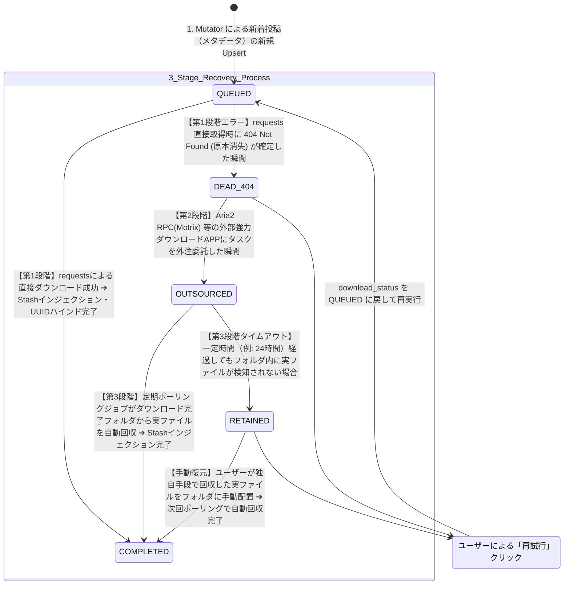
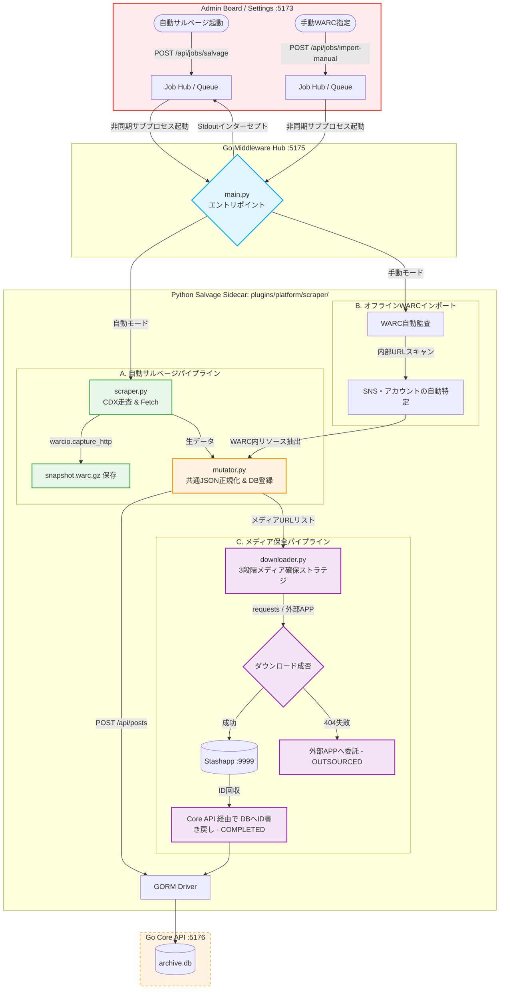

### 第9章：プラグインアーキテクチャとサイドカー (Plugin Architecture & Sidecar)
**プロジェクト名** : dozou_katanuki (Pluggable UI & Multi-Format Local Archival System "土蔵・型抜き") Pluggable UI & Multi-Format Archival System)
**ドキュメントID** : SPEC-PLUGIN-001
**バージョン** : 3.3.0
**作成日** : 2026-08-17
**ステータス** : 正式仕様（統合プラグイン `plugins/` 規格・Go製レンダラー・Python 3Arrows・3段階メディア確保ライフサイクル・ミドルウェア非同期制御・ポート9998同期）

**Navigation** : [← 前の章: 第8章：ローカルストレージ保全とメディアポリシー](08_storage_persistence_and_media_policy_v2.md) | [📚 目次 (Home)](README.md) | [次の章: 第10章：Admin & Governance（システム管理・設定・保守層） →](10_admin_board_and_governance_v5.md)

--------------------------------------------------------------------------------

#### 9.1 全体設計思想と責務の境界線
本システムにおけるプラグインアーキテクチャは、各SNSプラットフォーム（Twitter/X, Instagram, TikTok等）の追加・改修・パージをフォルダ1つの出し入れだけで完結させるため、**「統合プラグイン（Unified Plugin Package）」**規格を導入し、それを**「ファームウェアである第2層：Go Middleware (:5175)」**が一元管理・統治する設計を採用しています [6.1]。

##### 1. プラットフォーム統合パッケージの物理集約思想
従来の設計では、プラットフォーム固有の処理（Pythonの収集ロジック、GoのRenderTreeデータ変換、フロントの画面スキン）が、プロジェクト内の別々のディレクトリに散逸していました。これは開発の認知負荷を高めるだけでなく、AIエージェントに機能開発を指示する際のコンテキスト肥大化とハルシネーション（暴走）を引き起こす致命的要因でした [19]。
これを根本から解決するため、プラットフォーム（SNS）単位で、**「どう集めるか（収集）」、「どう整えるか（データ変換）」、「どう見せるか（表示スキン）」**のすべての責務を一意のフォルダに物理集約（あつまれあつまれ）した、**「統合プラグイン」**規格を定義します。

##### 2. Unixデバイスドライバ思想に基づく完璧な役割分離 [9.1]
本システムは、OSにおける「デバイスドライバモデル」に準拠した厳格な分離設計を徹底します [9.1]。
*   **第3層：Driver層 (Core Backend :5176)** は、SQLite3（archive.db）および Stashapp（:9999）という物理ストレージ「デバイス」へのクリーンな低レベルI/Oを提供する**「純粋なデバイスドライバ」**に徹します [2, 9.1]。外部プロセスの起動や進捗管理などの動的なコーディネーションには一切関与しません [9.1]。
*   **第2層：Middleware層 (Middleware Hub :5175)** は、システム全体のインテリジェンスとオーケストレーションを司る**「ファームウェア/制御層」**として振る舞います [9.1]。設定画面からの要求を受け取り、統合プラグイン配下の Python サイドカー（Scraper/Downloader）を直接サブプロセスとしてキック・監視・進捗スキャン（stdout解析）し、その状態（シグナル）をフロントエンドへ一方向（UDF）に中継配信します [9.1]。
*   **第1層：Presentation層 (Dumb UI :5173)** は、独自の状態やビジネスロジックを1行たりとも持たず、ミドルウェアが配信する完成済みのデータ構造 `RenderTree`、および統合プラグインから中継される表示スキン（Layout/CSS/JS）を忠実に描画するだけの **Stateless Pure View** とします [35, 36]。

--------------------------------------------------------------------------------

#### 9.2 統合プラグインパッケージ（Unified Plugin Package）の物理構造
各プラットフォーム（SNS）の統合プラグインは、プロジェクトルート直下の **`plugins/{platform}/`** ディレクトリに配置され、以下の厳格な構造制限および「1ファイル100行以下ルール」を順守します [18, 6.1]。

```text
plugins/
└── {platform}/                           # プラットフォーム識別子（例: twitter, instagram）
    │
    ├── scraper/                          ★ Python非常駐サイドカー（収集・保全）
    │   ├── main.py                       # 総合エントリポイント (Dispatcher)
    │   ├── core/
    │   │   ├── scraper.py                # ①【Scraper】CDX API走査、warcioを用いたオンザフライ原本WARC保存
    │   │   ├── mutator.py                # ②【Mutator】共通データへのパース、Core APIへのミューテーションPOST
    │   │   └── downloader.py             # ③【Downloader】3段階メディア確保、Stashインジェクション・ID回収
    │   └── parsers/
    │       ├── base_parser.py            # 解析機共通 of 抽象基底クラス (BaseParser)
    │       └── {platform}_parser.py      # 対象プラットフォーム専用パースエンジン
    │
    ├── renderer/                         ★ Goレンダリングプラグイン（データ構造変換）
    │   └── renderer.go                   # 生SQLite3レコード ➔ RenderTree への変換
    │
    └── skin/                             ★ Frontendプレゼンテーションスキン（表示定義）
        ├── layout.yaml                   # タイムラインのコンポーネント配置・マッピング
        ├── design.css                    # プラットフォーム固有のスタイル・装飾
        └── controller.js                 # スレッド展開、カルーセルスワイプ等の挙動
```

| フォルダ名 | 主要技術 | 1ファイル行数制限 | 役割・責務 |
| ------ | ------ | ------ | ------ |
| **scraper/** | Python 3.10+, `warcio`, `requests` | **100行以下厳守** [18] | オンデマンド（非常駐）で起動され、Wayback/WARCからのメタデータ・実メディアの抽出、Core APIへのGORM登録、Stashへのバイナリインジェクションを実行する [2]。 |
| **renderer/**| Go 1.22+ | **100行以下厳守** [18] | ミドルウェア（:5175）にロードされ、タイムライン表示要求のたびに、生の SQLite3 レコードをフロント用 JSON（`RenderTree`）へミリ秒解決・変換する [42, 6.1]。 |
| **skin/** | YAML, CSS, JavaScript (ES6) | **100行以下厳守** [18] | フロントエンドに配信され、対象プラットフォーム固有の「タイムラインレイアウト（CSS/JS）」や「スレッドツリー展開・カルーセルスワイプ」などの表示・振る舞いを決定する [106, 108]。 |

--------------------------------------------------------------------------------

#### 9.3 Pythonサイドカー・3段階メディア確保ライフサイクル（downloader.py 仕様）
統合プラグイン内の Python 収集パイプラインにおいて、もっともネットワークエラーやボット制限を受けやすく、システムの生命線となるのがメディア実ファイル（画像・動画・GIF）のダウンロード＆保全処理（`downloader.py`）です [11, 72]。
本システムは、Wayback Machineなどの外部アーカイブサーバーへの負荷に配慮しつつ、100%の信頼性でメディアをローカル完結サルベージするため、以下の**「3段階メディア確保ライフサイクル（3-Stage Media Recovery Strategy）」**を `downloader.py` の物理実装ロジックとして義務付けます [33, 71, 110]。

##### 1. メディア確保ライフサイクルの状態マシン（State Machine）とDB同期ポリシー [33, 72]
データベース（`archive.db`）の `media` テーブルに存在する `download_status` カラムの値は、`downloader.py` の実行処理状況に伴って以下のように自律遷移します。



##### 2. 各段階の実装ロジックと動作仕様
###### 第1段階：最初期 requests 直接アプローチ [72]
*   **処理挙動** : `downloader.py` は、まず標準の `requests` ライブラリを用いて、登録された `download_url`（本家CDNまたはWayback）へ HTTP GET ストリーム（`stream=True`）による直接ダウンロードを試みます [12, 72]。
*   **成功時（COMPLETED）** : ダウンロードしたバイナリを Stashapp（:9999）へ GraphQL 経由でインジェクションし、回収した一意の UUID（`stash_scene_id` / `stash_image_id`）を Core API（`:5176`）の `POST /api/posts` 経由で SQLite3 へ書き戻し、状態を **`COMPLETED`** に更新します [15, 72]。
*   **原本消失時（DEAD_404）** : サーバーから明確に `HTTP 404 Not Found`（原本消失）が返却された場合、直接回収は不可能であるため、状態を **`DEAD_404`** に更新し、即座に第2段階へエスカレーションします [72]。
*   **一時エラー時（QUEUEDの維持）** : Wayback側の過負荷による `HTTP 429`、`5xx`、あるいはタイムアウト等は一時的障害であるため、指数バックオフをかけた最大3回のリトライを行い、それでも失敗した場合は状態を **`QUEUED`**（保留・待機）のまま維持します [12, 72]。

###### 第2段階：DEAD_404 メディアの外部アプリ（外注）委託 [73]
*   **処理挙動** : 状態が `DEAD_404` となったアセットについて、システムは直接ダウンロードを諦め、ローカル環境で常時稼働している強力な外部ダウンロードマネージャーである **Motrix (Aria2 RPC ポート :6800)、Thunder (迅雷)、FDM (Free Download Manager)、JD2 (JDownloader2)** のいずれかの RPC API、または監視用トレント/リンクフォルダへアセットURLを外注委託（タスク登録）します [11, 73]。
*   **委託成功時（OUTSOURCED）** : タスクの発行が確認できた瞬間、状態を **`OUTSOURCED`** に更新します [73]。

###### 第3段階：cron-like 定期ポーリング ＆ Stash自動回収プッシュ [73]
*   **処理挙動** : Goミドルウェア（:5175）またはサイドカーの定期監視ジョブ（1分〜数分間隔の常駐スレッド）は、外部ダウンロードアプリの保存先フォルダ（ダウンロード完了ディレクトリ）を再帰的にポーリング（スキャン）します [73]。
*   **実ファイル検知時（COMPLETED）** :
    監視ディレクトリ内で、対象アセットの `media_id`（URL末尾の BaseName、例: `eb7ymRi-pfsx5FJH.mp4`）と物理ファイル名が100%一致する完遂ファイルを検出した瞬間、ファイルを Stashapp 監視フォルダ（`scenes/` または `images/`）へ自動回収移動します [64, 73]。
    その後、GraphQL 経由で Stash にインジェクションを実行し、回収された Stash ID を SQLite3 へ書き戻し、状態を **`COMPLETED`** へ最終更新します [15, 73]。
*   **タイムアウト（RETAINED）** :
    一定時間（例: 24時間）が経過しても完了フォルダに実ファイルが検出できない場合、状態を **`RETAINED`**（手動配置待ち保留状態）に自動遷移させ、タイムラインUI上に警告バッジを表示します [73]。ユーザーが独自に調達したファイルをフォルダに手動配置した場合、次回のポーリングがそれを検知して自動回収・インジェクションを実行し、安全に **`COMPLETED`** へと復元します [73]。

--------------------------------------------------------------------------------

#### 9.4 自動・手動2系統のオーケストレーションフロー
本システムは、Wayback Machine等から自動取得する**「自動サルベージ系統」**と、ボット対策を完全バイパスするためにユーザーが通常ブラウザ等（ArchiveWeb.page拡張機能など）で手動取得したWARCファイルを取り込む**「手動WARCインポート系統（オフライン完全対応）」**の2系統のフローをサポートします [8, 9.3]。



##### 9.4.1 自動サルベージ系統（CDX ➔ オンザフライWARC保存） [9.3.1]
1.  **フェッチ＆キャプチャ（Scraper）**：
    *   `scraper.py` がWayback MachineのCDX Server APIを走査して対象アカウントの過去URLを特定 [9.3.1]。
    *   通信時に `warcio.capture_http` コンテキストマネージャーを噛ませ、外部APIサーバーを叩いた瞬間の生のHTTPリクエスト・レスポンス（ヘッダー・パケット）を、一期一会の原本保証として **`backups/dumps/{platform}/{username}/{post_id}/snapshot.warc.gz`** にストリーム保存します [10, 9.3.1]。
2.  **正規化＆データベースミューテーション（Mutator）**：
    *   取得された生テキストを `parsers/{platform}_parser.py` が読み取り、共通構造化データ（metadata.jsonと同等の辞書）へパース [9.3.1]。
    *   Core Backend (:5176) の `POST /api/posts` を叩き、SQLite3（`archive.db`）に投稿およびメディアのリレーショナルレコードをUpsert登録します。このときのメディア初期状態は **`QUEUED`** です [9.3.1]。
3.  **3段階メディア保全・Stashインジェクション（Downloader）**：
    *   `downloader.py` は、前述の「3段階メディア確保ライフサイクル」を非同期かつ自律的に追跡・処理し、最終的に Stash UUID のバインドと `COMPLETED` への状態遷移を完了させます [9.3.1]。

##### 9.4.2 手動WARCインポート系統（手動WARC指定 ➔ 逆引き自動インポート） [9.3.2]
ログインウォール、鍵アカウント、あるいは各SNSによる厳しいボット対策を100%完全回避するために設計された、**完全オフライン動作可能**なバイパス系統です [9.3.2]。
1.  **自動監査・SNS特定（Dispatcher）**：
    *   `main.py` にローカルの `.warc` / `.warc.gz` ファイルパスが指定されてキックされると、サイドカーは `warcio` を開いて内部に記録されている通信レコードのURLパターンを全自動監査します [9.3.2]。
    *   内部URLに `twitter.com/{username}/status/` 等が含まれていることを検知すると、**「SNSプラットフォーム: twitter、アカウント名: {username}」を自動で逆引き特定・解決**します [9.3.2]。
2.  **オフライン・パース＆DB登録（Mutator - Offline）**：
    *   特定された専用パーサーを起動。外部のWayback Machineなどのネットワークには一切接続せず、指定されたWARCコンテナ内部から「当時の生のAPI応答JSON」や「生のHTMLパケット」を直接逆引き・解凍抽出します [9.3.2]。
    *   抽出されたデータから共通正規化JSONを再構築し、Core Backend (:5176) のAPIを叩いて SQLite3 にデータを登録します [9.3.2]。
3.  **オフライン・アセット抽出・Stashインジェクション（Downloader - Offline）**：
    *   メディアの実ファイルも、インターネットにダウンロードしに行くのではなく、**WARC内部のレスポンスレコード（Payloadバイナリ）から直接ローカルにデコンプレス（展開）して抽出**します（原本100%品質保証） [9.3.2]。
    *   抽出したメディアバイナリを Stash GraphQL API に流し込み、IDをSQLite3に書き戻して状態を **`COMPLETED`** に更新し、リレーションを完全に復旧します [9.3.2]。

--------------------------------------------------------------------------------

#### 9.5 コマンドライン（CLI）起動引数仕様
Pythonサイドカーは非対称・オンデマンド実行に徹しており、エントリポイント（`main.py`）は以下の統一された引数スキーマに沿って起動・制御されます [9.4]。

##### 1. 引数定義一覧 [9.4.1]
| 引数名 | 省略形 | 型 | 必須 | デフォルト値 | 説明 |
| ------ | ------ | ------ | ------ | ------ | ------ |
| `--mode` | `-m` | string | **必須** | - | 動作モード。`auto` (自動CDXサルベージ) または `manual` (手動WARCインポート)。 |
| `--platform` | `-p` | string | 条件付 | - | 対象SNS。`twitter`, `instagram`, `tiktok`。`auto`モード時は必須。`manual`モード時はWARCから自動監査されるため省略可能。 |
| `--account` | `-a` | string | 条件付 | - | サルベージ対象のアカウント名（@マーク不要）。`auto`モード時は必須。 |
| `--warc-path`| `-w` | string | 条件付 | - | インポート対象の `.warc` / `.warc.gz` のローカル絶対パス。`manual`モード時は必須。 |
| `--limit` | `-l` | int | 任意 | `100` | 1回の実行でフェッチ・処理する最大投稿件数上限。 |
| `--offline` | - | flag | 任意 | `False` | 手動インポート時、外部ネットワークへのアクセス（短縮URL展開など）を100%遮断してローカル処理するフラグ。 |

##### 2. 起動コマンド実例 [9.4.2]
*   **実例A: 特定アカウントの自動サルベージを実行する場合**
    ```bash
    python plugins/twitter/scraper/main.py --mode auto --platform twitter --account msluo14 --limit 50
    ```
*   **実例B: ユーザーが手動取得したWARCからオフラインインポートを実行する場合**
    ```bash
    python plugins/twitter/scraper/main.py --mode manual --warc-path "C:/Users/User/Downloads/msluo14_archive.warc.gz" --offline
    ```

--------------------------------------------------------------------------------

#### 9.6 バックエンド（Go / :5175）での非同期ジョブ制御仕様
Admin Board（Vue 3 `/settings` **:5173**）でのワンクリック制御を実現するため、**Goミドルウェア（ポート :5175）**側には、Pythonプロセスを非同期スレッドでサブプロセスとして安全に直接キック・制御・監視するためのジョブコントローラーを実装します [9.5]。

##### 1. 非同期ジョブ制御アーキテクチャ仕様 [9.5.1]
*   **Non-Blocking Execution**：
    *   Pythonの実行は長時間を要する可能性があるため、HTTPリクエストに対してブロッキングしてはなりません。Go Middleware側は `exec.Command` を用いて、独立したノンブロッキングなOSサブプロセスとしてPythonをキックします。
*   **Job Pool / Thread Management**：
    *   重複起動や過度なCPU・ネットワークバーストを防ぐため、Goミドルウェア内部（`jobs/pool.go`）で最大並行起動数 **1** の簡易キュー・スレッド管理を行います。同一アカウントや同一ジョブの多重キックは無視、またはキューイングされます。
*   **Stdout / Stderr のリアルタイム解析と進捗管理**：
    *   キックしたPythonプロセスの `StdoutPipe` から進捗メッセージをインターセプト・スキャンし、ジョブステータスおよびパーセンテージをオンメモリで追跡します。
    *   Python側は、以下の標準構造化文字列を stdout に1行（単一バッファ）としてフラッシュ出力する契約とします：
        `PROGRESS: {current_index}/{total_count} (Status: {message})`  
        *(例: `PROGRESS: 23/50 (Status: Media ID eb7ymRi... OUTSOURCED to Motrix)`)*

##### 2. ジョブ制御用 API エンドポイント（Middleware :5175 が直接提供） [9.5.2]
###### ① `POST /api/jobs/salvage` (自動サルベージの非同期キック)
*   **入力 JSON**：
    ```json
    {
      "platform": "twitter",
      "account": "msluo14",
      "limit": 50
    }
    ```
*   **出力 JSON (即時返却)**：
    ```json
    {
      "job_id": "job_20260817_0001",
      "status": "queued",
      "message": "msluo14 に対する自動サルベージジョブをキューに登録しました。"
    }
    ```

###### ② `POST /api/jobs/import-manual` (手動WARCインポートの非同期キック)
*   **入力 JSON**：
    ```json
    {
      "warc_path": "C:/Users/User/Downloads/msluo14_archive.warc.gz",
      "offline": true
    }
    ```
*   **出力 JSON (即時返却)**：
    ```json
    {
      "job_id": "job_20260817_0002",
      "status": "queued",
      "message": "手動WARCファイルの監査インポートジョブをキューに登録しました。"
    }
    ```

###### ③ `GET /api/jobs/status?id={job_id}` (ジョブステータス・進捗ポーリング)
*   **出力 JSON**：
    ```json
    {
      "job_id": "job_20260817_0001",
      "status": "running",
      "progress": {
        "current": 23,
        "total": 50,
        "percentage": 46.0,
        "last_message": "PROGRESS: 23/50 (Status: Media ID F8wZ1ab... Injected to Stash)"
      },
      "created_at": "2026-08-17T15:40:00-07:00"
    }
    ```

--------------------------------------------------------------------------------

#### 9.7 レンダリングプラグイン（Go）との接続仕様（共通中間JSON形式）
Python非常駐サイドカー（Mutator）がSQLite3にデータを書き込む際、あるいは直接システム本体へ引き渡す際、プラットフォームの差異を100%吸収した**「共通中間表現 JSON（GORM Post/Media モデル互換）」**としてパッキングし、Core Backend API (:5176) の **`POST /api/posts`** に流し込みます [9.6]。

この共通スキーマ定義を、プラグインと本体間の絶対的な「契約」とします [9.6]。

##### 1. 共通中間JSONスキーマ（`POST /api/posts` リクエストボディ定義） [9.6.1]
```json
{
  "platform": "twitter",
  "account": {
    "numeric_id": "18793827579",
    "username": "msluo14",
    "display_name": "Luo Yike",
    "avatar_url": "https://pbs.twimg.com/profile_images/9Kx_8Y7z_400x400.jpg",
    "description": "SNS Timeline dynamic archiver coordinator."
  },
  "post": {
    "id": "1879382757924868404",
    "conversation_id": "1879382757924868404",
    "reply_to_tweet_id": null,
    "created_at": "2026-08-17T12:00:00Z",
    "full_text": "本プロジェクトの5層アーキテクチャが「宣言型UI + UDF」へ純化完了！ #dozo_katanuki",
    "wayback_url": "https://web.archive.org/web/20260817120000/https://twitter.com/msluo14/status/1879382757924868404"
  },
  "media": [
    {
      "url": "https://pbs.twimg.com/media/F8wZ1abXYAAY7kL.jpg",
      "type": "image",
      "width": 1200,
      "height": 800
    }
  ]
}
```

--------------------------------------------------------------------------------

**Navigation** : [← 前の章: 第8章：ローカルストレージ保全とメディアポリシー](08_storage_persistence_and_media_policy_v2.md) | [📚 目次 (Home)](README.md) | [次の章: 第10章：Admin & Governance（システム管理・設定・保守層） →](10_admin_board_and_governance_v5.md)
