# 🏯 土蔵・型抜き (dozou_katanuki) 完全統合ドキュメント仕様書 (COMBINED WIKI)

> **生成日時**: 2026-08-24 17:03:41  
> **対象ファイル数**: 26 ファイル  
> **リポジトリ**: `opcksd96/dozou_katanuki.wiki`

---

## 📑 総合目次 (Table of Contents)

1. [Home.md](#homemd)
2. [Status_and_Roadmap.md](#status-and-roadmapmd)
3. [SPEC_TASK3_TASK2_WHITELIST_EXTERNAL_AND_SCRAPERS.md](#spec-task3-task2-whitelist-external-and-scrapersmd)
4. [PLAN_TASK3_TASK2_WHITELIST_EXTERNAL_AND_SCRAPERS.md](#plan-task3-task2-whitelist-external-and-scrapersmd)
5. [part1_01_technical_specs.md](#part1-01-technical-specsmd)
6. [part1_02_external_services.md](#part1-02-external-servicesmd)
7. [part1_03_storage_persistence.md](#part1-03-storage-persistencemd)
8. [part1_04_implementation_principles.md](#part1-04-implementation-principlesmd)
9. [part2_01_00_index.md](#part2-01-00-indexmd)
10. [part2_01_01_config.md](#part2-01-01-configmd)
11. [part2_01_02_lifecycle.md](#part2-01-02-lifecyclemd)
12. [part2_01_03_proxy.md](#part2-01-03-proxymd)
13. [part2_01_04_admin_board.md](#part2-01-04-admin-boardmd)
14. [part2_01_05_backup.md](#part2-01-05-backupmd)
15. [part2_01_06_recovery.md](#part2-01-06-recoverymd)
16. [part2_01_07_audit.md](#part2-01-07-auditmd)
17. [part2_01_08_scheduler.md](#part2-01-08-schedulermd)
18. [part2_02_plugin_architecture.md](#part2-02-plugin-architecturemd)
19. [part3_01_database_design.md](#part3-01-database-designmd)
20. [part3_02_pure_dumb_frontend.md](#part3-02-pure-dumb-frontendmd)
21. [part3_03_0_middleware_index.md](#part3-03-0-middleware-indexmd)
22. [part3_03_1_middleware_core.md](#part3-03-1-middleware-coremd)
23. [part3_03_2_data_decorator.md](#part3-03-2-data-decoratormd)
24. [part3_03_3_job_orchestrator.md](#part3-03-3-job-orchestratormd)
25. [part3_04_backend_driver.md](#part3-04-backend-drivermd)
26. [part4_01_references_and_literature.md](#part4-01-references-and-literaturemd)

---


<!-- ================================================================= -->
<!-- SECTION 1: Home.md -->
<!-- ================================================================= -->

<div id="homemd"></div>

# 📄 [1] Home.md

> *Source File: `Home.md`*

# 📚 dozou_katanuki DocWiki 総合ポータル

ようこそ、 **dozou_katanuki** 公式技術ドキュメント Wiki へ！ 本ドキュメント群は、Webの深淵から失われた投稿・メディアをサルベージし、ローカルで動態保存するためのアーキテクチャ・仕様・実装ガイドラインを網羅しています。

本ドキュメントは、システム全体の設計思想とレイヤーごとの責務を明確にするため、「4つの編（Part）」にカテゴライズされたモジュラー構造を採用しています。特定の章番号に依存しない「Single Source of Truth」としての情報管理を徹底しており、各トピックは独立したコンポーネントとして機能します。

---

## 🚩 【総合ステータス】 実装状況と今後のロードマップ
* **[🚀 実装状況と今後の実装計画書 (Status & Roadmap)](Status_and_Roadmap)**
  現在までの全5層（フロント/ミドル/ドライバ/DB/プラグイン）の実装達成度（95%達成）と、今後のマルチプラットフォーム（Bluesky/Instagram）拡張計画。

---

## 🛡️ 【Part 1】 アーキテクチャ・遵守事項 (Architecture & Principles)
システムが存在する意義と、AIおよび開発者が絶対に守るべき全体ルール・制約・ポリシーを定義します。

* **[技術仕様とバックボーン](part1_01_technical_specs)**
  サルベージ動態保存の崇高な目的、技術スタック、ポート非開放のキメラアーキテクチャの基本構造。
* **[外部サービスの概要とサルベージ技術](part1_02_external_services)**
  Wayback CDX API、Aria2/Motrix P2P並列通信、Stashapp、公式リンク集。
* **[実装規約・制約原則（宣言型UI・UDF・AI駆動開発）](part1_04_implementation_principles)**
  「1ファイル100行以下」厳格ルール、宣言型UI＋単一データフロー（UDF）＋シグナル原則、スクリプト隔離原則。
* **[ローカルストレージ保全とメディアポリシー](part1_03_storage_persistence)**
  URL BaseName命名原則、仮想アバターリゾルバ（3桁ナンバリング世代管理）、Stashメディアプールとの完全分離ポリシー。

---

## 📦 【Part 2】 Wails App Shell ＆ 運用基盤 (Shell & Governance)
システム全体を包み込む「外殻（Wails）」の起動・プロセスライフサイクルと、統合管理機構・拡張機構を定義します。

* **[Wails App Shell ＆ 統合管理基盤](part2_01_00_index)**
  `wails.json` を軸としたプロセスライフサイクル制御（`taskkill`道連れによるゾンビ化防止）と、統合設定ファイル `config.json` を操作するGUI基盤「Admin Board」の仕様。
* **[プラグインアーキテクチャとサイドカー](part2_02_plugin_architecture)**
  レンダリングプラグイン（Go）、Python非常駐サルベージサイドカーパイプライン、Stashインジェクション。

---

## ⚙️ 【Part 3】 内部システム設計・データモデル (Internal System & Data Flow)
Wailsの内部（内臓）で稼働する、UIからデータベースまでの具体的なデータフローと三層アーキテクチャ（フロントエンド・ミドルウェア・バックエンド）の設計を定義します。

* **[データベース設計と仮想ストレージプール](part3_01_database_design)**
  SQLite3 実稼働DDL完全版、最適化インデックス、コンフリクト監査結果、WALモード運用。
* **[フロントエンド層（Foolish Frontend & 宣言型UI）](part3_02_pure_dumb_frontend)**
  Dumb Component (Stateless Pure View)、Vue 3シグナル活用、アーカイブパスルーティング、主要型定義（RenderTree）。
* **[ミドルウェア層（Middleware Hub）](part3_03_0_middleware_index)**
  生データのRenderTree完全構造化、ページネーション制御、アバター仮想URLの解決と世代管理、多言語翻訳テキストのバインドとDOMリンク化。
* **[バックエンド層（Core Backend API & Driver）](part3_04_backend_driver)**
  Go Core Backend + GORM、ArchiveDB 統一メディアURLインターフェース、ローレベルクエリ処理。

---

## 📚 【Part 4】 リファレンス・付録 (Appendix)

* **[参考資料・技術文献・型定義カタログ](part4_01_references_and_literature)**
  RFC 7089 Memento、各ライブラリ公式ドキュメント、リファレンスリンク。

---

---


<!-- ================================================================= -->
<!-- SECTION 2: Status_and_Roadmap.md -->
<!-- ================================================================= -->

<div id="status-and-roadmapmd"></div>

# 📄 [2] Status_and_Roadmap.md

> *Source File: `Status_and_Roadmap.md`*

# 🏯 土蔵・型抜き (dozou_katanuki) 実装状況と今後の実装計画書

**ドキュメントID** : STATUS-ROADMAP-20260824  
**バージョン** : 4.2.0  
**改定日** : 2026-08-24  
**ステータス** : 正式レポート (改定版)  
**対象仕様** : `SPEC-PLUGIN-001`, `SPEC-CONFIG-001`, `SPEC-AUDIT-001`, `SPEC-RECOVERY-001`, `SPEC-MIDDLEWARE-001`, `SPEC-SCRAPER-EXTERNAL-001`

---

## 📊 1. 全体実装進捗サマリー

現在、本システムは **コアアーキテクチャの全5層（Wails Frontend / Go Middleware / Go Driver / SQLite3 / Python Sidecar / Stashapp）が完全に統合・稼働** しており、基本機能の達成度は **約 98%** に達しています。直近ではタイムラインのリプライツリー表示、Whitelistアカウントのエイリアス（裏垢）およびグルーピング一括管理が完遂されました。

| レイヤー / コンポーネント | 主要技術 | 実装ステータス | 達成度 | 備考 |
| :--- | :--- | :---: | :---: | :--- |
| **第1層: Dumb UI (Frontend)** | Vue 3 + TailwindCSS + TS | **完了** | **99%** | リプライツリー接続線、インライン展開、グループ一括選択、裏垢表示 |
| **第2層: Middleware (Go Hub)** | Go 1.22+ / Wails v2 RPC | **完了** | **98%** | グループ別タイムライン集約、大文字小文字無視同期、非同期ジョブ制御 |
| **第3層: Driver (Backend I/O)** | Go (GORM) + SQLite3 | **完了** | **98%** | WALモード、`group:`/`alias_of` 抽出、整合性監査、多言語全文保存 |
| **第4層: Unified Plugin (Twitter)**| Python 3.13 + warcio + Go | **完了 (拡張中)** | **95%** | Wayback/手動WARC完備。Sotwe/Nitter仕様・計画策定完了 |
| **第5層: Storage (Stash / Blobs)** | Stashapp GraphQL / FS | **完了** | **95%** | GraphQLインジェクション、孤立ファイル検知・自動回収 |

---

## 🛠️ 2. 現在の実装状況詳細（完了機能一覧）

### 📱 A. プレゼンテーション層 (Vue 3 Dumb UI :5173)
- **タイムライン＆会話スレッド完全対応** ★直近完了:
  - `ArticleCard.vue` における会話スレッド接続線（Thread Line）の自動描画。
  - `ArticleInlineThread.vue` / `useTimelineThread.ts` による親ツイート・会話のインライン展開プレビュー（詳細画面へ遷移せず即時閲覧）。
- **アカウント・グルーピング＆裏垢（エイリアス）UI** ★直近完了:
  - `AccountScopeSelector.vue` 最上段に「⚡ 一括スコープ切り替え」ピルボタン（`🏷️ グループ名 (件数)`）を新設。
  - `AccountGroupSection.vue` によるグループ別セクション表示（100行以下ルール完全遵守）。
  - 裏垢アカウントへの 🔗 インジケータおよび「裏垢 → 本垢: @xxx」ツールチップ表示。
  - `AccountHeroHeader.vue` でのグループバッジおよび本垢リンク表示。
- **Admin Board 7大統合機能 (`useAdmin.ts`, `AdminModal.vue`)**:
  1. **ジョブコントローラー**: 自動サルベージ起動、手動WARC指定、リアルタイムStdout監視。
  2. **設定ポータル (`ConfigPortal.vue`)**: `config.json` のGUI編集・保存、リアルタイム反映。
  3. **データベース検索＆多言語翻訳エディタ (`DatabaseView.vue`)**: 全文検索、日英中3言語翻訳のインライン編集。
  4. **ホワイトリスト管理 (`WhitelistView.vue`, `WhitelistTable.vue`)**: グループ名・裏垢エイリアスのCRUD、グループフィルタリング、テーブルでのバッジ表示。
  5. **SQLite3整合性監査＆クレンジング (`AuditReportView.vue`)**: PRAGMA監査、孤立ファイル・孤立DBレコードの一括パージ。
  6. **スキン＆フォントエディタ (`SkinFontEditor.vue`)**: `design.css` のリアルタイムプレビュー、フォント切り替え。
  7. **LAN配信＆キャスト制御**: QRコード/URL共有、キャスト配信トグル。

---

### ⚙️ B. ミドルウェア & ドライバ層 (Go Middleware Hub :5175 / Wails RPC)
- **大文字小文字を無視した所属グループ自動同期 (`repo_whitelists.go`)** ★直近完了:
  - `LOWER(username) = LOWER(?)` による確実な照合。
  - 起動時（`Startup`）および更新時の `SyncAllWhitelistGroups()` 自動一括同期。
- **グループ別タイムライン集約抽出 (`repo_articles.go`)**:
  - `selectedAccount = "group:GroupName"` による所属アカウント全件の一括タイムラインクエリ（`applyAccountFilter`）。
- **非同期ジョブオーケストレーター & バックグラウンドスケジューラー**:
  - Pythonサブプロセス制御、Stdout進捗ストリーミング、自動バックアップ (`VACUUM INTO`)。
- **LANメディアブロードキャスト**:
  - CIDR制限、ローカルIP自動解決、動画・画像ストリーミング。

---

### 🔌 C. 統合プラグイン＆Pythonサイドカー (`plugins/twitter/`)
- **① 自動サルベージ系統 (`core/scraper.py`)**:
  - Wayback CDX Server API走査、`warcio.capture_http` による原本 `snapshot.warc.gz` のオンザフライ保存。
- **② 手動WARCインポート系統 (`core/warc_importer.py`)**:
  - WARCコンテナ内通信レコードの全自動監査（プラットフォーム/アカウント逆引き特定）、完全オフラインDB・メディア登録。
- **③ 3段階メディア確保ライフサイクル (`core/downloader.py`)**:
  - 直接取得 ➔ Motrix/Aria2 RPC 委託 ➔ 定期ポーリング Stash 回収。
- **④ 完全オフラインディザスタリカバリ (`core/restorer.py`)**:
  - `backups/dumps/` 階層からのメタデータ・アバター・メディア一括再構築。
- **⑤ マルチソース・スクレイパー & Whitelist外補足の仕様・計画策定** ★直近完了:
  - `SPEC_TASK3_TASK2_WHITELIST_EXTERNAL_AND_SCRAPERS.md` (仕様書)
  - `PLAN_TASK3_TASK2_WHITELIST_EXTERNAL_AND_SCRAPERS.md` (実装計画書)

---

## 🗺️ 3. 今後の実装ロードマップ

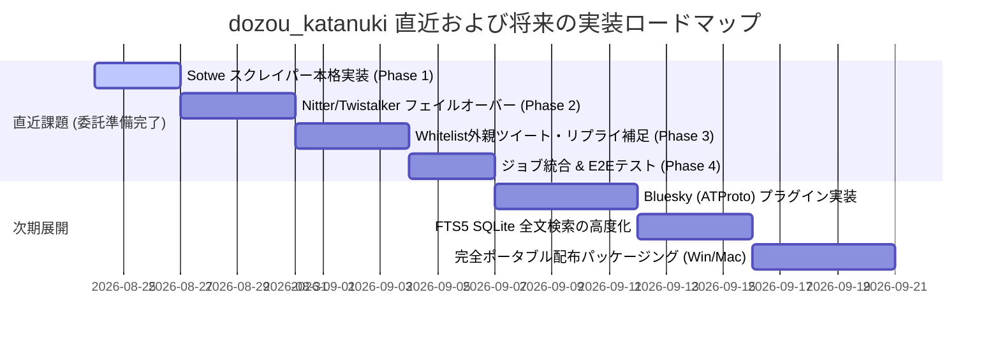

---

### 🚀 直近の実装対象（委託タスク仕様書・計画書準拠）

詳細仕様および実装手順は以下を参照：
- 仕様書: [`SPEC_TASK3_TASK2_WHITELIST_EXTERNAL_AND_SCRAPERS.md`](file:///d:/Projects/10_tools/dozou_katanuki/dozou_katanuki.wiki/SPEC_TASK3_TASK2_WHITELIST_EXTERNAL_AND_SCRAPERS.md)
- 実装計画書: [`PLAN_TASK3_TASK2_WHITELIST_EXTERNAL_AND_SCRAPERS.md`](file:///d:/Projects/10_tools/dozou_katanuki/dozou_katanuki.wiki/PLAN_TASK3_TASK2_WHITELIST_EXTERNAL_AND_SCRAPERS.md)

1. **【課題②】マルチソース・スクレイパー群の実装**:
    - **SotweSource / SotweParser**: SeleniumBase UC ModeによるWeb UI DOMスクレイピング。最新〜中期のツイート・メディア抽出。
   - **NitterSource / NitterParser**: 分散インスタンスプール管理・ヘルスチェック付きHTMLスクレイピング。
   - **TwistalkerSource / TwistalkerParser**: 代替HTMLミラー。
   - **Priority Cascade**: Wayback ➔ Sotwe ➔ Nitter ➔ Twistalker ➔ X Official の自動フォールバック。
2. **【課題③】Whitelist外ツイート補足ロジックの統合**:
   - 会話スレッドの `reply_to_id` を検知し、外部ユーザーの親ツイートを再帰取得（`Depth = 1〜2` 制限）。
   - `accounts` テーブルへの最小限メタデータ登録による外部キー整合性の担保。
   - 外部メディア保存ポリシーの適用（`salvage_external_media` 設定）。

---

### 📦 将来計画（マルチプラットフォーム・パッケージング）
1. **Bluesky (ATProto) 統合プラグイン (`plugins/bsky/`)**
2. **SQLite FTS5 高度全文検索 & ローカルAIタグ付け**
3. **一体型ポータブル配布パッケージ (`build/release/`)**

---


<!-- ================================================================= -->
<!-- SECTION 3: SPEC_TASK3_TASK2_WHITELIST_EXTERNAL_AND_SCRAPERS.md -->
<!-- ================================================================= -->

<div id="spec-task3-task2-whitelist-external-and-scrapersmd"></div>

# 📄 [3] SPEC_TASK3_TASK2_WHITELIST_EXTERNAL_AND_SCRAPERS.md

> *Source File: `SPEC_TASK3_TASK2_WHITELIST_EXTERNAL_AND_SCRAPERS.md`*

# 【土蔵・型抜き】仕様書：Whitelist外ツイート補足戦略 & マルチソース・スクレイパー仕様 (課題③ & 課題②)

- **文書ID**: `SPEC-SCRAPER-EXTERNAL-001`
- **作成日**: 2026-08-24
- **ステータス**: APPROVED / READY FOR IMPLEMENTATION
- **対象システム**: `dozou_katanuki` (Wails v2 + Go + Vue 3 + Python Scraper Plugin)

---

## 1. 全体背景と設計思想

### 1.1 プロジェクトの目的
「土蔵・型抜き」は、Twitter/Xを中心とするインフルエンサー・クリエイターの公開投稿・メディア（画像・動画）をローカル環境（SQLite + Stash + 静的ファイル）に恒久保存・閲覧するためのデスクトップ・アーカイブシステムです。

### 1.2 核心原則：Same Source, Same Flow
- **参照同一性**: どのスクレイパー（Wayback / Sotwe / Twistalker / Nitter / X）から取得したデータであっても、同一の `articles` / `media` / `accounts` スキーマに正規化され、同一のデータパイプラインを通じて保存・レンダリングされること。
- **100行以下ルール**: 全てのソースコードファイル（Python, Go, Vue, TS）は単一責任の原則に従い、**1ファイル原則100行以下**で分割・構成すること。

---

## 2. 【課題③】Whitelist外ツイート補足戦略・仕様

### 2.1 課題の所在
- 現在のシステムは、Whitelistに登録された特定アカウント（本垢・裏垢）のタイムラインを網羅的に保存することを主眼としています。
- しかし、Whitelist対象者が「他者からのメンションにリプライしている場合」や「他者のツイートを引用RT/RTしている場合」、**会話ツリー（会話の文脈・元ツイート）が欠落**し、タイムラインやリプライツリー表示で意味が通じなくなります。

### 2.2 補足戦略（Target Ingestion Strategy）

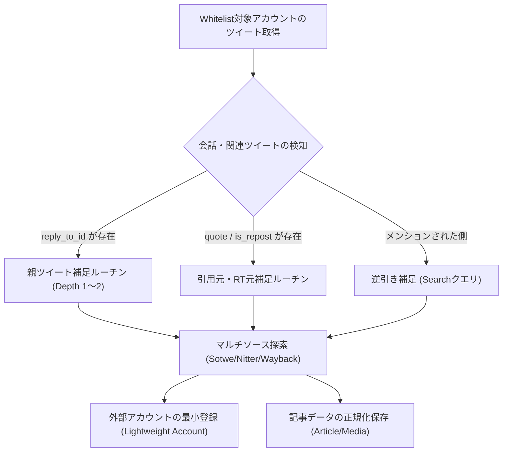

### 2.3 詳細仕様

#### (1) 探索深度（Depth）制限
- **デフォルト深度**: `Depth = 1`（直近の親ツイート・引用元ツイートのみ取得）。
- **最大深度（スレッド補完時）**: `Depth = 2`（会話の発端となるルートツイートまで遡及）。
- 無限連鎖（Whitelist外ユーザー同士の長大な口論スレッド等）によるリソース枯渇を防ぐため、**Whitelist外ユーザーを起点としたさらなる子リプライ収集は行わない（リーフノード扱い）**。

#### (2) 外部ユーザーのDB登録仕様（`accounts` テーブル）
- Whitelist外のユーザーであっても、外部キー制約（`fk_accounts_articles`）を満たすため `accounts` テーブルに登録します。
- **最小限メタデータ登録**:
  - `numeric_id`: 取得できた場合は数値ID、不明な場合は `ext_<username>` またはツイート内のユーザーID。
  - `username`: ユーザーハンドル（大文字小文字を保持）。
  - `display_name`: 表示名（取得できた場合）。
  - `avatar_url`: アイコンURL（取得できない場合はデフォルトアバターまたは空文字）。
  - `group_name`: 空文字 `""`。
  - `alias_of`: 空文字 `""`。
  - `is_external`: （拡張時または識別用）Whitelist外として扱う。

#### (3) 外部メディアの保存ポリシー
- **テキスト・メタデータ**: 100% 恒久保存（`articles` テーブル）。
- **メディア（画像・動画）**:
  - `config.storage.salvage_external_media = true` の場合: Whitelist対象者と同様にダウンロードキューに投入。
  - `false` の場合: `download_status = 'OUTSOURCED'` としてURLのみ保持し、ローカル実体保存はスキップしてストレージを節約可能とする。

---

## 3. 【課題②】マルチソース・スクレイパー仕様

### 3.1 ソース一覧と優先順位（Priority Cascade）

| 優先度 | ソース名 | 実装クラス | 特徴・役割 | 認証要否 |
|---|---|---|---|---|
| **1位 (最高)** | **Wayback Machine** | `WaybackSource` | 過去ログ・削除済みツイートの復元。最も網羅的。 | 不要 |
| **2位** | **Sotwe** | `SotweSource` | SeleniumBase UC ModeによるWeb UI DOMスクレイピング。最新〜中期のツイート。画像・動画直リンク取得可能。 | 不要 |
| **3位** | **Nitter (分散クローン)** | `NitterSource` | HTMLスクレイピング。複数インスタンス（`nitter.net`, `nitter.poast.org`等）への自動フェイルオーバー。 | 不要 |
| **4位** | **Twistalker** | `TwistalkerSource` | HTMLスクレイピング。代替ミラー。Sotwe/Nitter全滅時のフェイルオーバー。 | 不要 |
| **5位 (予備)** | **X Official / GraphQL** | `OfficialSource` | Guest TokenまたはCookieによる公式エンドポイント直接取得。 | 必要時Cookie |

### 3.2 各ソースの入出力インターフェース

全ソースは `plugins/base/scraper/core/base_source.py` の `BaseSource` を継承する：

```python
class BaseSource:
    def __init__(self, name: str, priority: int = 10, timeout: int = 15): ...
    def fetch_account(self, account: str, limit: int = 0, log_fn: Optional[Callable[[str], None]] = None) -> List[Dict[str, Any]]: ...
    def fetch_post(self, post_id: str, account: str = "", log_fn: Optional[Callable[[str], None]] = None) -> Optional[Dict[str, Any]]: ...
```

### 3.3 ソース別スクレイピング・パース詳細仕様

#### 1. SotweSource (`sotwe_source.py` / `sotwe_parser.py`)
- **アクセスURL**: `https://www.sotwe.com/{username}` (Web UI)
- **スクレイピング方式**: SeleniumBase UC Modeでブラウザを展開し、DOMツリーからBeautifulSoupで要素抽出
- **抽出要素**:
  - アカウント共通: `.profile-avatar img`, `.break-word .dynamic-link-content`, `.profile-name`
  - ツイート本体: `.tweet-card`, `.tweet-text .dynamic-link-content`
  - 投稿日時: `time[datetime]`
  - メディア画像: `.media-carousel img[src]`, `.media-carousel-image img[src]`
  - メディア動画: `.video-player video source[type="video/mp4"]`
  - 動画サムネイル: `.video-player video[poster]`
  - リツイート判定: `.v-card__title .fa-retweet`

#### 2. NitterSource (`nitter_source.py` / `nitter_parser.py`)
- **インスタンスプール管理**:
  - ヘルスチェック機能: 各インスタンスに対してリクエストを試行し、429/500番台エラーが発生した場合は一時的にクールダウンリストに隔離。
  - デフォルトインスタンス例: `https://nitter.net`, `https://nitter.poast.org`, `https://nitter.privacydev.net`, `https://nitter.woodland.cafe`
- **アカウント取得**: `GET {instance}/{username}` (HTML)
- **単一ポスト取得**: `GET {instance}/{username}/status/{post_id}` (HTML)
- **パース要素**:
  - ツイート本体: `.timeline-item`, `.tweet-content`
  - 親ツイートリンク: `.replying-to a`, `.tweet-link`
  - メディア: `.attachments img` (画像), `.attachments video` (動画)

#### 3. TwistalkerSource (`twistalker_source.py` / `twistalker_parser.py`)
- **アカウント取得 URL**: `GET https://twistalker.com/{username}`
- **パース要素**: BeautifulSoup または 正規表現によるツイートコンテナ `.post-item` からのデータ抽出。

---

## 4. データベース永続化仕様（Go側 Driver / Repository）

### 4.1 既存スキーマとの完全合致
Python側で正規化されたデータは、以下のSQLiteテーブルに投入される（`archive_schema.sql` 準拠）：
- `accounts`: `numeric_id`, `username`, `display_name`, `avatar_url`, `group_name`, `alias_of`, `updated_at`
- `articles`: `id`, `account_id`, `conversation_id`, `reply_to_id`, `reply_to_handle`, `created_at`, `full_text`, `lang`, `via`, `is_repost`, `is_liked`, `wayback_url`
- `media`: `media_id`, `article_id`, `type`, `download_url`, `width`, `height`, `download_status`, `stash_scene_id`, `stash_image_id`
- `url_redirects`: `short_url`, `expanded_url`, `article_id`

---


<!-- ================================================================= -->
<!-- SECTION 4: PLAN_TASK3_TASK2_WHITELIST_EXTERNAL_AND_SCRAPERS.md -->
<!-- ================================================================= -->

<div id="plan-task3-task2-whitelist-external-and-scrapersmd"></div>

# 📄 [4] PLAN_TASK3_TASK2_WHITELIST_EXTERNAL_AND_SCRAPERS.md

> *Source File: `PLAN_TASK3_TASK2_WHITELIST_EXTERNAL_AND_SCRAPERS.md`*

# 【土蔵・型抜き】実装計画書：Whitelist外ツイート補足 & マルチソース・スクレイパー (課題③ & 課題②)

- **文書ID**: `PLAN-SCRAPER-EXTERNAL-001`
- **作成日**: 2026-08-24
- **関連仕様書**: [`docs/SPEC_TASK3_TASK2_WHITELIST_EXTERNAL_AND_SCRAPERS.md`](file:///d:/Projects/10_tools/dozou_katanuki/dozou_katanuki/docs/SPEC_TASK3_TASK2_WHITELIST_EXTERNAL_AND_SCRAPERS.md)
- **ステータス**: READY FOR IMPLEMENTATION

---

## 1. 実装ロードマップ概要

全体を4つのフェーズに分割し、単体テストを挟みながら段階的に構築します。

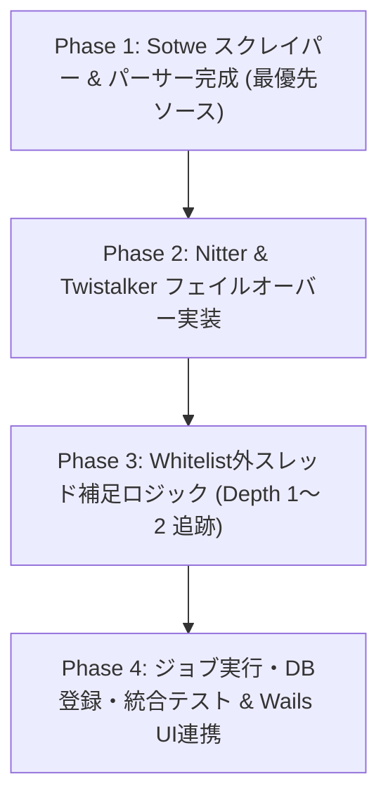

---

## 2. フェーズ別詳細タスク & 変更対象ファイル

### Phase 1: Sotwe ソース & パーサーの本格実装 (優先度: 高)

SotweはWeb UI DOMスクレイピング方式を正とする。SeleniumBase UC Modeでブラウザを展開し、BeautifulSoupによるDOM要素抽出でメタデータ・メディアを取得する。

#### [NEW] / [MODIFY] ファイル一覧
1. **[MODIFY] [`plugins/twitter/scraper/sources/sotwe_source.py`](file:///d:/Projects/10_tools/dozou_katanuki/dozou_katanuki/plugins/twitter/scraper/sources/sotwe_source.py)**
    - SeleniumBase UC ModeによるWeb UI DOMスクレイピング実装
    - 100行以下ルール遵守
2. **[MODIFY] `plugins/twitter/scraper/parsers/sotwe_parser.py`**
    - Sotwe HTMLのDOM要素を共通スキーマ（`Article`, `Media`, `Account`）に変換するパース関数
    - アバターURL修正（`_normal.`削除）、動画＋ポスター抽出
3. **[NEW] `plugins/twitter/scraper/test_sotwe_source.py`**
    - `sotwe.html` を用いた単体テスト（ネットワーク接続なしで実行可能）

---

### Phase 2: Nitter & Twistalker ソース & パーサー実装

Sotweが一時停止または429エラーとなった際のフォールバックソース群です。

#### [NEW] / [MODIFY] ファイル一覧
1. **[MODIFY] [`plugins/twitter/scraper/sources/nitter_source.py`](file:///d:/Projects/10_tools/dozou_katanuki/dozou_katanuki/plugins/twitter/scraper/sources/nitter_source.py)**
   - 動的インスタンスプール管理（死活監視・エラーインスタンスの自動スキップ）
   - User-Agentヘッダーローテーション
2. **[NEW] `plugins/twitter/scraper/parsers/nitter_parser.py`**
   - Nitter HTMLからツイート本文、親リプライ先、画像/動画リンク、投稿日時（UTC変換）を抽出
3. **[MODIFY] [`plugins/twitter/scraper/sources/twistalker_source.py`](file:///d:/Projects/10_tools/dozou_katanuki/dozou_katanuki/plugins/twitter/scraper/sources/twistalker_source.py)**
   - HTMLスクレイピングエンジンの堅牢化
4. **[NEW] `plugins/twitter/scraper/parsers/twistalker_parser.py`**
   - Twistalker HTMLの正規化パーサー

---

### Phase 3: Whitelist外ツイート補足ロジック（課題③）の実装

タイムライン上で会話の文脈を完全にするため、取得したツイートの `reply_to_id` / `quoted_status_id` を検知し、外部ユーザーの親ツイートを再帰補足します。

#### [NEW] / [MODIFY] ファイル一覧
1. **[NEW] `plugins/twitter/scraper/core/thread_expander.py`** (100行以下)
   - 抽出されたツイート群から `reply_to_id` をスキャン
   - 既にDBまたは現在の収集バッチに存在するかチェック
   - 存在しない場合、マルチソース経由で `fetch_post(reply_to_id)` を呼び出し（Depth制限: 最大2）
2. **[NEW] `plugins/twitter/scraper/core/external_account_handler.py`** (100行以下)
   - Whitelist外のユーザー情報を最小限の形式（`numeric_id`, `username`, `display_name`, `avatar_url`）で生成し、DB外部キー制約を満たすレコードを作成
3. **[MODIFY] `plugins/twitter/scraper/core/restorer.py`**
   - `thread_expander` をメインの収集パイプラインに統合

---

### Phase 4: ジョブ実行・DB登録・統合テスト & Wails UI連携

1. **[MODIFY] `plugins/twitter/scraper/main.py`**
   - コマンドライン引数（`--account`, `--source all|sotwe|nitter`, `--expand-threads`）の処理
   - 収集完了時の標準出力JSON（NDJSON）またはDB直接コミット
2. **[NEW] `plugins/twitter/scraper/test_thread_expansion_e2e.py`**
   - 親ツイート補足〜マルチソースフェイルオーバーの一連のフローを検証するE2Eテスト
3. **Go側連携確認**:
   - `middleware/job_orchestrator.go` から Python プロセス起動引数の互換性確認
   - サルベージ完了後にタイムライン（`TimelineContainer.vue`）で会話ツリーが正しく描画されることを確認

---

## 3. コーディング規約 & 制約事項（重要）

1. **100行以下ルールの徹底**:
   - 単一の `.py` または `.go`, `.vue` ファイルが100行を超えないように分割すること。
2. **Same Source, Same Flow**:
   - どのソースから取得したデータも、最終的には `models.Article`, `models.Media`, `models.Account` のスキーマに完全に一致させること。
3. **文字コード・タイムゾーン**:
   - タイムスタンプは全て ISO8601 (`YYYY-MM-DDTHH:mm:ssZ`) または SQLite `datetime` 互換（UTC）に統一すること。
4. **依存ライブラリの最小化**:
   - Python側: `requests`, `beautifulsoup4`, `urllib3` など標準的かつ軽量なライブラリのみ使用すること。

---

## 4. 完了の定義 (Definition of Done)

- [ ] `pytest plugins/twitter/scraper/` で全単体テストが PASS すること。
- [ ] Whitelist対象ユーザーのサルベージ実行時、他者へのリプライの「親ツイート」が自動的にDBに補足登録されること。
- [ ] Sotwe → Nitter → Twistalker の自動フェイルオーバーが正常に作動すること。
- [ ] タイムライン画面（フロントエンド）で外部ユーザーの親ツイートおよびリプライツリーが美しく描画されること。

---


<!-- ================================================================= -->
<!-- SECTION 5: part1_01_technical_specs.md -->
<!-- ================================================================= -->

<div id="part1-01-technical-specsmd"></div>

# 📄 [5] part1_01_technical_specs.md

> *Source File: `part1_01_technical_specs.md`*

[[← DocWiki ポータル|Home]] | [[📚 目次 (Home)|Home]] | [[次の章: 第1編第2章：外部サービスの概要とサルベージ技術 →|part1_02_external_services]]

# 第1編 第1章：技術仕様とバックボーン (Technical Specs & Backbone)

**プロジェクト名** : dozou_katanuki (Wails-Stash Hybrid "土蔵・型抜き" Multi-Format Local Archival System)  
**ドキュメントID** : SPEC-BACKBONE-001  
**バージョン** : 4.0.0 (Wailsキメラデスクトップ統合仕様)  
**作成日** : 2026-08-18  
**ステータス** : 正式仕様（Wailsインメモリプロキシ・ポート非開放・Stashライフサイクル完全同期）

---

## 1.1 プロジェクトの崇高な目的（動態保存・サルベージ）
公式プラットフォーム（Twitter/X, Instagram, TikTok等）におけるアカウント凍結（BAN）、投稿削除、規約変更によるAPI閉鎖、Webサービス自体の終了などにより、人類のデジタルな足跡や記憶は日々失われています [1]。  
本プロジェクト **dozou_katanuki** は、失われたアカウントや投稿を **Wayback Machine** や **Aria2** などの外部アーカイブ技術・分散ダウンロード技術を駆使してWebの深淵からサルベージ（救出・復元）し、ローカル環境において当時のタイムラインの質感・レスポンスそのままに**「動態保存（動作可能な状態で永続化）」**することを至上命題としています [1]。将来的には特定のプラットフォームに依存せず、あらゆる SNS に対応可能な「汎用動態保存基盤」を目指します [1]。

---

## 1.2 システムスタックと技術選定
Wails (Go) を中核骨格とし、メディアサーバーである Stash を完全に内包・プロセス管理する「キメラデスクトップアプリ」アーキテクチャを採用しています [2]。外部ポートを不必要に開放せず、メモリ内で安全に結合された堅牢なデスクトップパッケージを提供します [2]。

| レイヤー | 採用技術 / バージョン | 役割・責務 | 通信・アクセス制御 |
| :--- | :--- | :--- | :--- |
| **1. Window Container** | Wails v2 (Go 1.22+) | OSネイティブウィンドウの生成、およびアプリケーション全体のライフサイクル管理（終了時の `taskkill` 強制道連れ） | OSプロセスレベル制御（メモリ内バインド） |
| **2. Presentation** | Vue 3.5 (SFC) + Vite + TS + Tailwind CSS | Stateless Pure View (Dumb UI / 宣言型UI)、シグナルベース高速描画 [2] | Wails内蔵の **AssetHandler** によるポート非開放リソース通信 |
| **3. State & Action** | Vue Composition API + Wails Go Bind | UDF Composable（状態・一方向データフローの保持） [2] | Wails Bind によるローカルメモリ内高速RPC |
| **4. Hybrid Backend** | Go (Wails) + GORM + sqlite3 + Process Controller | **システム全体の頭脳。** Pythonプロセスの起動・監視、生DBデータの RenderTree 変換配信、Stash プロセス制御 [2] | 外部ポート完全廃止、メモリ内ルーティング |
| **5. Core Media Server** | Stash Server (stash.exe) | メディア重複排除、トランスコーディング、HLSストリーミング [2] | Wails AssetHandler 経由のメモリ内リバースプロキシ（外部ポート非公開） |
| **6. Salvage Sidecar** | Python 3.10+ (requests, warcio, GraphQL) | オンデマンド実行 of サルベージ・インジェクションパイプライン（非常駐） [2] | Go Backend から直接プロセスキック。Stash GraphQL とローカル通信 |
| **7. Storage** | SQLite3 (WALモード) | メタデータ高速クエリ、不変リレーション情報の永続化 [2] | **127.0.0.1** ループバック閉塞（外部アクセス遮断） |

---

## 1.3 ポートマップと内部通信フロー
過去の設計にあった「個別プロキシポート（`:9998` や `:5175`、`:5173` など）」は**すべて廃止**されました [3, 67]。フロント（Vue）とバック（Stash）の通信は、Wails内蔵の **AssetHandler** を用いて、ローカルOSのポートを開放することなく、メモリ内で安全にリバースプロキシします [67]。これにより、ローカルネットワークへの不要なポート露出を防ぎ、ゼロコンフィグと最高水準のセキュリティを両立します [67, 68]。

##### 1. 通信仕様
*   **Wails AssetHandler** : フロントエンド（Vueアセット）のロードおよび Stash の画像・動画配信（`/scene/...`, `/image/...`）を、ポートを一切開けずにメモリ内部のカスタムハンドラーでインターセプトし、安全にリバースプロキシ中継します [3, 67]。
*   **Stash 内部/LANポート (`:9999`)** : `stash.exe` は `dozou_katanuki` の `config.json` 保存時に透過同期され `0.0.0.0:9999` で待受します。管理画面および Broadcast 画面から接続ホストに応じたスマートな動線（`http://{hostname}:9999/`）で安全にアクセスできます [67]。

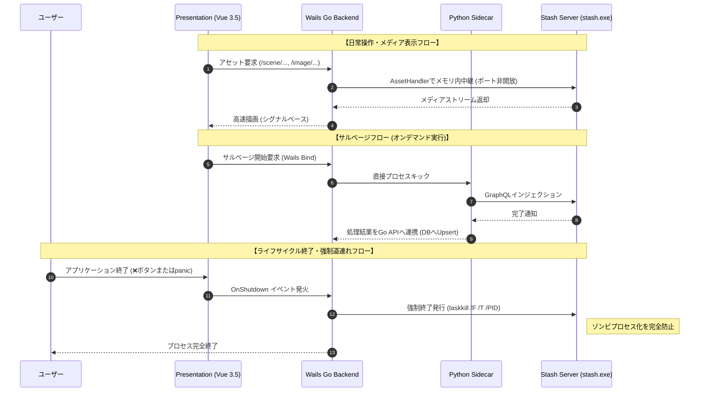

##### 2. 内部通信ネットワーク構造マップ (Mermaid Diagram)

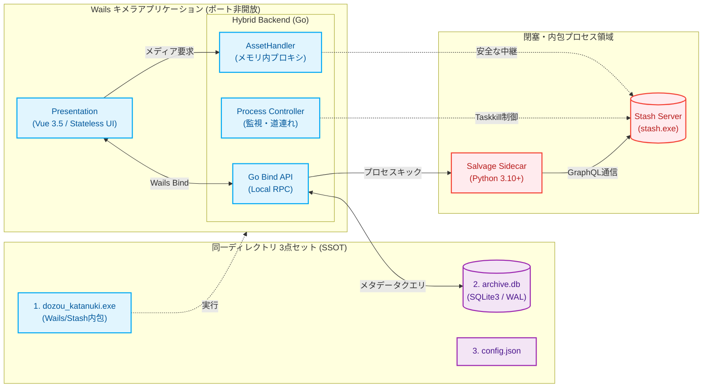

---

## 1.4 シングルバイナリ＆同階層3点セット（Single Source of Truth）
システムを起動・運用する際、**「同一ディレクトリに存在する以下の3点セット」**が唯一絶対のマスター（Single Source of Truth: SSOT）となります [4, 16]：

1.  **dozou_katanuki.exe** : Wails(Go)がフロントアセット、Stashバイナリ（`stash.exe`）を完全に内包してビルドした、デスクトップアプリケーション本体実行ファイル [16]。
2.  **archive.db** : 整合性チェックをクリアした実稼働 SQLite3 データベース [16, 29]。
3.  **config.json** : システム設定、ストレージパス、Pythonサイドカー起動設定等を統治する一元設定ファイル [16, 67]。

##### 新アーキテクチャのプロセス道連れ終了（Lifeline sync）
キメラアーキテクチャの最大の課題は、親プロセス（Wails）が急死した際、裏で蠢く子プロセス（`stash.exe`）がメモリ内にゾンビとして取り残されるポート競合リスクです [4]。  
本システムは、ユーザーがWailsの画面を「❌」ボタンで閉じたタイミング、または予期せぬ panic 終了を検知した際、バックエンドの `OnShutdown` イベントハンドラにおいてOSレベルの強制終了コマンド（Windows環境：`taskkill /F /T /PID {stash_pid}`）を確実に発行します。これにより、裏の `stash.exe` も一寸の猶予もなく確実に道連れにして即座に完全終了させ、ゾンビプロセスの残存を根絶します [11, 104]。

---

[[← DocWiki ポータル|Home]] | [[📚 目次 (Home)|Home]] | [[次の章: 第1編第2章：外部サービスの概要とサルベージ技術 →|part1_02_external_services]]

---


<!-- ================================================================= -->
<!-- SECTION 6: part1_02_external_services.md -->
<!-- ================================================================= -->

<div id="part1-02-external-servicesmd"></div>

# 📄 [6] part1_02_external_services.md

> *Source File: `part1_02_external_services.md`*

[[← 前の章: 第1編第1章：技術仕様とバックボーン|part1_01_technical_specs]] | [[📚 目次 (Home)|Home]] | [[次の章: 第1編第3章：ローカルストレージ保全とメディアポリシー →|part1_03_storage_persistence]]

# 第1編 第2章：外部サービスの概要とサルベージ技術 (External Services & Salvage Technologies)

**プロジェクト名** : dozou_katanuki (Wails-Stash Hybrid "土蔵・型抜き" Multi-Format Local Archival System)  
**ドキュメントID** : SPEC-EXTERNAL-001  
**バージョン** : 4.0.0 (Wailsキメラデスクトップ統合仕様)  
**作成日** : 2026-08-18  
**ステータス** : 正式仕様（Wayback CDX/Memento・warcio原本保全・Motrix適応型DL・Wails内包Stash制御）

---

## 2.1 SNSプラットフォームとデジタル消滅の危機
本システムがサルベージ対象とする主要プラットフォーム（Twitter/X, Instagram, TikTok等）は、中央集権的なWebサービスであるがゆえに、常にデータの恒久的喪失リスク（デジタル消滅）を孕んでいます [1, 6]。

##### 1. プラットフォーム固有の構造的破壊リスク
*   **アカウント凍結（BAN）とサイレントサスペンド** : アカウントがサスペンドされた瞬間、CDN（Content Delivery Network）上のメディアアセット（アバター、画像、動画）へのリンクは瞬時に無効化（404/403）され、いいね履歴やリプライツリー情報が完全に消滅します [6]。
*   **短縮URL（t.co等）のリダイレクト破綻** : プラットフォーム提供の短縮ドメインサーバーが停止または仕様変更した場合、投稿テキスト内に含まれるすべての外部リンク解決が不可能になり、一次情報のコンテキストが破壊されます [6]。
*   **メディアアセットのログインウォール** : スクレイピングや直接閲覧を防ぐため、各SNSはタイムラインに対して強力なログインウォールやWAF保護を導入しており、通常手段での巡回・ローカル保存を厳しく排除しています [6, 72]。

##### 2. 「自動サルベージ」と「手動サバイバルルート」の2系統制御の必然性
この厳しい防御策を突破するため、本システムは以下の2系統のデータ回収ルートを採用し、100%の保全導通を保証します [66, 72]。
1.  **自動系統（Wayback CDX経由）** : 外部アーカイブが巡回・キャッシュした過去のHTML/JSONから自動でデータを吸い出すルート [66, 71]。
2.  **手動系統（手動取得WARCの逆引きインポート）** : ログイン済みの実ブラウザ（Webrecorder等）を介してユーザーが直接パケットを記録したWARCファイルを、完全オフラインで自動解析・展開するサバイバルルート [66, 72]。

---

## 2.2 Wayback Machine (Internet Archive) と原本パケット保全技術
Wayback Machineにキャッシュされている特定のURL、あるいはアカウント配下のスナップショット履歴を、高速かつ軽量にスキャンするための CDX Server API を活用します [2, 7, 78]。

##### 1. CDX API & Mementoプロトコル (RFC 7089)
*   **本システムでの活用法 (Scraper)** : `scraper.py` は、CDX APIに対してアカウントのインデックスを高速走査し、過去にアーカイブされた投稿ID（PostID）とそれに対応するスナップショットの「タイムスタンプ」のリストを $O(N)$ で一括抽出します [7, 65, 95]。
*   **Mementoによる折衝** : 投稿された日時に最も近い（時刻誤差が最小の）メディアアセットやHTMLキャッシュを特定してピンポイント解決します [7, 59, 78]。

##### 2. warcio による一期一会の「オンザフライWARC」生成
Wayback Machineからフェッチするデータは、将来的にInternet Archive側のAPI閉鎖やサーバーエラーによって二度と手に入らなくなる可能性があります [65, 71, 97]。  
そのため、自動サルベージ実行時、Pythonサイドカーは **warcio** ライブラリをHTTP通信（`requests`）に透過的に噛ませ、**「通信パケット（生のHTTPリクエスト、レスポンスヘッダー、およびバイナリペイロード）を1ビットも改ざん・歪曲することなく、そのまま1つの圧縮コンテナ snapshot.warc.gz へストリーム保存する」**技術を適用します [65, 71, 97]。  

```python
# scraper.pyにおけるオンザフライWARC保存のコアロジック (warcio)
import requests
from warcio.capture_http import capture_http

# 指定されたWaybackスナップショットURLからデータを取得しながら、
# 通信パケットを100%オリジナルの原本としてリアルタイムでダンプ
with capture_http('backups/dumps/twitter/msluo14/snapshot.warc.gz'):
    response = requests.get('https://web.archive.org/web/...')
```

このWARCファイルはISO 28500に準拠した最高純度の原本証明であり、データベースが全損した場合でも、**完全オフラインで通信パケットをローカルにデコンプレス・リプレイするだけで全情報を再構築可能**な「第2の心臓（Deep Path）」として機能します [72, 74, 96]。

---

## 2.3 Aria2 ＆ Motrix による適応型メディアダウンロード技術
サルベージプロセスにおいて、投稿に添付された動画や高解像度静止画の実ファイルをローカルストレージ（Stash監視領域）に書き出す処理は、ネットワーク負荷とエラー耐性を最も要求されるレイヤーです [8, 55]。

##### 1. Motrix JSON-RPC 連携
`downloader.py` は、メディアの実ダウンロード処理を直接自プロセスのメモリ内で処理せず、Motrixに対して非同期のRPCコマンド `aria2.addUri` を発行してタスクを委譲します（RPCポート `:6800`） [9, 65]。これにより、マルチ接続によるディスク帯域いっぱいの爆速並列ロード、および途中で中断されたダウンロードの自動レジューム（再開）機能を100%外部エンジンにオフロードします [8, 9]。

##### 2. downloader.py に義務付ける「3段階適応型フォールバック」ロジック
ローカル環境においてMotrixが未起動である場合、または一時的にアクセス制限を食らった場合でも、データ回収を中断させない堅牢な **適応型フォールバックアルゴリズム** を実装します [9]。
1.  **RPC疎通チェック（第1優先）** : `downloader.py` 起動時に `:6800` への疎通確認を試みます。導通が確認できた場合、 `aria2.addUri` 経由でマルチスレッド超高速ダウンロードを開始します [9]。
2.  **直接 HTTP 同期ストリーミング（第2優先フォールバック）** : Motrixが未起動の場合（タイムアウト）、プロセスは即座に Python の `requests` ライブラリの同期直接ダウンロード（ `stream=True` によるチャンク処理）へと自律的に切り替えます。
3.  **指数バックオフ付 429/503 エラーハンドリング** : Wayback Machine等から HTTP 429 や HTTP 503 を受け取った場合、即時エラー終了を厳禁とし、指数バックオフ（Exponential Backoff）を伴う最大3回のリトライを自律的に実施します。

##### 3. メディア実体のハッシュ完全性検証 (Integrity Check)
ダウンロードが完了したメディアファイルは、Stashにインジェクションする前に必ず os.path.getsize でのスキャン、および **OSHash** または **MD5ハッシュ** の算出による破損・同一性検証を通過させなければなりません [8, 56]。

---

## 2.4 Stash による作品ストリーミング ＆ ヘッドレスタスク統治
Wailsキメラアプリ化に伴い、Stashは「プラグイン」ではなく、Wails(Go)がStashを内包・プロセス管理するヘッドレスな高速メディアデコーダ ＆ HLSストリーミングインジェクターとして完全に統治されます [64]。

##### 1. Wails AssetHandler によるポート非公開・インメモリリバースプロキシ
フロントエンド（Vue 3）とStashサーバーの間のすべてのメディアアセット、トランスコード、HLSストリーム（m3u8/tsセグメント）の配信は、Wails内蔵の **AssetHandler** がインターセプトします [3, 8]。これにより、外部に余計なストリーミングポートを開放せず、メモリ空間上だけで極めて安全かつ高速にストリーミングデータの透過的デリバリーを実現します [67]。

##### 2. GraphQL API 経由の自動バインディング
Pythonサイドカーは、ハッシュ検証をクリアしたメディアファイルをStashの物理フォルダへ移動した後、Stashが内部的にリッスンしている GraphQL API に対してミューテーションを発行します [3, 8, 78]。
1.  アカウント名から Stash 内部の Performer （出演者）を検索または自動作成 [31]。
2.  「標準タイトル規約」に準拠したタイトルを付与して、動画または静止画を登録 [61]。
3.  登録成功時にStashから返却される一意のUUID（`stash_scene_id`, `stash_image_id`）を回収し、Goバックエンド（Wails Bind API）経由で SQLite3 の media テーブルに書き戻します [43, 48, 61]。

##### 3. アバター隔離ポリシー（Avatar Isolation Policy）の技術的意義
アバターなどのプロフィール画像は、Stashappが本来想定しているビデオコレクションに紛れ込ませると、画像グリッドや出演者メタデータ領域を汚染し、パフォーマンス低下と画面崩壊を招きます [60]。そのため、**アバター画像実体はすべて `{middleware_root}/assets/{platform}/` に配置され、Stashの監視フォルダから物理的かつ完全に隔離されます（Avatar Isolation Policy）** [55, 60]。

---

## 2.5 SQLite3 WALモード ＆ GORM メタデータデータ abstraction
メタデータ（投稿、アカウント、お気に入り、リレーション）の安全な不変保存と、ローカルミリ秒応答クエリを両立させるため、中核データベースに **SQLite3** （WALモード）および **GORM** オブジェクトリレーショナルマッピングを採用します [2, 9, 15]。

##### 1. SQLite3 WAL (Write-Ahead Logging) モード
読み込み処理と書き込み処理が一切衝突せずに並行して走る同時実行制御技術です [9, 78]。Pythonサイドカーが大量の投稿データを書き込んでいる最中であっても、Wails(Go)およびフロントエンド（Vue 3）は一切のクエリラグなしにタイムラインを取得し、無限スクロールできます [9, 30, 49]。

##### 2. GORM による不変構造抽象化
GORM（Go ORM）は、Goの型安全な構造体をSQLite3のデータベーススキーマへと自動的にマッピング・マイグレーションします [15, 78]。AIエージェントによる生SQLバグを100%防止し、外部キー制約、インデックスチューニング、テーブル結合クエリをすべて Go コード側で型安全に統治・抽象化します [15, 29]。

---

[[← 前の章: 第1編第1章：技術仕様とバックボーン|part1_01_technical_specs]] | [[📚 目次 (Home)|Home]] | [[次の章: 第1編第3章：ローカルストレージ保全とメディアポリシー →|part1_03_storage_persistence]]

---


<!-- ================================================================= -->
<!-- SECTION 7: part1_03_storage_persistence.md -->
<!-- ================================================================= -->

<div id="part1-03-storage-persistencemd"></div>

# 📄 [7] part1_03_storage_persistence.md

> *Source File: `part1_03_storage_persistence.md`*

[[← 前の章: 第1編第2章：外部サービスの概要とサルベージ技術|part1_02_external_services]] | [[📚 目次 (Home)|Home]] | [[次の章: 第1編第4章：実装規約・制約原則 →|part1_04_implementation_principles]]

# 第1編 第3章：ローカルストレージ保全とメディアポリシー (Storage Persistence & Media Policy)
**プロジェクト名** : dozou_katanuki (Pluggable UI & Multi-Format Local Archival System "土蔵・型抜き") Pluggable UI & Multi-Format Archival System)  
**ドキュメントID** : SPEC-STORAGE-001  
**バージョン** : 3.1.0  
**作成日** : 2026-08-17  
**ステータス** : 正式仕様（アバター露出隠蔽・3桁世代リゾルバ・Stash完全分離統合・クレンジングアルゴリズム詳細化）

--------------------------------------------------------------------------------

## 3.1 概要と物理永続化ストレージ階層マップの厳格定義
本システムは、日本の著作権法第30条（私的使用のための複製）を厳格に遵守したローカル完結型アーカイブとして、Wayback Machineや手動インポートされたWARCコンテナからサルベージしたメディア（高解像度動画・画像・アバター等）を永続的に保全・ストリーミングします。

システム全体の物理ストレージプールは、以下の**「作品（本編）メディア」「アバター＆UIアセット」「原本ダンプ（DR用）」**の3つの独立した配置ルールに完全隔離され、ディレクトリ衝突を100%防止する構造に統制されます。

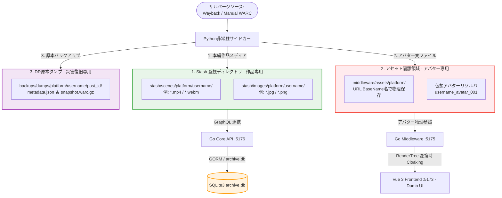

### 物理ストレージ階層およびマッピング設計
一元設定ファイル `config.json` に設定された基準パスをルートとして、以下の物理マッピングが自動適用されます。
*   `{storage_root}/stash/`（Stashappの作品監視ディレクトリ / Stash Library）
    *   `scenes/{platform}/{username}/` : 本編動画・GIFアニメーション実ファイル（例: `eb7ymRi-pfsx5FJH.mp4`）
    *   `images/{platform}/{username}/` : 本編静止画・Lightbox原画実ファイル（例: `F8wZ1abXYAAY7kL.jpg`）
*   `{middleware_root}/assets/{platform}/`（アセット隔離ディレクトリ）
    *   `{username}_avatar_{seq:03d}.jpg` などの実体ファイル（Stashの監視スコープから100%除外）
*   `{backup_root}/dumps/{platform}/{username}/{post_id}/`（DR（災害復旧）原本ダンプ）
    *   `metadata.json` : 共通中間JSONデータ（不変）
    *   `snapshot.warc.gz` : `warcio` にてフェッチ時に同時キャプチャされた生通信パケット原本

--------------------------------------------------------------------------------

## 3.2 URL BaseName 命名原則と拡張子クレンジングアルゴリズム
スクレイパー（Python）、Core Backend（Go）、Stashapp（C++）、およびフロントエンド（Vue 3）間でアセットの同一性を \\(O(1)\\) で照合・追跡するため、**「オリジナルのアセット取得URLの末尾（BaseName）をそのまま物理ファイル名および media_id とする」**原則を厳格に適用します。

### 1. なぜURL BaseNameなのか？
*   **キャッシュ判定の高速化**：
    Wayback Machineや本家SNSのCDNからメディアをダウンロードする際、独自のプレフィックス（例: `{tweet_id}_image.jpg`）でリネームして保存してしまうと、後から「このメディアはすでにローカルに保存済みか？」を照合する際にURLベースでの突合が不可能になり、無駄な再ダウンロードやDBの重複割当が発生します。
*   **原本性の保証**：
    ファイル名を不変のURL末尾（例: `eb7ymRi-pfsx5FJH.mp4`）に固定しておくことで、データベース再構築（ディザスタリカバリ）時にもメタデータと実ファイルを寸分の狂いもなく1対1で自動再バインド（Reconciliation）できます。

### 2. 拡張子およびクエリパラメータのクレンジングアルゴリズム (Cleansing Algorithm)
現実のSNS（特にX/Twitterの画像など）は、`https://pbs.twimg.com/media/F8wZ1abXYAAY7kL?format=jpg&name=orig` のように、末尾に拡張子がなく、クエリパラメータでフォーマットを指定する不規則なURL構造を持ちます。
これをそのままファイル名として保存するとファイルシステムやWebサーバーで正常に認識されないため、以下の**「URLクレンジングアルゴリズム」**をPythonおよびGoの共通規約として義務付けます。

```python
# Pythonサイドカー（Scraper/Mutator）共通実装アルゴリズム
import re
from urllib.parse import urlparse, parse_qs

def clean_media_url_to_basename(url: str) -> tuple[str, str]:
    """
    URLを解析し、一意なBaseName(media_id)とクレンジングされた拡張子を返却する
    Input:  "https://pbs.twimg.com/media/F8wZ1abXYAAY7kL?format=jpg&name=orig"
    Output: ("F8wZ1abXYAAY7kL.jpg", "jpg")
    """
    parsed = urlparse(url)
    path = parsed.path
    query = parse_qs(parsed.query)
    
    # パス末尾のファイル名
    filename = path.split('/')[-1]
    
    # 拡張子の判定
    ext = ""
    if '.' in filename:
        ext = filename.split('.')[-1].lower()
        media_id = filename
    elif "format" in query:
        # クエリパラメータに "format" がある場合 (Twitter CDN)
        ext = query["format"][0].lower()
        media_id = f"{filename}.{ext}"
    else:
        # 拡張子が特定できない場合のデフォルトフォールバック
        ext = "jpg"
        media_id = f"{filename}.{ext}"
        
    # 安全なファイル名（不正記号の除去、記号はアンダースコアに）
    media_id = re.sub(r'[\\/*?:"<>|]', '_', media_id)
    return media_id, ext
```

--------------------------------------------------------------------------------

## 3.3 仮想アバターリゾルバ（0埋め3桁世代管理）とアバター露出隠蔽ポリシー
本システムは、外部SNSのサーバー凍結やアカウント削除、ネットワーク非接続環境（完全ローカル）でも、タイムライン上でアバター画像が非表示（破れた画像アイコン）になることを防ぐため、**「アバター露出隠蔽ポリシー（Avatar Cloaking Policy）」**を厳格に適用します。

### 1. アバター画像「保全・隠蔽・配信」の3レイヤー連携
生のURLを基礎原本データとして安全に保全しつつ、フロントエンドへは解決済みの完全相対パスのみを露出させます。

1.  **原本の保全 (Pythonサイドカー ➔ SQLite3)**：
    *   Pythonスクレイパーは、Waybackからアバターの実ファイル（例: `9Kx_8Y7z_400x400.jpg`）を取得して、ローカルアセット隔離領域（`middleware/assets/{platform}/`）に物理保存します。
    *   Core Backend API (:5176) の `POST /api/posts` へ送信する共通中間JSONには、追跡用原本データとして**生のオリジナルURLをそのまま乗せて**送信します。
2.  **GORMでの世代カウントアップフック (Core Backend :5176)**：
    *   実データベースの `accounts`、`account_profile_history` には、生のオリジナルURLをそのまま保存します。
    *   データベース書き込み時、新規アバターURLの変更を検知すると、GORMは自動的に `avatar_seq` をカウントアップし、`account_profile_history` に履歴として安全に永続化します。

### 2. 世代解決・仮想アバターキーの解決アルゴリズム (GORM BeforeSave フック / Go)
Core Backend (:5176) 内における、アバター世代判定と仮想キー解決の具体的なコードロジックです。

```go
package models

import (
	"fmt"
	"gorm.io/gorm"
	"time"
)

// AccountProfileHistory の保存前に走るGORMフック
func (h *AccountProfileHistory) BeforeCreate(tx *gorm.DB) (err error) {
	var lastHistory AccountProfileHistory
	// 該当アカウントの最後の履歴を取得
	err = tx.Where("account_id = ?", h.AccountID).Order("avatar_seq desc").First(&lastHistory).Error
	
	if err == gorm.ErrRecordNotFound {
		// 初回登録の場合
		h.AvatarSeq = 1
	} else if err == nil {
		// アバターURLが変更されているか検証
		if lastHistory.AvatarOriginalURL != h.AvatarOriginalURL {
			h.AvatarSeq = lastHistory.AvatarSeq + 1
		} else {
			// URLが同一の場合は世代を維持
			h.AvatarSeq = lastHistory.AvatarSeq
		}
	} else {
		return err
	}
	
	// 0埋め3桁サフィックス付き仮想キー（{username}_avatar_{seq:03d}）の自動解決
	h.AvatarVirtualKey = fmt.Sprintf("%s_avatar_%03d", h.Username, h.AvatarSeq)
	h.CreatedAt = time.Now()
	return nil
}
```

### 3. タイムライン表示時のアバター復元アルゴリズム (Middleware Hub :5175)
タイムライン（`RenderTree`）を構築する際、ミドルウェアは各ツイートの投稿日時（`tweets.created_at`）と、アバターの各世代の観測日時（`account_profile_history.created_at`）を照合します。

$$\text{TargetSeq} = \max \left\{ \text{seq} \mid \text{history.created\_at} \le \text{tweet.created\_at} \right\}$$

これにより、**「そのツイートが投稿された瞬間に、ユーザーが設定していたアバター（世代）」**を正確に割り出し、該当する `{username}_avatar_{seq:03d}` パスを `RenderTree.author.avatar_url` に設定します。ユーザーが現在アバターを変更していても、過去の投稿に対しては当時のアイコンでタイムラインが完璧に描画されます。

```go
// Go Middleware (:5175) での時系列アバター解決ロジック
func ResolveAvatarForTweet(tweetCreatedAt time.Time, histories []AccountProfileHistory) string {
	if len(histories) == 0 {
		return "/assets/default_avatar.jpg"
	}
	
	// 投稿日時以前の最新の履歴を探索
	resolvedKey := ""
	for _, history := range histories {
		if history.CreatedAt.Before(tweetCreatedAt) || history.CreatedAt.Equal(tweetCreatedAt) {
			resolvedKey = history.AvatarVirtualKey
			break // 降順で取得しているため、最初に見つかったものが最新
		}
	}
	
	// 万が一、最初の登録以前のツイートだった場合は最古の履歴を割り当てる
	if resolvedKey == "" {
		resolvedKey = histories[len(histories)-1].AvatarVirtualKey
	}
	
	return fmt.Sprintf("/assets/twitter/%s", resolvedKey)
}
```

--------------------------------------------------------------------------------

## 3.4 Stashとアバターの完全物理分離規約 (Avatar Isolation Policy)
Stashapp メディアサーバー（:9999）は、「高解像度の本編作品メディア（Scene/Image）」を管理し、重複排除・トランスコード・HLSストリーミングを提供することに特化したエンジンです。

ここに解像度が低く数も多いプロフィールアバター（アイコン）画像を混入させることは、**「Stashのライブラリ（Scene / Image テーブル）を著しく汚染するスパム行為」**であり、システム設計上、**厳格に禁止（Avatar Isolation Policy）**します。

### 1. 隔離・パージの徹底
*   **アバター画像の除外**：
    アバター実ファイルはすべて `middleware/assets/{platform}/` に配置され、Stashのメディアスキャン監視フォルダ（`stash/`）の対象から物理的に完全に隔離します。Stash GraphQL APIを叩いてアバター画像を登録する行為は1行たりとも書いてはなりません。
*   **Stashライブラリのクリーン性維持**：
    Stashの画像グリッド、サムネイル一覧、および作品検索にアバター画像がノイズとして紛れ込むのを100%遮断し、大容量の作品コレクションのみを高速・最適にストリーミングできる高画質なメディアプール環境を保護します。

--------------------------------------------------------------------------------

## 3.5 標準タイトル規約とGraphQL逆引き自動バインド処理
Stashapp 内で動画（Scene）や静止画（Image）を美しく整理し、相互バインド処理の自動化（Reconciliation）をミリ秒単位で高速化するため、Stashにインジェクションする際のメタデータのタイトル（Title）は、以下の標準フォーマットに統一します。

### 1. 標準タイトル定義フォーマット
$$\text{Title} = \text{\{Platform\} (\\{@Username\\}): \{Type\} \{PostID\}}$$
*   **実例 (Twitter)** : `X (@msluo14): Tweet 1879382757924868404`
*   **実例 (Instagram)** : `Instagram (@yike_luo): Post 123456789012345`

### 2. GraphQL逆引き自動バインドアルゴリズム
Pythonサイドカー（Downloader）がStashにメディア実ファイルを投入した後、GORMデータベース側へその Stash ID を書き戻すための逆引き自動バインド処理を実行します。
タイトル文字列から正規表現を用いてメタデータを安全に復元・照合するロジックを以下に規定します。

```python
# wayback_tweet_rescure/core/downloader.py で実行される逆引き同期
import re
import requests

STASH_GRAPHQL_URL = "http://localhost:9999/graphql"

def reconcile_stash_ids_to_sqlite(core_backend_url: str):
    """
    Stashの全シーン/全画像を走査し、標準タイトルから投稿IDを逆引きして
    Core Backend API経由でSQLite3のmediaテーブルへStash IDを書き戻す
    """
    # 1. Stashから全SceneのIDとTitleを取得するGraphQLクエリ
    query = """
    query {
      allScenes {
        id
        title
      }
    }
    """
    response = requests.post(STASH_GRAPHQL_URL, json={'query': query})
    scenes = response.json()['data']['allScenes']
    
    # 標準タイトル解析用正規表現
    title_pattern = re.compile(r'^([A-Za-z0-9]+)\s\(@([A-Za-z0-9_]+)\):\s([A-Za-z]+)\s([0-9]+)$')
    
    for scene in scenes:
        title = scene['title']
        match = title_pattern.match(title)
        if match:
            platform, username, post_type, post_id = match.groups()
            stash_scene_id = scene['id']
            
            # Core Backend API (:5176) を叩いてSQLiteにStash IDを書き戻し（自動バインド）
            bind_url = f"{core_backend_url}/api/posts/bind-media"
            requests.post(bind_url, json={
                "post_id": post_id,
                "platform": platform.lower(),
                "stash_scene_id": stash_scene_id,
                "type": "video"
            })
```

### 3. この標準フォーマットがもたらす技術的メリット
1.  **自動逆引きマッピングの極大化**：
    Stashのデータベース側から、物理パスやファイル名を直接パースすることなく、タイトル文字列に対して正規表現を適用するだけで、プラットフォーム、ユーザー名、投稿IDを瞬時に特定・紐付けできます。
2.  **Stash Web UI上での検索効率向上**：
    Stash本来の強力なインクリメンタル検索窓で、`@msluo14`、`Tweet`、`Instagram` などのワードを入力するだけで、対象メディアが極めて正確に瞬時フィルタリングされます。
3.  **マルチプラットフォームの衝突回避**：
    異なるSNSで万が一同じ数値の投稿ID（PostID）がコンフリクトした場合でも、タイトルプレフィックスによって完全に名前空間が分かれるため、リレーションの紐付けエラーが100%防止されます。

[[← 前の章: 第1編第2章：外部サービスの概要とサルベージ技術|part1_02_external_services]] | [[📚 目次 (Home)|Home]] | [[次の章: 第1編第4章：実装規約・制約原則 →|part1_04_implementation_principles]]

---


<!-- ================================================================= -->
<!-- SECTION 8: part1_04_implementation_principles.md -->
<!-- ================================================================= -->

<div id="part1-04-implementation-principlesmd"></div>

# 📄 [8] part1_04_implementation_principles.md

> *Source File: `part1_04_implementation_principles.md`*

[← 前の章: 第1編第3章：ローカルストレージ保全とメディアポリシー](part1_03_storage_persistence) | [📚 目次 (Home)](Home) | [次の章: 第2編第1章：管理・設定・ディザスタリカバリ運用 →](part2_01_00_index)

# 第1編 第4章：実装規約・制約原則 (Implementation Principles & Constraints)

**プロジェクト名** : dozou_katanuki (Wails-Stash Hybrid "土蔵・型抜き" Multi-Format Local Archival System)  
**ドキュメントID** : SPEC-PRINCIPLE-001  
**バージョン** : 4.0.0 (Wailsキメラデスクトップ統合仕様)  
**作成日** : 2026-08-18  
**ステータス** : 正式仕様（宣言型UI・UDF・Wails Bind完全準拠、AI暴走防止規約統合）

---

## 4.1 「1ファイル 100行以下」の絶対ルール (Strict Rule)
AIエージェントおよび開発者がコードを生成・保守する際、コンポーネントおよびモジュールは **極限まで単一責任に細分化** し、1ファイルのソースコード is 空行を含めて「100行以下」を絶対的な制約とします。

##### 1. なぜ「100行以下」なのか？
*   **コンテキスト爆発の完全回避** : AIが作業する際、コードベース全体を走査させるとトークンが枯渇し、AIのハルシネーション（暴走）を引き起こします [91]。ファイルサイズを極小に保つことで、トークン消費を抑え、1回のやり取り（極小コンテキスト）で100%正確なコードを生成できます [36, 37]。
*   **テスト容易性とバグ混入率の低下** : モジュールが単一責任に閉じているため、ユニットテストが極めて容易になり、リファクタリング時に意図しないデグレードを100%防止できます。

##### 2. 100行を超過しそうな場合の対処フロー
ファイルが100行に達しそうな、あるいは超えてしまった場合、以下のステップに沿って機械的に分割を適用しなければなりません [10, 103]：
1.  **スタイル（CSS）の排除** : Tailwind CSS ユーティリティクラスを最大限活用するか、共通の `design.css` へスタイル記述を退避させます。
2.  **純粋計算・文字列操作の切り出し** : 日付フォーマットやテキストの改行処理といったビジネスロジックは、すべて `frontend/src/utils/` 配下に副作用のない純粋関数（Pure Function）として外出しします。
3.  **状態・Wails Bind通信の切り出し** : コンポーネント内の Wails Bind 呼び出しや状態管理（`ref`, `reactive`）は、すべて `frontend/src/composables/` の Composable（状態ホルダー）へと逃がします。
4.  **UIパーツのサブコンポーネント化（コンポーネント分割）** : `ArticleCard.vue` が肥大化した場合、 `ArticleAuthor.vue` (著者ヘッダー), `ArticleBody.vue` (本文), `ArticleStats.vue` (統計), `MediaGrid.vue` (メディア枠) に細分化して結合します。

---

## 4.2 レイヤー別 責務境界（宣言型UI ＋ 単一データフロー UDF 原則）
Wailsキメラアプリの特性に適合するよう、システムアーキテクチャのレイヤー定義と「やって良いこと、絶対にやってはならないこと」を厳格に規定します [45]。

```mermaid
graph TD
    %% 単一データフロー（UDF）の明示
    Presentation[1. Presentation Layer<br>components/*.vue<br>Dumb Pure View]
    Composable[2. State & Signal Layer<br>composables/*.ts<br>UDF State Holder]
    Utility[3. Utility Layer<br>utils/*.ts<br>Pure Functions]
    WailsGoAPI[4. Wails Go API Layer<br>Go Bind (RPC / Controller)<br>RenderTree Factory]
    Driver[5. Driver Layer<br>GORM & SQLite3 CRUD<br>Process Manager]
    Admin[6. Admin & Governance Layer<br>Wails Lifeline sync<br>Disaster Recovery]

    %% データの流れ
    Presentation -- "1. ユーザー操作 (Event / Action)" --> Composable
    Composable -- "2. Wails Bind RPC 呼出 (インメモリ)" --> WailsGoAPI
    WailsGoAPI -- "3. GORM / SQL" --> Driver
    Driver -- "4. Raw DB Record" --> WailsGoAPI
    WailsGoAPI -- "5. Props: RenderTree (UDF)" --> Composable
    Composable -- "6. Reactive Signal" --> Presentation

    style Presentation fill:#e1f5fe,stroke:#03a9f4,stroke-width:2px
    style Composable fill:#e8f5e9,stroke:#4caf50,stroke-width:2px
    style Utility fill:#f3e5f5,stroke:#9c27b0,stroke-width:2px
    style WailsGoAPI fill:#ffe0b2,stroke:#ff9800,stroke-width:2px
    style Driver fill:#ffebee,stroke:#f44336,stroke-width:2px
    style Admin fill:#eceff1,stroke:#607d8b,stroke-width:2px
```

##### 1. Presentation層（components/*.vue）- Stateless Pure View（Dumb UI） [105]
*   **責務** : Composableから受領した Props（RenderTree または状態シグナル）に基づき、画面テンプレートで描画する [105]。ユーザー操作は単にイベントとして上位にエスカレーションする [107, 110]。
*   **禁止事項** : コンポーネント内部での独自Stateの保持、Wails関数の直接呼び出し、相対パスの組み立て（アセットパス生成等）、テキストパース処理。これらはすべて下位レイヤーが解決したPropsで受領しなければならない [109]。

##### 2. Composable層（composables/*.ts）- State & Signal Layer [106]
*   **責務** : `ref`, `reactive`, `computed` を使用したシグナルベースの細粒度リアクティブ状態ホルダー [110]。一方向データフロー（UDF）に則り、Wails Go API から一方向にフェッチしたデータを格納し、Presentation層へ Props として安全に流し込む [106]。
*   **禁止事項** : DOMの直接操作、HTMLマークアップやCSSスタイルの混入 [108]。

##### 3. Utility層（utils/*.ts）- Pure Utility Layer
*   **責務** : 同一の入力引数に対して常に全く同一の戻り値を返却し、いかなる外部状態も変更しない「数学的純粋関数」のみを配置する [110]。日付変換、文字列切り出し、キー名マッピング等。
*   **禁止事項** : 内部でのグローバル変数やLocalStorage変更等の副作用の発生。

##### 4. Wails Go API層（Go Bind）- RenderTree Factory
*   **責務** : フロントエンドのロジック肥大化を防ぐ「インテリジェント・ハブ」 [109]。SQLiteの生データ（Raw Model）をフロント側が描画するだけの完成されたデータ構造 **RenderTree**（仮想アバター解決、Wails AssetHandlerへの相対パスURL解決、翻訳、テキストリンク整形等がすべて完了したフラットなデータ）へ変換して配信する [109]。
*   **禁止事項** : 永続層（SQLite3）への直接SQL呼出。DB操作は必ずDriver層経由で実行しなければならない。

##### 5. Driver層（Go Driver & Process Controller）
*   **責務** : SQLite3へのGORMを用いた型安全なCRUD操作、ローカル Stashapp への GraphQL アクセスのカプセル化、および `stash.exe` のOSプロセス起動・制御・監視 [22]。
*   **禁止事項** : UIプレゼンテーション要素の関与。タイムラインの表示レイアウト情報や画面描画メタロジックに一切関与してはならない。

##### 6. Admin & Governance層（Wails Lifeline / Administration）
*   **責務** : `config.json` に基づく設定管理 [32]、DB整合性監査、Wails終了時の `taskkill` 完全実行、および二重化バックアップ（SQLiteスナップショット ＋ WARC/JSON原本ダンプ）の統制 [32, 51]。
*   **禁止事項** : 実行制御ロジックという呼称による誤用・ルーティング記述。WebハンドラーやAPI呼び出しロジックはここに記述してはならない。

---

## 4.3 データフローとファイル配置の黄金律 (Same Source, Same Flow)
データベースの散逸、ゾンビプロセスによる不整合、およびデータの無秩序な汚染を防ぐための絶対的な規律です [53]。

##### 1. 同階層3点セット（Single Source of Truth: SSOT）の原則
開発時および運用時を問わず、システムのルートディレクトリ直下に存在する以下の **「3点セット」のみを唯一無二のマスター** とします [4, 11, 32]：
1.  **dozou_katanuki.exe**（実行バイナリ）
2.  **archive.db**（実稼働 SQLite3 データベース）
3.  **config.json**（システム一元設定ファイル）
DBパスを散逸させることを厳密に禁止します。常に同じ相対関係で動作させ、パス解決の破綻を根絶します [4]。

##### 2. スクリプト隔離原則
開発・テスト・検証・データパージ等、一時的あるいは管理者向けに作成したすべてのスクリプトは、**絶対にプロジェクトルートに放置してはなりません** [11, 103]。必ず `./scripts/` の配下に完全に隔離・分類して保存してください [11]。

##### 3. ファイル安全削除原則
不要ファイルを削除する際は `rm` や `os.remove` 等の完全な破壊的削除を行わず、必ずOSのゴミ箱への移動を仲介するか、 `.bak` サフィックスを付与して一時退避させることで、100%の復旧可能性を担保します [11]。

##### 4. Wailsデスクトップアプリ一元起動の徹底（個別手動起動の厳禁）
個別手動による `npm run dev` や `go run`、Pythonスクリプト等のバラバラな起動は、ポートの競合やゾンビプロセスを発生させるため厳重に禁じます [104]。
*   **ビルド** : 必ずプロジェクト提供 of `wails build` スケジューラ、またはルート直下の `build.bat` を通じてフロントアセット、Stashバイナリを一括パッキングしてビルドします [4, 104]。
*   **起動・動作確認** : ルート直下の `dozou_katanuki.exe` またはデバッグ用の `start_wails_dev.bat` をキックして起動します。この仕組みは、メモリ上に残存している前回の `stash.exe` 等のゾンビプロセスをOSレベルで自動検出し、キルした上でクリーンに一元起動させます [4, 104]。

---

[← 前の章: 第1編第3章：ローカルストレージ保全とメディアポリシー](part1_03_storage_persistence) | [📚 目次 (Home)](Home) | [次の章: 第2編第1章：管理・設定・ディザスタリカバリ運用 →](part2_01_00_index)

---


<!-- ================================================================= -->
<!-- SECTION 9: part2_01_00_index.md -->
<!-- ================================================================= -->

<div id="part2-01-00-indexmd"></div>

# 📄 [9] part2_01_00_index.md

> *Source File: `part2_01_00_index.md`*

[← 第1編第4章：実装規約・制約原則](part1_04_implementation_principles) | [📚 目次 (Home)](Home) | [01 一元設定仕様 →](part2_01_01_config)

# 第2編 第1章：管理・設定・ディザスタリカバリ運用 総合インデックス

**ドキュメントID** : SPEC-ADMIN-000  
**バージョン** : 4.0.0 (Wailsキメラデスクトップ アトミック統合仕様)

---

## 1. 概要とレイヤー責務 (第5層: Admin & Governance)
本レイヤーは、日常のタイムライン描画やデータ中継には関与せず、**「システム設定の一元統治、WailsとStashのライフライン同期、DB監査、自動スケジューリング、災害復旧」**に特化した最上位ガバナンス階層です。

## 2. アトミック仕様構成マップ

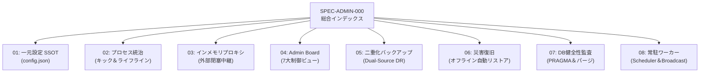

## 3. アトミック仕様リンク一覧
* [[SPEC-CONFIG-001: 一元設定ポータル (config.json) 仕様|part2_01_01_config]]
* [[SPEC-LIFECYCLE-001: Wails-Stash プロセスライフサイクル制御仕様|part2_01_02_lifecycle]]
* [[SPEC-PROXY-001: Wails インメモリプロキシ（閉塞通信）仕様|part2_01_03_proxy]]
* [[SPEC-ADMINBOARD-001: Settings UI (7大制御ビュー) ＆ Scraper View 仕様|part2_01_04_admin_board]]
* [[SPEC-BACKUP-001: 二重化バックアップ（Dual-Source DR）仕様|part2_01_05_backup]]
* [[SPEC-RECOVERY-001: 災害復旧（完全オフライン自動リストア）手順|part2_01_06_recovery]]
* [[SPEC-AUDIT-001: SQLite3 整合性監査＆パージプロトコル|part2_01_07_audit]]
* [[SPEC-SCHEDULER-001: 常駐スケジューラー＆キャスト配信仕様|part2_01_08_scheduler]]

---

[← 第1編第4章：実装規約・制約原則](part1_04_implementation_principles) | [📚 目次 (Home)](Home) | [01 一元設定仕様 →](part2_01_01_config)

---


<!-- ================================================================= -->
<!-- SECTION 10: part2_01_01_config.md -->
<!-- ================================================================= -->

<div id="part2-01-01-configmd"></div>

# 📄 [10] part2_01_01_config.md

> *Source File: `part2_01_01_config.md`*

[[← 00 総合インデックス|part2_01_00_index]] | [[📚 目次 (Home)|Home]] | [[02 プロセス制御仕様 →|part2_01_02_lifecycle]]

# SPEC-CONFIG-001: 一元設定ポータル (config.json) 仕様

## 1. 設定構造ハイエラルキー (Single Source of Truth)
従来散逸していたYAMLや個別環境変数を全廃し、ルート直下の `config.json` をシステム唯一の設定の源泉（SSOT）とします。

* **system**: 実行環境（`env`）、デフォルトプラットフォーム、UI言語（`ja/en/zh`）。
* **network**: ポート定義（内部閉塞 `stash_port: 9999` 等）、バインドアドレス。
* **storage**: DBパス（`db_path`）、`stash_enabled`、物理メディア保存先。
* **scheduler**: ポーリング間隔、自動バックアップ周期、最大保持世代数。
* **broadcast**: 家庭内LANキャスト有効化フラグ、許可サブネット（CIDR）。
* **appearance**: 3言語対応の優先フォントファミリー定義。

## 2. Stash `config.yml` 透過同期仕様 (Zero-Config Stash Bridge)
`dozou_katanuki` の `config.json` を変更・保存（`SaveConfig` RPC）したタイミングで、内部に同包される `bin/config.yml` のコア設定（`host`, `port`, `dangerous_allow_public_without_auth`）が透過的・安全に自動同期されます。
* **セルフリブート保護**: Stash 起動時ではなく、dozou の設定保存時のみ同期を走らせることで、Stash 自身のセルフリブートや設定変更との競合・意図せぬ巻き戻りを完全に防止します。
* **LAN透過アクセス**: `host: 0.0.0.0`, `port: 9999`, `dangerous_allow_public_without_auth: "true"` が保証され、LAN内の別端末からでも直接 `http://<HostIP>:9999` で Stash WebUI にアクセス可能となります。

## 3. 「Stash使わんし！」モード (物理フォルダ保存ポリシー)
`storage.stash_enabled` が `false` の場合、システムは Stashapp を起動せず、軽量な物理フォルダダイレクトサーブモードへ自律移行します。

* **物理マッピング**: ダウンロード完了ファイルを `{local_media_dir}/{platform}/{username}/{media_id}` にフラット保存。
* **相対URL動的解決**: タイムライン構築時、メディアURLは `/media-local/{platform}/{username}/{media_id}` へ自動置換され、軽量Goバイナリ単体で動態保存が完結します。

---

[[← 00 総合インデックス|part2_01_00_index]] | [[📚 目次 (Home)|Home]] | [[02 プロセス制御仕様 →|part2_01_02_lifecycle]]

---


<!-- ================================================================= -->
<!-- SECTION 11: part2_01_02_lifecycle.md -->
<!-- ================================================================= -->

<div id="part2-01-02-lifecyclemd"></div>

# 📄 [11] part2_01_02_lifecycle.md

> *Source File: `part2_01_02_lifecycle.md`*

[[← 01 一元設定仕様|part2_01_01_config]] | [[📚 目次 (Home)|Home]] | [[03 インメモリプロキシ仕様 →|part2_01_03_proxy]]

# SPEC-LIFECYCLE-001: Wails-Stash プロセスライフサイクル制御仕様

## 1. 起動・終了シーケンス (Non-blocking Prober & Lifeline Sync)

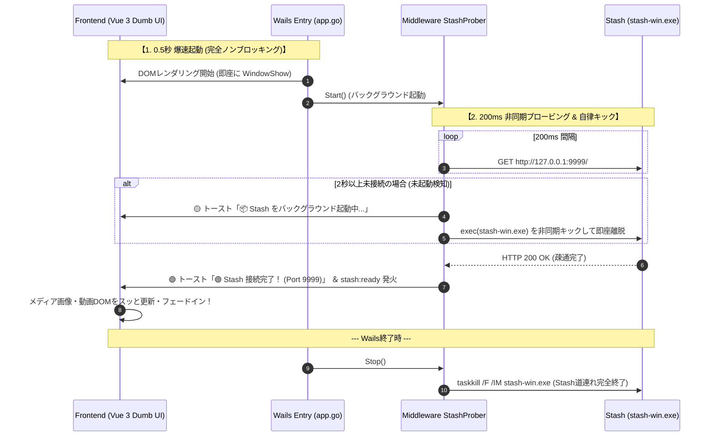

## 2. プロセス制御規約
* **完全ノンブロッキング**: Wails の `startup` / `domReady` では Stash 起動を一切同期待機せず、0.5秒未満で即座にUIを展開。
* **ミドルウェア層プローバー**: `middleware.StashProber` が 200ms 間隔でポート 9999 を非同期プロービングし、未起動時は自律キック、セルフリブート時も自動追従。
* **トースト＆DOM更新連携**: 接続完了・切断・自動起動ステータスをUIトーストにリアルタイム通知し、メディアDOMを安全に再描画。
* **道連れ終了**: 親ウィンドウ終了時（`OnShutdown`）に確実に `taskkill /F /IM stash-win.exe` を発行してゾンビプロセスを完全根絶。

---

[[← 01 一元設定仕様|part2_01_01_config]] | [[📚 目次 (Home)|Home]] | [[03 インメモリプロキシ仕様 →|part2_01_03_proxy]]

---


<!-- ================================================================= -->
<!-- SECTION 12: part2_01_03_proxy.md -->
<!-- ================================================================= -->

<div id="part2-01-03-proxymd"></div>

# 📄 [12] part2_01_03_proxy.md

> *Source File: `part2_01_03_proxy.md`*

[[← 02 プロセス制御仕様|part2_01_02_lifecycle]] | [[📚 目次 (Home)|Home]] | [[04 Admin Board仕様 →|part2_01_04_admin_board]]

# SPEC-PROXY-001: Wails インメモリプロキシ（閉塞通信）仕様

## 1. 外部プロキシポートの完全閉塞
従来の設計にあった外部公開プロキシポート（`:9998` 等）を全廃し、Wailsの `AssetHandler` を用いて **Goのメモリ内部でリバースプロキシを展開** します。これにより、外部からの不正アクセスやポート競合をゼロにします。

## 2. インメモリ・リバースプロキシ中継仕様

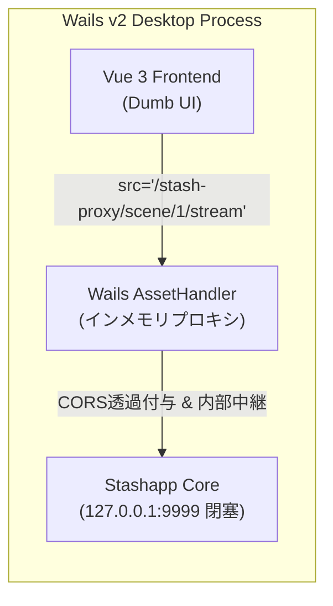

* **パス書き換え**: フロントエンドの `/stash-proxy/*` 要求を `http://127.0.0.1:9999/*` へメモリ内中継。
* **CORS透過無効化**: Same-Origin Policy を満たすHTTPヘッダーを内部自動付与し、ゼロレイテンシ再生を実現。

---

[[← 02 プロセス制御仕様|part2_01_02_lifecycle]] | [[📚 目次 (Home)|Home]] | [[04 Admin Board仕様 →|part2_01_04_admin_board]]

---


<!-- ================================================================= -->
<!-- SECTION 13: part2_01_04_admin_board.md -->
<!-- ================================================================= -->

<div id="part2-01-04-admin-boardmd"></div>

# 📄 [13] part2_01_04_admin_board.md

> *Source File: `part2_01_04_admin_board.md`*

[[← 03 インメモリプロキシ仕様|part2_01_03_proxy]] | [[📚 目次 (Home)|Home]] | [[05 二重化バックアップ仕様 →|part2_01_05_backup]]

# SPEC-ADMINBOARD-001: Settings UI (7大制御ビュー) ＆ Scraper View 仕様

## 1. Dumb UI原則に基づく責務
Vue 3 フロントエンドは状態ロジックを持たず、Actionイベント発行と表示に徹します。

## 2. 管理画面の「7大制御ビュー」
1. **Job コントローラー ＆ Scraper View**: サルベージキック、StdoutPipeによるリアルタイム進捗ログ疑似端末。
2. **Whitelist 管理ビュー**: 対象アカウント・キーワードのCRUDおよびトグル。
3. **個別記事編集ビュー**: 3言語翻訳テキスト（`full_text_ja/en/zh`）の手動微調整・保存。
4. **Stashスマート別窓・LAN導線**: 接続元クライアントのアクセスホスト（`window.location.hostname`）に応じて動的解決される `http://{hostname}:{stash_port}/` への `_blank` 誘導およびURLワンクリックコピー。LAN内端末からも誤作動なくStash WebUIを開通。
5. **デフォルトCSSエディタ**: `plugins/{platform}/skin/design.css` のブラウザ直接編集・上書き。
6. **フォント微調整パネル**: 日・英・中の優先フォントをCSSカスタム変数へ動的シグナル同期。
7. **「Stash使わんし！」モードトグル**: `storage.stash_enabled` のワンクリック切り替え。

## 2.1 メディア管理ビュー（MediaManagementView）における 2ペイン大画面インスペクタ ＆ Stash GraphQL メタデータ安全ミューテーション仕様
メディア管理画面（`DatabaseView` ➔ `MediaManagementView`）におけるメディアタップ時の挙動と Stash 動線・メタデータ管理は、**「大画面メディアビューア（左）＋ 詳細インスペクタ＆エディタ（右）」の2ペイン構成**として統一・担保されます：

1. **大画面メディアビューア ＆ 安定再生（左ペイン: 約65%）**:
   - 従来の「ダイアログ内にさらにダイアログを埋め込むことでメディアが小さく縮小される問題」を完全撤廃し、`max-w-[96vw] h-[92vh]` の広大な領域でアスペクト比を完全維持したダイナミックなメディア（画像/動画/GIF/HLSストリーム）を描画。
   - 不要かつ動画リソースの破棄・再生成不整合を引き起こしていた前後ナビゲーション（‹ / ›）を廃止し、タップした単一メディアの安定した動画再生・高解像度鑑賞に集中。
2. **アカウント詳細 ＆ アバター完全表示 (Same Source, Same Flow)**:
   - タイムラインと同一の `middleware.AuditAndResolveAvatar("twitter", tweetAt, histories)` を通して投稿日時に合致した正確な世代アバター（Base64 / `/avatars/...`）を解決。
   - `Avatar.vue` との連携により、アバター画像、表示名、`@username`、Numeric ID、投稿日時を確実にロード・表示。
3. **Stash 連携詳細 ＆ 不可逆ID保護（ReadOnly）**:
   - Stash Scene ID / Image ID はシステム主キーのため**手動書き換え不可（ReadOnlyバッジ ＋ ワンクリックコピー）**として保護。
   - `🎛️ Stash WebUI で開く ↗` ボタンにより、外部ブラウザで即座に該当アセットを開通。
4. **Stash GraphQL API メタデータ取得 ＆ 安全なデータミューテーション**:
   - **リアルタイム取得**: Stash GraphQL（`findScene` / `findImage`）からタイトル、詳細メモ、評価（Rating 1〜5★）、ファイル解像度、再生時間、コーデック、ビットレート、パスを直接フェッチ。
   - **一時変更（ローカル編集）**: タイトル、詳細メモ、評価のローカル編集プレビュー。
   - **確認モーダル（Safe Mutation）**: 変更前（Before）と変更後（After）の差分プレビューを確認ダイアログで提示し、誤操作を防止。
   - **Undo機能（ロールバック）**: 変更直前のスナップショットを退避し、`↩️ Undo` ボタンによりワンクリックで直前の状態へ完全復元。
5. **SQLite 側状態管理 ＆ クイックアクション**:
   - アーカイブ DB のダウンロード状態（`COMPLETED`, `QUEUED`, `EXCLUDED`, `DEAD_404`）および失敗理由の個別更新。
   - 「📝 親記事を見る」「🔄 再取得」「🗑️ パージ」をワンクリック実行可能。

## 3. Python サイドカー連携シーケンス

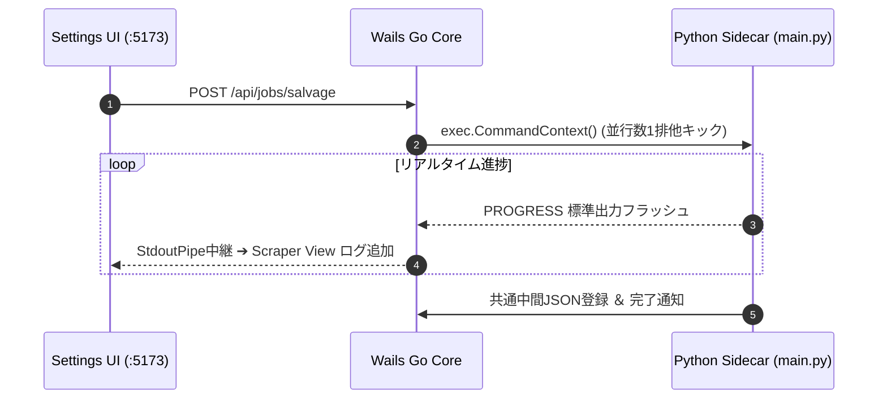

---

[[← 03 インメモリプロキシ仕様|part2_01_03_proxy]] | [[📚 目次 (Home)|Home]] | [[05 二重化バックアップ仕様 →|part2_01_05_backup]]

---


<!-- ================================================================= -->
<!-- SECTION 14: part2_01_05_backup.md -->
<!-- ================================================================= -->

<div id="part2-01-05-backupmd"></div>

# 📄 [14] part2_01_05_backup.md

> *Source File: `part2_01_05_backup.md`*

[[← 04 Admin Board仕様|part2_01_04_admin_board]] | [[📚 目次 (Home)|Home]] | [[06 災害復旧手順 →|part2_01_06_recovery]]

# SPEC-BACKUP-001: 二重化バックアップ（Dual-Source DR）仕様

## 1. 二重系統データ保全アーキテクチャ

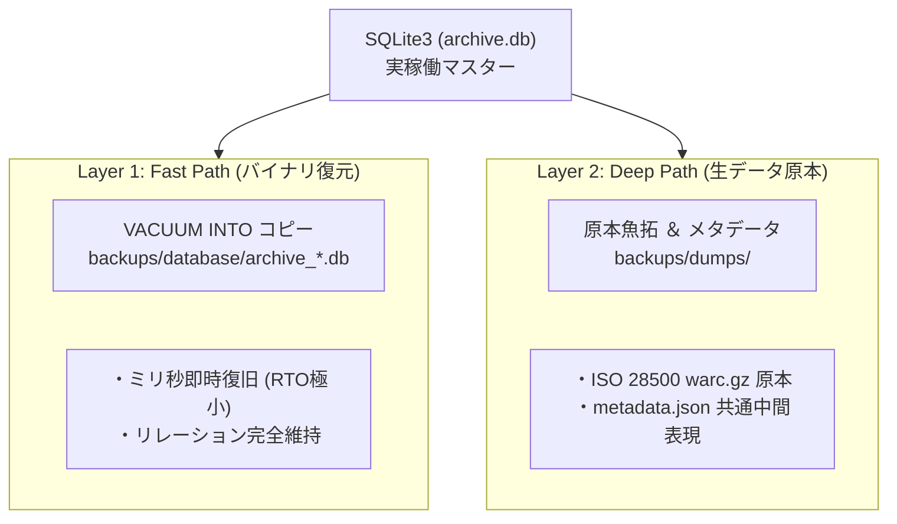

## 2. アバター保全・隔離ポリシー (Avatar Isolation)
* **ライブラリ汚染防止**: Stashの画像グリッド混入を防ぐため、アバター実ファイルはすべて `backups/dumps/{platform}/{username}/avatars/` に物理隔離保存します。
* **原本性保証**: `metadata.json` 内には生のアバターオリジナルURLを不変データとして保持します。

---

[[← 04 Admin Board仕様|part2_01_04_admin_board]] | [[📚 目次 (Home)|Home]] | [[06 災害復旧手順 →|part2_01_06_recovery]]

---


<!-- ================================================================= -->
<!-- SECTION 15: part2_01_06_recovery.md -->
<!-- ================================================================= -->

<div id="part2-01-06-recoverymd"></div>

# 📄 [15] part2_01_06_recovery.md

> *Source File: `part2_01_06_recovery.md`*

[[← 05 二重化バックアップ仕様|part2_01_05_backup]] | [[📚 目次 (Home)|Home]] | [[07 DB健全性監査 →|part2_01_07_audit]]

# SPEC-RECOVERY-001: 災害復旧（完全オフライン自動リストア）手順

## 1. ゼロからの自動再構築設計
実稼働DB `archive.db` が完全破壊された場合、Layer 2 (生データ原本) のみから外部通信ゼロ・完全オフラインで動態保存状態を100%自動再構築します。

## 2. 対称リストアフロー

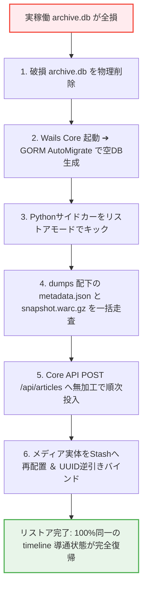

---

[[← 05 二重化バックアップ仕様|part2_01_05_backup]] | [[📚 目次 (Home)|Home]] | [[07 DB健全性監査 →|part2_01_07_audit]]

---


<!-- ================================================================= -->
<!-- SECTION 16: part2_01_07_audit.md -->
<!-- ================================================================= -->

<div id="part2-01-07-auditmd"></div>

# 📄 [16] part2_01_07_audit.md

> *Source File: `part2_01_07_audit.md`*

[[← 06 災害復旧手順|part2_01_06_recovery]] | [[📚 目次 (Home)|Home]] | [[08 常駐スケジューラー →|part2_01_08_scheduler]]

# SPEC-AUDIT-001: SQLite3 整合性監査＆パージプロトコル

## 1. SQLite3 整合性監査 (PRAGMA Audit)
* **`PRAGMA integrity_check;`**: データページ、B-Tree、インデックスの破損を徹底スキャン。破損時は Layer 1 / 2 からの復旧アラートを発行。
* **`PRAGMA foreign_key_check;`**: `accounts` ➔ `articles` ➔ `media` 間の孤立外部キーエラーが0件であることを保証。

## 2. 孤立メディア・ゾンビキャッシュの自動パージ
* **SQLite3 孤立メディア検出**: DBに存在するがStash側にないレコードを検知・削除。
* **Stash 孤立ファイルパージ**: `stash/scenes/` 内を自動走査し、DBの `media_id` と一致しない未紐付けファイルをOSのゴミ箱へ自動退避。

---

[[← 06 災害復旧手順|part2_01_06_recovery]] | [[📚 目次 (Home)|Home]] | [[08 常駐スケジューラー →|part2_01_08_scheduler]]

---


<!-- ================================================================= -->
<!-- SECTION 17: part2_01_08_scheduler.md -->
<!-- ================================================================= -->

<div id="part2-01-08-schedulermd"></div>

# 📄 [17] part2_01_08_scheduler.md

> *Source File: `part2_01_08_scheduler.md`*

[← 07 DB健全性監査](part2_01_07_audit) | [📚 目次 (Home)](Home.md) | [第2編第2章：プラグインアーキテクチャとサイドカー →](part2_02_plugin_architecture)

# SPEC-SCHEDULER-001: 常駐スケジューラー＆キャスト配信仕様

## 1. cron-like 常駐型ワーカースケジューラー
Wails起動時にGo常駐Goroutineとして立ち上がる軽量スケジューラーです。
* **完了フォルダ自動巡回**: `scheduler.polling_interval_minutes` 周期でダウンロード完了フォルダをスキャンし、対象ファイルをStashへ自動インジェクション。
* **Layer 1 自動オンラインバックアップ**: `scheduler.backup_interval_hours` ごとに `VACUUM INTO` を実行し、世代数上限（`max_backup_files`）超過分を安全退避・パージ。

## 2. メディア Broadcast（家庭内LANキャスト）
* **ネットワークバインド**: `network.public_bind_address`（`0.0.0.0`）にバインドして家庭内デバイスへメディアを中継。
* **IP / CIDR サブネット制限**: 送信元IPが `broadcast.allowed_networks`（例: `192.168.1.0/24`）に合致するかを厳格に検証し、不正アクセスを即座に `403 Forbidden` で遮断。

---

[← 07 DB健全性監査](part2_01_07_audit) | [📚 目次 (Home)](Home) | [第2編第2章：プラグインアーキテクチャとサイドカー →](part2_02_plugin_architecture)

---


<!-- ================================================================= -->
<!-- SECTION 18: part2_02_plugin_architecture.md -->
<!-- ================================================================= -->

<div id="part2-02-plugin-architecturemd"></div>

# 📄 [18] part2_02_plugin_architecture.md

> *Source File: `part2_02_plugin_architecture.md`*

[← 前の章: 第2編第1章：管理・設定・ディザスタリカバリ運用](part2_01_00_index) | [📚 目次 (Home)](Home) | [次の章: 第3編第1章：データベース設計と仮想ストレージプール →](part3_01_database_design)

# 第2編 第2章：プラグインアーキテクチャとサイドカー (Plugin Architecture & Sidecar)

**プロジェクト名** : dozou_katanuki (Wails-Stash Hybrid "土蔵・型抜き" Multi-Format Local Archival System)  
**ドキュメントID** : SPEC-PLUGIN-001  
**バージョン** : 4.0.0 (Wailsキメラデスクトップ統合仕様)  
**作成日** : 2026-08-18  
**ステータス** : 正式仕様（統合プラグイン plugins/ 規格・Go製レンダラー・Python 3Arrows・3段階メディア確保ライフサイクル・ミドルウェア非同期制御・ポート9998同期）

---

## 2.1 全体設計思想と責務の境界線
本システムにおけるプラグインアーキテクチャは、各SNSプラットフォーム（Twitter/X, Instagram, TikTok等）の追加・改修・パージをフォルダ1つの出し入れだけで完結させるため、**「統合プラグイン（Unified Plugin Package）」**規格を導入し、それを**「ファームウェアである第2層：Go Middleware (:5175)」**が一元管理・統治する設計を採用しています [6.1]。

### 1. プラットフォーム統合パッケージの物理集約思想
従来の設計では、プラットフォーム固有の処理（Pythonの収集ロジック、GoのRenderTreeデータ変換、フロントの画面スキン）が、プロジェクト内の別々のディレクトリに散逸していました。これは開発の認知負荷を高めるだけでなく、AIエージェントに機能開発を指示する際のコンテキスト肥大化とハルシネーション（暴走）を引き起こす致命的要因でした [19]。
これを根本から解決するため、プラットフォーム（SNS）単位で、**「どう集めるか（収集）」、「どう整えるか（データ変換）」、「どう見せるか（表示スキン）」**のすべての責務を一意のフォルダに物理集約（あつまれあつまれ）した、**「統合プラグイン」**規格を定義します。

### 2. Unixデバイスドライバ思想に基づく完璧な役割分離 [9.1]
本システムは、OSにおける「デバイスドライバモデル」に準拠した厳格な分離設計を徹底します [9.1]。
*   **第3層：Driver層 (Core Backend :5176)** は、SQLite3（archive.db）および Stashapp（:9999）という物理ストレージ「デバイス」へのクリーンな低レベルI/Oを提供する**「純粋なデバイスドライバ」**に徹します [2, 9.1]。外部プロセスの起動や進捗管理などの動的なコーディネーションには一切関与しません [9.1]。
*   **第2層：Middleware層 (Middleware Hub :5175)** は、システム全体のインテリジェンスとオーケストレーションを司る**「ファームウェア/制御層」**として振る舞います [9.1]。設定画面からの要求を受け取り、統合プラグイン配下の Python サイドカー（Scraper/Downloader）を直接サブプロセスとしてキック・監視・進捗スキャン（stdout解析）し、その状態（シグナル）をフロントエンドへ一方向（UDF）に中継配信します [9.1]。
*   **第1層：Presentation層 (Dumb UI :5173)** は、独自の状態やビジネスロジックを1行たりとも持たず、ミドルウェアが配信する完成済みのデータ構造 `RenderTree`、および統合プラグインから中継される表示スキン（Layout/CSS/JS）を忠実に描画するだけの **Stateless Pure View** とします [35, 36]。

--------------------------------------------------------------------------------

## 2.2 統合プラグインパッケージ（Unified Plugin Package）の物理構造
各プラットフォーム（SNS）の統合プラグインは、プロジェクトルート直下の **`plugins/{platform}/`** ディレクトリに配置され、以下の厳格な構造制限および「1ファイル100行以下ルール」を順守します [18, 6.1]。

```text
plugins/
└── {platform}/                           # プラットフォーム識別子（例: twitter, instagram）
    │
    ├── scraper/                          ★ Python非常駐サイドカー（収集・保全）
    │   ├── main.py                       # 総合エントリポイント (Dispatcher)
    │   ├── core/
    │   │   ├── scraper.py                # ①【Scraper】CDX API走査、warcioを用いたオンザフライ原本WARC保存
    │   │   ├── mutator.py                # ②【Mutator】共通データへのパース、Core APIへのミューテーションPOST
    │   │   └── downloader.py             # ③【Downloader】3段階メディア確保、Stashインジェクション・ID回収
    │   └── parsers/
    │       ├── base_parser.py            # 解析機共通 of 抽象基底クラス (BaseParser)
    │       └── {platform}_parser.py      # 対象プラットフォーム専用パースエンジン
    │
    ├── renderer/                         ★ Goレンダリングプラグイン（データ構造変換）
    │   └── renderer.go                   # 生SQLite3レコード ➔ RenderTree への変換
    │
    └── skin/                             ★ Frontendプレゼンテーションスキン（表示定義）
        ├── layout.yaml                   # タイムラインのコンポーネント配置・マッピング
        ├── design.css                    # プラットフォーム固有のスタイル・装飾
        └── controller.js                 # スレッド展開、カルーセルスワイプ等の挙動
```

| フォルダ名 | 主要技術 | 1ファイル行数制限 | 役割・責務 |
| ------ | ------ | ------ | ------ |
| **scraper/** | Python 3.10+, `warcio`, `requests` | **100行以下厳守** [18] | オンデマンド（非常駐）で起動され、Wayback/WARCからのメタデータ・実メディアの抽出、Core APIへのGORM登録、Stashへのバイナリインジェクションを実行する [2]。 |
| **renderer/**| Go 1.22+ | **100行以下厳守** [18] | ミドルウェア（:5175）にロードされ、タイムライン表示要求のたびに、生の SQLite3 レコードをフロント用 JSON（`RenderTree`）へミリ秒解決・変換する [42, 6.1]。 |
| **skin/** | YAML, CSS, JavaScript (ES6) | **100行以下厳守** [18] | フロントエンドに配信され、対象プラットフォーム固有の「タイムラインレイアウト（CSS/JS）」や「スレッドツリー展開・カルーセルスワイプ」などの表示・振る舞いを決定する [106, 108]。 |

--------------------------------------------------------------------------------

## 2.3 Pythonサイドカー・3段階メディア確保ライフサイクル（downloader.py 仕様）
統合プラグイン内の Python 収集パイプラインにおいて、もっともネットワークエラーやボット制限を受けやすく、システムの生命線となるのがメディア実ファイル（画像・動画・GIF）のダウンロード＆保全処理（`downloader.py`）です [11, 72]。
本システムは、Wayback Machineなどの外部アーカイブサーバーへの負荷に配慮しつつ、100%の信頼性でメディアをローカル完結サルベージするため、以下の**「3段階メディア確保ライフサイクル（3-Stage Media Recovery Strategy）」**を `downloader.py` の物理実装ロジックとして義務付けます [33, 71, 110]。

### 1. メディア確保ライフサイクルの状態マシン（State Machine）とDB同期ポリシー [33, 72]
データベース（`archive.db`）の `media` テーブルに存在する `download_status` カラムの値は、`downloader.py` の実行処理状況に伴って以下のように自律遷移します。

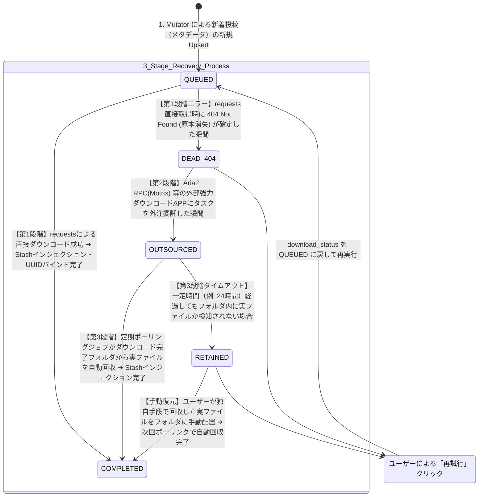

### 2. 各段階の実装ロジックと動作仕様
#### 第1段階：最初期 requests 直接アプローチ [72]
*   **処理挙動** : `downloader.py` は、まず標準の `requests` ライブラリを用いて、登録された `download_url`（本家CDNまたはWayback）へ HTTP GET ストリーム（`stream=True`）による直接ダウンロードを試みます [12, 72]。
*   **成功時（COMPLETED）** : ダウンロードしたバイナリを Stashapp（:9999）へ GraphQL 経由でインジェクションし、回収した一意の UUID（`stash_scene_id` / `stash_image_id`）を Core API（`:5176`）の `POST /api/posts` 経由で SQLite3 へ書き戻し、状態を **`COMPLETED`** に更新します [15, 72]。
*   **原本消失時（DEAD_404）** : サーバーから明確に `HTTP 404 Not Found`（原本消失）が返却された場合、直接回収は不可能であるため、状態を **`DEAD_404`** に更新し、即座に第2段階へエスカレーションします [72]。
*   **一時エラー時（QUEUEDの維持）** : Wayback側の過負荷による `HTTP 429`、`5xx`、あるいはタイムアウト等は一時的障害であるため、指数バックオフをかけた最大3回のリトライを行い、それでも失敗した場合は状態を **`QUEUED`**（保留・待機）のまま維持します [12, 72]。

#### 第2段階：DEAD_404 メディアの外部アプリ（外注）委託 [73]
*   **処理挙動** : 状態が `DEAD_404` となったアセットについて、システムは直接ダウンロードを諦め、ローカル環境で常時稼働している強力な外部ダウンロードマネージャーである **Motrix (Aria2 RPC ポート :6800)、Thunder (迅雷)、FDM (Free Download Manager)、JD2 (JDownloader2)** のいずれかの RPC API、または監視用トレント/リンクフォルダへアセットURLを外注委託（タスク登録）します [11, 73]。
*   **委託成功時（OUTSOURCED）** : タスクの発行が確認できた瞬間、状態を **`OUTSOURCED`** に更新します [73]。

#### 第3段階：cron-like 定期ポーリング ＆ Stash自動回収プッシュ [73]
*   **処理挙動** : Goミドルウェア（:5175）またはサイドカーの定期監視ジョブ（1分〜数分間隔の常駐スレッド）は、外部ダウンロードアプリの保存先フォルダ（ダウンロード完了ディレクトリ）を再帰的にポーリング（スキャン）します [73]。
*   **実ファイル検知時（COMPLETED）** :
    監視ディレクトリ内で、対象アセットの `media_id`（URL末尾の BaseName、例: `eb7ymRi-pfsx5FJH.mp4`）と物理ファイル名が100%一致する完遂ファイルを検出した瞬間、ファイルを Stashapp 監視フォルダ（`scenes/` または `images/`）へ自動回収移動します [64, 73]。
    その後、GraphQL 経由で Stash にインジェクションを実行し、回収された Stash ID を SQLite3 へ書き戻し、状態を **`COMPLETED`** へ最終更新します [15, 73]。
*   **タイムアウト（RETAINED）** :
    一定時間（例: 24時間）が経過しても完了フォルダに実ファイルが検出できない場合、状態を **`RETAINED`**（手動配置待ち保留状態）に自動遷移させ、タイムラインUI上に警告バッジを表示します [73]。ユーザーが独自に調達したファイルをフォルダに手動配置した場合、次回のポーリングがそれを検知して自動回収・インジェクションを実行し、安全に **`COMPLETED`** へと復元します [73]。

--------------------------------------------------------------------------------

## 2.4 自動・手動2系統のオーケストレーションフロー
本システムは、Wayback Machine等から自動取得する**「自動サルベージ系統」**と、ボット対策を完全バイパスするためにユーザーが通常ブラウザ等（ArchiveWeb.page拡張機能など）で手動取得したWARCファイルを取り込む**「手動WARCインポート系統（オフライン完全対応）」**の2系統のフローをサポートします [8, 9.3]。

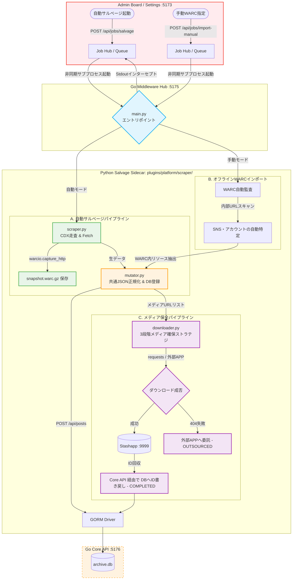

### 2.4.1 自動サルベージ系統（CDX ➔ オンザフライWARC保存） [9.3.1]
1.  **フェッチ＆キャプチャ（Scraper）**：
    *   `scraper.py` がWayback MachineのCDX Server APIを走査して対象アカウントの過去URLを特定 [9.3.1]。
    *   通信時に `warcio.capture_http` コンテキストマネージャーを噛ませ、外部APIサーバーを叩いた瞬間の生のHTTPリクエスト・レスポンス（ヘッダー・パケット）を、一期一会の原本保証として **`backups/dumps/{platform}/{username}/{post_id}/snapshot.warc.gz`** にストリーム保存します [10, 9.3.1]。
2.  **正規化＆データベースミューテーション（Mutator）**：
    *   取得された生テキストを `parsers/{platform}_parser.py` が読み取り、共通構造化データ（metadata.jsonと同等の辞書）へパース [9.3.1]。
    *   Core Backend (:5176) の `POST /api/posts` を叩き、SQLite3（`archive.db`）に投稿およびメディアのリレーショナルレコードをUpsert登録します。このときのメディア初期状態は **`QUEUED`** です [9.3.1]。
3.  **3段階メディア保全・Stashインジェクション（Downloader）**：
    *   `downloader.py` は、前述の「3段階メディア確保ライフサイクル」を非同期かつ自律的に追跡・処理し、最終的に Stash UUID のバインドと `COMPLETED` への状態遷移を完了させます [9.3.1]。

### 2.4.2 手動WARCインポート系統（手動WARC指定 ➔ 逆引き自動インポート） [9.3.2]
ログインウォール、鍵アカウント、あるいは各SNSによる厳しいボット対策を100%完全回避するために設計された、**完全オフライン動作可能**なバイパス系統です [9.3.2]。
1.  **自動監査・SNS特定（Dispatcher）**：
    *   `main.py` にローカルの `.warc` / `.warc.gz` ファイルパスが指定されてキックされると、サイドカーは `warcio` を開いて内部に記録されている通信レコードのURLパターンを全自動監査します [9.3.2]。
    *   内部URLに `twitter.com/{username}/status/` 等が含まれていることを検知すると、**「SNSプラットフォーム: twitter、アカウント名: {username}」を自動で逆引き特定・解決**します [9.3.2]。
2.  **オフライン・パース＆DB登録（Mutator - Offline）**：
    *   特定された専用パーサーを起動。外部のWayback Machineなどのネットワークには一切接続せず、指定されたWARCコンテナ内部から「当時の生のAPI応答JSON」や「生のHTMLパケット」を直接逆引き・解凍抽出します [9.3.2]。
    *   抽出されたデータから共通正規化JSONを再構築し、Core Backend (:5176) のAPIを叩いて SQLite3 にデータを登録します [9.3.2]。
3.  **オフライン・アセット抽出・Stashインジェクション（Downloader - Offline）**：
    *   メディアの実ファイルも、インターネットにダウンロードしに行くのではなく、**WARC内部のレスポンスレコード（Payloadバイナリ）から直接ローカルにデコンプレス（展開）して抽出**します（原本100%品質保証） [9.3.2]。
    *   抽出したメディアバイナリを Stash GraphQL API に流し込み、IDをSQLite3に書き戻して状態を **`COMPLETED`** に更新し、リレーションを完全に復旧します [9.3.2]。

--------------------------------------------------------------------------------

## 2.5 コマンドライン（CLI）起動引数仕様
Pythonサイドカーは非対称・オンデマンド実行に徹しており、エントリポイント（`main.py`）は以下の統一された引数スキーマに沿って起動・制御されます [9.4]。

### 1. 引数定義一覧 [9.4.1]
| 引数名 | 省略形 | 型 | 必須 | デフォルト値 | 説明 |
| ------ | ------ | ------ | ------ | ------ | ------ |
| `--mode` | `-m` | string | **必須** | - | 動作モード。`auto` (自動CDXサルベージ) または `manual` (手動WARCインポート)。 |
| `--platform` | `-p` | string | 条件付 | - | 対象SNS。`twitter`, `instagram`, `tiktok`。`auto`モード時は必須。`manual`モード時はWARCから自動監査されるため省略可能。 |
| `--account` | `-a` | string | 条件付 | - | サルベージ対象のアカウント名（@マーク不要）。`auto`モード時は必須。 |
| `--warc-path`| `-w` | string | 条件付 | - | インポート対象の `.warc` / `.warc.gz` のローカル絶対パス。`manual`モード時は必須。 |
| `--limit` | `-l` | int | 任意 | `100` | 1回の実行でフェッチ・処理する最大投稿件数上限。 |
| `--offline` | - | flag | 任意 | `False` | 手動インポート時、外部ネットワークへのアクセス（短縮URL展開など）を100%遮断してローカル処理するフラグ。 |

### 2. 起動コマンド実例 [9.4.2]
*   **実例A: 特定アカウントの自動サルベージを実行する場合**
    ```bash
    python plugins/twitter/scraper/main.py --mode auto --platform twitter --account msluo14 --limit 50
    ```
*   **実例B: ユーザーが手動取得したWARCからオフラインインポートを実行する場合**
    ```bash
    python plugins/twitter/scraper/main.py --mode manual --warc-path "C:/Users/User/Downloads/msluo14_archive.warc.gz" --offline
    ```

--------------------------------------------------------------------------------

## 2.6 バックエンド（Go / :5175）での非同期ジョブ制御仕様
Admin Board（Vue 3 `/settings` **:5173**）でのワンクリック制御を実現するため、**Goミドルウェア（ポート :5175）**側には、Pythonプロセスを非同期スレッドでサブプロセスとして安全に直接キック・制御・監視するためのジョブコントローラーを実装します [9.5]。

### 1. 非同期ジョブ制御アーキテクチャ仕様 [9.5.1]
*   **Non-Blocking Execution**：
    *   Pythonの実行は長時間を要する可能性があるため、HTTPリクエストに対してブロッキングしてはなりません。Go Middleware側は `exec.Command` を用いて、独立したノンブロッキングなOSサブプロセスとしてPythonをキックします。
*   **Job Pool / Thread Management**：
    *   重複起動や過度なCPU・ネットワークバーストを防ぐため、Goミドルウェア内部（`jobs/pool.go`）で最大並行起動数 **1** の簡易キュー・スレッド管理を行います。同一アカウントや同一ジョブの多重キックは無視、またはキューイングされます。
*   **Stdout / Stderr のリアルタイム解析と進捗管理**：
    *   キックしたPythonプロセスの `StdoutPipe` から進捗メッセージをインターセプト・スキャンし、ジョブステータスおよびパーセンテージをオンメモリで追跡します。
    *   Python側は、以下の標準構造化文字列を stdout に1行（単一バッファ）としてフラッシュ出力する契約とします：
        `PROGRESS: {current_index}/{total_count} (Status: {message})`  
        *(例: `PROGRESS: 23/50 (Status: Media ID eb7ymRi... OUTSOURCED to Motrix)`)*

### 2. ジョブ制御用 API エンドポイント（Middleware :5175 が直接提供） [9.5.2]
#### ① `POST /api/jobs/salvage` (自動サルベージの非同期キック)
*   **入力 JSON**：
    ```json
    {
      "platform": "twitter",
      "account": "msluo14",
      "limit": 50
    }
    ```
*   **出力 JSON (即時返却)**：
    ```json
    {
      "job_id": "job_20260817_0001",
      "status": "queued",
      "message": "msluo14 に対する自動サルベージジョブをキューに登録しました。"
    }
    ```

#### ② `POST /api/jobs/import-manual` (手動WARCインポートの非同期キック)
*   **入力 JSON**：
    ```json
    {
      "warc_path": "C:/Users/User/Downloads/msluo14_archive.warc.gz",
      "offline": true
    }
    ```
*   **出力 JSON (即時返却)**：
    ```json
    {
      "job_id": "job_20260817_0002",
      "status": "queued",
      "message": "手動WARCファイルの監査インポートジョブをキューに登録しました。"
    }
    ```

#### ③ `GET /api/jobs/status?id={job_id}` (ジョブステータス・進捗ポーリング)
*   **出力 JSON**：
    ```json
    {
      "job_id": "job_20260817_0001",
      "status": "running",
      "progress": {
        "current": 23,
        "total": 50,
        "percentage": 46.0,
        "last_message": "PROGRESS: 23/50 (Status: Media ID F8wZ1ab... Injected to Stash)"
      },
      "created_at": "2026-08-17T15:40:00-07:00"
    }
    ```

--------------------------------------------------------------------------------

## 2.7 レンダリングプラグイン（Go）との接続仕様（共通中間JSON形式）
Python非常駐サイドカー（Mutator）がSQLite3にデータを書き込む際、あるいは直接システム本体へ引き渡す際、プラットフォームの差異を100%吸収した**「共通中間表現 JSON（GORM Post/Media モデル互換）」**としてパッキングし、Core Backend API (:5176) の **`POST /api/posts`** に流し込みます [9.6]。

この共通スキーマ定義を、プラグインと本体間の絶対的な「契約」とします [9.6]。

### 1. 共通中間JSONスキーマ（`POST /api/posts` リクエストボディ定義） [9.6.1]
```json
{
  "platform": "twitter",
  "account": {
    "numeric_id": "18793827579",
    "username": "msluo14",
    "display_name": "Luo Yike",
    "avatar_url": "https://pbs.twimg.com/profile_images/9Kx_8Y7z_400x400.jpg",
    "description": "SNS Timeline dynamic archiver coordinator."
  },
  "post": {
    "id": "1879382757924868404",
    "conversation_id": "1879382757924868404",
    "reply_to_tweet_id": null,
    "created_at": "2026-08-17T12:00:00Z",
    "full_text": "本プロジェクトの5層アーキテクチャが「宣言型UI + UDF」へ純化完了！ #dozo_katanuki",
    "wayback_url": "https://web.archive.org/web/20260817120000/https://twitter.com/msluo14/status/1879382757924868404"
  },
  "media": [
    {
      "url": "https://pbs.twimg.com/media/F8wZ1abXYAAY7kL.jpg",
      "type": "image",
      "width": 1200,
      "height": 800
    }
  ]
}
```

---

[← 前の章: 第2編第1章：管理・設定・ディザスタリカバリ運用](part2_01_00_index) | [📚 目次 (Home)](Home) | [次の章: 第3編第1章：データベース設計と仮想ストレージプール →](part3_01_database_design)

---


<!-- ================================================================= -->
<!-- SECTION 19: part3_01_database_design.md -->
<!-- ================================================================= -->

<div id="part3-01-database-designmd"></div>

# 📄 [19] part3_01_database_design.md

> *Source File: `part3_01_database_design.md`*

[[← 前の章: 第2編第2章：プラグインアーキテクチャとサイドカー|part2_02_plugin_architecture]] | [[📚 目次 (Home)|Home]] | [[次の章: 第3編第2章：フロントエンド層概論 →|part3_02_pure_dumb_frontend]]

# 第3編 第1章：データベース設計と仮想ストレージプール (Database Design & Virtual Storage Pool)

**プロジェクト名** : dozou_katanuki (Wails-Stash Hybrid "土蔵・型抜き" Multi-Format Local Archival System)  
**ドキュメントID** : SPEC-DATABASE-001  
**バージョン** : 4.0.0 (Wailsキメラデスクトップ統合仕様)  
**作成日** : 2026-08-18  
**ステータス** : 正式仕様（GORMモデル完全同期・SQLite3 DDL・10大インデックス最適化・WALモード競合制御定義）

---

## 1.1 概要とデータ構造の整合性
本システムの中核永続化層は、極めて軽量かつ自己完結型なリレーショナルデータベースである **SQLite3** と、大容量バイナリの重複排除・トランスコード・HLS配信を担当し、Wails(Go)に内包・プロセス管理される **Stash Server** の2つの独立した仮想ストレージプールで構成されています [2, 14]。

この2つを繋ぐ唯一の架け橋（バインド関係）は、SQLite3 の `media` テーブルに保存される Stash 側の UUID（ `stash_scene_id` , `stash_image_id` ）のみです [15, 52]。これにより、データベース全損などの致命的障害時でも、100%ローカルにダンプされた二重化ソース（原本WARCおよびメタデータJSON）から、完全自動かつ非破壊的にリレーションを対称復元（ゼロリストア）できる「データの対称性（Symmetry）」を物理的に担保します [10.5]。

---

## 1.2 実稼働 SQLite3 スキーマ定義 (DDL)
実稼働マスターデータベース（ `archive.db` ）をクリーンビルド・再構築する際の、ANSI規格およびSQLite3方言に準拠した厳格な物理DDL（データ定義言語）仕様です [4, 15]。  
GORMによる `AutoMigrate` [17] の実行時、このスキーマおよび各種制約（外部キー、NULL許容、ユニークインデックス）が完全自動で整合展開されます。

```sql
-- 1. accounts テーブル（ユーザープロフィールの基本原本データ）
CREATE TABLE IF NOT EXISTS accounts (
    numeric_id TEXT PRIMARY KEY,               -- SNS固有の不変な数値文字列ID (例: "1234567890123456789")
    username TEXT NOT NULL,                     -- 一意なスクリーンネーム / ハンドル (例: "msluo14", @マークなし)
    display_name TEXT NOT NULL,                -- 表示名。絵文字を含むマルチバイト文字列
    avatar_url TEXT NOT NULL,                  -- 本家SNSにおける生のアバターURL（基礎データ原本として100%不変保存）
    updated_at DATETIME NOT NULL               -- 最終同期・更新タイムスタンプ
);

-- 2. account_profile_history テーブル（0埋め3桁アバター世代管理 ＆ プロフィール変遷履歴）
CREATE TABLE IF NOT EXISTS account_profile_history (
    id INTEGER PRIMARY KEY AUTOINCREMENT,      -- 履歴シリアルID
    account_id TEXT NOT NULL,                  -- 外部キー: accounts(numeric_id)
    display_name TEXT NOT NULL,                -- その時点での表示名
    avatar_url TEXT NOT NULL,                  -- その時点でのアバターオリジナル生URL
    avatar_seq INTEGER NOT NULL,               -- アバター変更履歴を1からカウントアップする世代シリアル値 (1, 2, 3...)
    observed_at DATETIME NOT NULL,             -- 履歴観測・保存日時
    FOREIGN KEY (account_id) REFERENCES accounts(numeric_id) ON DELETE CASCADE
);

-- 3. articles テーブル（投稿メタデータ：スレッドツリーおよび会話構造の保持）
CREATE TABLE IF NOT EXISTS articles (
    id TEXT PRIMARY KEY,                       -- 投稿ID (または記事ID)
    account_id TEXT NOT NULL,                  -- 外部キー: accounts(numeric_id)
    conversation_id TEXT NOT NULL,             -- 会話ツリーをグルーピングするためのスレッドルートID
    reply_to_status_id TEXT,                   -- 返信先（親）投稿ID (NULL許容)
    reply_to_username TEXT,                    -- 返信先（親）スクリーンネーム (NULL許容)
    created_at DATETIME NOT NULL,              -- 投稿作成タイムスタンプ
    full_text TEXT NOT NULL,                   -- 投稿本文テキスト
    via TEXT NOT NULL,                         -- 投稿ソース（クライアント名、例: "Twitter for Android"）
    is_retweet BOOLEAN NOT NULL DEFAULT 0,     -- リツイート（他者投稿の引用/転載）フラグ
    is_liked BOOLEAN NOT NULL DEFAULT 0,       -- お気に入り（ローカルブックマーク）フラグ
    wayback_url TEXT NOT NULL,                 -- Wayback Machine のキャッシュ原本URL
    FOREIGN KEY (account_id) REFERENCES accounts(numeric_id) ON DELETE CASCADE
);

-- 4. media テーブル（Stash IDとSQLite3をバインドする最重要リレーション層）
CREATE TABLE IF NOT EXISTS media (
    media_id TEXT PRIMARY KEY,                 -- オリジナルアセット取得URLの末尾（BaseName）をそのまま採用 [65]
    article_id TEXT NOT NULL,                  -- 外部キー: articles(id)
    type TEXT NOT NULL,                        -- メディア種別: "image" | "video" | "gif"
    download_url TEXT NOT NULL,                -- 本家CDNまたはWaybackのオリジナルメディアURL [52]
    width INTEGER NOT NULL,                    -- ピクセル横幅
    height INTEGER NOT NULL,                   -- ピクセル縦幅
    stash_scene_id TEXT UNIQUE,                -- Wailsが秘匿するStash内部プロセス側の動画UUID (NULL許容) [52]
    stash_image_id TEXT UNIQUE,                -- Wailsが秘匿するStash内部プロセス側の静止画UUID (NULL許容) [52]
    FOREIGN KEY (article_id) REFERENCES articles(id) ON DELETE CASCADE
);

-- 5. url_redirects テーブル（t.co 等のSNS短縮URL逆引きマップ）
CREATE TABLE IF NOT EXISTS url_redirects (
    short_url TEXT PRIMARY KEY,                -- 短縮URL (例: "https://t.co/eb7ymRi")
    expanded_url TEXT NOT NULL,                -- 解決済みのフルURL (例: "https://example.com/actual_destination")
    article_id TEXT NOT NULL,                  -- 外部キー: articles(id)
    FOREIGN KEY (article_id) REFERENCES articles(id) ON DELETE CASCADE
);

-- 6. whitelist テーブル（スパムパージ用・アーカイブ対象アカウントの統治ホワイトリスト）
CREATE TABLE IF NOT EXISTS whitelist (
    id INTEGER PRIMARY KEY AUTOINCREMENT,
    type TEXT NOT NULL,                        -- 種別: "account" | "keyword"
    value TEXT NOT NULL UNIQUE,                -- 値: "msluo14" 等のスクリーンネーム
    is_active BOOLEAN NOT NULL DEFAULT 1       -- 有効フラグ
);
```

---

## 1.3 高速化インデックス定義 (10 Optimizations)
ローカルでの無限スクロール描画、会話スレッドの逆引き走査、およびStashappのUUIDとのバインド突合処理において、 **ミリ秒単位のゼロレイテンシレスポンス** を100%保証するため、以下の10大インデックスを厳格に適用します [16, 58]。

```sql
-- 1. 【お気に入りタイムライン高速化】
-- 目的: いいねした投稿（Bookmarks）のみを瞬時に逆順フィルタリングする [58]
CREATE INDEX IF NOT EXISTS idx_articles_is_liked_created ON articles(is_liked, created_at DESC) WHERE is_liked = 1;

-- 2. 【アカウント別タイムライン高速化】
-- 目的: 特定アカウントのタイムラインを無限スクロールで超高速に表示・ページネーションする [58]
CREATE INDEX IF NOT EXISTS idx_articles_account_created ON articles(account_id, created_at DESC);

-- 3. 【会話ツリー爆速スキャン】
-- 目的: 特定の conversation_id に属する関連投稿を時系列順に一括解決する
CREATE INDEX IF NOT EXISTS idx_articles_conversation ON articles(conversation_id, created_at ASC);

-- 4. 【リプライ親参照インデックス】
-- 目的: 特定の親記事に対する子リプライ（スレッドツリーの下流）を瞬時に検索する
CREATE INDEX IF NOT EXISTS idx_articles_reply_to ON articles(reply_to_status_id);

-- 5. 【統合タイムライン高速化】
-- 目的: 登録されている全アカウントの投稿を時系列に結合した統合タイムラインの描画ソートを O(1) 化する [58]
CREATE INDEX IF NOT EXISTS idx_articles_created_at ON articles(created_at DESC);

-- 6. 【アバター履歴世代・逆引きミリ秒解決】
-- 目的: 記事の投稿日時に最も近いアバターの「世代キー」をGORM BeforeFindフックで瞬時に逆引き解決する [68]
CREATE INDEX IF NOT EXISTS idx_history_lookup ON account_profile_history(account_id, avatar_seq DESC);

-- 7. 【ユーザー名インクリメンタル検索】
-- 目的: ハンドルネーム（username）から numeric_id やプロフィール情報をミリ秒検索する
CREATE INDEX IF NOT EXISTS idx_accounts_username ON accounts(username);

-- 8. 【メディア紐付け（Reconciliation）自動高速化】
-- 目的: 添付メディアのロード、およびStash IDの逆引きインポートをバースト検索可能にする
CREATE INDEX IF NOT EXISTS idx_media_article ON media(article_id);

-- 9. 【StashビデオUUIDユニーク参照】
-- 目的: StashappのUUIDとSQLite3 mediaレコードの一対一整合性を最速で照合・監視する [52]
CREATE UNIQUE INDEX IF NOT EXISTS idx_media_stash_scene ON media(stash_scene_id) WHERE stash_scene_id IS NOT NULL;

-- 10. 【StashイメージUUIDユニーク参照】
-- 目的: Stashappの静止画UUIDとのバインド突合をミリ秒で判定し、二重インポートを100%防止する [52]
CREATE UNIQUE INDEX IF NOT EXISTS idx_media_stash_image ON media(stash_image_id) WHERE stash_image_id IS NOT NULL;
```

---

## 1.4 WAL (Write-Ahead Logging) モードと同時実行制御仕様
本システムは、データベース接続の開始時に必ず **WAL（Write-Ahead Logging）モード** を有効化します [16]。これは、ローカルのマルチプロセス・マルチスレッド環境における「非ブロッキングUDFデータフロー」を成立させる上での絶対的な要件です [16, 43]。

##### 1. なぜ WAL モードなのか？（非ブロッキング読み込み）
*   **読み込み・書き込みの完全非衝突** [16]： Python非常駐サイドカー（Mutator）がバックグラウンドで何万行もの投稿・メディアデータをデータベースに一括インジェクションして排他ロックをかけている最中であっても、フロントエンド（Vue 3）からのタイムラインフェッチ（Go Bind呼び出し）は、 **1ミリ秒のブロッキング（遅延）もなく同時に実行可能** です [16]。
*   **R/W スループットの飛躍的向上**： 実データベースファイル（ `archive.db` ）を直接ロックして書き換えるのではなく、高速な追記専用のログファイル（ `archive.db-wal` ）を仲介するため、HDD/SSD等のI/O負荷を極限まで低減し、インポート処理の時間を 1/10 以下に圧縮します。

##### 2. Go（GORM）におけるWAL接続初期化コード規約
Wails バックエンドのデータベース接続プール初期化時、必ず以下の `PRAGMA` 設定を実行することを義務付けます。

```go
package db

import (
	"gorm.io/driver/sqlite"
	"gorm.io/gorm"
	"gorm.io/gorm/logger"
	"log"
)

func InitDatabase(dbPath string) *gorm.DB {
	db, err := gorm.Open(sqlite.Open(dbPath), &gorm.Config{
		Logger: logger.Default.LogMode(logger.Silent),
	})
	if err != nil {
		log.Fatalf("[FATAL] Failed to connect to database: %v", err)
	}

	sqlDB, err := db.DB()
	if err != nil {
		log.Fatalf("[FATAL] Failed to get database handle: %v", err)
	}

	// SQLite3 WALモードと整合性制約を強制有効化
	// busy_timeout = 5000 (ロック競合時の待機時間を5秒に設定し、エラー発生を防ぐ)
	pragmaQueries := []string{
		"PRAGMA journal_mode = WAL;",
		"PRAGMA foreign_keys = ON;",
		"PRAGMA synchronous = NORMAL;",
		"PRAGMA busy_timeout = 5000;",
	}

	for _, query := range pragmaQueries {
		if _, err := sqlDB.Exec(query); err != nil {
			log.Fatalf("[FATAL] Failed to apply database pragma '%s': %v", query, err)
		}
	}

	log.Println("[INFO] SQLite3 Database connected in WAL mode with Foreign Keys enabled.")
	return db
}
```

---

## 1.5 仮想アバター ＆ Stash メディアプール物理分離規約のDB的意義
本システムにおける「仮想アバターリゾルバ」および「Stashとアバターの完全物理分離（Avatar Isolation Policy）」は、データベース構造的にも極めてクリーンな状態を保つために設計されました [15, 69]。

1.  **アバター情報の「オリジナル原本」と「表示用仮想キー」の同居** [15, 67]：
    *   `accounts.avatar_url` および `account_profile_history.avatar_url` には、将来の監査や原本証明のために、 `https://pbs.twimg.com/...` などの生URLを **100%不変の基礎データ** としてそのままDB保存します [15, 67]。
    *   フロントエンドに値を返す際、Wails Goバックエンドは自動で最新の世代履歴（ `avatar_seq` ）を結合し、表示用プロパティ `avatar_url` にのみ仮想アバターキー（例: `msluo14_avatar_001` ）をセットした RenderTree を構築して返却します [56, 68]。
2.  **Stashのデータベース（Scene / Image テーブル）のクリーン性保護** [15, 69]：
    *   StashにインジェクションされるメディアのUUIDは、すべて `media` テーブルの `stash_scene_id` 、 `stash_image_id` としてSQLite3にのみ登録され、アバター（プロフィール画像）がStash側に登録されることは1件もありません [15, 69]。
    *   これにより、Stash本来 of 画像ビューアに、アバター画像がゴミ・ノイズとして紛れ込んでUI表示が崩れるバグを、物理的（ディレクトリ構成）かつリレーショナルデータベースレベル（外部キー/NULL制限）で100%遮断します [15, 69]。

---

[[← 前の章: 第2編第2章：プラグインアーキテクチャとサイドカー|part2_02_plugin_architecture]] | [[📚 目次 (Home)|Home]] | [[次の章: 第3編第2章：フロントエンド層概論 →|part3_02_pure_dumb_frontend]]

---


<!-- ================================================================= -->
<!-- SECTION 20: part3_02_pure_dumb_frontend.md -->
<!-- ================================================================= -->

<div id="part3-02-pure-dumb-frontendmd"></div>

# 📄 [20] part3_02_pure_dumb_frontend.md

> *Source File: `part3_02_pure_dumb_frontend.md`*

[[← 前の章: 第3編第1章：データベース設計と仮想ストレージプール|part3_01_database_design]] | [[📚 目次 (Home)|Home]] | [[次の章: 第3編第3章：ミドルウェア層インデックス →|part3_03_0_middleware_index]]

# 第3編 第2章：フロントエンド層概論（Pure Dumb UI Framework）

**プロジェクト名** : dozou_katanuki (Wails-Stash Hybrid "土蔵・型抜き" Multi-Format Local Archival System)  
**ドキュメントID** : SPEC-FRONTEND-001  
**バージョン** : 4.0.0 (Wailsキメラデスクトップ統合仕様)  
**作成日** : 2026-08-18  
**ステータス** : 正式仕様（Dumb UI一般化・シグナル・UDF原則、設定管理系コンポーネント、SVGプレースホルダーフィラー出し分け）

---

## 2.1 宣言型UIと単一データフロー（UDF）パラダイム
本システムのフロントエンド（Vue 3.5）は、特定のSNSプラットフォームに依存する自律的なビジネスロジックや複雑なURL組み立てを一切持たず、Goミドルウェア（:5175）から受領した汎用的なデータ構造 `RenderTree` を忠実に描画する**「純粋なプレゼンテーション層（Foolish Frontend）」**として設計されています [35, 36]。
従来の特定のプラットフォームに依存した設計（MVVM等）から、高い予測可能性と優れたテスタビリティを両立する「宣言型UI ＋ 単一データフロー（UDF）＋ シグナル」パターンへと完全に純化し、以下の3大原則を徹底します [35, 36]。

### 1. 宣言型レンダリング (Declarative Rendering) [35, 36]
*   「どうDOMを操作するか」「どう状態を遷移させるか」という手続き的な処理を完全に排除します [36]。
*   View（`frontend/src/components/`）は、受け取った `RenderTree` の状態がこうであれば、こう表示するという宣言的テンプレート（`<template>`）のみで記述される **Dumb Component (Stateless Pure View)** とします [36]。
*   View内でのアバター画像のURL解決（`/assets/...`）やStashプロキシURL（`/stash-proxy/...`）の組み立て、テキストの加工（改行、ハッシュタグ、リンク解決など）は**厳格に禁止**し、すべて上流の Middleware Hub (:5175) が事前処理した完成データ（`RenderTree`）をそのままバインドします [36]。

### 2. シグナル（Signals-based Reactive）の活用 [36]
*   Vue 3 Composition API の `ref` / `reactive` / `computed` を、ピンポイント高速更新を行う「シグナル」として位置づけます [36]。
*   ローカル環境ならではのゼロ・レイテンシを最大限に活かし、いいね（お気に入り）ボタンのトグルや翻訳トグルが発生した際、関係するカード（コンポーネント）のシグナル状態のみをピンポイントで超高速に再描画し、タイムライン全体の不要な再レンダリングや遅延（ラグ）を極限まで排除します [36]。

### 3. 単一データフロー (Unidirectional Data Flow / UDF) の徹底 [37]
*   データは常に **[Go Middleware Hub (:5175)] ➔ [Composable (State) :5173] ➔ [View (Props)]** の一方向（Top-to-Bottom）のみに流れます [37]。
*   下流のコンポーネントがPropsや共有状態を直接書き換える「双方向データバインディングによる暗黙的な状態破壊」を完全に禁止します [37]。
*   ユーザー操作（クリック、スクロール、トグル等）は、すべて「イベント（Action）」として上流の Composable または Skin Controller へ通知され、APIリクエストを介して状態（シグナル）が更新された後、再び新しいProps（`RenderTree`）としてViewへ一方向に流れます [37]。

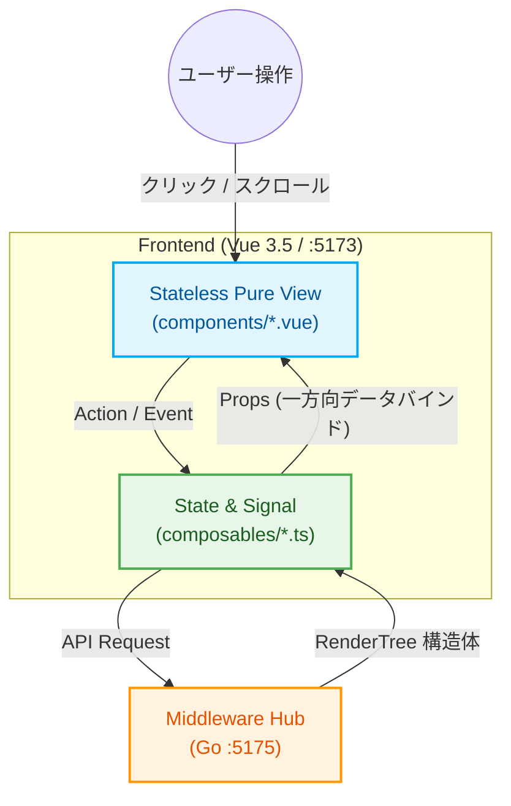

---

## 2.2 プラットフォーム共通 URL ルーティング体系（Vue Router / History API） [38]
本システムでは、すべての画面を単一URLで表示するアドホックな設計を全廃し、本家SNSと高い互換性・ポータビリティを持つ汎用的なURLルーティング体系を Vue Router (HTML5 History API) によって構築しています [38]。
これにより、特定の投稿（Article）や特定アカウントのタイムラインを「ブックマーク保存」したり、ブラウザから直接URLを指定してアクセスすることが可能になっています [38]。

| 画面種別 | パス形式 (Path Segment) | 実例URL | 動作・描画仕様 |
| ------ | ------ | ------ | ------ |
| **統合タイムライン** | `/:platform` または `/` | `http://localhost:5173/twitter` | 登録・有効化されている全アカウントの投稿を時系列に結合したタイムラインを表示 [38]。 |
| **個別ユーザーTL** | `/:platform/:username/` | `http://localhost:5173/twitter/msluo14/` | 指定ユーザーのプロフィールヘッダー、Bio、および個別投稿タイムラインを表示 [38]。 |
| **個別詳細画面** | `/:platform/:username/status/:id` | `http://localhost:5173/twitter/msluo14/status/1879382757924868404` | 対象投稿（ID: `1879382757924868404`）の個別詳細、会話ツリー（上位リプライ・下位スレッド）を表示 [38]。 |
| **管理・設定画面** | `/settings` | `http://localhost:5173/settings` | 各種統計、Stash接続状態、ホワイトリスト管理、個別サルベージジョブおよび Scraper View 監視UI [38]。 |

*   **SPA Fallback ルーティングとの連携** [39]:
    ユーザーがブラウザで上記の個別詳細URL（例: `/:platform/:username/status/...`）を直接URL欄に入力してアクセス（直打ち）したり、F5キーでリロードした際、Webサーバーが 404 Not Found を返すのを防ぐため、Middleware Hub (:5175) が 404 リクエストを全て `index.html` にルーティング中継（Fallback）します [39]。フロントエンドに到着後、Vue Router がパスを解決して正確な画面を描画します [39]。

---

## 2.3 主要フロントエンド型定義 (RenderTree / RenderMedia Status)
フロントエンドとミドルウェアを繋ぐ、契約（SSOT / Single Source of Truth）としての共通型定義（TypeScript）です [39]。すべての UI コンポーネントはこの型定義に従って描画を決定します。
データベース上で定義された **3段階メディア確保ライフサイクルの状態値** が添付メディアに統合され、フロントエンドでのインジケーター表示を統治します [33]。

```typescript
// frontend/src/models/RenderTree.ts

/**
 * タイムライン描画の最小単位となる投稿（アセット・記事）のデータ表現
 */
export interface RenderTree {
  id: string;                     // プラットフォーム固有の投稿ID (string化)
  conversation_id: string;        // 会話スレッドグループID
  created_at: string;             // ISO 8601 形式の投稿日時 (UTC)
  content: {
    original: string;             // HTMLリンク・タグ整形済みの生本文（原本）
    ja?: string;                  // HTMLリンク・タグ整形済みの日本語訳 (存在時のみ)
    en?: string;                  // HTMLリンク・タグ整形済みの英語訳
    zh?: string;                  // HTMLリンク・タグ整形済みの中国語訳
  };
  author: RenderAuthor;           // 投稿者（アカウント）データ
  media: RenderMedia[];           // 添付メディアの配列 (0〜4件)
  metrics: RenderMetrics;         // エンゲージメント指標（いいね、RT数など）
  source_url: string;             // アーカイブ元（Wayback Machine等）の魚拓URL
  is_liked: boolean;              // ローカルでのお気に入り（ブックマーク）登録フラグ
  is_pinned: boolean;             // ローカルでのピン留めフラグ
  parent_id?: string;             // 返信先の親投稿ID (スレッド展開用)
}

/**
 * 投稿者（作成者）のメタデータ表現
 */
export interface RenderAuthor {
  numeric_id: string;             // 内部管理用のユニークID
  handle: string;                 // スクリーンネーム / ユーザーID (例: @msluo14)
  display_name: string;           // 表示名 (名前)
  avatar_url: string;             // 仮想解決されたアバター相対パス (/assets/twitter/msluo14_avatar_001.jpg)
  bio: string;                    // プロフィール自己紹介文
}

/**
 * メディア要素（画像・動画・GIF）のデータ表現
 * (ミドルウェアおよびドライバー層で完全相対URL化して配信)
 */
export interface RenderMedia {
  id: string;                     // メディア一意ID
  type: 'image' | 'video' | 'gif';// メディアの種別
  download_status: 'QUEUED' | 'COMPLETED' | 'DEAD_404' | 'OUTSOURCED' | 'RETAINED'; // メディア確保ステータス [33, 42]
  failed_reason?: string;         // ダウンロード失敗・保留時の具体的なエラー原因 (存在する場合のみ) [33]
  urls: {
    stream: string;               // 動画再生ストリーム相対パス (/stash-proxy/scene/{stash_scene_id}/m3u8 または stream)
    image: string;                // 静止画フル解像度相対パス (/stash-proxy/image/{stash_image_id}/image)
    thumbnail: string;            // サムネイル軽量画像相対パス (/stash-proxy/image/{stash_image_id}/thumbnail)
    original: string;             // 外部Wayback / CDNのフォールバック用オリジナルURL
  };
  width?: number;                 // メディアの横幅 (px)
  height?: number;                // メディアの縦幅 (px)
}

/**
 * 収集したアセットの統計指標（エンゲージメント）
 */
export interface RenderMetrics {
  replies: number;                // 返信/リプライ数
  retweets: number;               // リツイート/リポスト/シェア数
  likes: number;                  // いいね/お気に入り数
  views?: number;                 // インプレッション表示数
}
```

---

## 2.4 Skin Controller 共通インターフェース規格 [100]
各プラットフォーム（Twitter、Instagram等）固有の動作・インタラクション（スレッドツリー探索、カルーセルスワイプ、ダブルタップいいねなど）を、ホストである Vue のコアシステムから完全に切り離してプラグインパッケージ化するための統一インターフェース定義です [100]。
これは、Goミドルウェア（:5175）側が管理する **RendererPlugin** （データ変換プラグイン）と完全な1対1の対称性（Symmetry）を持つようにマッピングされます。

```typescript
// frontend/src/models/SkinController.ts

import { RenderTree, RenderMedia } from './RenderTree';

/**
 * プラガブルUIスキンパッケージが実装すべきコントローラー契約
 */
export interface SkinController {
  // 1. 初期化 (Vue側からルーター、共通APIクライアント、リアクティブ状態を注入)
  init(ctx: SkinContext): void;

  // 2. ライフサイクル・マウントフック
  onMount?(containerElement: HTMLElement): void;
  onUnmount?(): void;

  // 3. ユーザーアクションの汎用ハンドラ
  handleItemClick?(item: RenderTree, event: Event): void;
  handleMediaClick?(media: RenderMedia, index: number): void;

  // 4. プラットフォーム固有のアクションマップ (Vue側から動的にキーキック可能)
  actions: Record<string, (item: RenderTree, ...args: any[]) => Promise<any> | void>;
}

/**
 * Vue（ホスト側）からスキンパッケージへ供給されるコンテキスト情報
 */
export interface SkinContext {
  router: {
    push: (path: string) => void;
  };
  api: {
    fetchRelated: (id: string) => Promise<RenderTree[]>;
    toggleLike: (id: string) => Promise<boolean>;
  };
  showToast: (msg: string) => void;
  state: any; // タイムライン全体のリアクティブシグナル状態への参照
}
```

---

## 2.5 ディレクトリ構造とコンポーネント配置ルール
「1ファイル100行以下ルール」および「宣言型UI/UDF」を完全に守るため、フロントエンドのディレクトリ配置を以下のように厳密かつ抽象的に構造化します [40]。特定のSNSを表す単語は排除され、あらゆるプラットフォームに対応可能です。

```text
frontend/src/
├── components/                  ★ Stateless Pure View (Dumb Component / 100行以下厳守)
│   ├── layout/                  （AppSidebar.vue, StatusBanner.vue, AppHeader.vue 等）
│   ├── article/                 （ArticleCard.vue, ArticleHeader.vue, Avatar.vue, ArticleBody.vue, ArticleStats.vue）
│   ├── media/                   （MediaGrid.vue, MediaOverlay.vue, StashPlayer.vue）
│   └── settings/                ★ 設定・管理用 7大コンポーネントピース (第10章 10.3節 と完全マージ)
│       ├── JobController.vue    （インポート非同期起動・進捗バー）
│       ├── ScraperView.vue      （【新規】進行中ジョブの StdoutPROGRESS リアルタイム監視疑似ターミナル ＆ ログ履歴）
│       ├── WhitelistGrid.vue    （whitelistテーブル CRUD グリッド）
│       ├── ArticleEditor.vue    （GORM multi-lang 翻訳テキスト手動微調整・上書き保存パネル）
│       ├── CssEditor.vue        （design.css 直接物理編集コードエディタ）
│       ├── FontPanel.vue        （font_family_* 動的バインド微調整パネル）
│       └── StashTogglor.vue     （stash_enabled 軽量ローカルモード設定トグル）
│
├── composables/                 ★ State & Signal Layer (UDF Composable)
│   ├── useTimeline.ts           （タイムライン状態・ページネーション・UDFフェッチ）
│   ├── useMediaOverlay.ts       （画像/動画全画面オーバーレイのシグナル状態）
│   └── useArticleTranslation.ts （多言語事前キャッシュ切り替えシグナル状態ホルダー）
│
├── models/                      ★ 不変の型定義・契約定義
│   ├── RenderTree.ts
│   └── SkinController.ts
│
└── utils/                       ★ 副作用ゼロの純粋関数（Pure Functions）
    ├── formatters.ts            （日付フォーマット、数字の略表記：K, M等）
    └── parser.ts                （テキスト内アセット要素のパース処理ヘルパー）
```

---

## 2.6 主要コンポーネントの実装規約
### 1. コンポーネント分割の実践例（`ArticleCard` の100行解体） [19]
タイムラインの投稿を表す `ArticleCard.vue` が肥大化して「1ファイル100行」を超過する場合、以下の順序で Stateless Sub-Components に機械的に分解します [19]。これによりコンテキストがコンパクト化され、AIによる保守性が飛躍的に向上します [19]。

1.  **`ArticleCard.vue`** (親コンポーネント、レイアウトコンテナとしての役割のみ。Propsを子へ流す) [19]
2.  ➔ **`ArticleHeader.vue`** (表示名、ハンドル名、および `Avatar.vue` 呼び出しに特化) [19]
3.  ➔ **`Avatar.vue`** (アバター画像の円形切り抜きおよび世代表示に特化) [19]
4.  ➔ **`ArticleBody.vue`** (本文テキスト表示、翻訳表示トグルの統合) [19]
5.  ➔ **`ArticleStats.vue`** (いいね、リツイート、リプライ等のエンゲージメント数値表示) [19]
6.  ➔ **`MediaGrid.vue`** (添付メディア数 [1〜4] に応じたCSSグリッド/ギャラリー描画) [19]

### 2. メディア確保ステータス（download_status）に基づく宣言型描画ルール [33]
`MediaGrid.vue` は、Propsとして受け取る `RenderMedia` オブジェクトの `download_status` に従い、以下の描画パターンを100%宣言的に出し分けるものとします [33, 36]。

特に、**`COMPLETED` 以外のすべてのステータスにおいては、ブラウザのフリーズや非接続環境での画像崩れを防ぐため、外部魚拓（Wayback直接読み込み）の自動読み込みを行わず、SVGフィラーを用いた軽量プレースホルダーを表示**します。このプレースホルダーは、対象メディアが画像（`image`）、動画（`video`）、またはGIFアニメーション（`gif`）であるか一瞬で判別できるように、グラフィカルかつ視覚的に出し分けられます。

#### A. `COMPLETED` の場合（ローカル確保完了）
*   CORSを回避して再生・読み込みが保証された完全相対プロキシURL（`/stash-proxy/...`）を用いて、動画再生プレイヤー（`StashPlayer.vue`）またはフル解像度静止画をLightBox等で美しく描画します [54, 71, 7.6]。

#### B. `COMPLETED` 以外（`QUEUED`, `DEAD_404`, `OUTSOURCED`, `RETAINED`）の場合のSVGフィラー描画
*   各アセット枠には、メディア種別（`type`）に連動した以下の**「SVGプレースホルダー・フィラー」**を宣言的に表示し、パルスアニメーション（`animate-pulse`）と合わせてロード状態を表現します。

1.  **画像（`type == 'image'`）用SVGフィラー仕様**：
    *   **背景デザイン**：明るめのライトグレー調グラデーションモック（`bg-neutral-100 dark:bg-neutral-800 animate-pulse`）
    *   **SVGアイコン**：カメラまたは写真フレームを象った美しいモダンフラットアイコン（例：`feather-image` 互換の美しい24pxパス線）。
    *   **UI挙動**：アッシュグレー of 静的な印象を与えつつ、現在のステータスバッジ（例：`[OUTSOURCED] 外部APPダウンロード中`）を重ねます。

2.  **動画（`type == 'video'`）用SVGフィラー仕様**：
    *   **背景デザイン**：深みのあるチャコール調ダークグラデーションモック（`bg-neutral-200 dark:bg-neutral-900 animate-pulse`）
    *   **SVGアイコン**：再生（Play）の三角形、あるいはビデオカメラ・映画フィルムを象ったグラフィカルなSVGアイコン（例：中央に大きく配置されたシャドウ付きPlayシンボル）。
    *   **UI挙動**：動画アセットであることを明確に示すため、底面に「シークバー風プレースホルダーライン」を薄く重ねて描画します。

3.  **GIFアニメーション（`type == 'gif'`）用SVGフィラー仕様**：
    *   **背景デザイン**：少し点滅スピードを速めたアクティブパルス背景（`bg-neutral-150 dark:bg-neutral-850 animate-pulse-fast`）
    *   **SVGアイコン**：四角いボーダーフレームで「GIF」の文字マークを囲ったアイコン、あるいは円環ループ矢印マークを組み合わせたグラフィカルなSVG。
    *   **UI挙動**：通常の静止画や動画と一瞬で混同なく判別できるよう、角に「GIF」と記した軽量のピルマークバッジを配置します。

#### C. 失敗・保留ステータス（`DEAD_404`, `OUTSOURCED`, `RETAINED`）の重ね描き＆再試行（Retry）トグラー
*   上記の各SVGフィラーの上に、現在のステータス（例：`DEAD_404: 外部アクセスエラー`）と具体的なエラー理由（`failed_reason`）を薄いブラー付き半透明のオーバーレイシートとして重ねて表示します。
*   このオーバーレイ領域内には、ユーザーがいつでも手動で再ダウンロードを非同期要求できる「**再試行（Retry）**」トグラーボタン（これも美しいリロード回転矢印SVGを埋め込んだもの）を提供し、Dumb UI内の自己完結したアクションとして統治します。

---

## 2.7 フロントエンド専用外部プラグイン ＆ 共通コアライブラリ仕様
本システムのフロントシェル（:5173）は、スタンドアロン（デスクトップ）アプリとして極めてレスポンシブかつ美しく動作し、Stashapp（:9999）が中継配信する高画質な動画・画像ストリーミングをゼロ・レイテンシで再生・表示するため、以下のフロントエンド専用ライブラリおよびプラグインを静的にバンドル・統合します [2, 118]。

### 1. 高密度 HLS ビデオプレイヤー（`StashPlayer.vue` の静的統合仕様）
Stashapp（:9999）がリアルタイムにデコード・トランスコードする HLS（`.m3u8`）アダプティブストリーミング [14] を、ブラウザ側のCORS制約を完全に中和したプロキシポート **:9998** を通じてサクサクと遅延なく再生するため、ビデオプレイヤーは以下のライブラリ群を統合して構成します [54, 71, 7.6]。
*   **hls.js** （軽量なJS製 HLS デコーダ）:
    *   ブラウザがネイティブで HLS 再生に対応していない環境（Chromium 系の多くのデスクトップブラウザ等）において、メディアバッファをパケット単位でオーバーレイデコードして再生を可能にします。
    *   プロキシ（:9998）から返却される `.ts` チャンクファイルに対して、動的バッファサイズ調整（Adaptive Bitrate / ABR）を最適化して接続します [7.6]。
*   **plyr** （洗練されたモダンビデオプレイヤー UI）:
    *   HTML5 標準ビデオタグの野暮ったいコントロールをすべて排除し、CSS（Tailwindと調和させたダークカスタムテーマ）で統一された美しいレスポンシブシークバー、音量、再生、最大10秒スキップ、ピクチャー・イン・ピクチャー、および全画面表示ボタンを提供します。

### 2. ライトボックス＆ジェスチャ拡大オーバーレイ（`MediaOverlay.vue` 仕様）
タイムライン（`ArticleCard`）上の静止画や動画、GIFをクリックした際、画面いっぱいに美しいブラー背景とともに展開され、拡大縮小（ピンチズーム）や前後アセット送り（カルーセルスワイプ）を可能にするメディアビューアです。
*   **fslightbox-vue** または **自作軽量ジェスチャモジュール**:
    *   バンドルのポータビリティを最優先し、モバイル端末でのスワイプ距離（`touchstart` / `touchend`）や、キーボードの `Esc`（閉じる）、`ArrowLeft` / `ArrowRight`（前後アセット切り替え）をフックします [132]。
*   **一方向データフロー（UDF）での状態同期**:
    *   オーバーレイが開いている状態（`isOpen`）や現在アクティブなアセットインデックス（`activeIndex`）は、 `useMediaOverlay.ts` という Composable（シグナル状態）で厳密に管理され、コンポーネントへ Props として一方向供給されます [41]。

### 3. 高効率 SVG アイコンシステム (FontAwesome ＆ Lucide-Vue-Next)
Dumbコンポーネントが、1ファイル100行以下のルールを守りながら、動作時の描画オーバーヘッドを限りなくゼロにするために、アイコンアセットのロード仕様を規定します [18, 36]。
*   **@fortawesome/vue-fontawesome** (FontAwesome SVG Core):
    *   全アイコン（数MBの重厚なライブラリ）の丸ごと一括ロードを **厳格に禁止** します。
    *   `frontend/src/plugins/fontawesome.ts` 等のプラグインファイルにて、使用する特定のアイコン（例: `faHeart`, `faRetweet`, `faComment`, `faBookmark`, `faRotate`）のみを `library.add` に明示的にインポート・登録し、個別登録された軽量な SVG-Core のみから動的に呼び出します。
*   **lucide-vue-next** (Feather Icons の Vue 3 用ラッパー):
    *   Vue の Tree Shaking 機能が100%機能するように、 `import { Image, Video, Film, RefreshCw } from 'lucide-vue-next'` のようにコンポーネント単位でピンポイント個別インポートし、Dumb Component 内にマウントして描画します。

### 4. 共通ヘルパー＆レイアウト YAML パーサー
*   **lodash-es** (ESモジュール版 Lodash):
    *   動的レイアウト解決（`layout.yaml` の `props_mapping`）において、ネストされたデータ構造から値を安全に引っ張るため、 `import { get } from 'lodash-es'` を用いてバインディングエラーを100%防止（ゼロ・ポインター回避）します [85]。
*   **js-yaml** (フロントエンド向け YAML パーサー):
    *   ミドルウェア（:5175）の `GET /api/plugins/{platform}/skin/layout` からプレーンテキストで中継サーブされた `layout.yaml` を、フロントエンド内で瞬時に型安全な JSON オブジェクトへとパース・デシリアライズします [50, 6.2.3]。

---

[[← 前の章: 第3編第1章：データベース設計と仮想ストレージプール|part3_01_database_design]] | [[📚 目次 (Home)|Home]] | [[次の章: 第3編第3章：ミドルウェア層インデックス →|part3_03_0_middleware_index]]

---


<!-- ================================================================= -->
<!-- SECTION 21: part3_03_0_middleware_index.md -->
<!-- ================================================================= -->

<div id="part3-03-0-middleware-indexmd"></div>

# 📄 [21] part3_03_0_middleware_index.md

> *Source File: `part3_03_0_middleware_index.md`*

[[← 前の章: 第3編第2章：フロントエンド層概論|part3_02_pure_dumb_frontend]] | [[📚 目次 (Home)|Home]] | [[次の章: 第3編第4章：ドライバー層 →|part3_04_backend_driver]]

# 第3編 第3章：ミドルウェア層インデックス (Intelligent Hub Architecture)

**プロジェクト名** : dozou_katanuki (Wails-Stash Hybrid "土蔵・型抜き" Multi-Format Local Archival System)  
**ドキュメントID** : SPEC-MIDDLEWARE-000  
**バージョン** : 4.0.0  
**作成日** : 2026-08-18  
**ステータス** : 正式仕様（Wails v2 キメラアーキテクチャ準拠・プロキシ層委譲完了・サブファイル細分化）

---

## 概要：純化されたミドルウェアの真の責務

v4.0.0のアーキテクチャ大改修により、ミドルウェア層は劇的な進化を遂げました。
従来のポート開放（`:5175`, `:9998` など）に依存したリバースプロキシやSPAフォールバックルーティングの責務は、【Part 2】の Wails `AssetHandler` および管理層へと完全に委譲されています。

現在のミドルウェア層は、フロントエンド（Vue 3）とバックエンド（Core Driver）の間に立つ「純粋なデータ変換・統治ハブ」として、以下の3つの中核機能のみに100%専念します。AIによるハルシネーションを防ぐため、本章は機能ごとに以下の3つのサブファイルに厳密に細分化されています。

### 📦 1. [6.1 Middleware Core Components](part3_03_1_middleware_core)
フロントエンドからのAPIリクエストを受け止め、バックエンドへのアクセスを整理・キューイングします。レスポンスを監査し、フロントエンドへとレンダリング情報を流す心臓部です。

### 🎨 2. [6.2 Data Decorator](part3_03_2_data_decorator)
アバターの仮想解決、URLデコレーション、完全相対パス化、そしてフロントエンドに対する「プレースホルダー表示」の指示など、生データをUI向けに装飾する変換器です。

### 🔌 3. [6.3 Plugin Orchestrator](part3_03_3_job_orchestrator)
レンダリングとスクレイピングを統合した「中核プラグイン」がインジェクトされ、最終的な表示形式（レイアウト・デザイン）が決定される拡張領域です。

---

[[← 前の章: 第3編第2章：フロントエンド層概論|part3_02_pure_dumb_frontend]] | [[📚 目次 (Home)|Home]] | [[次の章: 第3編第4章：ドライバー層 →|part3_04_backend_driver]]

---


<!-- ================================================================= -->
<!-- SECTION 22: part3_03_1_middleware_core.md -->
<!-- ================================================================= -->

<div id="part3-03-1-middleware-coremd"></div>

# 📄 [22] part3_03_1_middleware_core.md

> *Source File: `part3_03_1_middleware_core.md`*

[[← インデックス: 第3編第3章 ミドルウェア層 ポータル|part3_03_0_middleware_index]] | [[📚 目次 (Home)|Home]] | [[次の節: 3.2 Data & Skin Decorator →|part3_03_2_data_decorator]]

# 第3編 第3章.1：Middleware Core Components（要求オーケストレーションとリスト統治）

**プロジェクト名** : dozou_katanuki (Wails-Stash Hybrid "土蔵・型抜き" Multi-Format Local Archival System)  
**ドキュメントID** : SPEC-MIDDLEWARE-001-1  
**バージョン** : 4.0.0  
**作成日** : 2026-08-18  
**ステータス** : 正式仕様（Wails v2 キメラアーキテクチャ・要求終端・中間JSONリスト統治・フォールトトレラント反復キュー純化）

---

## 1. 概要とアーキテクチャ上の責務境界
ミドルウェアコア（Middleware Core）は、一切の知性を持たないフロントエンド（Vue 3 Dumb UI）と、物理I/Oをカプセル化したバックエンド（Core Driver）の間に立ち、システム全体のデータオーケストレーションおよびオブジェクトライフサイクルを一元管理する中核エンジンです[cite: 4, 5, 6]。

旧アーキテクチャに存在したポート通信（`:5175`, `:9998`）やSPAフォールバック等のネットワーク・プロキシ責務は、Wailsの外殻（`AssetHandler`）へ完全に委譲・パージされています[cite: 4]。
本コンポーネントは、フロントエンドからの要求を完全に終端（Terminate）し、バックエンドから提供される「共通中間構造体JSON（Unified Normalized JSON）」のリストをメモリ上で統括・反復取得して、フロントエンドへ `RenderTree` リストを一方向（UDF）に供給する責務を負います[cite: 4, 5, 6, 8]。

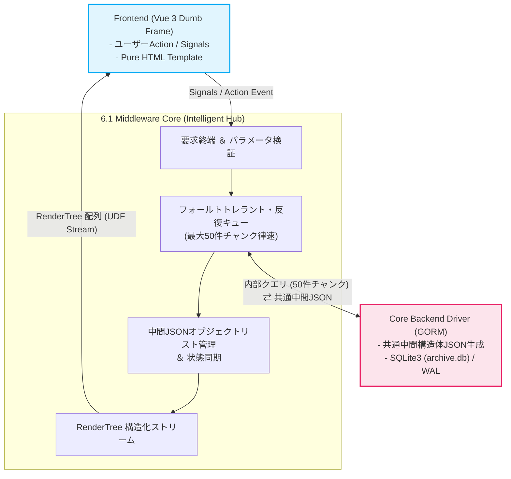

---

## 2. 入力パラメータ検証と要求解釈仕様
フロントエンドの Composable（`useTimeline.ts` 等）から発行されたデータ取得シグナルを受け取った際、ミドルウェアは直ちに以下の厳格な型安全バリデーションを実施し、不正なクエリを遮断します[cite: 4, 6]。

*   **`platform`（必須）**: プラグインディレクトリに実体が存在する有効な識別子（`"twitter"`, `"instagram"`, `"tiktok"` 等）であるかを検証[cite: 4, 8]。
*   **`account_id`（必須）**: 特定アカウントの `numeric_id`、または全アカウント統合を示す `"all"` であることを検証[cite: 4, 5]。
*   **`filter`（任意）**: `"all"`（全投稿）, `"reposts"`（転載のみ）, `"media"`（メディア付のみ）, `"bookmarks"`（いいね済）のいずれかに完全一致することを検証（デフォルト: `"all"`）[cite: 4, 5]。
*   **`limit`（任意）**: 要求件数を検証。フロントエンドから 50 件を超える要求があった場合でも、後述の反復キューエンジンによって安全に分割処理[cite: 4, 5]。
*   **`offset`（任意）**: `0` 以上の整数値であることを検証[cite: 4, 5]。

---

## 3. フォールトトレラント・反復キューエンジン（律速段階制御）
フロントエンドからの高速スクロールや一括取得要求に対して、ミドルウェアはバックエンドのメモリバーストおよびDBロックを防ぐため、**「フォールトトレラントな律速器（Rate-Limiting Step）」**として機能します[cite: 4, 5]。

### 1. 50件チャンク分割・反復取得アルゴリズム
バックエンド（Core Driver）のデータ抽出インターフェースは、1回の呼び出しにつき最大 `50` 件に制限されています[cite: 4, 5]。フロントエンドがそれ以上の件数（例: 150件）を要求した場合、ミドルウェア内部で以下の反復処理ループ（Iteration Loop）を自動実行します[cite: 4, 5]。

1.  **要求総数の算出**: フロントエンドが要求する目標件数 $N$（例: 150）と開始位置 $Offset$ を設定[cite: 4, 5]。
2.  **チャンククエリ発行**: $\min(N - \text{取得済件数}, 50)$ を 1 チャンクの取得サイズとしてバックエンドへ要求[cite: 4, 5]。
3.  **中間JSONの蓄積**: バックエンドから返却された共通中間構造体JSONの配列を受領し、ミドルウェアの内部バッファへ追記[cite: 4, 5, 8]。
4.  **終了判定**:
    *   取得済件数が目標件数 $N$ に達した時点で反復を終了[cite: 4, 5]。
    *   バックエンドからの返却件数が要求チャンクサイズ未満（DB枯渇 / EOF）となった場合、即座にループを脱出し、取得できた全件を確定[cite: 4, 5]。
5.  **非ブロッキング完遂**: バックエンドへのアクセスが完了するまで要求を握り潰すことなく安全に回収し、メモリバーストを物理的に防ぎながら要求を100%完遂[cite: 4]。

---

## 4. 共通中間構造体JSONの受容とリストライフサイクル統治
ミドルウェア層は、バックエンドの物理リレーショナル構造（SQLite3のテーブル・外部キー構成）に直接依存しません[cite: 5, 9]。

### 1. 共通中間構造体JSON（Unified Normalized JSON）の受容
バックエンドから渡されるデータは、スキーマが隠蔽・正規化された以下の共通中間形式のみです[cite: 5, 8]。

```json
[
  {
    "id": "1879382757924868404",
    "conversation_id": "1879382757924868404",
    "reply_to_id": null,
    "reply_to_handle": null,
    "created_at": "2026-08-17T12:00:00Z",
    "full_text": "Archival process completed! #memory",
    "lang": "en",
    "full_text_ja": "アーカイブ処理が完了しました！ #memory",
    "full_text_en": "Archival process completed! #memory",
    "full_text_zh": "归档处理完成！ #memory",
    "via": "Twitter for Web",
    "is_repost": false,
    "is_liked": true,
    "wayback_url": "https://web.archive.org/web/.../status/1879382757924868404",
    "account": {
      "numeric_id": "1234567890123456789",
      "username": "msluo14",
      "display_name": "Yike Luo",
      "avatar_url": "msluo14_avatar_001",
      "avatar_original_url": "https://pbs.twimg.com/profile_images/.../avatar.jpg"
    },
    "media": [
      {
        "media_id": "eb7ymRi-pfsx5FJH",
        "type": "video",
        "download_url": "https://video.twimg.com/.../eb7ymRi-pfsx5FJH.mp4",
        "width": 1920,
        "height": 1080,
        "download_status": "COMPLETED",
        "failed_reason": null,
        "stash_scene_id": "99b3a7a9-bf0c-4389-9a72-f19b8849646b",
        "stash_image_id": null
      }
    ]
  }
]
```

### 2. オブジェクトリスト管理とフロントエンド・シグナル状態同期
フロントエンド（Vue 3）はDOMの骨組み（HTMLフレーム）を提供するだけであり、画面に表示されている投稿オブジェクト群のライフサイクル（並び順、フィルタリング、動的更新）はミドルウェアが統括します[cite: 6]。

*   **リアクティブ状態同期**:
    フロントエンド上で「いいね（ブックマーク）」や「多言語トグル」などのアクションが発生した場合、Vue 3 シグナルを経由してミドルウェアへ通知されます[cite: 6]。
*   **オンメモリ・リストの更新**:
    ミドルウェアは保持している中間JSONオブジェクトリストの該当要素（`is_liked` や表示言語ステータス）を瞬時に書き換えます[cite: 6]。
*   **非破壊的な再生成**:
    リスト変更に伴い、次節（`6.2 Data Decorator`）の装飾パイプラインを即座に再適用して最新の `RenderTree` 配列を再構築し、フロントエンドへ一方向ストリーム配信します[cite: 4, 6]。

---

## 5. RenderTree への変換と UDF ストリーム供給
ミドルウェアコアは、整列・取得された共通中間構造体JSONリストを `Data Decorator` および `Plugin Orchestrator` へバトンタッチし、フロントエンドがそのままバインド可能な完全完成品である `RenderTree[]` を組み立てます[cite: 4, 6]。

*   **ゼロ・ロジック描画の保証**: フロントエンド側で文字列パース、リンク生成、メディアURLの組み立てなどの演算処理を一切行わせない構造を担保します[cite: 6]。
*   **単一データフロー（UDF）の遵守**: 完成した `RenderTree` 配列は、フロントエンドの Composable 層（State）へ向けて一方向のみに流し込まれ、Stateless Pure View のテンプレートへ宣言的に展開されます[cite: 6]。

---

[[← インデックス: 第3編第3章 ミドルウェア層 ポータル|part3_03_0_middleware_index]] | [[📚 目次 (Home)|Home]] | [[次の節: 3.2 Data & Skin Decorator →|part3_03_2_data_decorator]]

---


<!-- ================================================================= -->
<!-- SECTION 23: part3_03_2_data_decorator.md -->
<!-- ================================================================= -->

<div id="part3-03-2-data-decoratormd"></div>

# 📄 [23] part3_03_2_data_decorator.md

> *Source File: `part3_03_2_data_decorator.md`*

[[← 前の節: 3.1 Middleware Core Components|part3_03_1_middleware_core]] | [[📚 目次 (Home)|Home]] | [[次の節: 3.3 Job & Process Orchestrator →|part3_03_3_job_orchestrator]]

# 第3編 第3章.2：Data & Skin Decorator（描画データ装飾とスキン配信）

**プロジェクト名** : dozou_katanuki (Wails-Stash Hybrid "土蔵・型抜き" Multi-Format Local Archival System)  
**ドキュメントID** : SPEC-MIDDLEWARE-001-2  
**バージョン** : 4.0.0  
**作成日** : 2026-08-18  
**ステータス** : 正式仕様（Wails v2 キメラアーキテクチャ・プラグインインターフェース・Skin配信統合・ゼロレイテンシ純化）

---

## 1. 概要とプレゼンテーションリソース供給の責務
Data & Skin Decorator は、フロントエンドの一般View（タイムライン画面）が描画を行うために必要な「装飾済みデータ（`RenderTree`）」および「表示定義スキン（Layout / CSS / JS）」を一元的に供給するゲートウェイです[cite: 1]。

描画時の動的パースによるレイテンシ遅延を物理的に根絶するため、重たいテキスト装飾、短縮URL展開、多言語翻訳キャッシュの生成はすべて**「インポート／ミューテーション時（ドライバー層へのPOST時）」にディスパッチされて確定・永続化**されます[cite: 1]。フェッチ時のミドルウェアは、確定済みの構造体を $O(1)$ のゼロコストで `RenderTree` に詰め替えてフロントエンドへ流すだけのゼロレイテンシ供給を実現します[cite: 1]。

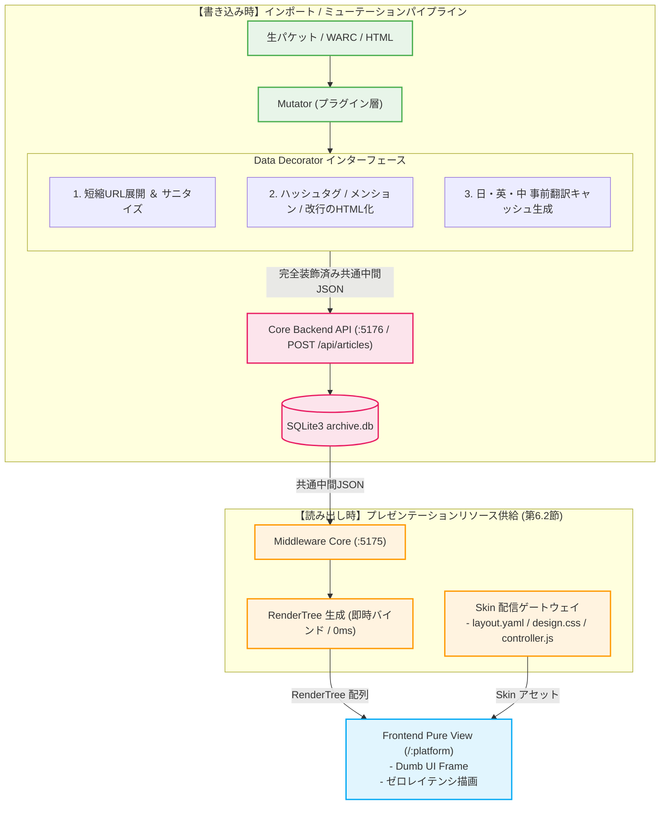

---

## 2. テキスト・短縮URL・HTMLリンク事前デコレーション規約
プラグイン層の Mutator は、共通中間構造体JSONを組み立てる段階で以下の装飾ルールを一括適用します[cite: 1]。フロントエンドでの実行時正規表現パースは一切禁止されます。

*   **短縮URL展開**: `url_redirects` 等の逆引き解決に基づき、テキスト内の短縮URL（`t.co` 等）を展開後の完全なURL文字列へ置換[cite: 1]。
*   **ハッシュタグのリンク化**:
    `#(\w+)` ➔ `<a href="/:platform/search?q=$1" class="hashtag-link">#$1</a>`[cite: 1]
*   **メンションのリンク化**:
    `@([a-zA-Z0-9_]+)` ➔ `<a href="/:platform/$1" class="mention-link">@$1</a>`[cite: 1]
*   **改行コードのDOM展開**:
    `\n` ➔ `<br/>` への安全なHTML展開コード化[cite: 1]。

---

## 3. 多言語事前翻訳キャッシュの確定と永続化
インポート時、Mutator 内のデコレータモジュールが日・英・中の 3 大言語翻訳を実行し、共通中間構造体JSONの `full_text_ja`, `full_text_en`, `full_text_zh` カラムに確定データとしてバインドします[cite: 1]。

```json
{
  "full_text": "Past log automatic archival test complete! #memory",
  "full_text_ja": "過去ログの自動アーカイブテスト完了！ <a href=\"/twitter/search?q=memory\" class=\"hashtag-link\">#memory</a>",
  "full_text_en": "Past log automatic archival test complete! <a href=\"/twitter/search?q=memory\" class=\"hashtag-link\">#memory</a>",
  "full_text_zh": "过去日志自动归档测试完成！ <a href=\"/twitter/search?q=memory\" class=\"hashtag-link\">#memory</a>"
}
```
[cite: 1]

*   **データベースへの書き込み**: Core API（`POST /api/articles`）経由でこれらを不変キャッシュとして永続化[cite: 1]。
*   **フロントエンドでのゼロレイテンシ切り替え**: フェッチ時に `RenderTree.content` ハッシュへそのままマップされるため、画面上での言語切り替えはネットワーク通信も再装飾も走らず、完全ローカルでミリ秒トグルされます[cite: 1]。

---

## 4. 仮想アバター解決 ＆ 露出隠蔽インターフェース
アバター画像の外部依存を遮断し、完全ローカル保全と過去ログの時代背景を再現するため、以下の世代管理ルールをインターフェースとして規定します[cite: 1]。

1.  **原本の保全（Mutator ➔ バックエンド）**:
    *   Pythonスクレイパーが実ファイルを `assets/` に保存し、生URL（`avatar_original_url`）と共にバックエンドへ送信。
2.  **世代キーの自動採番（バックエンド GORM）**:
    *   URL変更を検知した場合のみ `avatar_seq` をカウントアップし、仮想アバターキー `{username}_avatar_{seq:03d}`（例: `msluo14_avatar_002`）を決定して保存。
3.  **RenderTree への露出隠蔽バインド（ミドルウェアフェッチ時）**:
    *   フロントエンドへ渡す `RenderTree.author.avatar_url` には、完全相対パス **/assets/{platform}/{username}_avatar_{seq:03d}.jpg** のみをセットし、生URLはフロントから完全に隠蔽[cite: 1]。

---

## 5. メディア確保ライフサイクルとSVGフィラー指示の構造化
添付メディアの定常状態は Stash 登録済みの `COMPLETED` です。デコレータインターフェースは、メディアの確保状態（`download_status`）に応じて `RenderMedia` の構造をシンプルに確定させます。

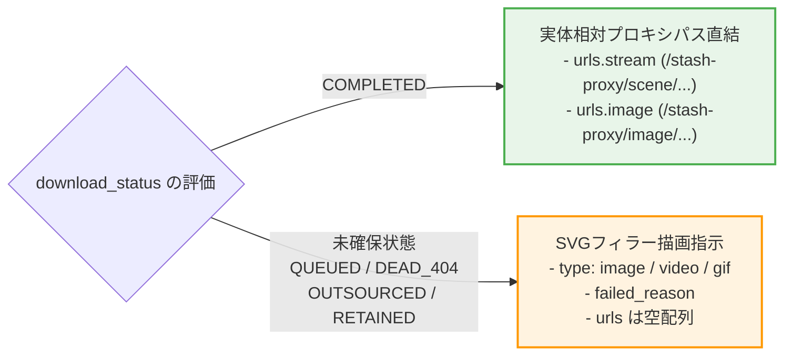

*   **定常状態（`COMPLETED`）**:
    *   Stash UUID に基づく完全相対パス（`/stash-proxy/...`）を `RenderMedia.urls` に直結[cite: 1]。
*   **未確保状態（`QUEUED`, `DEAD_404`, `OUTSOURCED`, `RETAINED`）**:
    *   実体 URL を空にし、メディア種別（`type`）とエラー理由（`failed_reason`）を指示情報として格納。フロントエンドはこれに基づき、カメラ・ビデオ・GIF を象った軽量 SVG プレースホルダーを宣言的に描画。

---

## 6. 中間JSONから RenderTree への即時転送規約（Go Renderer）
フェッチ時、ミドルウェア（Go）は既に装飾済みの共通中間構造体JSONを受け取り、パース処理を挟むことなく $O(1)$ で `RenderTree` に詰め替えて一方向（UDF）にストリームします[cite: 1]。

```go
package renderer

import (
	"fmt"
	"dozou_katanuki/middleware/models"
)

// ToRenderTree は装飾済みの中間JSONを即座に RenderTree へマッピングします (ゼロパース)
func ToRenderTree(item models.UnifiedNormalizedJSON, platform string) models.RenderTree {
	return models.RenderTree{
		ID:             item.ID,
		ConversationID: item.ConversationID,
		CreatedAt:      item.CreatedAt.Format("2006-01-02T15:04:05Z07:00"),
		Content: models.RenderContent{
			Original: item.FullText,   // インポート時にリンク化・サニタイズ完了済み
			JA:       item.FullTextJA, // インポート時に翻訳・リンク化完了済み
			EN:       item.FullTextEN,
			ZH:       item.FullTextZH,
		},
		Author: models.RenderAuthor{
			NumericID:   item.Account.NumericID,
			Handle:      item.Account.Username,
			DisplayName: item.Account.DisplayName,
			AvatarURL:   fmt.Sprintf("/assets/%s/%s.jpg", platform, item.Account.AvatarURL),
			Bio:         item.Account.Bio,
		},
		Media:     mapMediaToRenderMedia(item.Media),
		IsLiked:   item.IsLiked,
		SourceURL: item.WaybackURL,
	}
}
```

---

## 7. スキンアセット（Skin Delivery）配信ゲートウェイ
フロントシェルからの動的なスキン要求を受け、ミドルウェアは `plugins/{platform}/skin/` 直下のアセットを透過的にサーブします[cite: 1]。

*   **`GET /api/plugins/{platform}/skin/layout`**: `layout.yaml` を配信（コンポーネントの配置構成定義）[cite: 1]。
*   **`GET /api/plugins/{platform}/skin/design`**: `design.css` (MIME: `text/css`) を配信（プラットフォーム固有デザイン）[cite: 1]。
*   **`GET /api/plugins/{platform}/skin/controller`**: `skin/controller.js` (MIME: `application/javascript`) を配信（スレッド探索やカルーセル操作）[cite: 1]。

---

[[← 前の節: 3.1 Middleware Core Components|part3_03_1_middleware_core]] | [[📚 目次 (Home)|Home]] | [[次の節: 3.3 Job & Process Orchestrator →|part3_03_3_job_orchestrator]]

---


<!-- ================================================================= -->
<!-- SECTION 24: part3_03_3_job_orchestrator.md -->
<!-- ================================================================= -->

<div id="part3-03-3-job-orchestratormd"></div>

# 📄 [24] part3_03_3_job_orchestrator.md

> *Source File: `part3_03_3_job_orchestrator.md`*

[[← 前の節: 3.2 Data & Skin Decorator|part3_03_2_data_decorator]] | [[📚 目次 (Home)|Home]] | [[次の章: 第3編第4章：ドライバー層 →|part3_04_backend_driver]]

# 第3編 第3章.3：Job & Process Orchestrator（管理コンソール向け非同期ジョブ制御）

**プロジェクト名** : dozou_katanuki (Wails-Stash Hybrid "土蔵・型抜き" Multi-Format Local Archival System)  
**ドキュメントID** : SPEC-MIDDLEWARE-001-3  
**バージョン** : 4.0.0  
**作成日** : 2026-08-18  
**ステータス** : 正式仕様（Wails v2 キメラアーキテクチャ・管理コンソール専用・非同期サブプロセス制御純化）

---

## 1. 概要と管理コンソール（Admin Board）連携
Job & Process Orchestrator は、管理・設定画面（フロントエンド `/settings`）からの指示を受け、Python非常駐サイドカー（Scraper / Mutator / Downloader）を独立したOSサブプロセスとして安全に起動・監視する**管理専用ジョブエンジン**です[cite: 1, 3, 5]。

純粋なデータアクセスに徹するドライバー層（:5176）を保護し、ミドルウェア層が非同期実行、排他制御、標準出力スキャンを一元統治します[cite: 1, 5]。

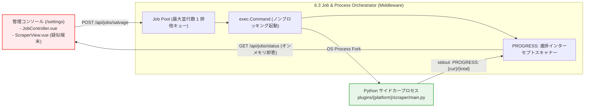

---

## 2. 非同期サブプロセス起動と排他制御仕様
多重実行によるCPU負荷バーストやネットワーク帯域のパンクを100%遮断するため、以下の制御規約を適用します[cite: 1, 5]。

*   **最大並行数 `1` の厳格なキュー管理**: 同時に起動できるPythonプロセスは常に1つに制限され、実行中の多重リクエストは拒絶またはキューイングされます[cite: 1, 5]。
*   **ノンブロッキング実行**:
    ```go
    // 独立したサブプロセスとしてノンブロッキング起動
    cmdPath := fmt.Sprintf("plugins/%s/scraper/main.py", platform)
    cmd := exec.CommandContext(ctx, "python", append([]string{cmdPath}, args...)...)

    stdoutPipe, err := cmd.StdoutPipe()
    if err != nil {
        return nil, err
    }
    if err := cmd.Start(); err != nil {
        return nil, err
    }
    go j.scanStdoutProgress(jobID, stdoutPipe, cmd)
    ```
  [cite: 1, 5]

---

## 3. stdout インターセプトスキャンと疑似ターミナル連携
Pythonプロセスが標準出力に出力する構造化文字列をインターセプトし、オンメモリで追跡します[cite: 1, 5]。

$$\text{PROGRESS: } \{\text{current\_index}\}/\{\text{total\_count}\} \mid \{\text{message}\}$$
*(例: `PROGRESS: 23/50 | Media ID eb7ymRi... Injected to Stash`)*[cite: 5]

*   **オンメモリ追跡**: `bufio.Scanner` でリアルタイムに進捗率（%）と最新メッセージをオンメモリに保持[cite: 1, 5]。
*   **管理コンソール（`ScraperView.vue`）即時応答**: フロントエンドのポーリング要求に対し、DBを介さずミリ秒で進捗ステータスを返却[cite: 1, 3, 5]。

---

## 4. 管理コンソール専用 API エンドポイント
*   **`POST /api/jobs/salvage`**: 自動サルベージジョブの非同期キック（入力: `platform`, `account`, `limit`）[cite: 5]。
*   **`POST /api/jobs/import-manual`**: 手動WARCインポートジョブの非同期キック（入力: `warc_path`, `offline`）[cite: 5]。
*   **`GET /api/jobs/status?id={job_id}`**: 進行中ジョブのリアルタイム進捗率・ステータス取得[cite: 5]。

---

[[← 前の節: 3.2 Data & Skin Decorator|part3_03_2_data_decorator]] | [[📚 目次 (Home)|Home]] | [[次の章: 第3編第4章：ドライバー層 →|part3_04_backend_driver]]

---


<!-- ================================================================= -->
<!-- SECTION 25: part3_04_backend_driver.md -->
<!-- ================================================================= -->

<div id="part3-04-backend-drivermd"></div>

# 📄 [25] part3_04_backend_driver.md

> *Source File: `part3_04_backend_driver.md`*

[[← 前の章: 第3編第3章：ミドルウェア層インデックス|part3_03_0_middleware_index]] | [[📚 目次 (Home)|Home]] | [[次の章: 第4編第1章：参考資料・技術文献・型定義カタログ・公式リンク集 →|part4_01_references_and_literature]]

# 第3編 第4章：ドライバー層（Core Backend Driver & Data Abstraction）

**プロジェクト名** : dozou_katanuki (Wails-Stash Hybrid "土蔵・型抜き" Multi-Format Local Archival System)  
**ドキュメントID** : SPEC-DRIVER-001  
**バージョン** : 4.0.0  
**作成日** : 2026-08-18  
**ステータス** : 正式仕様（GORMモデル完全一般化・多言語事前翻訳カラム・純粋ストレージドライバ純化）

---

## 4.1 ドライバー層の構造と役割・責務

ドライバー層（Core Backend Layer）は、ポート **:5176** (Core Backend API) で常時稼働する、Go製システムの中核データベースおよび物理メディアハンドラカプセル化レイヤーです [2, 3]。

本レイヤーは、データの永続化を担う **SQLite3（接続論理名: ArchiveDB、ファイル名: `archive.db`）** [4.1] および大容量バイナリ保全を担う **Stashapp**（:9999） [2.4] への低レベルな物理I/Oアクセスをカプセル化（抽象化）し、上位レイヤー（Middleware Hub :5175）および外部ツール（Pythonサイドカー）に対して型安全かつ一意なデータ書き込み/読み込みプロトコル（REST API 契約）を提供します [2, 14, 61]。

### 1. ドライバー層の主要な責務
*   **共通中間JSON (Unified Normalized JSON) の完全受入と冪等な一括登録 (POST /api/articles)** [61, 66]：
    *   Python非常駐サイドカー（Mutator）から `POST /api/articles` 経由で送信される共通中間表現JSONを完全にデシリアライズし、トランザクション整合性を担保して ArchiveDB へUpsert（更新・挿入）します [61, 66]。
*   **GORMによるデータモデル抽象化 (DBMSの完全隠蔽)** [61]：
    *   生SQLを排除したオブジェクトリレーショナルマッピング。GORMタグを用いて自動インデックス、外部キー制約、プリロード（Eager Loading）関係を型安全に統治します [61]。
*   **多言語事前翻訳テキストおよびオリジナル言語判定（lang）の永続化保管** [4.2]：
    *   インポート時にMutator側で翻訳された 3大主要言語（`full_text_ja`, `full_text_en`, `full_text_zh`）を、不変のキャッシュテキストとして物理カラムに安全に書き込み、保存します [4.2]。
*   **Stashapp UUID の自動紐付け（Reconciliation）と GORM 書き戻し** [15, 61]：
    *   メディアテーブルの `stash_scene_id` や `stash_image_id` を回収し、SQLite3 に書き戻すための自動バインドAPI（`POST /api/articles/bind-media`）の提供 [15, 61, 66]。

### 2. 厳格な禁止事項 (ハルシネーション・暴走防止)
*   **UIプレゼンテーション要素・表示用スキン仕様（layout.yaml）への一切の関与禁止** [23, 62]：
    *   ドライバー層は純粋な「データアクセス（GORM / I/O）」に100%徹する必要があります [23, 62]。各SNS固有の表示レイアウトのパースや、スキンプラグインの配信エンドポイント、フロント用描画状態（CSS/JS）の制御を行ってはなりません [23, 62]。これらはすべて第2層（Middleware Hub）の責務です [23, 62]。
*   **CORSリバースプロキシ中継仕様（ポート :9998）の完全排除（第6章へ移管）** [68]：
    *   以前の設計でドライバー層に含まれていた、Stashappからのメディアストリームや画像をブラウザへ透過中継する「リバースプロキシ（:9998）」は、システム全体の実行制御を統治する **Go Middleware (:5175) 内の「Stash Side Loader」として完全移管・一元化されました** [68]。
    *   本レイヤーがプロキシルーティング、CORS回避ヘッダーの付与、または動画ストリームの中継制御に関与することは一切禁止（パージ）します [23]。
*   **フロントエンドとの直接通信の禁止** [62]：
    *   フロントエンド（Dumb UI :5173）が、ミドルウェア（:5175）を介さずにこのポート :5176 へ直接アクセスすることは厳禁です [62]。フロントからのクエリは必ずミドルウェア（:5175）を経由して一方向データフロー（UDF）に則って安全に中継・変換（RenderTree）されます [62, 131]。

---

## 4.2 データベース書き込み(POST)トランザクション ＆ リレーション解決シーケンス

Python非常駐サイドカーの Mutator が、解析および多言語事前翻訳に成功した共通中間JSONを `POST /api/articles` に送信した際の、Core Backend (:5176) 内部のトランザクションシーケンスを以下に示します [63, 66]。

```mermaid
sequenceDiagram
    autonumber
    participant Mutator as Python Mutator
    participant CoreAPI as Go Core API (:5176)
    participant DB as SQLite3 (archive.db)

    Note over Mutator, CoreAPI: 1. 共通中間表現JSON (多言語付) をPOST
    Mutator->+CoreAPI: POST /api/articles (UnifiedNormalizedJSON)
    
    Note over CoreAPI, DB: 2. DBトランザクション開始
    CoreAPI->+DB: BEGIN TRANSACTION

    Note over CoreAPI, DB: 3. アカウントUpsert & 3桁アバター世代監査
    CoreAPI->DB: Select Account by numeric_id
    alt 新規アカウント または アバターURLが異なる
        CoreAPI->DB: Upsert Account & Insert AccountProfileHistory (seq+1)
        Note over CoreAPI: アバター世代キーを自動カウント<br/>例: msluo14_avatar_002
    else 変更なし
        CoreAPI->DB: 既存レコードの最終観測日時を更新
    end

    Note over CoreAPI, DB: 4. 記事本体 (Article) の Upsert (冪等)
    Note over CoreAPI: オリジナル + 多言語翻訳テキスト<br/>(ja, en, zh) を一括保存
    CoreAPI->DB: Upsert Article (id, created_at, full_text, full_text_ja, full_text_en, full_text_zh)

    Note over CoreAPI, DB: 5. メディアおよび初期ステータス登録
    loop メディア添付数 [0〜4枚]
        CoreAPI->DB: Upsert Media (media_id, type, download_url, status = 'QUEUED')
    end

    Note over CoreAPI, DB: 6. トランザクションコミット
    DB-->>-CoreAPI: COMMIT SUCCESS
    CoreAPI-->>-Mutator: 200 OK (Mutation Complete)
```

---

## 4.3 GORM モデル定義 (GORM Models Schema & Structs)

データベース `archive.db` と完全マッピングされ、GORMによる自動マイグレーションに対応した、型安全なGo構造体定義です [2, 14, 105]。

```go
package models

import (
	"database/sql"
	"time"
)

// Account represents accounts table (SSOT Profile Raw Data)
type Account struct {
	NumericID   string    `gorm:"primaryKey;column:numeric_id;type:text"`
	Username    string    `gorm:"index;column:username;type:text;not null"`
	DisplayName string    `gorm:"column:display_name;type:text;not null"`
	AvatarURL   string    `gorm:"column:avatar_url;type:text;not null"` // オリジナルの本家生URL
	UpdatedAt   time.Time `gorm:"column:updated_at;type:datetime;not null"`
	
	// Relationships
	ProfileHistory []AccountProfileHistory `gorm:"foreignKey:AccountID;references:NumericID"`
	Articles       []Article               `gorm:"foreignKey:AccountID;references:NumericID"`
}

// AccountProfileHistory represents account_profile_history table
type AccountProfileHistory struct {
	ID               uint      `gorm:"primaryKey;autoIncrement;column:id"`
	AccountID        string    `gorm:"index;column:account_id;type:text;not null"`
	DisplayName      string    `gorm:"column:display_name;type:text;not null"`
	AvatarOriginalURL string    `gorm:"column:avatar_original_url;type:text;not null"` // その世代のオリジナルアバター生URL
	AvatarSeq        int       `gorm:"column:avatar_seq;type:integer;not null"`        // 3桁世代キーのシリアル値 (1, 2, 3...)
	AvatarVirtualKey string    `gorm:"column:avatar_virtual_key;type:text;not null"`  // 解決済みキー (msluo14_avatar_001)
	ObservedAt       time.Time `gorm:"column:observed_at;type:datetime;not null"`
}

// Article represents articles table (Generic Timeline Item Specification)
type Article struct {
	ID             string         `gorm:"primaryKey;column:id;type:text"`
	AccountID      string         `gorm:"index;column:account_id;type:text;not null"`
	ConversationID string         `gorm:"index;column:conversation_id;type:text;not null"`
	ReplyToID      sql.NullString `gorm:"column:reply_to_id;type:text"`                // 返信先（親）アセットID
	ReplyToHandle  sql.NullString `gorm:"column:reply_to_handle;type:text"`            // 返信先（親）ハンドル名 (@スクリーンネーム)
	CreatedAt      time.Time      `gorm:"index;column:created_at;type:datetime;not null"`
	FullText       string         `gorm:"column:full_text;type:text;not null"`         // オリジナル原本本文
	Lang           string         `gorm:"column:lang;type:text;not null;default:'ja'"` // 元のオリジナル言語コード
	FullTextJA     sql.NullString `gorm:"column:full_text_ja;type:text"`               // 【キャッシュ】日本語訳本文
	FullTextEN     sql.NullString `gorm:"column:full_text_en;type:text"`               // 【キャッシュ】英語訳本文
	FullTextZH     sql.NullString `gorm:"column:full_text_zh;type:text"`               // 【キャッシュ】中国語訳本文
	Via            string         `gorm:"column:via;type:text;not null"`
	IsRepost       bool           `gorm:"column:is_repost;type:boolean;not null;default:false"` // 転載・リポストフラグ
	IsLiked        bool           `gorm:"index;column:is_liked;type:boolean;not null;default:false"` // ブックマーク（お気に入り）フラグ
	WaybackURL     string         `gorm:"column:wayback_url;type:text;not null"`

	// Relationships
	Account Account `gorm:"foreignKey:AccountID;references:NumericID"`
	Media   []Media `gorm:"foreignKey:ArticleID;references:ID"`
}

// Media represents media table (Stashapp Mapping and 3-Stage Recovery status)
type Media struct {
	MediaID        string         `gorm:"primaryKey;column:media_id;type:text"` // URL BaseName (eb7ymRi-pfsx5FJH)
	ArticleID      string         `gorm:"index;column:article_id;type:text;not null"`
	Type           string         `gorm:"column:type;type:text;not null"` // "image" | "video" | "gif"
	DownloadURL    string         `gorm:"column:download_url;type:text;not null"` // オリジナルメディアURL
	Width          int            `gorm:"column:width;type:integer;not null"`
	Height         int            `gorm:"column:height;type:integer;not null"`
	DownloadStatus string         `gorm:"column:download_status;type:text;not null;default:'QUEUED'"` // QUEUED | COMPLETED | DEAD_404 | OUTSOURCED | RETAINED
	FailedReason   sql.NullString `gorm:"column:failed_reason;type:text"`             // 失敗時のエラー原因テキスト
	StashSceneID   sql.NullString `gorm:"uniqueIndex;column:stash_scene_id;type:text"` // Stash Scene UUID (動画)
	StashImageID   sql.NullString `gorm:"uniqueIndex;column:stash_image_id;type:text"` // Stash Image UUID (静止画)
}

// UrlRedirect represents url_redirects table (Short URL resolution mapping)
type UrlRedirect struct {
	ShortURL    string `gorm:"primaryKey;column:short_url;type:text"`
	ExpandedURL string `gorm:"column:expanded_url;type:text;not null"`
	ArticleID   string `gorm:"index;column:article_id;type:text;not null"`
}

// Whitelist represents whitelist table
type Whitelist struct {
	ID       uint   `gorm:"primaryKey;autoIncrement;column:id"`
	Type     string `gorm:"column:type;type:text;not null"`             // "account" | "keyword"
	Value    string `gorm:"uniqueIndex;column:value;type:text;not null"` // アカウントスクリーンネーム
	IsActive bool   `gorm:"column:is_active;type:boolean;not null;default:true"`
}
```

---

## 4.4 アバター保全 ＆ 3桁ナンバリング世代管理ロジック

本システムでは、外部SNSサーバーの凍結や削除、ネットワーク非接続状態（オフライン）でもアバター画像が「破れたイメージ」として非表示になるのを防ぐため、**「アバター保全・3桁ナンバリング世代管理（Avatar Gen Resolution）」**をバックエンドGORMモデル層において監査・解決します [46, 86]。

### 1. 新規インポート(POST)時の世代判定と自動ナンバリング
`POST /api/articles` のトランザクション中、GORMフックまたはCRUDメソッド（`article.go`）において以下のアバター履歴の比較監査を自動実行します [64, 66]。

*   **監査フロー**:
    1. 送信された共通中間JSON内のアバターオリジナルURL（`account.avatar_url`）を取得します [64]。
    2. SQLite3 の `account_profile_history` から該当アカウントの最大 `avatar_seq` を検索します [64]。
    3.  **判定**:
        *   履歴が全く存在しない場合、または最後の履歴に記録された `avatar_url` と今回のURLが異なる場合：
            *   ➔ **新世代のアバターとして検知！**
            *   ➔ 最大 `avatar_seq` + 1（初回は `1`）を採番します [64]。
            *   ➔ `avatar_seq` を用いて、Goバックエンド内部で**「仮想アバター世代キー（`{username}_avatar_{seq:03d}`）」**を解決・決定します（例: `msluo14_avatar_002`） [46, 64, 86]。
            *   ➔ `AccountProfileHistory` テーブルに、最新の `DisplayName`、オリジナルの `AvatarURL`、決定された `AvatarSeq`（数値型）、および現在日時を不変の履歴レコードとして追加保存します [64, 81, 86]。
        *   アバターURLが前回の記録と完全に一致する場合：
            *   ➔ 履歴レコードは追加せず、最終観測日時（`Account.UpdatedAt`）のみを更新します [64]。

### 2. データフェッチ(GET)時の仮想アバターキーの解決
ミドルウェア（Go :5175）または管理画面が `GET /api/account` や `GET /api/articles` を呼び出した際、バックエンド（Core Backend）は Account 構造体に対して、以下のロジックでアバター表示用キーを自動解決して返却します [65]。

*   **Go解決コード（イメージ）**:
    ```go
    // GetLatestAvatarKey はアカウントの最新アバター世代キーを解決して返します
    func (a *Account) GetLatestAvatarKey(db *gorm.DB) string {
        var latestHistory AccountProfileHistory
        // 該当アカウントの最新履歴を取得
        err := db.Where("account_id = ?", a.NumericID).Order("avatar_seq DESC").First(&latestHistory).Error
        if err != nil {
            // 万が一履歴がない場合はフォールバックとしてseq=1で解決
            return fmt.Sprintf("%s_avatar_001", a.Username)
        }
        return fmt.Sprintf("%s_avatar_%03d", a.Username, latestHistory.AvatarSeq)
    }
    ```
*   **返却されるJSON**:
    *   本APIが上位レイヤー（Middleware Hub）へ返すアカウント情報のJSONレスポンスにおいて、生の `https://pbs.twimg.com/...` などのオリジナルアバターURLは `avatar_original_url` に退避（基礎データとして保全）されます [65]。
    *   表示に利用される `avatar_url` プロパティには、上記メソッドで動的に解決された **`{username}_avatar_{seq:03d}`** のみが安全にセットされて応答されます [65]。

---

## 4.5 API エンドポイント詳細仕様

### 1. POST /api/articles (共通中間JSONの書き込み・Upsert)
Python非常駐サイドカー（Mutator）または手動WARCインポートバッチが、共通中間JSONをデータベースに冪等にUpsert登録するための書き込み専用エンドポイントです [66]。
*   **Method**: `POST`
*   **URI**: `/api/articles`
*   **認証**: 不要（ローカルホスト完結）
*   **リクエスト JSON**: 共通中間JSON形式 (Unified Normalized JSON)
*   **内部トランザクション処理ルール**:
    1. 送信された `account` 情報をもとに、`accounts` テーブルへ Upsert を試みます。このとき、アバターURLが変更されていた場合は自動で `account_profile_history` の `avatar_seq` をカウントアップして挿入します [64, 66]。
    2. `post` 情報をもとに、`articles` テーブルへ Upsert（挿入、存在する場合は無視または更新）を実行します [66, 81]。
    3. `media` リストを展開し、`media_id`（URL BaseName）を主キーとして `media` テーブルへ Upsert を実行します [66, 81]。Stash ID（`stash_scene_id` / `stash_image_id`）が既に含まれる場合はリレーションIDの書き戻しを実施します [66]。
*   **レスポンス JSON (200 OK)**:
    ```json
    {
      "status": "success",
      "message": "Mutation completed successfully",
      "article_id": "1879382757924868404",
      "media_processed": 1
    }
    ```

### 2. GET /api/articles (投稿タイムライン取得 - ページネーション)
特定アカウントまたは統合タイムライン（`all`）の投稿を、指定されたフィルタ条件と Limit/Offset に基づいて時系列に高速取得します [67]。
*   **Method**: `GET`
*   **URI**: `/api/articles`
*   **リクエストパラメータ**:

| パラメータ名 | 型 | 必須 | デフォルト値 | 説明 |
| ------ | ------ | ------ | ------ | ------ |
| `account_id` | string | **必須** | - | アカウントID（numeric_id）または `"all"`（統合タイムライン） |
| `filter` | string | 任意 | `"all"` | `"all"` (通常), `"reposts"` (旧RTのみ), `"media"` (メディア付のみ), `"bookmarks"` (いいねした投稿のみ) |
| `limit` | int | 任意 | `50` | 最大取得件数（最大50） |
| `offset` | int | 任意 | `0` | ページネーション開始位置（オフセット） |

*   **データベース最適化クエリ (GORM)**:
    ```go
    // GORMクエリの構築例
    query := db.Model(&models.Article{}).Preload("Account").Preload("Media").Order("created_at DESC")
    if accountID != "all" {
        query = query.Where("account_id = ?", accountID)
    }
    switch filter {
    case "reposts":
        query = query.Where("is_repost = ?", true)
    case "media":
        query = query.Joins("JOIN media ON media.article_id = articles.id").Group("articles.id")
    case "bookmarks":
        query = query.Where("is_liked = ?", true)
    }
    var articles []models.Article
    err := query.Limit(limit).Offset(offset).Find(&articles).Error
    ```
*   **レスポンス JSON スキーマ (200 OK)**:
    ```json
    [
      {
        "id": "1879382757924868404",
        "conversation_id": "1879382757924868404",
        "reply_to_id": null,
        "reply_to_handle": null,
        "created_at": "2026-08-17T12:00:00Z",
        "full_text": "Past log automatic archival test complete! #memory",
        "lang": "en",
        "full_text_ja": "過去ログの自動アーカイブテスト完了！ #memory",
        "full_text_en": "Past log automatic archival test complete! #memory",
        "full_text_zh": "过去日志自动归档测试完成！ #memory",
        "via": "Twitter for Web",
        "is_repost": false,
        "is_liked": true,
        "wayback_url": "https://web.archive.org/web/.../https://twitter.com/msluo14/status/1879382757924868404",
        "account": {
          "numeric_id": "1234567890123456789",
          "username": "msluo14",
          "display_name": "Yike Luo",
          "avatar_original_url": "https://pbs.twimg.com/profile_images/9Kx_8Y7z_400x400.jpg",
          "avatar_url": "msluo14_avatar_001"
        },
        "media": [
          {
            "media_id": "eb7ymRi-pfsx5FJH",
            "type": "video",
            "download_url": "https://video.twimg.com/ext_tw_video/.../eb7ymRi-pfsx5FJH.mp4",
            "width": 1920,
            "height": 1080,
            "download_status": "COMPLETED",
            "failed_reason": null,
            "stash_scene_id": "99b3a7a9-bf0c-4389-9a72-f19b8849646b",
            "stash_image_id": null
          }
        ]
      }
    ]
    ```

### 3. GET /api/account (単一アカウント詳細取得)
指定された numeric_id のアカウントプロフィール情報を取得します。`account_profile_history` の最新観測レコード（表示名やBioなど）が自動でマージ解決されます [42, 68]。
*   **Method**: `GET`
*   **URI**: `/api/account`
*   **パラメータ**: `id={numeric_id}` (必須)
*   **レスポンス JSON (200 OK)**:
    ```json
    {
      "numeric_id": "1234567890123456789",
      "username": "msluo14",
      "display_name": "Yike Luo",
      "avatar_url": "msluo14_avatar_001",
      "avatar_original_url": "https://pbs.twimg.com/profile_images/9Kx_8Y7z_400x400.jpg",
      "bio": "デジタルアーカイブと宣言型UIを好むエンジニア。",
      "updated_at": "2026-08-17T15:58:27Z"
    }
    ```

---

[[← 前の章: 第3編第3章：ミドルウェア層インデックス|part3_03_0_middleware_index]] | [[📚 目次 (Home)|Home]] | [[次の章: 第4編第1章：参考資料・技術文献・型定義カタログ・公式リンク集 →|part4_01_references_and_literature]]

---


<!-- ================================================================= -->
<!-- SECTION 26: part4_01_references_and_literature.md -->
<!-- ================================================================= -->

<div id="part4-01-references-and-literaturemd"></div>

# 📄 [26] part4_01_references_and_literature.md

> *Source File: `part4_01_references_and_literature.md`*

[[← 前の章: 第3編第4章：ドライバー層|part3_04_backend_driver]] | [[📚 目次 (Home)|Home]] | [[DocWiki ポータルへ戻る →|Home]]

# 第4編 第1章：参考資料・技術文献・型定義カタログ・公式リンク集

**プロジェクト名** : dozou_katanuki (Wails-Stash Hybrid "土蔵・型抜き" Multi-Format Local Archival System)  
**ドキュメントID** : SPEC-REFERENCE-001  
**バージョン** : 4.0.0  
**作成日** : 2026-08-18  
**ステータス** : 正式仕様（パラダイム・規約・言語・モジュール・外部アプリ・Webサービス一元技術カタログ化）

---

## 1.1 プログラミングパラダイム (Programming Paradigms)

本システムは、ローカル環境ならではのゼロ遅延（ゼロレイテンシ）表示 [1.2] と、外部SNSの凍結やAPI閉鎖に対する「極限のデータ永続性」 [1.1] を両立させるため、以下の4つの高度なプログラミングパラダイムをソースコード全体に強制適用します。

### 1. 宣言型UI (Declarative UI) [3.2.1]
*   **概念** : 「どうDOMを操作するか（命令型）」ではなく、「データがこの状態であれば、画面はこう描画されるべきである（宣言型）」という関係性を記述します [3.2.1, 5.1.1]。
*   **適用** : フロントエンド（Vue 3.5 / `:5173`）のすべての View コンポーネントは、ミドルウェアから受領した `RenderTree` [5.3] をそのままPropsバインドして描画するだけの **Dumb Component（愚かなUI）** とします [3.2.1, 5.1.1]。
*   **効果** : 表示条件の複雑なSNSフィードであっても、コードが100%予測可能になり、描画ラグやバグを根絶します [5.1.1, 5.5.2]。

### 2. 単一データフロー (Unidirectional Data Flow / UDF) [3.2.2]
*   **概念** : データが一方向（Top-to-Bottom）にのみ流れるようにデータフローを制限します [3.2.2, 5.1.3]。
*   **適用** : **[Go Middleware Hub (:5175)] ➔ [Composable (State) :5173] ➔ [View (Props)]** の流れを絶対に遵守します [5.1.3]。下流コンポーネントが Props やグローバル状態を直接書き換える「双方向データバインディングによる暗黙の状態破壊」は厳格に禁止されます [3.2.1, 5.1.3]。
*   **効果** : 状態変更のトリガー（イベント）が常に明確になり、大規模なタイムライン展開でもバグの追跡が容易になります [5.1.3, 139]。

### 3. リアクティブシグナル (Signals-based Reactivity) [5.1.2]
*   **概念** : データの変更を極めて細粒度な「値そのもの」で追跡し、変更が発生した対象UIエレメントのみをピンポイントで高速に自動更新します [5.1.2, 138]。
*   **適用** : Vue 3 Composition API の `ref` / `reactive` / `computed` をシグナルとして活用。タイムラインで「いいね」を押した際、関係するカード（コンポーネント）の状態のみをミリ秒でピンポイント描画します [5.1.2, 140]。
*   **効果** : 画面全体の不必要な再描画や、仮想DOMの差分計算によるCPU負荷を完全に回避します [138, 140]。

### 4. Unixデバイスドライバ思想 (Unix Device Driver Paradigm) [9.1.2]
*   **概念** : ハードウェア（永続ストレージ）に低レベルI/Oを行うドライバと、それらを統治・オーケストレーションする制御層（カーネル/ミドルウェア）の責務を100%分離します [9.1.2]。
*   **適用** :
    *   **Driver層（Core Backend :5176）** : SQLite3 への GORM アクセスおよび Stashapp の UUID バインドに特化した「純粋なデバイスドライバ」 [9.1.2, 9.3]。
    *   **Middleware層（Go :5175）** : Pythonサイドカーの直接起動、進捗監視、アセット解決を担う「ファームウェア/カーネル」 [9.1.2]。
*   **効果** : データベース構造と表示用スキンが互いに汚染し合うのを物理的に防ぎます [9.1.2, 9.3]。

--------------------------------------------------------------------------------

## 1.2 厳格なコーディング規約 (Coding Standards & Constraints)

AIエージェントによるハルシネーション（暴走・デグレード）を100%防止し、人間開発者との円滑な協調を実現するため、以下の 5大規約をソースコードに対して強制適用します。

1.  **「1ファイル 100行以下」ルール (Strict 100-Line Limit)** [3.1]
    *   Go, TypeScript, Vue SFC, Python のすべてのファイルは、空行を含めて **100行以下** を絶対の上限制約とします [3.1]。
    *   これを超過しそうな場合、機械的に「CSSの Tailwind インライン化」「純粋関数の utils 逃がし」「Composable への状態分離」「Dumb UIコンポーネント分割」を徹底します [3.1.2]。
2.  **同階層3点セット原則 (Same Source, Same Flow / SSOT)** [3.3.1]
    *   起動・運用時は、ルート直下の **「実行バイナリ (dozo_katanuki.exe)」「実DB (archive.db)」「一元設定 (config.json)」** の3点セットのみを唯一のマスター（SSOT）とします [1.4, 3.3.1]。絶対パス依存やデータベースの散逸を禁止します [3.3.1]。
3.  **公開・閉塞IPバインドの完全分離 (IP Security Binding)** [3.3.2]
    *   外部（スマートフォン等）からの接続を受け付ける `:5173` (UI) および `:5175` (Middleware) は `0.0.0.0`（public）でバインド [3.3.2]。
    *   データベースCRUDを担う `:5176` (Core API) および `:9998` (Proxy)、`:9999` (Stashapp) は `127.0.0.1`（loopback）に強制バインドし、外部からの不正操作を物理的に遮断します [3.3.2]。
4.  **安全データパージ・ゴミ箱退避原則 (Safe Data Purging & File Removal)** [3.3.4]
    *   開発および運用時、不要ファイル・アセットの削除時は `rm` などの完全破壊的コマンドを禁止。OSのゴミ箱への移動を仲介するか、`.bak` などの一時退避を徹底します [3.3.4]。
5.  **start.bat 一元起動によるゾンビプロセス撲滅** [3.3.5]
    *   個別の手動起動を禁止。必ず `start.bat` をキックし、前回の残存ゾンビプロセスを強制キル（ゾンビキル）したのち、クリーンに各サービスを一括起動させます [3.3.5]。

--------------------------------------------------------------------------------

## 1.3 採用プログラミング言語 (Programming Languages)

本システムは、各レイヤーの特性と動作スタック（同期/常時稼働/非同期）の最適性を踏まえ、以下の3言語を適材適所で組み合わせて構築します。

| 言語 | 採用レイヤー | 動作特性 | 採用の技術的意義 |
| ------ | ------ | ------ | ------ |
| **Go 1.22+** | Middleware (:5175) <br>Core Backend (:5176) | 同期・常時稼働 <br>単一バイナリ | シングルバイナリパッキング、極めて高速な並行処理（Goroutine）、GORMによるDBMSの完全カプセル化、および低消費メモリ [1.2, 2.5]。 |
| **TypeScript / JS (ES6+)** | Frontend (:5173) <br>Skin Controllers | 宣言型UI <br>シグナルベース | 静的な型安全性の担保、Vue 3.5 との完全密着、およびプラガブル UI における `SkinController` インターフェースの整合契約 [1.2, 5.4]。 |
| **Python 3.10+** | Salvage Sidecar | オンデマンド起動 <br>非常駐スクリプト | 豊富なスクレイピング（CDX/WARC）ライブラリ、Stashインジェクション用 GraphQL API 処理の記述容易性、およびバッチバースト特性の最大化 [1.2, 2.4.2]。 |
| **YAML** | Skin Layouts (`layout.yaml`) | 設定・定義宣言 | JSON Schema (Draft 7) に完全準拠した、人間・AIエージェント双方に最も可読性の高いレイアウト設計図の宣言形式 [9.3]。 |
| **CSS3 (Tailwind)** | Skin Styles (`design.css`) | 宣言的装飾 | コンポーネントに個別の `<style>` を持たせないための、グローバルかつスコーププレフィックス付きスタイル定義 [3.1.2, 9.2]。 |

--------------------------------------------------------------------------------

## 1.4 採用モジュール・ライブラリ (Key Modules & Libraries)

「1ファイル100行以下」のルールを守りつつ、自作すると複雑化する処理を完全に外部委託するために、厳選された以下のコアライブラリをバンドル・ロードします。

### 1. Go (Middleware / Core API 側)
*   **GORM v2** (`gorm.io/gorm`, `gorm.io/driver/sqlite`) [2.5]
    *   生SQLの作成を100%禁止し、型安全なデータ構造（GORM Structs）から SQLite3 スキーマへの自動展開（AutoMigrate）を管理 [2.5, 7.1.1]。
*   **Go net/http & httputil**
    *   ミドルウェア内の「Stash Side Loader (:9998)」における、CORS許可ヘッダーをオーバーライド注入する透過プロキシハンドラの構築。

### 2. Frontend (Vue 3 側)
*   **hls.js** & **plyr** [5.7.1]
    *   Stashapp（:9999）がトランスコードする HLS ストリーム（m3u8）をブラウザ側CORSをバイパスしてゼロラグ再生する、最強のカスタムビデオプレイヤーコンポーネント。
*   **lucide-vue-next** [5.7.3]
    *   Vue の Tree Shaking 機能を100%効かせ、バンドルサイズを極限まで軽量化しつつ、SVGアイコン（Camera, Play, Loop 等）をインラインで Dumb 描画。
*   **lodash-es** (`get`) [5.7.4]
    *   `layout.yaml` に基づいて `RenderTree` からネストされたデータを安全に（ゼロポインタ・バグを回避して）動的走査・バインドするための必須ヘルパー。
*   **js-yaml** [5.7.4]
    *   ミドルウェアから配信された `layout.yaml` のテキストを、フロント側で瞬時に型安全な JSON オブジェクトへパース・デシリアライズする軽量ライブラリ。

### 3. Python (Salvage Sidecar 側)
*   **warcio** [2.2.3]
    *   Wayback Machineからのフェッチ時、HTTPリクエスト/レスポンスパケットを1ビットも改ざんせずに、一期一会の原本証明として圧縮コンテナ `.warc.gz` へストリーム同時キャプチャ保存。
*   **requests**
    *   Wayback CDX APIのスキャン、および3段階メディア確保における最初期の HTTP 直接 GET ストリーミングアタック。
*   **gql** (Python GraphQL Client) [2.4.2]
    *   破損チェック（ハッシュ整合）をクリアした本編メディア実ファイルを Stashapp メディアサーバーにインジェクションし、UUID（ stash_id ）を回収するための GraphQL 通信処理。

--------------------------------------------------------------------------------

## 1.5 外部連携アプリケーション (External Applications)

本システムは、データの重複排除や大容量トランスコード、マルチセッションの高速ダウンロードを自作して車輪の再発明（肥大化・バグ）を招くのを防ぐため、以下の2つの実績ある外部オープンソースアプリを完全に「物理接続エンジン（ヘッドレス）」として協調させます。

### 1. Stashapp Media Server (Port 9999 / Loopback 閉塞) [2.4, 3.3.2]
*   **役割** : 大容量の動画（H.264/H.265/VP9等）や静止画アセットの重複排除（OSHash / Perceptual Hash 照合） [2.4.1]、マルチビットレート HLS への自動トランスコード、および HLS ストリーミング配信 [2.4.1]。
*   **境界** : UIは一切露出させず、Python（Downloader）からの GraphQL API 経由でのインジェクションおよび、ミドルウェア（Stash Side Loader :9998）経由での透過プロキシ配信にのみ徹せさせます [2.4, 6.2]。

### 2. Motrix / Aria2 JSON-RPC (Port 6800 / Loopback 閉塞) [2.3, 3.3.2]
*   **役割** : 3段階メディア確保における「外部外注（OUTSOURCED）」の受け皿。コマンドライン型マルチセッション・高速ダウンローダ Aria2 を内蔵。
*   **境界** : 127.0.0.1:6800 の WebSocket/HTTP JSON-RPC を通じて `aria2.addUri` 委託タスクを発行。マルチスレッドでの爆速並列ロード、および途中で中断されたダウンロードの自動レジューム（再開）を外部に完全オフロードします [2.3.1]。

--------------------------------------------------------------------------------

## 1.6 外部連携Webサービス (Web Services)

1.  **Internet Archive Wayback Machine** [2.2]
    *   **CDX Server API** : 対象アカウントのすべての投稿ID（PostID）と過去のアーカイブスナップショット「タイムスタンプ」を  $O(N)$  で一括走査 [2.2.1]。
    *   **Memento Protocol (RFC 7089)** : 投稿日時に最も近い（時刻誤差が最小の）メディアアセットやHTMLキャッシュを特定するための時間折協（Time Negotiation）プロトコル [2.2.2]。
2.  **Google / DeepL 翻訳 API** [6.3.3]
    *   **適用** : インポート時の Python Mutator フェーズにおいて、1ポストごとに1.5秒以上のスリープ（`time.sleep`）と指数バックオフを伴う厳格な throttling（流量制御）を効かせながら「礼儀正しく」1回限りキック [10.2.1, 10.3.1]。
    *   **役割** : データベースの `articles` テーブルに `full_text_ja/en/zh` の 3大主要言語テキストを事前キャッシュ保存し、フロントエンドでの完全オフライン・ミリ秒言語トグル表示を成立させます [4.2, 5.6.3]。

--------------------------------------------------------------------------------

## 1.7 公式ドキュメント・リンク集 (Official Documentation)

> プロジェクトで採用した技術の公式ドキュメントを一覧にまとめています。
> バージョン固有の情報はリンク先で最新情報を確認してください。

### 🟦 プログラミング言語 (Languages)

| 技術 | バージョン | 公式リンク |
| ------ | ------ | ------ |
| **Go** | 1.22+ | [go.dev/doc](https://go.dev/doc/) |
| **Go — net/http パッケージ** | stdlib | [pkg.go.dev/net/http](https://pkg.go.dev/net/http) |
| **TypeScript** | 5.x | [typescriptlang.org/docs](https://www.typescriptlang.org/docs/) |
| **Python** | 3.10+ | [docs.python.org/3](https://docs.python.org/3/) |
| **SQLite3** | 3.x | [sqlite.org/docs](https://www.sqlite.org/docs.html) |

---

### 🟩 フロントエンド (Frontend)

| 技術 | バージョン | 公式リンク |
| ------ | ------ | ------ |
| **Vue 3** | 3.5.x | [vuejs.org/guide](https://vuejs.org/guide/introduction.html) |
| **Vue — Composition API** | 3.x | [vuejs.org/api/composition-api](https://vuejs.org/api/composition-api-setup.html) |
| **Vue Router** | 4.x | [router.vuejs.org](https://router.vuejs.org/) |
| **Vite** | 8.x | [vite.dev/guide](https://vite.dev/guide/) |
| **Tailwind CSS** | 3.x | [tailwindcss.com/docs](https://tailwindcss.com/docs/installation) |
| **hls.js** | latest | [github.com/video-dev/hls.js](https://github.com/video-dev/hls.js) |
| **Plyr** | latest | [plyr.io](https://plyr.io/) / [github.com/sampotts/plyr](https://github.com/sampotts/plyr) |
| **Lucide Vue Next** | latest | [lucide.dev/guide/packages/lucide-vue-next](https://lucide.dev/guide/packages/lucide-vue-next) |
| **Lodash-es** (`get`) | latest | [lodash.com/docs#get](https://lodash.com/docs/4.17.15#get) |
| **js-yaml** | latest | [github.com/nodeca/js-yaml](https://github.com/nodeca/js-yaml) |

---

### 🟧 バックエンド / Go ライブラリ (Backend / Go)

| 技術 | バージョン | 公式リンク |
| ------ | ------ | ------ |
| **GORM v2** | v2.x | [gorm.io/docs](https://gorm.io/docs/) |
| **GORM — SQLite ドライバ** | v2.x | [gorm.io/driver/sqlite](https://gorm.io/docs/connecting_to_the_database.html#SQLite) |
| **go-sqlite3** | latest | [github.com/mattn/go-sqlite3](https://github.com/mattn/go-sqlite3) |

---

### 🟨 Python サイドカー ライブラリ (Python Sidecar)

| 技術 | バージョン | 公式リンク |
| ------ | ------ | ------ |
| **warcio** | latest | [github.com/webrecorder/warcio](https://github.com/webrecorder/warcio) |
| **requests** | 2.x | [docs.python-requests.org](https://docs.python-requests.org/en/latest/) |
| **gql** (Python GraphQL Client) | 3.x | [gql.readthedocs.io](https://gql.readthedocs.io/en/latest/) |

---

### 📦 外部連携アプリケーション (External Applications)

| アプリ | 役割 | 公式リンク |
| ------ | ------ | ------ |
| **Stashapp** | メディアサーバー（HLS配信・重複排除） | [stashapp.cc](https://stashapp.cc/) / [github.com/stashapp/stash](https://github.com/stashapp/stash) |
| **Stashapp — GraphQL API** | インジェクション・UUID回収 | [github.com/stashapp/stash/blob/develop/graphql/schema](https://github.com/stashapp/stash/tree/develop/graphql/schema) |
| **Motrix** | GUI ダウンロードマネージャー（Aria2 内蔵） | [motrix.app](https://motrix.app/) / [github.com/agalwood/Motrix](https://github.com/agalwood/Motrix) |
| **Aria2** | マルチセッション高速ダウンローダー CLI | [aria2.github.io](https://aria2.github.io/) |
| **Aria2 — JSON-RPC** | RPC プロトコル仕様（:6800） | [aria2.github.io/manual/en/html/aria2c.html#rpc-interface](https://aria2.github.io/manual/en/html/aria2c.html#rpc-interface) |

---

### 🌐 外部 Web サービス / API (Web Services)

| サービス | 概要 | 公式リンク |
| ------ | ------ | ------ |
| **Internet Archive Wayback Machine** | 過去スナップショット検索・取得 | [archive.org/web](https://archive.org/web/) |
| **Wayback CDX Server API** | スナップショットインデックス高速走査 | [github.com/internetarchive/wayback/tree/master/wayback-cdx-server](https://github.com/internetarchive/wayback/tree/master/wayback-cdx-server) |
| **Wayback CDX API ドキュメント** | クエリパラメータ詳細 | [web.archive.org/web/cdx/search](https://web.archive.org/cdx/search/cdx?url=example.com&output=json&limit=1) |
| **Memento Protocol (RFC 7089)** | 時間折協プロトコル仕様 | [RFC 7089 — IETF](https://datatracker.ietf.org/doc/html/rfc7089) / [timetravel.mementoweb.org](http://timetravel.mementoweb.org/) |
| **Memento Timemap API** | タイムマップ取得エンドポイント | [mementoweb.org/guide/api](http://mementoweb.org/guide/api/) |
| **DeepL API** | 機械翻訳（ja/en/zh 事前キャッシュ） | [developers.deepl.com/docs](https://developers.deepl.com/docs) |
| **DeepL API — Python SDK** | Python クライアントライブラリ | [github.com/DeepLcom/deepl-python](https://github.com/DeepLcom/deepl-python) |

---

### 📐 標準規格 / プロトコル (Standards & Protocols)

| 規格 | 概要 | 公式リンク |
| ------ | ------ | ------ |
| **WARC (ISO 28500)** | Webアーカイブコンテナ形式 | [iipc.github.io/warc-specifications](https://iipc.github.io/warc-specifications/) |
| **HLS — HTTP Live Streaming** | Apple HLS 仕様（RFC 8216） | [RFC 8216 — IETF](https://datatracker.ietf.org/doc/html/rfc8216) |
| **JSON Schema Draft 7** | config.json スキーマ検証規格 | [json-schema.org/draft-07](https://json-schema.org/specification-links.html#draft-7) |
| **GraphQL** | APIクエリ言語仕様 | [graphql.org/learn](https://graphql.org/learn/) |
| **SQLite WAL モード** | Write-Ahead Logging 仕様 | [sqlite.org/wal](https://www.sqlite.org/wal.html) |

---

[[← 前の章: 第3編第4章：ドライバー層|part3_04_backend_driver]] | [[📚 目次 (Home)|Home]] | [[DocWiki ポータルへ戻る →|Home]]

---

