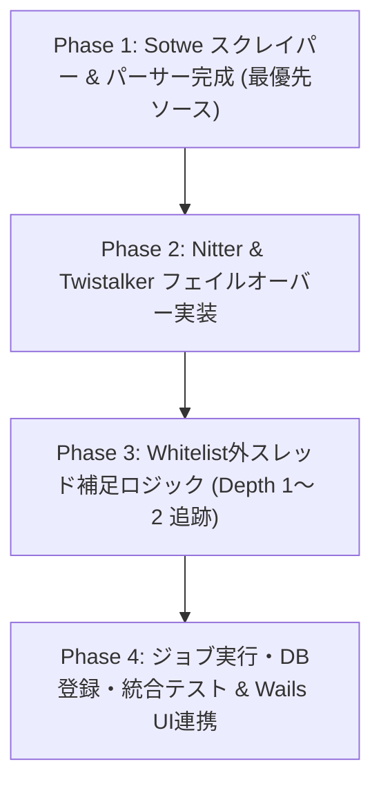

# 【土蔵・型抜き】実装計画書：Whitelist外ツイート補足 & マルチソース・スクレイパー (課題③ & 課題②)

- **文書ID**: `PLAN-SCRAPER-EXTERNAL-001`
- **作成日**: 2026-08-24
- **関連仕様書**: [`docs/SPEC_TASK3_TASK2_WHITELIST_EXTERNAL_AND_SCRAPERS.md`](file:///d:/Projects/10_tools/dozou_katanuki/dozou_katanuki/docs/SPEC_TASK3_TASK2_WHITELIST_EXTERNAL_AND_SCRAPERS.md)
- **ステータス**: READY FOR IMPLEMENTATION

---

## 1. 実装ロードマップ概要

全体を4つのフェーズに分割し、単体テストを挟みながら段階的に構築します。

---

## 2. フェーズ別詳細タスク & 変更対象ファイル

### Phase 1: Sotwe ソース & パーサーの本格実装 (優先度: 高)

SotweはJSON API形式でデータ構造が最も安定しており、高速かつ高精度のメタデータ・メディア取得が可能です。

#### [NEW] / [MODIFY] ファイル一覧
1. **[MODIFY] [`plugins/twitter/scraper/sources/sotwe_source.py`](file:///d:/Projects/10_tools/dozou_katanuki/dozou_katanuki/plugins/twitter/scraper/sources/sotwe_source.py)**
   - ページネーション対応（`cursor` または `page` パラメータ）
   - レスポンスのステータスコード判定（429 Rate Limit検知、Exponential Backoff）
   - 100行以下ルール遵守
2. **[NEW] `plugins/twitter/scraper/parsers/sotwe_parser.py`**
   - Sotwe APIの生JSONを共通スキーマ（`Article`, `Media`, `Account`）に変換するパース関数
   - `conversation_id`, `in_reply_to_status_id`, `media_entities` の正確な抽出
3. **[NEW] `plugins/twitter/scraper/test_sotwe_source.py`**
   - モックJSONレスポンスを用いた単体テスト（ネットワーク接続なしで実行可能）

---

### Phase 2: Nitter & Twistalker ソース & パーサー実装

Sotweが一時停止または429エラーとなった際のフォールバックソース群です。

#### [NEW] / [MODIFY] ファイル一覧
1. **[MODIFY] [`plugins/twitter/scraper/sources/nitter_source.py`](file:///d:/Projects/10_tools/dozou_katanuki/dozou_katanuki/plugins/twitter/scraper/sources/nitter_source.py)**
   - 動的インスタンスプール管理（死活監視・エラーインスタンスの自動スキップ）
   - User-Agentヘッダーローテーション
2. **[NEW] `plugins/twitter/scraper/parsers/nitter_parser.py`**
   - Nitter HTMLからツイート本文、親リプライ先、画像/動画リンク、投稿日時（UTC変換）を抽出
3. **[MODIFY] [`plugins/twitter/scraper/sources/twistalker_source.py`](file:///d:/Projects/10_tools/dozou_katanuki/dozou_katanuki/plugins/twitter/scraper/sources/twistalker_source.py)**
   - HTMLスクレイピングエンジンの堅牢化
4. **[NEW] `plugins/twitter/scraper/parsers/twistalker_parser.py`**
   - Twistalker HTMLの正規化パーサー

---

### Phase 3: Whitelist外ツイート補足ロジック（課題③）の実装

タイムライン上で会話の文脈を完全にするため、取得したツイートの `reply_to_id` / `quoted_status_id` を検知し、外部ユーザーの親ツイートを再帰補足します。

#### [NEW] / [MODIFY] ファイル一覧
1. **[NEW] `plugins/twitter/scraper/core/thread_expander.py`** (100行以下)
   - 抽出されたツイート群から `reply_to_id` をスキャン
   - 既にDBまたは現在の収集バッチに存在するかチェック
   - 存在しない場合、マルチソース経由で `fetch_post(reply_to_id)` を呼び出し（Depth制限: 最大2）
2. **[NEW] `plugins/twitter/scraper/core/external_account_handler.py`** (100行以下)
   - Whitelist外のユーザー情報を最小限の形式（`numeric_id`, `username`, `display_name`, `avatar_url`）で生成し、DB外部キー制約を満たすレコードを作成
3. **[MODIFY] `plugins/twitter/scraper/core/restorer.py`**
   - `thread_expander` をメインの収集パイプラインに統合

---

### Phase 4: ジョブ実行・DB登録・統合テスト & Wails UI連携

1. **[MODIFY] `plugins/twitter/scraper/main.py`**
   - コマンドライン引数（`--account`, `--source all|sotwe|nitter`, `--expand-threads`）の処理
   - 収集完了時の標準出力JSON（NDJSON）またはDB直接コミット
2. **[NEW] `plugins/twitter/scraper/test_thread_expansion_e2e.py`**
   - 親ツイート補足〜マルチソースフェイルオーバーの一連のフローを検証するE2Eテスト
3. **Go側連携確認**:
   - `middleware/job_orchestrator.go` から Python プロセス起動引数の互換性確認
   - サルベージ完了後にタイムライン（`TimelineContainer.vue`）で会話ツリーが正しく描画されることを確認

---

## 3. コーディング規約 & 制約事項（重要）

1. **100行以下ルールの徹底**:
   - 単一の `.py` または `.go`, `.vue` ファイルが100行を超えないように分割すること。
2. **Same Source, Same Flow**:
   - どのソースから取得したデータも、最終的には `models.Article`, `models.Media`, `models.Account` のスキーマに完全に一致させること。
3. **文字コード・タイムゾーン**:
   - タイムスタンプは全て ISO8601 (`YYYY-MM-DDTHH:mm:ssZ`) または SQLite `datetime` 互換（UTC）に統一すること。
4. **依存ライブラリの最小化**:
   - Python側: `requests`, `beautifulsoup4`, `urllib3` など標準的かつ軽量なライブラリのみ使用すること。

---

## 4. 完了の定義 (Definition of Done)

- [ ] `pytest plugins/twitter/scraper/` で全単体テストが PASS すること。
- [ ] Whitelist対象ユーザーのサルベージ実行時、他者へのリプライの「親ツイート」が自動的にDBに補足登録されること。
- [ ] Sotwe → Nitter → Twistalker の自動フェイルオーバーが正常に作動すること。
- [ ] タイムライン画面（フロントエンド）で外部ユーザーの親ツイートおよびリプライツリーが美しく描画されること。
