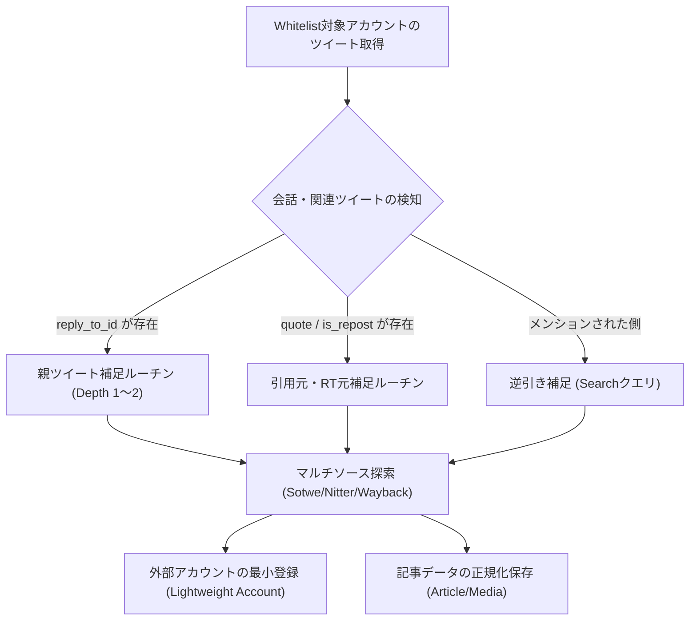

# 【土蔵・型抜き】仕様書：Whitelist外ツイート補足戦略 & マルチソース・スクレイパー仕様 (課題③ & 課題②)

- **文書ID**: `SPEC-SCRAPER-EXTERNAL-001`
- **作成日**: 2026-08-24
- **ステータス**: APPROVED / READY FOR IMPLEMENTATION
- **対象システム**: `dozou_katanuki` (Wails v2 + Go + Vue 3 + Python Scraper Plugin)

---

## 1. 全体背景と設計思想

### 1.1 プロジェクトの目的
「土蔵・型抜き」は、Twitter/Xを中心とするインフルエンサー・クリエイターの公開投稿・メディア（画像・動画）をローカル環境（SQLite + Stash + 静的ファイル）に恒久保存・閲覧するためのデスクトップ・アーカイブシステムです。

### 1.2 核心原則：Same Source, Same Flow
- **参照同一性**: どのスクレイパー（Wayback / Sotwe / Twistalker / Nitter / X）から取得したデータであっても、同一の `articles` / `media` / `accounts` スキーマに正規化され、同一のデータパイプラインを通じて保存・レンダリングされること。
- **100行以下ルール**: 全てのソースコードファイル（Python, Go, Vue, TS）は単一責任の原則に従い、**1ファイル原則100行以下**で分割・構成すること。

---

## 2. 【課題③】Whitelist外ツイート補足戦略・仕様

### 2.1 課題の所在
- 現在のシステムは、Whitelistに登録された特定アカウント（本垢・裏垢）のタイムラインを網羅的に保存することを主眼としています。
- しかし、Whitelist対象者が「他者からのメンションにリプライしている場合」や「他者のツイートを引用RT/RTしている場合」、**会話ツリー（会話の文脈・元ツイート）が欠落**し、タイムラインやリプライツリー表示で意味が通じなくなります。

### 2.2 補足戦略（Target Ingestion Strategy）



### 2.3 詳細仕様

#### (1) 探索深度（Depth）制限
- **デフォルト深度**: `Depth = 1`（直近の親ツイート・引用元ツイートのみ取得）。
- **最大深度（スレッド補完時）**: `Depth = 2`（会話の発端となるルートツイートまで遡及）。
- 無限連鎖（Whitelist外ユーザー同士の長大な口論スレッド等）によるリソース枯渇を防ぐため、**Whitelist外ユーザーを起点としたさらなる子リプライ収集は行わない（リーフノード扱い）**。

#### (2) 外部ユーザーのDB登録仕様（`accounts` テーブル）
- Whitelist外のユーザーであっても、外部キー制約（`fk_accounts_articles`）を満たすため `accounts` テーブルに登録します。
- **最小限メタデータ登録**:
  - `numeric_id`: 取得できた場合は数値ID、不明な場合は `ext_<username>` またはツイート内のユーザーID。
  - `username`: ユーザーハンドル（大文字小文字を保持）。
  - `display_name`: 表示名（取得できた場合）。
  - `avatar_url`: アイコンURL（取得できない場合はデフォルトアバターまたは空文字）。
  - `group_name`: 空文字 `""`。
  - `alias_of`: 空文字 `""`。
  - `is_external`: （拡張時または識別用）Whitelist外として扱う。

#### (3) 外部メディアの保存ポリシー
- **テキスト・メタデータ**: 100% 恒久保存（`articles` テーブル）。
- **メディア（画像・動画）**:
  - `config.storage.salvage_external_media = true` の場合: Whitelist対象者と同様にダウンロードキューに投入。
  - `false` の場合: `download_status = 'OUTSOURCED'` としてURLのみ保持し、ローカル実体保存はスキップしてストレージを節約可能とする。

---

## 3. 【課題②】マルチソース・スクレイパー仕様

### 3.1 ソース一覧と優先順位（Priority Cascade）

| 優先度 | ソース名 | 実装クラス | 特徴・役割 | 認証要否 |
|---|---|---|---|---|
| **1位 (最高)** | **Wayback Machine** | `WaybackSource` | 過去ログ・削除済みツイートの復元。最も網羅的。 | 不要 |
| **2位** | **Sotwe** | `SotweSource` | SeleniumBase UC ModeによるWeb UI DOMスクレイピング。最新〜中期のツイート。画像・動画直リンク取得可能。 | 不要 |
| **3位** | **Nitter (分散クローン)** | `NitterSource` | HTMLスクレイピング。複数インスタンス（`nitter.net`, `nitter.poast.org`等）への自動フェイルオーバー。 | 不要 |
| **4位** | **Twistalker** | `TwistalkerSource` | HTMLスクレイピング。代替ミラー。Sotwe/Nitter全滅時のフェイルオーバー。 | 不要 |
| **5位 (予備)** | **X Official / GraphQL** | `OfficialSource` | Guest TokenまたはCookieによる公式エンドポイント直接取得。 | 必要時Cookie |

### 3.2 各ソースの入出力インターフェース

全ソースは `plugins/base/scraper/core/base_source.py` の `BaseSource` を継承する：

```python
class BaseSource:
    def __init__(self, name: str, priority: int = 10, timeout: int = 15): ...
    def fetch_account(self, account: str, limit: int = 0, log_fn: Optional[Callable[[str], None]] = None) -> List[Dict[str, Any]]: ...
    def fetch_post(self, post_id: str, account: str = "", log_fn: Optional[Callable[[str], None]] = None) -> Optional[Dict[str, Any]]: ...
```

### 3.3 ソース別スクレイピング・パース詳細仕様

#### 1. SotweSource (`sotwe_source.py` / `sotwe_parser.py`)
- **アクセスURL**: `https://www.sotwe.com/{username}` (Web UI)
- **スクレイピング方式**: SeleniumBase UC Modeでブラウザを展開し、DOMツリーからBeautifulSoupで要素抽出
- **抽出要素**:
  - アカウント共通: `.profile-avatar img`, `.break-word .dynamic-link-content`, `.profile-name`
  - ツイート本体: `.tweet-card`, `.tweet-text .dynamic-link-content`
  - 投稿日時: `time[datetime]`
  - メディア画像: `.media-carousel img[src]`, `.media-carousel-image img[src]`
  - メディア動画: `.video-player video source[type="video/mp4"]`
  - 動画サムネイル: `.video-player video[poster]`
  - リツイート判定: `.v-card__title .fa-retweet`

#### 2. NitterSource (`nitter_source.py` / `nitter_parser.py`)
- **インスタンスプール管理**:
  - ヘルスチェック機能: 各インスタンスに対してリクエストを試行し、429/500番台エラーが発生した場合は一時的にクールダウンリストに隔離。
  - デフォルトインスタンス例: `https://nitter.net`, `https://nitter.poast.org`, `https://nitter.privacydev.net`, `https://nitter.woodland.cafe`
- **アカウント取得**: `GET {instance}/{username}` (HTML)
- **単一ポスト取得**: `GET {instance}/{username}/status/{post_id}` (HTML)
- **パース要素**:
  - ツイート本体: `.timeline-item`, `.tweet-content`
  - 親ツイートリンク: `.replying-to a`, `.tweet-link`
  - メディア: `.attachments img` (画像), `.attachments video` (動画)

#### 3. TwistalkerSource (`twistalker_source.py` / `twistalker_parser.py`)
- **アカウント取得 URL**: `GET https://twistalker.com/{username}`
- **パース要素**: BeautifulSoup または 正規表現によるツイートコンテナ `.post-item` からのデータ抽出。

---

## 4. データベース永続化仕様（Go側 Driver / Repository）

### 4.1 既存スキーマとの完全合致
Python側で正規化されたデータは、以下のSQLiteテーブルに投入される（`archive_schema.sql` 準拠）：
- `accounts`: `numeric_id`, `username`, `display_name`, `avatar_url`, `group_name`, `alias_of`, `updated_at`
- `articles`: `id`, `account_id`, `conversation_id`, `reply_to_id`, `reply_to_handle`, `created_at`, `full_text`, `lang`, `via`, `is_repost`, `is_liked`, `wayback_url`
- `media`: `media_id`, `article_id`, `type`, `download_url`, `width`, `height`, `download_status`, `stash_scene_id`, `stash_image_id`
- `url_redirects`: `short_url`, `expanded_url`, `article_id`
