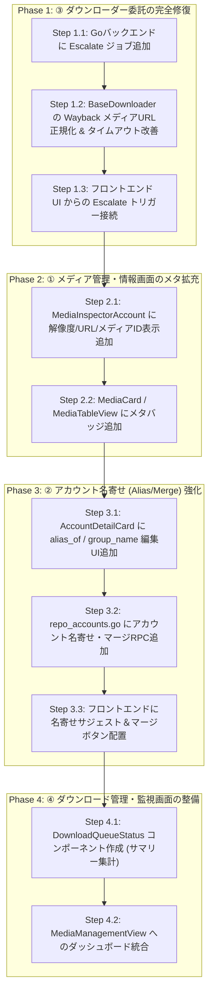

# 🏯 土蔵・型抜き：スモールステップ実装指示書 (Playbook)

先輩！どのモデルに切り替えても1手ずつ確実に進められるよう、**1ステップ1コミット（1ファイル〜2ファイル単位）**で完結する詳細な指示書を作成しました。

---

## 🗺️ 全体ロードマップ（全10ステップ）



---

## 📋 各ステップの個別指示書（そのままAIにコピペして実行可能）

---

### 🔹 Step 1.1: Goバックエンドに Escalate ジョブ追加

- **目的**: Python側に存在する `--mode escalate`（DEAD_404 → Aria2/Motrix外注）をGoの `JobOrchestrator` および Wails RPC から呼び出せるようにする。
- **対象ファイル**:
  - `models/job.go` (JobTypeEscalate 追加)
  - `middleware/job_queue.go` (`EnqueueMediaEscalate` メソッド追加)
  - `app/app_rpc_jobs.go` (`StartMediaEscalateJob` メソッド追加)
- **制約**: 全ファイル **100行以下** を維持すること。
- **検証**: `go test ./...`

<details>
<summary>💬 【AIへの指示用プロンプト】（クリックして展開）</summary>

```markdown
【指示: Step 1.1】
以下のファイルを修正して、DEAD_404 メディアを Aria2/Motrix へ外注委託する Escalate ジョブを Go 側に実装してください。

1. `models/job.go`:
   - `JobTypeEscalate JobType = "escalate"` を定数に追加する。

2. `middleware/job_queue.go`:
   - `EnqueueMediaEscalate(platform string) (*models.JobProgress, error)` を新設。
   - `args := []string{"--mode", "escalate", "--platform", platform}` で JobRequest をキューイングする。

3. `app/app_rpc_jobs.go`:
   - `StartMediaEscalateJob(platform string) (*models.JobProgress, error)` を新設。
   - `a.JobOrchestrator.EnqueueMediaEscalate(platform)` を呼び出す。

※ 全てのファイルは「1ファイル100行以下」のルールを厳守してください。
※ 修正後、`go test ./...` を実行してコンパイルとテスト通過を確認してください。
```
</details>

---

### 🔹 Step 1.2: BaseDownloader の URL正規化 & タイムアウト改善

- **目的**: 
  - Wayback Machine 経由のメディアURL（`https://web.archive.org/web/...id_/https://...`）や `:orig` サフィックスを正しく正規化し、直接取得率を向上させる。
  - 動画と画像で適切なタイムアウト（画像10s、動画30s）を適用する。
- **対象ファイル**:
  - `plugins/base/scraper/core/base_downloader.py`
  - `plugins/twitter/scraper/test_downloader.py`
- **制約**: 1ファイル **100行以下**。
- **検証**: `python -m unittest plugins/twitter/scraper/test_downloader.py`

<details>
<summary>💬 【AIへの指示用プロンプト】（クリックして展開）</summary>

```markdown
【指示: Step 1.2】
`plugins/base/scraper/core/base_downloader.py` と `plugins/twitter/scraper/test_downloader.py` を改善してください。

1. `base_downloader.py`:
   - `_try_download_and_escalate`:
     - タイムアウトを `timeout=10 if m_type == "image" else 30` に変更。
     - URLの正規化（WaybackラッパーURLが含まれる場合のアンラップ処理、またはそのまま利用の判定）を確実にする。
     - リトライ待機ステータスコードに 408, 429, 500, 502, 503, 504 を網羅。
2. `test_downloader.py`:
   - 変更点に対する単体テストが PASS することを確認。

※ 1ファイル100行以下ルールを厳守してください。
※ 修正後、`python -m unittest plugins/twitter/scraper/test_downloader.py` を実行して検証してください。
```
</details>

---

### 🔹 Step 1.3: フロントエンド UI からの Escalate トリガー接続

- **目的**: メディア管理ツールバーに「🚀 Motrix外注」ボタンを配置し、DEAD_404 のアイテムを一括委託できるようにする。
- **対象ファイル**:
  - `frontend/src/composables/admin/useAdminDatabaseMedia.ts` (startMediaEscalate 追加)
  - `frontend/src/components/admin/database/MediaToolbar.vue` (外注ボタン追加)
  - `frontend/src/components/admin/database/MediaManagementView.vue` (イベント伝達)
- **制約**: 1ファイル **100行以下**。
- **検証**: `npm run build`

<details>
<summary>💬 【AIへの指示用プロンプト】（クリックして展開）</summary>

```markdown
【指示: Step 1.3】
フロントエンドのメディア管理画面から Motrix/Aria2 外注ジョブを実行できるように配線してください。

1. `frontend/src/composables/admin/useAdminDatabaseMedia.ts`:
   - `startMediaEscalate()` を実装し、`window.go.app.App.StartMediaEscalateJob('twitter')` を呼ぶ。
2. `frontend/src/components/admin/database/MediaToolbar.vue`:
   - 「🚀 Motrix外注」ボタンを追加し、クリック時に `startEscalate` イベントを emit する。
3. `frontend/src/components/admin/database/MediaManagementView.vue`:
   - `startEscalate` イベントを受け取り、親（または composable）に中継する。

※ 全ファイル100行以下ルール厳守。
※ 修正後、`npm run build` を実行してフロントエンドがビルドエラーなしで通過することを確認してください。
```
</details>

---

### 🔹 Step 2.1: MediaInspectorAccount に解像度/URL/メディアID表示追加

- **目的**: メディアインスペクター（詳細パネル）に、現在不足している「メディアID」「原本URL」「解像度 (Width x Height)」「メディア種別」を表示する。
- **対象ファイル**:
  - `frontend/src/components/admin/database/MediaInspectorAccount.vue`
- **制約**: 1ファイル **100行以下**。
- **検証**: `npm run build`

<details>
<summary>💬 【AIへの指示用プロンプト】（クリックして展開）</summary>

```markdown
【指示: Step 2.1】
`frontend/src/components/admin/database/MediaInspectorAccount.vue` を改修し、メディアの技術メタ情報を表示できるようにしてください。

1. 表示項目に追加:
   - メディアID (`media.media_id` または `media.id`)
   - 原本URL (`media.download_url`) + クリックでコピー機能
   - メディア種別 & 解像度 (`media.type` / `${media.width} x ${media.height}`)
   - Wayback原本URL (`media.wayback_url` が存在する場合)
2. UIデザイン:
   - Tailwind CSS でダークテーマに馴染むコンパクトな情報ブロック（`bg-slate-950/80`）として配置。

※ 1ファイル100行以下ルールを厳守してください。必要であればサブコンポーネント化してください。
※ 修正後、`npm run build` を実行して検証してください。
```
</details>

---

### 🔹 Step 2.2: MediaCard / MediaTableView にメタバッジ追加

- **目的**: 一覧カード（MediaCard）上で、メディアの解像度やダウンロードステータスがひと目で把握できるようにする。
- **対象ファイル**:
  - `frontend/src/components/admin/database/MediaCard.vue`
- **制約**: 1ファイル **100行以下**。
- **検証**: `npm run build`

<details>
<summary>💬 【AIへの指示用プロンプト】（クリックして展開）</summary>

```markdown
【指示: Step 2.2】
`frontend/src/components/admin/database/MediaCard.vue` を改修し、メディアカードのプレビュー枠上に以下のバッジを追加してください。

1. 解像度バッジ: `media.width` と `media.height` が存在する場合、右下に `1920x1080` などのバッジを表示。
2. ステータスバッジの色分け強化:
   - `COMPLETED`: エメラルド (`bg-emerald-950 text-emerald-300`)
   - `OUTSOURCED`: 紫 (`bg-purple-950 text-purple-300`)
   - `DEAD_404`: 赤 (`bg-rose-950 text-rose-300`)
   - `QUEUED`: スレート (`bg-slate-800 text-slate-300`)

※ 1ファイル100行以下ルール厳守。
※ 修正後、`npm run build` で確認。
```
</details>

---

### 🔹 Step 3.1: AccountDetailCard に alias_of / group_name 編集UI追加

- **目的**: アカウント詳細画面から名寄せ先（`alias_of`）やグループ名（`group_name`）を手動編集できるようにする。
- **対象ファイル**:
  - `frontend/src/components/admin/database/AccountDetailCard.vue`
  - `driver/repo_accounts.go`
- **制約**: 1ファイル **100行以下**。
- **検証**: `npm run build` & `go test ./...`

<details>
<summary>💬 【AIへの指示用プロンプト】（クリックして展開）</summary>

```markdown
【指示: Step 3.1】
アカウント詳細編集フォームに `alias_of` と `group_name` の編集機能を追加してください。

1. `frontend/src/components/admin/database/AccountDetailCard.vue`:
   - `editForm` に `aliasOf`, `groupName` を追加。
   - 編集モード時に「名寄せ先（代表アカウントID/ユーザー名）」「グループ名」の入力欄を追加。
   - 通常表示時にもグループ・名寄せ情報をタグ表示。
2. `driver/repo_accounts.go`:
   - `UpdateAccount` で `alias_of` と `group_name` も更新するようにマップを拡張。

※ 1ファイル100行以下ルール厳守。
※ `go test ./...` および `npm run build` で検証。
```
</details>

---

### 🔹 Step 3.2: repo_accounts.go にアカウント名寄せ・マージRPC追加

- **目的**: 外部アカウント（`ext_xxx`）と本登録アカウントをマージするバックエンド処理を実装する。
- **対象ファイル**:
  - `driver/repo_accounts.go` (または分割ファイル `driver/repo_accounts_merge.go`)
  - `app/app_rpc_database.go`
- **制約**: 1ファイル **100行以下**。
- **検証**: `go test ./...`

<details>
<summary>💬 【AIへの指示用プロンプト】（クリックして展開）</summary>

```markdown
【指示: Step 3.2】
アカウントのマージ（名寄せ統合）処理を Go バックエンドに実装してください。

1. `driver/repo_accounts_merge.go` (新設・100行以下):
   - `MergeAccounts(sourceNumericID, targetNumericID string) error`
   - `articles` テーブルの `account_id` を `targetNumericID` に付け替える。
   - `source` アカウントの `alias_of` に `targetNumericID` をセット（または統合後に削除フラグ）。
2. `app/app_rpc_database.go`:
   - `MergeAccounts(sourceID, targetID string) error` を公開。

※ 1ファイル100行以下ルール厳守。
※ `go test ./...` で検証。
```
</details>

---

### 🔹 Step 3.3: フロントエンドに名寄せサジェスト＆マージボタン配置

- **目的**: アカウント管理画面で、同名・類似アカウントの統合サジェストを表示し、1クリックでマージできるようにする。
- **対象ファイル**:
  - `frontend/src/components/admin/database/AccountManagementView.vue`
- **制約**: 1ファイル **100行以下**。
- **検証**: `npm run build`

<details>
<summary>💬 【AIへの指示用プロンプト】（クリックして展開）</summary>

```markdown
【指示: Step 3.3】
`frontend/src/components/admin/database/AccountManagementView.vue` に名寄せサジェストとマージ実行機能を追加してください。

1. 表示中のアカウントと `username` または `display_name` が前方一致／類似する他のアカウントを検出し、「名寄せ候補」としてサジェスト表示。
2. 「このアカウントに統合」ボタンを配置し、確認ダイアログ後にマージRPCを実行。
3. 成功時にトースト通知と一覧再取得を行う。

※ 1ファイル100行以下ルール厳守。
※ `npm run build` で検証。
```
</details>

---

### 🔹 Step 4.1: DownloadQueueStatus コンポーネント作成

- **目的**: メディアのダウンロード状況（QUEUED / DOWNLOADING / COMPLETED / DEAD_404 / OUTSOURCED）を一目で俯瞰できるステータス集計バーを作成する。
- **対象ファイル**:
  - `frontend/src/components/admin/database/MediaQueueStatus.vue` (新設)
- **制約**: 1ファイル **100行以下**。
- **検証**: `npm run build`

<details>
<summary>💬 【AIへの指示用プロンプト】（クリックして展開）</summary>

```markdown
【指示: Step 4.1】
`frontend/src/components/admin/database/MediaQueueStatus.vue` を新設し、ダウンロードキュー全体の進捗ダッシュボードを作成してください。

1. props としてステータス別集計（`stats: { queued: number, completed: number, dead_404: number, outsourced: number, total: number }`）および `activeJob` を受け取る。
2. Tailwind CSS を使用し、色付きプログレスバーおよびステータス別カウントチップ（クリックでフィルタ連動）を表示。

※ 1ファイル100行以下ルール厳守。
※ `npm run build` で検証。
```
</details>

---

### 🔹 Step 4.2: MediaManagementView へのダッシュボード統合

- **目的**: Step 4.1 で作成した `MediaQueueStatus` を `MediaManagementView` に組み込み、ダウンロード管理画面として完成させる。
- **対象ファイル**:
  - `frontend/src/components/admin/database/MediaManagementView.vue`
- **制約**: 1ファイル **100行以下**。
- **検証**: `npm run build`

<details>
<summary>💬 【AIへの指示用プロンプト】（クリックして展開）</summary>

```markdown
【指示: Step 4.2】
`frontend/src/components/admin/database/MediaManagementView.vue` に `MediaQueueStatus.vue` を組み込んでください。

1. `MediaCockpitHeader` と `MediaToolbar` の間に `MediaQueueStatus` を配置。
2. キュー状態のチップクリック時に `statusFilter` を切り替える連動処理を追加。

※ 1ファイル100行以下ルール厳守。
※ `npm run build` で確認。
```
</details>

---

## 🎯 運用のコツ（モデル切り替え時の注意事項）

1. **1回のやり取りで 1ステップだけ** 指示してください。
2. 指示を出す際は、上記各ステップの **「💬 【AIへの指示用プロンプト】」の中身をそのままコピー** して貼り付けてください。
3. 完了したら必ず `go test ./...` または `npm run build` の検証結果を確認してから次のステップへ進んでください。
4. **「1ファイル100行以下ルール」** は本プロジェクトの絶対原則ですので、コード生成時に必ず守らせてください。
