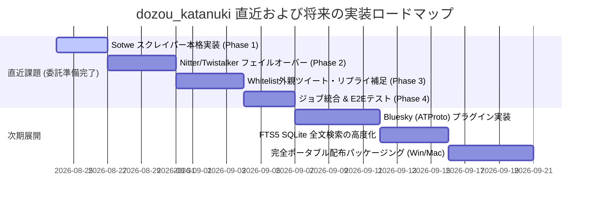

# 🏯 土蔵・型抜き (dozou_katanuki) 実装状況と今後の実装計画書

**ドキュメントID** : STATUS-ROADMAP-20260824  
**バージョン** : 4.2.0  
**改定日** : 2026-08-24  
**ステータス** : 正式レポート (改定版)  
**対象仕様** : `SPEC-PLUGIN-001`, `SPEC-CONFIG-001`, `SPEC-AUDIT-001`, `SPEC-RECOVERY-001`, `SPEC-MIDDLEWARE-001`, `SPEC-SCRAPER-EXTERNAL-001`

---

## 📊 1. 全体実装進捗サマリー

現在、本システムは **コアアーキテクチャの全5層（Wails Frontend / Go Middleware / Go Driver / SQLite3 / Python Sidecar / Stashapp）が完全に統合・稼働** しており、基本機能の達成度は **約 98%** に達しています。直近ではタイムラインのリプライツリー表示、Whitelistアカウントのエイリアス（裏垢）およびグルーピング一括管理が完遂されました。

| レイヤー / コンポーネント | 主要技術 | 実装ステータス | 達成度 | 備考 |
| :--- | :--- | :---: | :---: | :--- |
| **第1層: Dumb UI (Frontend)** | Vue 3 + TailwindCSS + TS | **完了** | **99%** | リプライツリー接続線、インライン展開、グループ一括選択、裏垢表示 |
| **第2層: Middleware (Go Hub)** | Go 1.22+ / Wails v2 RPC | **完了** | **98%** | グループ別タイムライン集約、大文字小文字無視同期、非同期ジョブ制御 |
| **第3層: Driver (Backend I/O)** | Go (GORM) + SQLite3 | **完了** | **98%** | WALモード、`group:`/`alias_of` 抽出、整合性監査、多言語全文保存 |
| **第4層: Unified Plugin (Twitter)**| Python 3.13 + warcio + Go | **完了 (拡張中)** | **95%** | Wayback/手動WARC完備。Sotwe/Nitter仕様・計画策定完了 |
| **第5層: Storage (Stash / Blobs)** | Stashapp GraphQL / FS | **完了** | **95%** | GraphQLインジェクション、孤立ファイル検知・自動回収 |

---

## 🛠️ 2. 現在の実装状況詳細（完了機能一覧）

### 📱 A. プレゼンテーション層 (Vue 3 Dumb UI :5173)
- **タイムライン＆会話スレッド完全対応** ★直近完了:
  - `ArticleCard.vue` における会話スレッド接続線（Thread Line）の自動描画。
  - `ArticleInlineThread.vue` / `useTimelineThread.ts` による親ツイート・会話のインライン展開プレビュー（詳細画面へ遷移せず即時閲覧）。
- **アカウント・グルーピング＆裏垢（エイリアス）UI** ★直近完了:
  - `AccountScopeSelector.vue` 最上段に「⚡ 一括スコープ切り替え」ピルボタン（`🏷️ グループ名 (件数)`）を新設。
  - `AccountGroupSection.vue` によるグループ別セクション表示（100行以下ルール完全遵守）。
  - 裏垢アカウントへの 🔗 インジケータおよび「裏垢 → 本垢: @xxx」ツールチップ表示。
  - `AccountHeroHeader.vue` でのグループバッジおよび本垢リンク表示。
- **Admin Board 7大統合機能 (`useAdmin.ts`, `AdminModal.vue`)**:
  1. **ジョブコントローラー**: 自動サルベージ起動、手動WARC指定、リアルタイムStdout監視。
  2. **設定ポータル (`ConfigPortal.vue`)**: `config.json` のGUI編集・保存、リアルタイム反映。
  3. **データベース検索＆多言語翻訳エディタ (`DatabaseView.vue`)**: 全文検索、日英中3言語翻訳のインライン編集。
  4. **ホワイトリスト管理 (`WhitelistView.vue`, `WhitelistTable.vue`)**: グループ名・裏垢エイリアスのCRUD、グループフィルタリング、テーブルでのバッジ表示。
  5. **SQLite3整合性監査＆クレンジング (`AuditReportView.vue`)**: PRAGMA監査、孤立ファイル・孤立DBレコードの一括パージ。
  6. **スキン＆フォントエディタ (`SkinFontEditor.vue`)**: `design.css` のリアルタイムプレビュー、フォント切り替え。
  7. **LAN配信＆キャスト制御**: QRコード/URL共有、キャスト配信トグル。

---

### ⚙️ B. ミドルウェア & ドライバ層 (Go Middleware Hub :5175 / Wails RPC)
- **大文字小文字を無視した所属グループ自動同期 (`repo_whitelists.go`)** ★直近完了:
  - `LOWER(username) = LOWER(?)` による確実な照合。
  - 起動時（`Startup`）および更新時の `SyncAllWhitelistGroups()` 自動一括同期。
- **グループ別タイムライン集約抽出 (`repo_articles.go`)**:
  - `selectedAccount = "group:GroupName"` による所属アカウント全件の一括タイムラインクエリ（`applyAccountFilter`）。
- **非同期ジョブオーケストレーター & バックグラウンドスケジューラー**:
  - Pythonサブプロセス制御、Stdout進捗ストリーミング、自動バックアップ (`VACUUM INTO`)。
- **LANメディアブロードキャスト**:
  - CIDR制限、ローカルIP自動解決、動画・画像ストリーミング。

---

### 🔌 C. 統合プラグイン＆Pythonサイドカー (`plugins/twitter/`)
- **① 自動サルベージ系統 (`core/scraper.py`)**:
  - Wayback CDX Server API走査、`warcio.capture_http` による原本 `snapshot.warc.gz` のオンザフライ保存。
- **② 手動WARCインポート系統 (`core/warc_importer.py`)**:
  - WARCコンテナ内通信レコードの全自動監査（プラットフォーム/アカウント逆引き特定）、完全オフラインDB・メディア登録。
- **③ 3段階メディア確保ライフサイクル (`core/downloader.py`)**:
  - 直接取得 ➔ Motrix/Aria2 RPC 委託 ➔ 定期ポーリング Stash 回収。
- **④ 完全オフラインディザスタリカバリ (`core/restorer.py`)**:
  - `backups/dumps/` 階層からのメタデータ・アバター・メディア一括再構築。
- **⑤ マルチソース・スクレイパー & Whitelist外補足の仕様・計画策定** ★直近完了:
  - `SPEC_TASK3_TASK2_WHITELIST_EXTERNAL_AND_SCRAPERS.md` (仕様書)
  - `PLAN_TASK3_TASK2_WHITELIST_EXTERNAL_AND_SCRAPERS.md` (実装計画書)

---

## 🗺️ 3. 今後の実装ロードマップ

---

### 🚀 直近の実装対象（委託タスク仕様書・計画書準拠）

詳細仕様および実装手順は以下を参照：
- 仕様書: [`SPEC_TASK3_TASK2_WHITELIST_EXTERNAL_AND_SCRAPERS.md`](file:///d:/Projects/10_tools/dozou_katanuki/dozou_katanuki.wiki/SPEC_TASK3_TASK2_WHITELIST_EXTERNAL_AND_SCRAPERS.md)
- 実装計画書: [`PLAN_TASK3_TASK2_WHITELIST_EXTERNAL_AND_SCRAPERS.md`](file:///d:/Projects/10_tools/dozou_katanuki/dozou_katanuki.wiki/PLAN_TASK3_TASK2_WHITELIST_EXTERNAL_AND_SCRAPERS.md)

1. **【課題②】マルチソース・スクレイパー群の実装**:
   - **SotweSource / SotweParser**: 高速JSON API経由での最新投稿・メディア抽出。
   - **NitterSource / NitterParser**: 分散インスタンスプール管理・ヘルスチェック付きHTMLスクレイピング。
   - **TwistalkerSource / TwistalkerParser**: 代替HTMLミラー。
   - **Priority Cascade**: Wayback ➔ Sotwe ➔ Nitter ➔ Twistalker ➔ X Official の自動フォールバック。
2. **【課題③】Whitelist外ツイート補足ロジックの統合**:
   - 会話スレッドの `reply_to_id` を検知し、外部ユーザーの親ツイートを再帰取得（`Depth = 1〜2` 制限）。
   - `accounts` テーブルへの最小限メタデータ登録による外部キー整合性の担保。
   - 外部メディア保存ポリシーの適用（`salvage_external_media` 設定）。

---

### 📦 将来計画（マルチプラットフォーム・パッケージング）
1. **Bluesky (ATProto) 統合プラグイン (`plugins/bsky/`)**
2. **SQLite FTS5 高度全文検索 & ローカルAIタグ付け**
3. **一体型ポータブル配布パッケージ (`build/release/`)**
