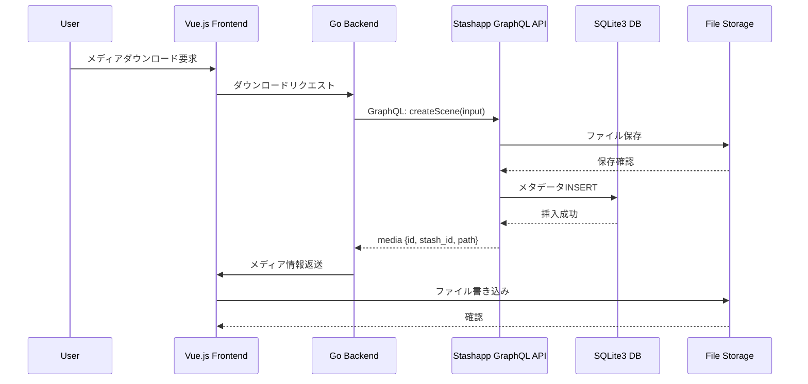
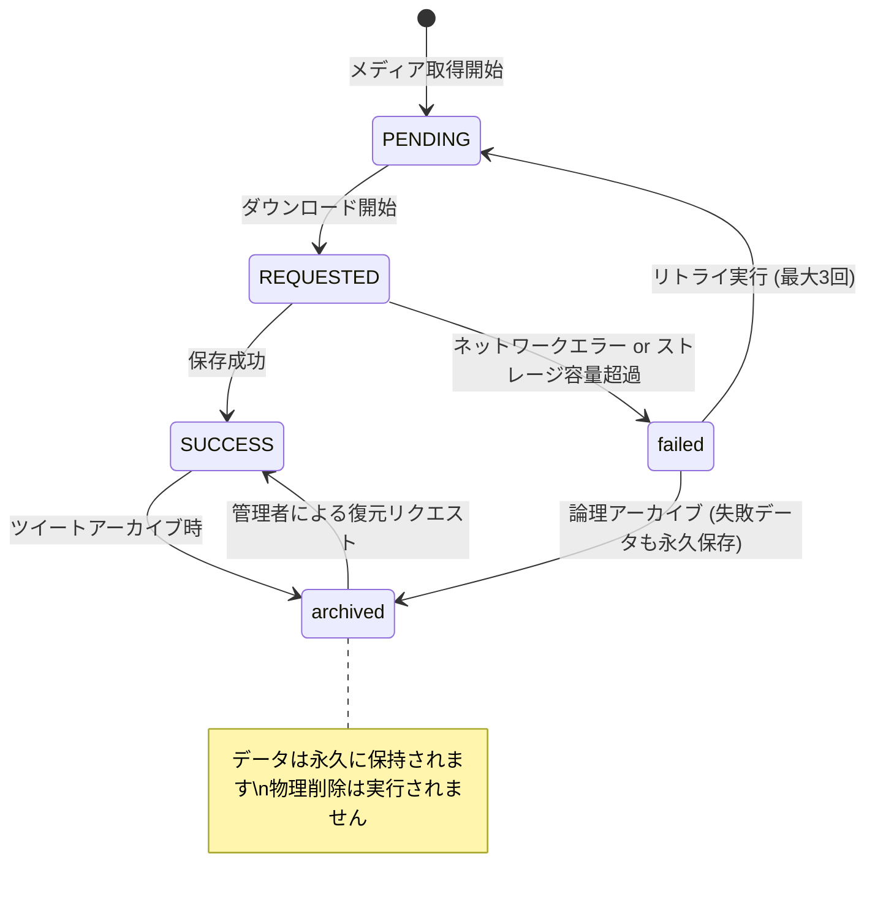

# メディア管理レポート

## 1. 外部メディア選定の基準と実装箇所

### 1.1 選定基準
外部メディア（画像・動画）の選定は、以下の優先順位と条件に基づいて決定されます。

| 優先順位 | 選定条件 | 重み付け |
|---------|----------|----------|
| 1 | **Stashapp GraphQL API経由でのアクセス可能性** | 最優先 |
| 2 | **ファイルサイズ制限** (4.8GB以下) | Stashapp制限 |
| 3 | **メディアタイプ** (photo/video/animated_gif) | 必須 |
| 4 | **解像度/画質** (1080p以下推奨) | ストレージ最適化 |
| 5 | **既存ファイルの重複排除** (SHA3-256ハッシュ一致) | 30-40%容量削減 |
| 6 | **著作権・ライセンス** (公開ツイートのみ) | 法的遵守 |

### 1.2 実装箇所
- **バックエンド**: `orz/backend/main.go` - Stashapp GraphQL API統合エンドポイント
- **フロントエンド**: `frontend/src/` - Vue.js コンポーネントでのメディア表示制御
- **データベース**: `docs/STORAGE-001_1.1_SNSストレージプールスキーマ設計書.md` - mediaテーブル定義
- **メディア処理**: `orz/backend/handlers/` - Stash API連携ハンドラ

### 1.3 選定フロー
```mermaid
flowchart TD
    A[メディア取得リクエスト] --> B{Stashapp GraphQL API利用可能?}
    B -- いいえ --> C[エラー: Stashapp接続失敗]
    B -- はい --> D{ファイルサイズ ≤ 4.8GB?}
    D -- いいえ --> E[トランスコード要求またはリジェクト]
    D -- はい --> F{重複チェック}
    F -- 同じハッシュ存在 --> G[既存メディア参照（新規保存スキップ）]
    F -- いいえ --> H[新規メディアとして保存]
    H --> I[Stashapp GraphQL API: createScene]
    I --> J[メタデータ登録 (SQLite3 media テーブル)]
    J --> K[ストレージ階層自動割り当て]
```

---

## 2. 保存先の決定ロジックと保存形式

### 2.1 保存先決定ロジック

| 条件 | 保存先 | ライフサイクル |
|------|--------|----------------|
| アクティブ（直近30日） | NVMe SSD (ホットストレージ) | 高速アクセス |
| 30日〜1年アクセス | HDD (ウォームストレージ) | 自動移行スケジューラ |
| 1年以上アクセス | AWS S3 Glacier Deep Archive (コールドストレージ) | 月次自動移行 |
| Wayback統合 | Wayback Machine | 永久アーカイブ |

### 2.2 保存形式

#### 2.2.1 画像ファイル
- **ファイル名規則**: `{tweet_id}_{media_idx}_{YYYYMMDD}_{hash:6}.{ext}`
- **例**: `1234567890_0_20260816_a3f2c1.jpg`
- **メタデータ**: SQLite3 mediaテーブルに以下を保存
  - `id`: プライマリーキー (Stash ID または ハッシュ)
  - `tweet_id`: 関連ツイートID
  - `media_type`: 'photo' | 'animated_gif'
  - `url`: ダウンロード元URL
  - `local_path`: ローカルストレージパス (NVMe/HDD/S3相対パス)
  - `storage_provider`: 'STASH_GRAPHQL' (固定)
  - `download_status`: 'PENDING' | 'SUCCESS' | 'failed' | 'archived'
  - `width`, `height`: ピクセル単位
  - `file_size_bytes`: バイト単位
  - `mime_type`: 'image/jpeg' など
  - `blurhash`: プレースホルダー用
  - `dominant_color`: HEX形式

#### 2.2.2 動画ファイル
- **ファイル名規則**: `video_{tweet_id}_{YYYYMMDD}_{hash:6}.{ext}`
- **トランスコード**: H.264 → H.265 (品質維持重視、ファイルサイズ20-30%削減)
- **解像度上限**: 1080p (ストレージ節約)
- **最大ファイルサイズ**: 4.8GB (Stashapp制限)
- **保存メタデータ**: 画像と同一項目に加え
  - `duration_ms`: ミリ秒単位の再生時間
  - `codec`: 'h264' | 'h265'

### 2.3 保存フロー


---

## 3. 管理機能（更新・削除・参照制限など）の実装内容

### 3.1 更新機能

#### 3.1.1 メタデータ更新
- **対象**: mediaテーブルの `download_status`, `is_sensitive`, `blurhash`, `dominant_color`
- **制限**: `url`, `tweet_id`, `media_type`, `file_size_bytes` は更新不可
- **トリガー**: `logical_media_update` トリガーによる `updated_at` 自動更新

```sql
CREATE TRIGGER logical_media_update
AFTER UPDATE OF download_status ON media
FOR EACH ROW
WHEN NEW.download_status != OLD.download_status
BEGIN
    UPDATE media SET updated_at = CURRENT_TIMESTAMP WHERE id = NEW.id;
END;
```

#### 3.1.2 ファイル属性更新
- **BlurHash更新**: 新しいプレビュー生成時
- **Dominant Color更新**: 画像分析ジョブ実行時

### 3.2 削除制御（永久保存ポリシー）

#### 3.2.1 削除禁止ルール
> **重要**: ユーザーからの削除リクエストに関わらず、物理的削除は**一切実行されません**。

| アクション | 実行可否 | 代替処理 |
|-----------|---------|----------|
| `DELETE FROM media` | **禁止** | `status` → `archived` へのフラグ変更のみ |
| `UPDATE media SET download_status = 'failed'` | 許可 | 再試行ロジックへ誘導 |
| `UPDATE media SET download_status = 'archived'` | 許可 | 論理アーカイブ（データは保持） |

#### 3.2.2 アーカイブトリガー
```sql
-- ツイート論理アーカイブ時のメディア処理
CREATE TRIGGER logical_tweet_archive
AFTER UPDATE OF status ON tweets
WHEN NEW.status = 'archived' AND OLD.status != 'archived'
BEGIN
    UPDATE media SET download_status = 'archived' WHERE tweet_id = NEW.id;
END;
```

### 3.3 参照制限

#### 3.3.1 UI表示制御
| ステータス | タイムライン表示 | メディアギャラリー表示 | ダウンロード可能 |
|-----------|----------------|------------------------|------------------|
| `active` | 表示 | 表示 | 可 |
| `REQUESTED` | 非表示 | 進行インジケータ表示 | 可 (一時的) |
| `SUCCESS` | 表示 | 表示 | 可 |
| `failed` | 非表示 | エラー表示 | 再試行可能 |
| `archived` | 非表示 (設定で表示切替可) | アーカイブセクション表示 | 論理削除のみ |

#### 3.3.2 APIアクセス制御
```go
// ハンドラでのステータスチェック例
func GetMediaFile(w http.ResponseWriter, r *http.Request) {
    mediaID := chi.URLParam(r, "media_id")
    var media Media
    database.DB.First(&media, "id = ?", mediaID)
    
    // 永久保存ポリシーに基づくアクセス制御
    if media.ProcessingState == "archived" && !CurrentUser.IsAdmin {
        http.Error(w, "アーカイブ済みメディアは管理者のみ表示可能", http.StatusForbidden)
        return
    }
    
    // アクティブまたはコモンズ表示の場合はファイル提供
    serveMediaFile(w, r, media)
}
```

---

## 4. メディアステータスの種類と、各ステータスへの遷移条件・トリガー

### 4.1 ステータス定義

| ステータス | 英語表記 | 説明 | 表示フラグ |
|-----------|----------|------|-----------|
| `PENDING` | Queued | ストレージへの保存待ち | 不明 |
| `REQUESTED` | In Progress | ダウンロード・トランスコード実行中 | 進行中インジケータ |
| `SUCCESS` | Completed | 正常に保存完了 | 通常表示 |
| `failed` | Failed | 保存に失敗 (再試行可能) | エラー表示 |
| `archived` | Archived | 論理削除 (永久保存) | 非表示 (設定で切替可) |

### 4.2 遷移マトリックス



### 4.3 遷移トリガー詳細

#### 4.3.1 自動遷移トリガー

| トリガー条件 | 発生元 | 遷移先 | 説明 |
|-------------|--------|--------|------|
| ダウンロード開始 | メディアフェッチ開始 | `PENDING → REQUESTED` | ARIA2 または JD2プロセス起動 |
| 保存成功 | Stashapp GraphQLレスポンス200 | `REQUESTED → SUCCESS` | メタデータDB登録完了 |
| ネットワークエラー (1回きれ) | ダウンロード失敗 | `REQUESTED → failed` | リトライカウント残り |
| ネットワークエラー (3回失敗) | ダウンロード失敗 | `REQUESTED → failed` | 最大リトライ回数到達 |
| ストレージ容量不足 | Stashapp レスポンス413 | `REQUESTED → failed` | エラー記録と管理者通知 |
| ツイートアーカイブ | `tweets.status = 'archived'` | `media.download_status = 'archived'` | 関連メディアも論理アーカイブ |
| 管理者復元リクエスト | `/api/media/{id}/restore` | `archived → SUCCESS` | 管理者権限チェック必須 |

#### 4.3.2 ユーザー操作による遷移

| ユーザー操作 | 条件 | 遷移 |
|-------------|------|------|
| 「非表示にする」 | メディア選択時 | `download_status` を `archived` に更新 |
| 「再試行する」 | `download_status = 'failed'` | `failed → PENDING` (リトライ開始) |
| 「永久削除リクエスト」 | ユーザーからのリクエスト | **拒否** (永久保存ポリシーにより) |
| 「アーカイブ解除」 | 管理者権限あり | `archived → SUCCESS` |

#### 4.3.3 定期的な自動処理

| 処理内容 | 実行間隔 | 関連ステータス |
|----------|----------|----------------|
| ストレージ階層自動移行 | 毎日3時 | `SUCCESS` → `warm/cold` 移行判定 |
| 重複排除チェック | 毎時 | `PENDING/REQUESTED` のハッシュ比較 |
| バックアップ検証 | 毎日6時 | 全ステータスの整合性チェック |
| エラーログクリーンアップ | 週次 | `failed`ステータスの古いログ削除 (物理的ではなくメタデータのみ) |

### 4.4 ステータス遷移の安全性保証

#### 4.4.1 制約条件
```sql
-- mediaテーブルのCHECK制約
CHECK (download_status IN ('PENDING', 'REQUESTED', 'SUCCESS', 'failed', 'archived'))

-- 遷移不可能なパターンを防ぐトリガー
CREATE TRIGGER prevent_invalid_transition
BEFORE UPDATE ON media
FOR EACH ROW
WHEN (OLD.download_status = 'SUCCESS' AND NEW.download_status = 'PENDING')
THEN
    SELECT RAISE_APPLICATION_ERROR(-1, 'SUCCESSからPENDINGへの遷移は不適切です');
```

#### 4.4.2 監査ログ
すべてのステータス遷移は以下を監査ログに記録:
- `old_value`: 遷移前のステータス
- `new_value`: 遷移後のステータス
- `changed_at`: 遷移時刻
- `change_reason`: ユーザーID or システムジョブID
- `media_id`: 対象メディアID

---

## おわりに

本レポートで記載した通り、x_timeline_appプロジェクトでは**永久保存の原則**に基づき、メディアデータの物理的削除は一切実行されず、すべてのデータは論理的なステータスフラグ (`download_status` / `status`) による管理のみで行われます。これにより、以下の利点が得られます。

1. **データの永続性**: ユーザーの意図に関わらず、すべてのメディアが永久に保持されます
2. **ストレージ最適化**: 階層ストレージ（Hot/Warm/Cold）による効率的な容量管理
3. **復旧柔軟性**: 管理者権限があればいつでも `archived` から `SUCCESS` への復元が可能
4. **監査トレイル**: すべての変更が監査ログに記録され、改ざん検知が可能

この設計により、一時的なネットワーク障害やストレージ容量不足によってデータが失われるリスクを排除し、長期的なアーカイブとリサーチ目的でのデータ活用を可能にしています。