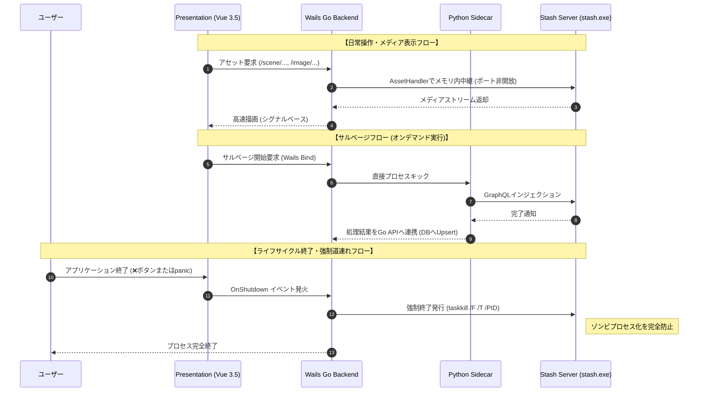
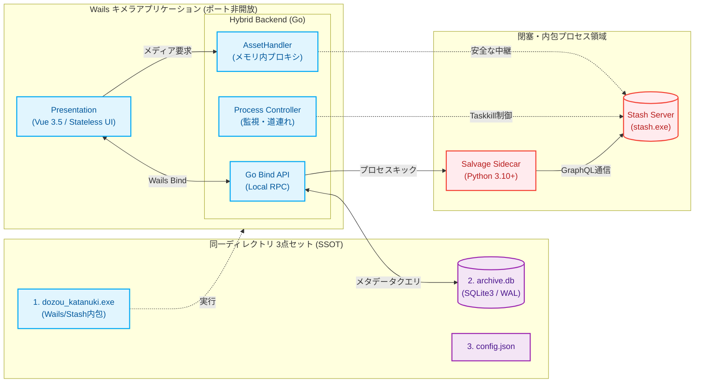

[[← DocWiki ポータル|Home]] | [[次の章: 第2章：外部サービスの概要とサルベージ技術 →|02_external_services_and_salvage]]

### 第1章：技術仕様とバックボーン (Technical Specs & Backbone)

**プロジェクト名** : dozou_katanuki (Wails-Stash Hybrid "土蔵・型抜き" Multi-Format Local Archival System)  
**ドキュメントID** : SPEC-BACKBONE-001  
**バージョン** : 4.0.0 (Wailsキメラデスクトップ統合仕様)  
**作成日** : 2026-08-18  
**ステータス** : 正式仕様（Wailsインメモリプロキシ・ポート非開放・Stashライフサイクル完全同期）

---

#### 1.1 プロジェクトの崇高な目的（動態保存・サルベージ）
公式プラットフォーム（Twitter/X, Instagram, TikTok等）におけるアカウント凍結（BAN）、投稿削除、規約変更によるAPI閉鎖、Webサービス自体の終了などにより、人類のデジタルな足跡や記憶は日々失われています [1]。  
本プロジェクト **dozou_katanuki** は、失われたアカウントや投稿を **Wayback Machine** や **Aria2** などの外部アーカイブ技術・分散ダウンロード技術を駆使してWebの深淵からサルベージ（救出・復元）し、ローカル環境において当時のタイムラインの質感・レスポンスそのままに**「動態保存（動作可能な状態で永続化）」**することを至上命題としています [1]。将来的には特定のプラットフォームに依存せず、あらゆる SNS に対応可能な「汎用動態保存基盤」を目指します [1]。

---

#### 1.2 システムスタックと技術選定
Wails (Go) を中核骨格とし、メディアサーバーである Stash を完全に内包・プロセス管理する「キメラデスクトップアプリ」アーキテクチャを採用しています [2]。外部ポートを不必要に開放せず、メモリ内で安全に結合された堅牢なデスクトップパッケージを提供します [2]。

| レイヤー | 採用技術 / バージョン | 役割・責務 | 通信・アクセス制御 |
| :--- | :--- | :--- | :--- |
| **1. Window Container** | Wails v2 (Go 1.22+) | OSネイティブウィンドウの生成、およびアプリケーション全体のライフサイクル管理（終了時の `taskkill` 強制道連れ） | OSプロセスレベル制御（メモリ内バインド） |
| **2. Presentation** | Vue 3.5 (SFC) + Vite + TS + Tailwind CSS | Stateless Pure View (Dumb UI / 宣言型UI)、シグナルベース高速描画 [2] | Wails内蔵の **AssetHandler** によるポート非開放リソース通信 |
| **3. State & Action** | Vue Composition API + Wails Go Bind | UDF Composable（状態・一方向データフローの保持） [2] | Wails Bind によるローカルメモリ内高速RPC |
| **4. Hybrid Backend** | Go (Wails) + GORM + sqlite3 + Process Controller | **システム全体の頭脳。** Pythonプロセスの起動・監視、生DBデータの RenderTree 変換配信、Stash プロセス制御 [2] | 外部ポート完全廃止、メモリ内ルーティング |
| **5. Core Media Server** | Stash Server (stash.exe) | メディア重複排除、トランスコーディング、HLSストリーミング [2] | Wails AssetHandler 経由のメモリ内リバースプロキシ（外部ポート非公開） |
| **6. Salvage Sidecar** | Python 3.10+ (requests, warcio, GraphQL) | オンデマンド実行 of サルベージ・インジェクションパイプライン（非常駐） [2] | Go Backend から直接プロセスキック。Stash GraphQL とローカル通信 |
| **7. Storage** | SQLite3 (WALモード) | メタデータ高速クエリ、不変リレーション情報の永続化 [2] | **127.0.0.1** ループバック閉塞（外部アクセス遮断） |

---

#### 1.3 ポートマップと内部通信フロー
過去の設計にあった「個別プロキシポート（`:9998` や `:5175`、`:5173` など）」は**すべて廃止**されました [3, 67]。フロント（Vue）とバック（Stash）の通信は、Wails内蔵の **AssetHandler** を用いて、ローカルOSのポートを開放することなく、メモリ内で安全にリバースプロキシします [67]。これにより、ローカルネットワークへの不要なポート露出を防ぎ、ゼロコンフィグと最高水準のセキュリティを両立します [67, 68]。

##### 1. 通信仕様
*   **Wails AssetHandler** : フロントエンド（Vueアセット）のロードおよび Stash の画像・動画配信（`/scene/...`, `/image/...`）を、ポートを一切開けずにメモリ内部のカスタムハンドラーでインターセプトし、安全にリバースプロキシ中継します [3, 67]。
*   **Stash 内部ポート** : `stash.exe` が内部的に起動するポート（デフォルト `:9999`）は、Wails側のプロセス管理下で厳重に秘匿され、外部LANや一般ブラウザからの直接アクセスは遮断されます [67]。

##### 2. 内部通信ネットワーク構造マップ (Mermaid Diagram)

---

#### 1.4 シングルバイナリ＆同階層3点セット（Single Source of Truth）
システムを起動・運用する際、**「同一ディレクトリに存在する以下の3点セット」**が唯一絶対のマスター（Single Source of Truth: SSOT）となります [4, 16]：

1.  **dozou_katanuki.exe** : Wails(Go)がフロントアセット、Stashバイナリ（`stash.exe`）を完全に内包してビルドした、デスクトップアプリケーション本体実行ファイル [16]。
2.  **archive.db** : 整合性チェックをクリアした実稼働 SQLite3 データベース [16, 29]。
3.  **config.json** : システム設定、ストレージパス、Pythonサイドカー起動設定等を統治する一元設定ファイル [16, 67]。

##### 新アーキテクチャのプロセス道連れ終了（Lifeline sync）
キメラアーキテクチャの最大の課題は、親プロセス（Wails）が急死した際、裏で蠢く子プロセス（`stash.exe`）がメモリ内にゾンビとして取り残されるポート競合リスクです [4]。  
本システムは、ユーザーがWailsの画面を「❌」ボタンで閉じたタイミング、または予期せぬ panic 終了を検知した際、バックエンドの `OnShutdown` イベントハンドラにおいてOSレベルの強制終了コマンド（Windows環境：`taskkill /F /T /PID {stash_pid}`）を確実に発行します。これにより、裏の `stash.exe` も一寸の猶予もなく確実に道連れにして即座に完全終了させ、ゾンビプロセスの残存を根絶します [11, 104]。

---

[[← DocWiki ポータル|Home]] | [[次の章: 第2章：外部サービスの概要とサルベージ技術 →|02_external_services_and_salvage]]
