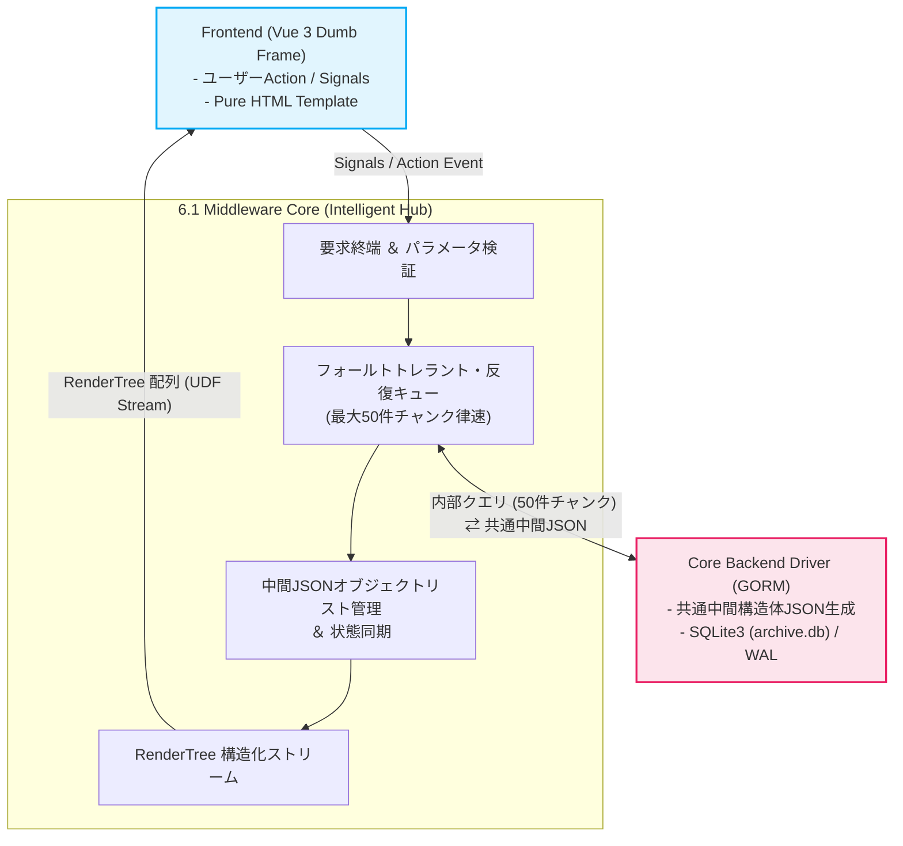

# 6.1 Middleware Core Components（要求オーケストレーションとリスト統治）
**プロジェクト名** : dozou_katanuki (Pluggable UI & Multi-Format Local Archival System "土蔵・型抜き")  
**ドキュメントID** : SPEC-MIDDLEWARE-001-1  
**バージョン** : 4.0.0  
**作成日** : 2026-08-18  
**ステータス** : 正式仕様（Wails v2 キメラアーキテクチャ・要求終端・中間JSONリスト統治・フォールトトレラント反復キュー純化）  

**Navigation** : [← インデックス: 第6章 ミドルウェア層 ポータル](06_0_middleware_index) | [📚 目次 (Home)](Home) | [次の節: 6.2 Data Decorator →](06_2_data_decorator)

---

## 1. 概要とアーキテクチャ上の責務境界
ミドルウェアコア（Middleware Core）は、一切の知性を持たないフロントエンド（Vue 3 Dumb UI）と、物理I/Oをカプセル化したバックエンド（Core Driver）の間に立ち、システム全体のデータオーケストレーションおよびオブジェクトライフサイクルを一元管理する中核エンジンです[cite: 4, 5, 6]。

旧アーキテクチャに存在したポート通信（`:5175`, `:9998`）やSPAフォールバック等のネットワーク・プロキシ責務は、Wailsの外殻（`AssetHandler`）へ完全に委譲・パージされています[cite: 4]。
本コンポーネントは、フロントエンドからの要求を完全に終端（Terminate）し、バックエンドから提供される「共通中間構造体JSON（Unified Normalized JSON）」のリストをメモリ上で統括・反復取得して、フロントエンドへ `RenderTree` リストを一方向（UDF）に供給する責務を負います[cite: 4, 5, 6, 8]。



---

## 2. 入力パラメータ検証と要求解釈仕様
フロントエンドの Composable（`useTimeline.ts` 等）から発行されたデータ取得シグナルを受け取った際、ミドルウェアは直ちに以下の厳格な型安全バリデーションを実施し、不正なクエリを遮断します[cite: 4, 6]。

*   **`platform`（必須）**: プラグインディレクトリに実体が存在する有効な識別子（`"twitter"`, `"instagram"`, `"tiktok"` 等）であるかを検証[cite: 4, 8]。
*   **`account_id`（必須）**: 特定アカウントの `numeric_id`、または全アカウント統合を示す `"all"` であることを検証[cite: 4, 5]。
*   **`filter`（任意）**: `"all"`（全投稿）, `"reposts"`（転載のみ）, `"media"`（メディア付のみ）, `"bookmarks"`（いいね済）のいずれかに完全一致することを検証（デフォルト: `"all"`）[cite: 4, 5]。
*   **`limit`（任意）**: 要求件数を検証。フロントエンドから 50 件を超える要求があった場合でも、後述の反復キューエンジンによって安全に分割処理[cite: 4, 5]。
*   **`offset`（任意）**: `0` 以上の整数値であることを検証[cite: 4, 5]。

---

## 3. フォールトトレラント・反復キューエンジン（律速段階制御）
フロントエンドからの高速スクロールや一括取得要求に対して、ミドルウェアはバックエンドのメモリバーストおよびDBロックを防ぐため、**「フォールトトレラントな律速器（Rate-Limiting Step）」**として機能します[cite: 4, 5]。

### 1. 50件チャンク分割・反復取得アルゴリズム
バックエンド（Core Driver）のデータ抽出インターフェースは、1回の呼び出しにつき最大 `50` 件に制限されています[cite: 4, 5]。フロントエンドがそれ以上の件数（例: 150件）を要求した場合、ミドルウェア内部で以下の反復処理ループ（Iteration Loop）を自動実行します[cite: 4, 5]。

1.  **要求総数の算出**: フロントエンドが要求する目標件数 $N$（例: 150）と開始位置 $Offset$ を設定[cite: 4, 5]。
2.  **チャンククエリ発行**: $\min(N - \text{取得済件数}, 50)$ を 1 チャンクの取得サイズとしてバックエンドへ要求[cite: 4, 5]。
3.  **中間JSONの蓄積**: バックエンドから返却された共通中間構造体JSONの配列を受領し、ミドルウェアの内部バッファへ追記[cite: 4, 5, 8]。
4.  **終了判定**:
    *   取得済件数が目標件数 $N$ に達した時点で反復を終了[cite: 4, 5]。
    *   バックエンドからの返却件数が要求チャンクサイズ未満（DB枯渇 / EOF）となった場合、即座にループを脱出し、取得できた全件を確定[cite: 4, 5]。
5.  **非ブロッキング完遂**: バックエンドへのアクセスが完了するまで要求を握り潰すことなく安全に回収し、メモリバーストを物理的に防ぎながら要求を100%完遂[cite: 4]。

---

## 4. 共通中間構造体JSONの受容とリストライフサイクル統治
ミドルウェア層は、バックエンドの物理リレーショナル構造（SQLite3のテーブル・外部キー構成）に直接依存しません[cite: 5, 9]。

### 1. 共通中間構造体JSON（Unified Normalized JSON）の受容
バックエンドから渡されるデータは、スキーマが隠蔽・正規化された以下の共通中間形式のみです[cite: 5, 8]。

```json
[
  {
    "id": "1879382757924868404",
    "conversation_id": "1879382757924868404",
    "reply_to_id": null,
    "reply_to_handle": null,
    "created_at": "2026-08-17T12:00:00Z",
    "full_text": "Archival process completed! #memory",
    "lang": "en",
    "full_text_ja": "アーカイブ処理が完了しました！ #memory",
    "full_text_en": "Archival process completed! #memory",
    "full_text_zh": "归档处理完成！ #memory",
    "via": "Twitter for Web",
    "is_repost": false,
    "is_liked": true,
    "wayback_url": "https://web.archive.org/web/.../status/1879382757924868404",
    "account": {
      "numeric_id": "1234567890123456789",
      "username": "msluo14",
      "display_name": "Yike Luo",
      "avatar_url": "msluo14_avatar_001",
      "avatar_original_url": "https://pbs.twimg.com/profile_images/.../avatar.jpg"
    },
    "media": [
      {
        "media_id": "eb7ymRi-pfsx5FJH",
        "type": "video",
        "download_url": "https://video.twimg.com/.../eb7ymRi-pfsx5FJH.mp4",
        "width": 1920,
        "height": 1080,
        "download_status": "COMPLETED",
        "failed_reason": null,
        "stash_scene_id": "99b3a7a9-bf0c-4389-9a72-f19b8849646b",
        "stash_image_id": null
      }
    ]
  }
]
```

### 2. オブジェクトリスト管理とフロントエンド・シグナル状態同期
フロントエンド（Vue 3）はDOMの骨組み（HTMLフレーム）を提供するだけであり、画面に表示されている投稿オブジェクト群のライフサイクル（並び順、フィルタリング、動的更新）はミドルウェアが統括します[cite: 6]。

*   **リアクティブ状態同期**:
    フロントエンド上で「いいね（ブックマーク）」や「多言語トグル」などのアクションが発生した場合、Vue 3 シグナルを経由してミドルウェアへ通知されます[cite: 6]。
*   **オンメモリ・リストの更新**:
    ミドルウェアは保持している中間JSONオブジェクトリストの該当要素（`is_liked` や表示言語ステータス）を瞬時に書き換えます[cite: 6]。
*   **非破壊的な再生成**:
    リスト変更に伴い、次節（`6.2 Data Decorator`）の装飾パイプラインを即座に再適用して最新の `RenderTree` 配列を再構築し、フロントエンドへ一方向ストリーム配信します[cite: 4, 6]。

---

## 5. RenderTree への変換と UDF ストリーム供給
ミドルウェアコアは、整列・取得された共通中間構造体JSONリストを `Data Decorator` および `Plugin Orchestrator` へバトンタッチし、フロントエンドがそのままバインド可能な完全完成品である `RenderTree[]` を組み立てます[cite: 4, 6]。

*   **ゼロ・ロジック描画の保証**: フロントエンド側で文字列パース、リンク生成、メディアURLの組み立てなどの演算処理を一切行わせない構造を担保します[cite: 6]。
*   **単一データフロー（UDF）の遵守**: 完成した `RenderTree` 配列は、フロントエンドの Composable 層（State）へ向けて一方向のみに流し込まれ、Stateless Pure View のテンプレートへ宣言的に展開されます[cite: 6]。

---
**Navigation** : [← インデックス: 第6章 ミドルウェア層 ポータル](06_0_middleware_index) | [📚 目次 (Home)](Home) | [次の節: 6.2 Data Decorator →](06_2_data_decorator)