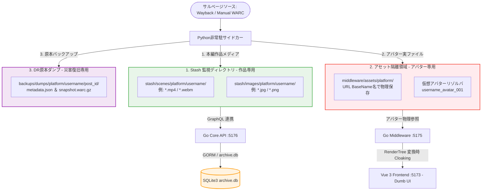

# 第8章：ローカルストレージ保全とメディアポリシー (Storage Persistence & Media Policy)
**プロジェクト名** : dozou_katanuki (Pluggable UI & Multi-Format Local Archival System "土蔵・型抜き") Pluggable UI & Multi-Format Archival System)  
**ドキュメントID** : SPEC-STORAGE-001  
**バージョン** : 3.1.0  
**作成日** : 2026-08-17  
**ステータス** : 正式仕様（アバター露出隠蔽・3桁世代リゾルバ・Stash完全分離統合・クレンジングアルゴリズム詳細化）

**Navigation** : [← 前の章: 第7章：ドライバー層（Core Backend API）](07_robust_backend_driver_and_api_v4) | [📚 目次 (Home)](Home) | [次の章: 第9章：プラグインアーキテクチャとサイドカー →](09_plugin_architecture_and_sidecar_v3)

--------------------------------------------------------------------------------

## 8.1 概要と物理永続化ストレージ階層マップの厳格定義
本システムは、日本の著作権法第30条（私的使用のための複製）を厳格に遵守したローカル完結型アーカイブとして、Wayback Machineや手動インポートされたWARCコンテナからサルベージしたメディア（高解像度動画・画像・アバター等）を永続的に保全・ストリーミングします。

システム全体の物理ストレージプールは、以下の**「作品（本編）メディア」「アバター＆UIアセット」「原本ダンプ（DR用）」**の3つの独立した配置ルールに完全隔離され、ディレクトリ衝突を100%防止する構造に統制されます。



### 物理ストレージ階層およびマッピング設計
一元設定ファイル `config.json` に設定された基準パスをルートとして、以下の物理マッピングが自動適用されます。
*   `{storage_root}/stash/`（Stashappの作品監視ディレクトリ / Stash Library）
    *   `scenes/{platform}/{username}/` : 本編動画・GIFアニメーション実ファイル（例: `eb7ymRi-pfsx5FJH.mp4`）
    *   `images/{platform}/{username}/` : 本編静止画・Lightbox原画実ファイル（例: `F8wZ1abXYAAY7kL.jpg`）
*   `{middleware_root}/assets/{platform}/`（アセット隔離ディレクトリ）
    *   `{username}_avatar_{seq:03d}.jpg` などの実体ファイル（Stashの監視スコープから100%除外）
*   `{backup_root}/dumps/{platform}/{username}/{post_id}/`（DR（災害復旧）原本ダンプ）
    *   `metadata.json` : 共通中間JSONデータ（不変）
    *   `snapshot.warc.gz` : `warcio` にてフェッチ時に同時キャプチャされた生通信パケット原本

--------------------------------------------------------------------------------

## 8.2 URL BaseName 命名原則と拡張子クレンジングアルゴリズム
スクレイパー（Python）、Core Backend（Go）、Stashapp（C++）、およびフロントエンド（Vue 3）間でアセットの同一性を \\(O(1)\\) で照合・追跡するため、**「オリジナルのアセット取得URLの末尾（BaseName）をそのまま物理ファイル名および media_id とする」**原則を厳格に適用します。

### 1. なぜURL BaseNameなのか？
*   **キャッシュ判定の高速化**：
    Wayback Machineや本家SNSのCDNからメディアをダウンロードする際、独自のプレフィックス（例: `{tweet_id}_image.jpg`）でリネームして保存してしまうと、後から「このメディアはすでにローカルに保存済みか？」を照合する際にURLベースでの突合が不可能になり、無駄な再ダウンロードやDBの重複割当が発生します。
*   **原本性の保証**：
    ファイル名を不変のURL末尾（例: `eb7ymRi-pfsx5FJH.mp4`）に固定しておくことで、データベース再構築（ディザスタリカバリ）時にもメタデータと実ファイルを寸分の狂いもなく1対1で自動再バインド（Reconciliation）できます。

### 2. 拡張子およびクエリパラメータのクレンジングアルゴリズム (Cleansing Algorithm)
現実のSNS（特にX/Twitterの画像など）は、`https://pbs.twimg.com/media/F8wZ1abXYAAY7kL?format=jpg&name=orig` のように、末尾に拡張子がなく、クエリパラメータでフォーマットを指定する不規則なURL構造を持ちます。
これをそのままファイル名として保存するとファイルシステムやWebサーバーで正常に認識されないため、以下の**「URLクレンジングアルゴリズム」**をPythonおよびGoの共通規約として義務付けます。

```python
# Pythonサイドカー（Scraper/Mutator）共通実装アルゴリズム
import re
from urllib.parse import urlparse, parse_qs

def clean_media_url_to_basename(url: str) -> tuple[str, str]:
    """
    URLを解析し、一意なBaseName(media_id)とクレンジングされた拡張子を返却する
    Input:  "https://pbs.twimg.com/media/F8wZ1abXYAAY7kL?format=jpg&name=orig"
    Output: ("F8wZ1abXYAAY7kL.jpg", "jpg")
    """
    parsed = urlparse(url)
    path = parsed.path
    query = parse_qs(parsed.query)
    
    # パス末尾のファイル名
    filename = path.split('/')[-1]
    
    # 拡張子の判定
    ext = ""
    if '.' in filename:
        ext = filename.split('.')[-1].lower()
        media_id = filename
    elif "format" in query:
        # クエリパラメータに "format" がある場合 (Twitter CDN)
        ext = query["format"][0].lower()
        media_id = f"{filename}.{ext}"
    else:
        # 拡張子が特定できない場合のデフォルトフォールバック
        ext = "jpg"
        media_id = f"{filename}.{ext}"
        
    # 安全なファイル名（不正記号の除去、記号はアンダースコアに）
    media_id = re.sub(r'[\\/*?:"<>|]', '_', media_id)
    return media_id, ext
```

--------------------------------------------------------------------------------

## 8.3 仮想アバターリゾルバ（0埋め3桁世代管理）とアバター露出隠蔽ポリシー
本システムは、外部SNSのサーバー凍結やアカウント削除、ネットワーク非接続環境（完全ローカル）でも、タイムライン上でアバター画像が非表示（破れた画像アイコン）になることを防ぐため、**「アバター露出隠蔽ポリシー（Avatar Cloaking Policy）」**を厳格に適用します。

### 1. アバター画像「保全・隠蔽・配信」の3レイヤー連携
生のURLを基礎原本データとして安全に保全しつつ、フロントエンドへは解決済みの完全相対パスのみを露出させます。

1.  **原本の保全 (Pythonサイドカー ➔ SQLite3)**：
    *   Pythonスクレイパーは、Waybackからアバターの実ファイル（例: `9Kx_8Y7z_400x400.jpg`）を取得して、ローカルアセット隔離領域（`middleware/assets/{platform}/`）に物理保存します。
    *   Core Backend API (:5176) の `POST /api/posts` へ送信する共通中間JSONには、追跡用原本データとして**生のオリジナルURLをそのまま乗せて**送信します。
2.  **GORMでの世代カウントアップフック (Core Backend :5176)**：
    *   実データベースの `accounts`、`account_profile_history` には、生のオリジナルURLをそのまま保存します。
    *   データベース書き込み時、新規アバターURLの変更を検知すると、GORMは自動的に `avatar_seq` をカウントアップし、`account_profile_history` に履歴として安全に永続化します。

### 2. 世代解決・仮想アバターキーの解決アルゴリズム (GORM BeforeSave フック / Go)
Core Backend (:5176) 内における、アバター世代判定と仮想キー解決の具体的なコードロジックです。

```go
package models

import (
	"fmt"
	"gorm.io/gorm"
	"time"
)

// AccountProfileHistory の保存前に走るGORMフック
func (h *AccountProfileHistory) BeforeCreate(tx *gorm.DB) (err error) {
	var lastHistory AccountProfileHistory
	// 該当アカウントの最後の履歴を取得
	err = tx.Where("account_id = ?", h.AccountID).Order("avatar_seq desc").First(&lastHistory).Error
	
	if err == gorm.ErrRecordNotFound {
		// 初回登録の場合
		h.AvatarSeq = 1
	} else if err == nil {
		// アバターURLが変更されているか検証
		if lastHistory.AvatarOriginalURL != h.AvatarOriginalURL {
			h.AvatarSeq = lastHistory.AvatarSeq + 1
		} else {
			// URLが同一の場合は世代を維持
			h.AvatarSeq = lastHistory.AvatarSeq
		}
	} else {
		return err
	}
	
	// 0埋め3桁サフィックス付き仮想キー（{username}_avatar_{seq:03d}）の自動解決
	h.AvatarVirtualKey = fmt.Sprintf("%s_avatar_%03d", h.Username, h.AvatarSeq)
	h.CreatedAt = time.Now()
	return nil
}
```

### 3. タイムライン表示時のアバター復元アルゴリズム (Middleware Hub :5175)
タイムライン（`RenderTree`）を構築する際、ミドルウェアは各ツイートの投稿日時（`tweets.created_at`）と、アバターの各世代の観測日時（`account_profile_history.created_at`）を照合します。

$$\text{TargetSeq} = \max \left\{ \text{seq} \mid \text{history.created\_at} \le \text{tweet.created\_at} \right\}$$

これにより、**「そのツイートが投稿された瞬間に、ユーザーが設定していたアバター（世代）」**を正確に割り出し、該当する `{username}_avatar_{seq:03d}` パスを `RenderTree.author.avatar_url` に設定します。ユーザーが現在アバターを変更していても、過去の投稿に対しては当時のアイコンでタイムラインが完璧に描画されます。

```go
// Go Middleware (:5175) での時系列アバター解決ロジック
func ResolveAvatarForTweet(tweetCreatedAt time.Time, histories []AccountProfileHistory) string {
	if len(histories) == 0 {
		return "/assets/default_avatar.jpg"
	}
	
	// 投稿日時以前の最新の履歴を探索
	resolvedKey := ""
	for _, history := range histories {
		if history.CreatedAt.Before(tweetCreatedAt) || history.CreatedAt.Equal(tweetCreatedAt) {
			resolvedKey = history.AvatarVirtualKey
			break // 降順で取得しているため、最初に見つかったものが最新
		}
	}
	
	// 万が一、最初の登録以前のツイートだった場合は最古の履歴を割り当てる
	if resolvedKey == "" {
		resolvedKey = histories[len(histories)-1].AvatarVirtualKey
	}
	
	return fmt.Sprintf("/assets/twitter/%s", resolvedKey)
}
```

--------------------------------------------------------------------------------

## 8.4 Stashとアバターの完全物理分離規約 (Avatar Isolation Policy)
Stashapp メディアサーバー（:9999）は、「高解像度の本編作品メディア（Scene/Image）」を管理し、重複排除・トランスコード・HLSストリーミングを提供することに特化したエンジンです。

ここに解像度が低く数も多いプロフィールアバター（アイコン）画像を混入させることは、**「Stashのライブラリ（Scene / Image テーブル）を著しく汚染するスパム行為」**であり、システム設計上、**厳格に禁止（Avatar Isolation Policy）**します。

### 1. 隔離・パージの徹底
*   **アバター画像の除外**：
    アバター実ファイルはすべて `middleware/assets/{platform}/` に配置され、Stashのメディアスキャン監視フォルダ（`stash/`）の対象から物理的に完全に隔離します。Stash GraphQL APIを叩いてアバター画像を登録する行為は1行たりとも書いてはなりません。
*   **Stashライブラリのクリーン性維持**：
    Stashの画像グリッド、サムネイル一覧、および作品検索にアバター画像がノイズとして紛れ込むのを100%遮断し、大容量の作品コレクションのみを高速・最適にストリーミングできる高画質なメディアプール環境を保護します。

--------------------------------------------------------------------------------

## 8.5 標準タイトル規約とGraphQL逆引き自動バインド処理
Stashapp 内で動画（Scene）や静止画（Image）を美しく整理し、相互バインド処理の自動化（Reconciliation）をミリ秒単位で高速化するため、Stashにインジェクションする際のメタデータのタイトル（Title）は、以下の標準フォーマットに統一します。

### 1. 標準タイトル定義フォーマット
$$\text{Title} = \text{\{Platform\} (\\{@Username\\}): \{Type\} \{PostID\}}$$
*   **実例 (Twitter)** : `X (@msluo14): Tweet 1879382757924868404`
*   **実例 (Instagram)** : `Instagram (@yike_luo): Post 123456789012345`

### 2. GraphQL逆引き自動バインドアルゴリズム
Pythonサイドカー（Downloader）がStashにメディア実ファイルを投入した後、GORMデータベース側へその Stash ID を書き戻すための逆引き自動バインド処理を実行します。
タイトル文字列から正規表現を用いてメタデータを安全に復元・照合するロジックを以下に規定します。

```python
# wayback_tweet_rescure/core/downloader.py で実行される逆引き同期
import re
import requests

STASH_GRAPHQL_URL = "http://localhost:9999/graphql"

def reconcile_stash_ids_to_sqlite(core_backend_url: str):
    """
    Stashの全シーン/全画像を走査し、標準タイトルから投稿IDを逆引きして
    Core Backend API経由でSQLite3のmediaテーブルへStash IDを書き戻す
    """
    # 1. Stashから全SceneのIDとTitleを取得するGraphQLクエリ
    query = """
    query {
      allScenes {
        id
        title
      }
    }
    """
    response = requests.post(STASH_GRAPHQL_URL, json={'query': query})
    scenes = response.json()['data']['allScenes']
    
    # 標準タイトル解析用正規表現
    title_pattern = re.compile(r'^([A-Za-z0-9]+)\s\(@([A-Za-z0-9_]+)\):\s([A-Za-z]+)\s([0-9]+)$')
    
    for scene in scenes:
        title = scene['title']
        match = title_pattern.match(title)
        if match:
            platform, username, post_type, post_id = match.groups()
            stash_scene_id = scene['id']
            
            # Core Backend API (:5176) を叩いてSQLiteにStash IDを書き戻し（自動バインド）
            bind_url = f"{core_backend_url}/api/posts/bind-media"
            requests.post(bind_url, json={
                "post_id": post_id,
                "platform": platform.lower(),
                "stash_scene_id": stash_scene_id,
                "type": "video"
            })
```

### 3. この標準フォーマットがもたらす技術的メリット
1.  **自動逆引きマッピングの極大化**：
    Stashのデータベース側から、物理パスやファイル名を直接パースすることなく、タイトル文字列に対して正規表現を適用するだけで、プラットフォーム、ユーザー名、投稿IDを瞬時に特定・紐付けできます。
2.  **Stash Web UI上での検索効率向上**：
    Stash本来の強力なインクリメンタル検索窓で、`@msluo14`、`Tweet`、`Instagram` などのワードを入力するだけで、対象メディアが極めて正確に瞬時フィルタリングされます。
3.  **マルチプラットフォームの衝突回避**：
    異なるSNSで万が一同じ数値の投稿ID（PostID）がコンフリクトした場合でも、タイトルプレフィックスによって完全に名前空間が分かれるため、リレーションの紐付けエラーが100%防止されます。

**Navigation** : [← 前の章: 第7章：ドライバー層（Core Backend API）](07_robust_backend_driver_and_api_v4) | [📚 目次 (Home)](Home) | [次の章: 第9章：プラグインアーキテクチャとサイドカー →](09_plugin_architecture_and_sidecar_v3)
