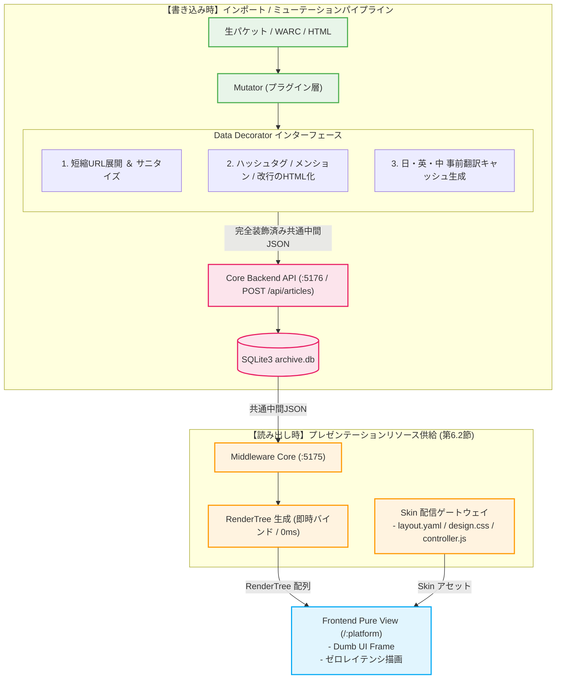
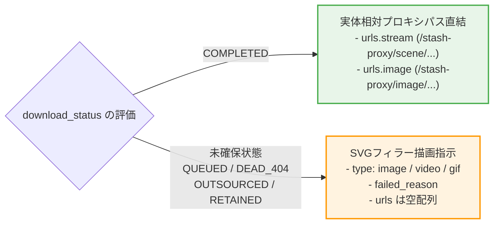

# 第3編 第3章.2：Data & Skin Decorator（描画データ装飾とスキン配信）
**プロジェクト名** : dozou_katanuki (Pluggable UI & Multi-Format Local Archival System "土蔵・型抜き")  
**ドキュメントID** : SPEC-MIDDLEWARE-001-2  
**バージョン** : 4.0.0  
**作成日** : 2026-08-18  
**ステータス** : 正式仕様（Wails v2 キメラアーキテクチャ・プラグインインターフェース・Skin配信統合・ゼロレイテンシ純化）  

**Navigation** : [← 前の節: 6.1 Middleware Core Components](part3_03_1_middleware_core) | [📚 目次 (Home)](Home) | [次の節: 6.3 Job & Process Orchestrator →](part3_03_3_job_orchestrator)

---

## 1. 概要とプレゼンテーションリソース供給の責務
Data & Skin Decorator は、フロントエンドの一般View（タイムライン画面）が描画を行うために必要な「装飾済みデータ（`RenderTree`）」および「表示定義スキン（Layout / CSS / JS）」を一元的に供給するゲートウェイです[cite: 1]。

描画時の動的パースによるレイテンシ遅延を物理的に根絶するため、重たいテキスト装飾、短縮URL展開、多言語翻訳キャッシュの生成はすべて**「インポート／ミューテーション時（ドライバー層へのPOST時）」にディスパッチされて確定・永続化**されます[cite: 1]。フェッチ時のミドルウェアは、確定済みの構造体を $O(1)$ のゼロコストで `RenderTree` に詰め替えてフロントエンドへ流すだけのゼロレイテンシ供給を実現します[cite: 1]。



---

## 2. テキスト・短縮URL・HTMLリンク事前デコレーション規約
プラグイン層の Mutator は、共通中間構造体JSONを組み立てる段階で以下の装飾ルールを一括適用します[cite: 1]。フロントエンドでの実行時正規表現パースは一切禁止されます。

*   **短縮URL展開**: `url_redirects` 等の逆引き解決に基づき、テキスト内の短縮URL（`t.co` 等）を展開後の完全なURL文字列へ置換[cite: 1]。
*   **ハッシュタグのリンク化**:
    `#(\w+)` ➔ `<a href="/:platform/search?q=$1" class="hashtag-link">#$1</a>`[cite: 1]
*   **メンションのリンク化**:
    `@([a-zA-Z0-9_]+)` ➔ `<a href="/:platform/$1" class="mention-link">@$1</a>`[cite: 1]
*   **改行コードのDOM展開**:
    `\n` ➔ `<br/>` への安全なHTML展開コード化[cite: 1]。

---

## 3. 多言語事前翻訳キャッシュの確定と永続化
インポート時、Mutator 内のデコレータモジュールが日・英・中の 3 大言語翻訳を実行し、共通中間構造体JSONの `full_text_ja`, `full_text_en`, `full_text_zh` カラムに確定データとしてバインドします[cite: 1]。

```json
{
  "full_text": "Past log automatic archival test complete! #memory",
  "full_text_ja": "過去ログの自動アーカイブテスト完了！ <a href=\"/twitter/search?q=memory\" class=\"hashtag-link\">#memory</a>",
  "full_text_en": "Past log automatic archival test complete! <a href=\"/twitter/search?q=memory\" class=\"hashtag-link\">#memory</a>",
  "full_text_zh": "过去日志自动归档测试完成！ <a href=\"/twitter/search?q=memory\" class=\"hashtag-link\">#memory</a>"
}
```
[cite: 1]

*   **データベースへの書き込み**: Core API（`POST /api/articles`）経由でこれらを不変キャッシュとして永続化[cite: 1]。
*   **フロントエンドでのゼロレイテンシ切り替え**: フェッチ時に `RenderTree.content` ハッシュへそのままマップされるため、画面上での言語切り替えはネットワーク通信も再装飾も走らず、完全ローカルでミリ秒トグルされます[cite: 1]。

---

## 4. 仮想アバター解決 ＆ 露出隠蔽インターフェース
アバター画像の外部依存を遮断し、完全ローカル保全と過去ログの時代背景を再現するため、以下の世代管理ルールをインターフェースとして規定します[cite: 1]。

1.  **原本の保全（Mutator ➔ バックエンド）**:
    *   Pythonスクレイパーが実ファイルを `assets/` に保存し、生URL（`avatar_original_url`）と共にバックエンドへ送信。
2.  **世代キーの自動採番（バックエンド GORM）**:
    *   URL変更を検知した場合のみ `avatar_seq` をカウントアップし、仮想アバターキー `{username}_avatar_{seq:03d}`（例: `msluo14_avatar_002`）を決定して保存。
3.  **RenderTree への露出隠蔽バインド（ミドルウェアフェッチ時）**:
    *   フロントエンドへ渡す `RenderTree.author.avatar_url` には、完全相対パス **/assets/{platform}/{username}_avatar_{seq:03d}.jpg** のみをセットし、生URLはフロントから完全に隠蔽[cite: 1]。

---

## 5. メディア確保ライフサイクルとSVGフィラー指示の構造化
添付メディアの定常状態は Stash 登録済みの `COMPLETED` です。デコレータインターフェースは、メディアの確保状態（`download_status`）に応じて `RenderMedia` の構造をシンプルに確定させます。



*   **定常状態（`COMPLETED`）**:
    *   Stash UUID に基づく完全相対パス（`/stash-proxy/...`）を `RenderMedia.urls` に直結[cite: 1]。
*   **未確保状態（`QUEUED`, `DEAD_404`, `OUTSOURCED`, `RETAINED`）**:
    *   実体 URL を空にし、メディア種別（`type`）とエラー理由（`failed_reason`）を指示情報として格納。フロントエンドはこれに基づき、カメラ・ビデオ・GIF を象った軽量 SVG プレースホルダーを宣言的に描画。

---

## 6. 中間JSONから RenderTree への即時転送規約（Go Renderer）
フェッチ時、ミドルウェア（Go）は既に装飾済みの共通中間構造体JSONを受け取り、パース処理を挟むことなく $O(1)$ で `RenderTree` に詰め替えて一方向（UDF）にストリームします[cite: 1]。

```go
package renderer

import (
	"fmt"
	"dozou_katanuki/middleware/models"
)

// ToRenderTree は装飾済みの中間JSONを即座に RenderTree へマッピングします (ゼロパース)
func ToRenderTree(item models.UnifiedNormalizedJSON, platform string) models.RenderTree {
	return models.RenderTree{
		ID:             item.ID,
		ConversationID: item.ConversationID,
		CreatedAt:      item.CreatedAt.Format("2006-01-02T15:04:05Z07:00"),
		Content: models.RenderContent{
			Original: item.FullText,   // インポート時にリンク化・サニタイズ完了済み
			JA:       item.FullTextJA, // インポート時に翻訳・リンク化完了済み
			EN:       item.FullTextEN,
			ZH:       item.FullTextZH,
		},
		Author: models.RenderAuthor{
			NumericID:   item.Account.NumericID,
			Handle:      item.Account.Username,
			DisplayName: item.Account.DisplayName,
			AvatarURL:   fmt.Sprintf("/assets/%s/%s.jpg", platform, item.Account.AvatarURL),
			Bio:         item.Account.Bio,
		},
		Media:     mapMediaToRenderMedia(item.Media),
		IsLiked:   item.IsLiked,
		SourceURL: item.WaybackURL,
	}
}
```

---

## 7. スキンアセット（Skin Delivery）配信ゲートウェイ
フロントシェルからの動的なスキン要求を受け、ミドルウェアは `plugins/{platform}/skin/` 直下のアセットを透過的にサーブします[cite: 1]。

*   **`GET /api/plugins/{platform}/skin/layout`**: `layout.yaml` を配信（コンポーネントの配置構成定義）[cite: 1]。
*   **`GET /api/plugins/{platform}/skin/design`**: `design.css` (MIME: `text/css`) を配信（プラットフォーム固有デザイン）[cite: 1]。
*   **`GET /api/plugins/{platform}/skin/controller`**: `skin/controller.js` (MIME: `application/javascript`) を配信（スレッド探索やカルーセル操作）[cite: 1]。

---
**Navigation** : [← 前の節: 6.1 Middleware Core Components](part3_03_1_middleware_core) | [📚 目次 (Home)](Home) | [次の節: 6.3 Job & Process Orchestrator →](part3_03_3_job_orchestrator)