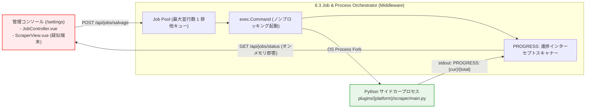

# 第3編 第3章.3：Job & Process Orchestrator（管理コンソール向け非同期ジョブ制御）
**プロジェクト名** : dozou_katanuki (Pluggable UI & Multi-Format Local Archival System "土蔵・型抜き")  
**ドキュメントID** : SPEC-MIDDLEWARE-001-3  
**バージョン** : 4.0.0  
**作成日** : 2026-08-18  
**ステータス** : 正式仕様（Wails v2 キメラアーキテクチャ・管理コンソール専用・非同期サブプロセス制御純化）  

**Navigation** : [← 前の節: 6.2 Data & Skin Decorator](part3_03_2_data_decorator) | [📚 目次 (Home)](Home) | [次の章: 第3編第4章 ドライバー層（Core Backend & Data Abstraction） →](part3_04_backend_driver)

---

## 1. 概要と管理コンソール（Admin Board）連携
Job & Process Orchestrator は、管理・設定画面（フロントエンド `/settings`）からの指示を受け、Python非常駐サイドカー（Scraper / Mutator / Downloader）を独立したOSサブプロセスとして安全に起動・監視する**管理専用ジョブエンジン**です[cite: 1, 3, 5]。

純粋なデータアクセスに徹するドライバー層（:5176）を保護し、ミドルウェア層が非同期実行、排他制御、標準出力スキャンを一元統治します[cite: 1, 5]。



---

## 2. 非同期サブプロセス起動と排他制御仕様
多重実行によるCPU負荷バーストやネットワーク帯域のパンクを100%遮断するため、以下の制御規約を適用します[cite: 1, 5]。

*   **最大並行数 `1` の厳格なキュー管理**: 同時に起動できるPythonプロセスは常に1つに制限され、実行中の多重リクエストは拒絶またはキューイングされます[cite: 1, 5]。
*   **ノンブロッキング実行**:
    ```go
    // 独立したサブプロセスとしてノンブロッキング起動
    cmdPath := fmt.Sprintf("plugins/%s/scraper/main.py", platform)
    cmd := exec.CommandContext(ctx, "python", append([]string{cmdPath}, args...)...)

    stdoutPipe, err := cmd.StdoutPipe()
    if err != nil {
        return nil, err
    }
    if err := cmd.Start(); err != nil {
        return nil, err
    }
    go j.scanStdoutProgress(jobID, stdoutPipe, cmd)
    ```
  [cite: 1, 5]

---

## 3. stdout インターセプトスキャンと疑似ターミナル連携
Pythonプロセスが標準出力に出力する構造化文字列をインターセプトし、オンメモリで追跡します[cite: 1, 5]。

$$\text{PROGRESS: } \{\text{current\_index}\}/\{\text{total\_count}\} \mid \{\text{message}\}$$
*(例: `PROGRESS: 23/50 | Media ID eb7ymRi... Injected to Stash`)*[cite: 5]

*   **オンメモリ追跡**: `bufio.Scanner` でリアルタイムに進捗率（%）と最新メッセージをオンメモリに保持[cite: 1, 5]。
*   **管理コンソール（`ScraperView.vue`）即時応答**: フロントエンドのポーリング要求に対し、DBを介さずミリ秒で進捗ステータスを返却[cite: 1, 3, 5]。

---

## 4. 管理コンソール専用 API エンドポイント
*   **`POST /api/jobs/salvage`**: 自動サルベージジョブの非同期キック（入力: `platform`, `account`, `limit`）[cite: 5]。
*   **`POST /api/jobs/import-manual`**: 手動WARCインポートジョブの非同期キック（入力: `warc_path`, `offline`）[cite: 5]。
*   **`GET /api/jobs/status?id={job_id}`**: 進行中ジョブのリアルタイム進捗率・ステータス取得[cite: 5]。

---
**Navigation** : [← 前の節: 6.2 Data & Skin Decorator](part3_03_2_data_decorator) | [📚 目次 (Home)](Home) | [次の章: 第3編第4章 ドライバー層（Core Backend & Data Abstraction） →](part3_04_backend_driver)