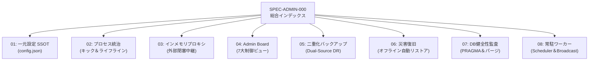

[← 第1編第4章：実装規約・制約原則](part1_04_implementation_principles) | [📚 目次 (Home)](Home) | [01 一元設定仕様 →](part2_01_01_config)

# 第2編 第1章：管理・設定・ディザスタリカバリ運用 総合インデックス

**ドキュメントID** : SPEC-ADMIN-000  
**バージョン** : 4.0.0 (Wailsキメラデスクトップ アトミック統合仕様)

---

## 1. 概要とレイヤー責務 (第5層: Admin & Governance)
本レイヤーは、日常のタイムライン描画やデータ中継には関与せず、**「システム設定の一元統治、WailsとStashのライフライン同期、DB監査、自動スケジューリング、災害復旧」**に特化した最上位ガバナンス階層です。

## 2. アトミック仕様構成マップ

## 3. アトミック仕様リンク一覧
* [[SPEC-CONFIG-001: 一元設定ポータル (config.json) 仕様|part2_01_01_config]]
* [[SPEC-LIFECYCLE-001: Wails-Stash プロセスライフサイクル制御仕様|part2_01_02_lifecycle]]
* [[SPEC-PROXY-001: Wails インメモリプロキシ（閉塞通信）仕様|part2_01_03_proxy]]
* [[SPEC-ADMINBOARD-001: Settings UI (7大制御ビュー) ＆ Scraper View 仕様|part2_01_04_admin_board]]
* [[SPEC-BACKUP-001: 二重化バックアップ（Dual-Source DR）仕様|part2_01_05_backup]]
* [[SPEC-RECOVERY-001: 災害復旧（完全オフライン自動リストア）手順|part2_01_06_recovery]]
* [[SPEC-AUDIT-001: SQLite3 整合性監査＆パージプロトコル|part2_01_07_audit]]
* [[SPEC-SCHEDULER-001: 常駐スケジューラー＆キャスト配信仕様|part2_01_08_scheduler]]

---

[← 第1編第4章：実装規約・制約原則](part1_04_implementation_principles) | [📚 目次 (Home)](Home) | [01 一元設定仕様 →](part2_01_01_config)
