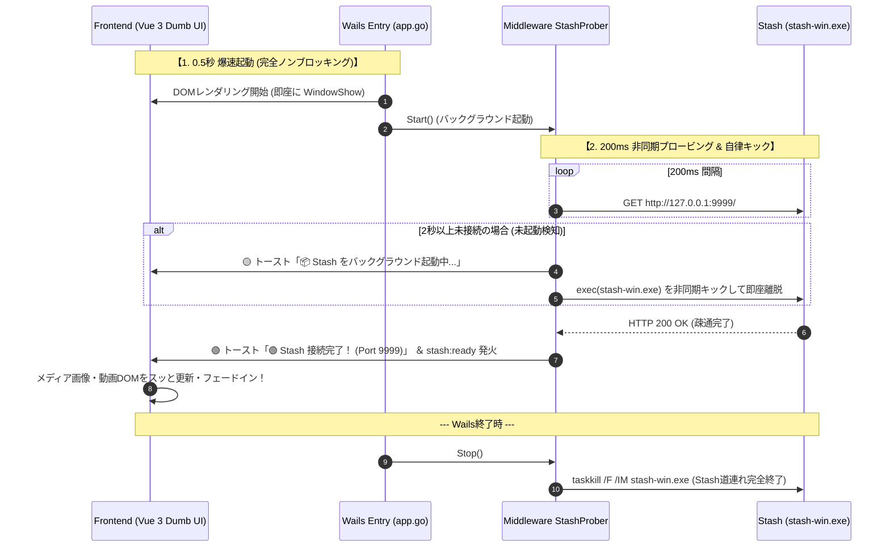

[[← 01 一元設定仕様|part2_01_01_config]] | [[📚 目次 (Home)|Home]] | [[03 インメモリプロキシ仕様 →|part2_01_03_proxy]]

# SPEC-LIFECYCLE-001: Wails-Stash プロセスライフサイクル制御仕様

## 1. 起動・終了シーケンス (Non-blocking Prober & Lifeline Sync)

## 2. プロセス制御規約
* **完全ノンブロッキング**: Wails の `startup` / `domReady` では Stash 起動を一切同期待機せず、0.5秒未満で即座にUIを展開。
* **ミドルウェア層プローバー**: `middleware.StashProber` が 200ms 間隔でポート 9999 を非同期プロービングし、未起動時は自律キック、セルフリブート時も自動追従。
* **トースト＆DOM更新連携**: 接続完了・切断・自動起動ステータスをUIトーストにリアルタイム通知し、メディアDOMを安全に再描画。
* **道連れ終了**: 親ウィンドウ終了時（`OnShutdown`）に確実に `taskkill /F /IM stash-win.exe` を発行してゾンビプロセスを完全根絶。

---

[[← 01 一元設定仕様|part2_01_01_config]] | [[📚 目次 (Home)|Home]] | [[03 インメモリプロキシ仕様 →|part2_01_03_proxy]]
