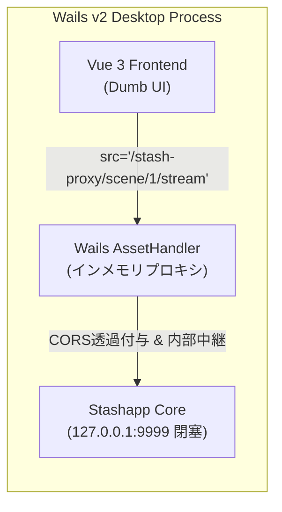

[[← 02 プロセス制御仕様|part2_01_02_lifecycle]] | [[📚 目次 (Home)|Home]] | [[04 Admin Board仕様 →|part2_01_04_admin_board]]

# SPEC-PROXY-001: Wails インメモリプロキシ（閉塞通信）仕様

## 1. 外部プロキシポートの完全閉塞
従来の設計にあった外部公開プロキシポート（`:9998` 等）を全廃し、Wailsの `AssetHandler` を用いて **Goのメモリ内部でリバースプロキシを展開** します。これにより、外部からの不正アクセスやポート競合をゼロにします。

## 2. インメモリ・リバースプロキシ中継仕様

* **パス書き換え**: フロントエンドの `/stash-proxy/*` 要求を `http://127.0.0.1:9999/*` へメモリ内中継。
* **CORS透過無効化**: Same-Origin Policy を満たすHTTPヘッダーを内部自動付与し、ゼロレイテンシ再生を実現。

---

[[← 02 プロセス制御仕様|part2_01_02_lifecycle]] | [[📚 目次 (Home)|Home]] | [[04 Admin Board仕様 →|part2_01_04_admin_board]]
