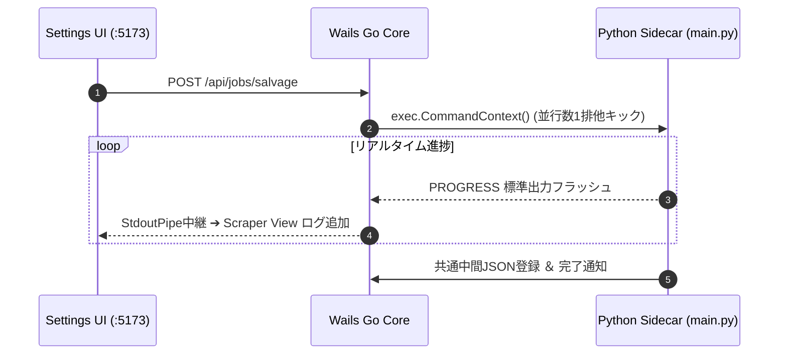

[[← 03 インメモリプロキシ仕様|part2_01_03_proxy]] | [[📚 目次 (Home)|Home]] | [[05 二重化バックアップ仕様 →|part2_01_05_backup]]

# SPEC-ADMINBOARD-001: Settings UI (7大制御ビュー) ＆ Scraper View 仕様

## 1. Dumb UI原則に基づく責務
Vue 3 フロントエンドは状態ロジックを持たず、Actionイベント発行と表示に徹します。

## 2. 管理画面の「7大制御ビュー」
1. **Job コントローラー ＆ Scraper View**: サルベージキック、StdoutPipeによるリアルタイム進捗ログ疑似端末。
2. **Whitelist 管理ビュー**: 対象アカウント・キーワードのCRUDおよびトグル。
3. **個別記事編集ビュー**: 3言語翻訳テキスト（`full_text_ja/en/zh`）の手動微調整・保存。
4. **Stashスマート別窓・LAN導線**: 接続元クライアントのアクセスホスト（`window.location.hostname`）に応じて動的解決される `http://{hostname}:{stash_port}/` への `_blank` 誘導およびURLワンクリックコピー。LAN内端末からも誤作動なくStash WebUIを開通。
5. **デフォルトCSSエディタ**: `plugins/{platform}/skin/design.css` のブラウザ直接編集・上書き。
6. **フォント微調整パネル**: 日・英・中の優先フォントをCSSカスタム変数へ動的シグナル同期。
7. **「Stash使わんし！」モードトグル**: `storage.stash_enabled` のワンクリック切り替え。

## 2.1 メディア管理ビュー（MediaManagementView）における 2ペイン大画面インスペクタ ＆ Stash GraphQL メタデータ安全ミューテーション仕様
メディア管理画面（`DatabaseView` ➔ `MediaManagementView`）におけるメディアタップ時の挙動と Stash 動線・メタデータ管理は、**「大画面メディアビューア（左）＋ 詳細インスペクタ＆エディタ（右）」の2ペイン構成**として統一・担保されます：

1. **大画面メディアビューア ＆ 安定再生（左ペイン: 約65%）**:
   - 従来の「ダイアログ内にさらにダイアログを埋め込むことでメディアが小さく縮小される問題」を完全撤廃し、`max-w-[96vw] h-[92vh]` の広大な領域でアスペクト比を完全維持したダイナミックなメディア（画像/動画/GIF/HLSストリーム）を描画。
   - 不要かつ動画リソースの破棄・再生成不整合を引き起こしていた前後ナビゲーション（‹ / ›）を廃止し、タップした単一メディアの安定した動画再生・高解像度鑑賞に集中。
2. **アカウント詳細 ＆ アバター完全表示 (Same Source, Same Flow)**:
   - タイムラインと同一の `middleware.AuditAndResolveAvatar("twitter", tweetAt, histories)` を通して投稿日時に合致した正確な世代アバター（Base64 / `/avatars/...`）を解決。
   - `Avatar.vue` との連携により、アバター画像、表示名、`@username`、Numeric ID、投稿日時を確実にロード・表示。
3. **Stash 連携詳細 ＆ 不可逆ID保護（ReadOnly）**:
   - Stash Scene ID / Image ID はシステム主キーのため**手動書き換え不可（ReadOnlyバッジ ＋ ワンクリックコピー）**として保護。
   - `🎛️ Stash WebUI で開く ↗` ボタンにより、外部ブラウザで即座に該当アセットを開通。
4. **Stash GraphQL API メタデータ取得 ＆ 安全なデータミューテーション**:
   - **リアルタイム取得**: Stash GraphQL（`findScene` / `findImage`）からタイトル、詳細メモ、評価（Rating 1〜5★）、ファイル解像度、再生時間、コーデック、ビットレート、パスを直接フェッチ。
   - **一時変更（ローカル編集）**: タイトル、詳細メモ、評価のローカル編集プレビュー。
   - **確認モーダル（Safe Mutation）**: 変更前（Before）と変更後（After）の差分プレビューを確認ダイアログで提示し、誤操作を防止。
   - **Undo機能（ロールバック）**: 変更直前のスナップショットを退避し、`↩️ Undo` ボタンによりワンクリックで直前の状態へ完全復元。
5. **SQLite 側状態管理 ＆ クイックアクション**:
   - アーカイブ DB のダウンロード状態（`COMPLETED`, `QUEUED`, `EXCLUDED`, `DEAD_404`）および失敗理由の個別更新。
   - 「📝 親記事を見る」「🔄 再取得」「🗑️ パージ」をワンクリック実行可能。

## 3. Python サイドカー連携シーケンス

---

[[← 03 インメモリプロキシ仕様|part2_01_03_proxy]] | [[📚 目次 (Home)|Home]] | [[05 二重化バックアップ仕様 →|part2_01_05_backup]]
