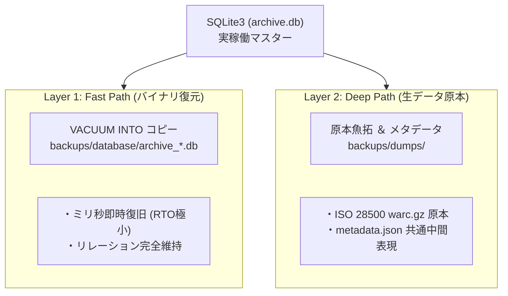

[[← 04 Admin Board仕様|part2_01_04_admin_board]] | [[📚 目次 (Home)|Home]] | [[06 災害復旧手順 →|part2_01_06_recovery]]

# SPEC-BACKUP-001: 二重化バックアップ（Dual-Source DR）仕様

## 1. 二重系統データ保全アーキテクチャ

## 2. アバター保全・隔離ポリシー (Avatar Isolation)
* **ライブラリ汚染防止**: Stashの画像グリッド混入を防ぐため、アバター実ファイルはすべて `backups/dumps/{platform}/{username}/avatars/` に物理隔離保存します。
* **原本性保証**: `metadata.json` 内には生のアバターオリジナルURLを不変データとして保持します。

---

[[← 04 Admin Board仕様|part2_01_04_admin_board]] | [[📚 目次 (Home)|Home]] | [[06 災害復旧手順 →|part2_01_06_recovery]]
