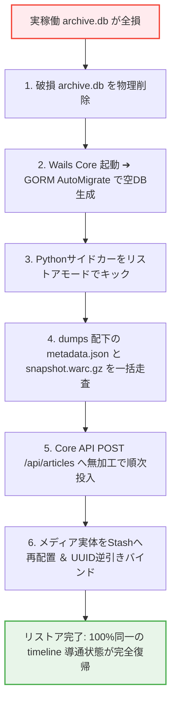

[[← 05 二重化バックアップ仕様|part2_01_05_backup]] | [[📚 目次 (Home)|Home]] | [[07 DB健全性監査 →|part2_01_07_audit]]

# SPEC-RECOVERY-001: 災害復旧（完全オフライン自動リストア）手順

## 1. ゼロからの自動再構築設計
実稼働DB `archive.db` が完全破壊された場合、Layer 2 (生データ原本) のみから外部通信ゼロ・完全オフラインで動態保存状態を100%自動再構築します。

## 2. 対称リストアフロー

---

[[← 05 二重化バックアップ仕様|part2_01_05_backup]] | [[📚 目次 (Home)|Home]] | [[07 DB健全性監査 →|part2_01_07_audit]]
