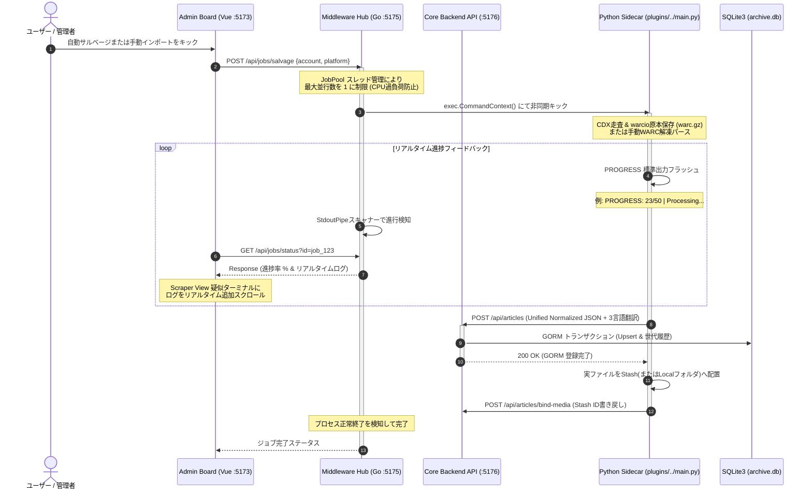
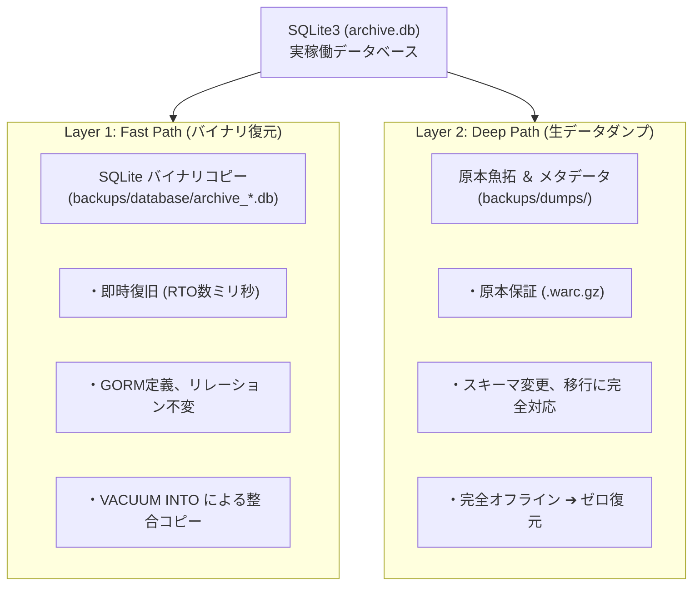
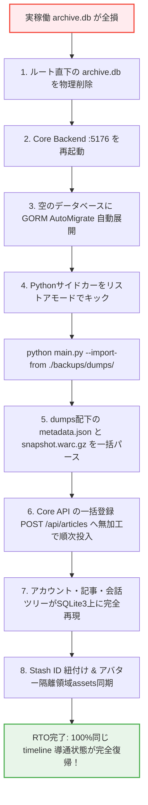
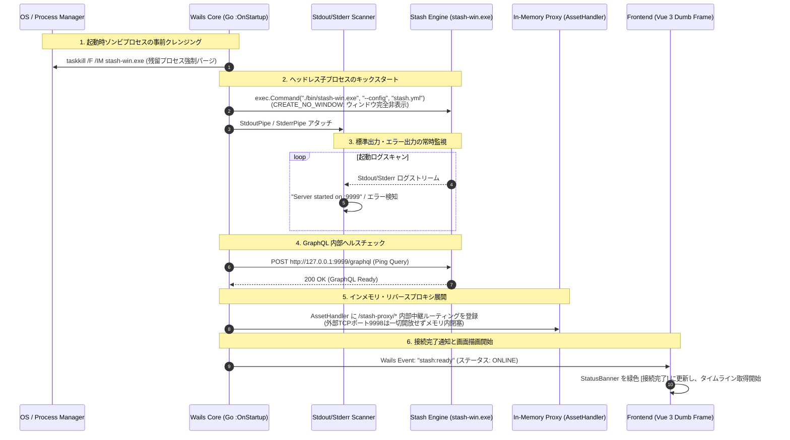

# 第2編 第1章：管理・設定・ディザスタリカバリ運用 (Administration & Governance)

**プロジェクト名** : dozou_katanuki (Wails-Stash Hybrid "土蔵・型抜き" Multi-Format Local Archival System)  
**ドキュメントID** : SPEC-ADMIN-001  
**バージョン** : 4.0.0 (Wailsキメラデスクトップ統合仕様)  
**作成日** : 2026-08-18  
**ステータス** : 正式仕様（テキストグラフ全パージ・Mermaid完全移行・一元設定・7大管理ビュー・Scraper View・二重化バックアップ）

---

## 1.1 概要とレイヤー責務
本レイヤー（第5層：Admin & Governance）は、日常のタイムライン表示やデータ中継といった実行制御には一切関与せず、**「システム設定の一元統治、データベースの整合性監査、cron-likeな自動ジョブスケジューリング、およびデータ全損時の災害復旧（DR）」**に100%特化した最上位のガバナンス階層です [23, 24, 118]。

本層が、ウェブのルーティングやAPIハンドリングといった「コントローラー（Controller）」としての実行制御機能を持つことは、アーキテクチャの境界線（境界）保護の観点から厳格に禁止されます [24, 119]。本レイヤーは、安全・確実なシステム運用を維持し、ユーザーが収集したデジタル資産を恒久的にローカル保全するための「防壁およびルールセット（SSOT）」として機能します [1, 24, 118]。

---

## 1.2 一元設定ファイル仕様 (config.json)
従来散逸していたYAMLや個別環境設定を全廃し、プロジェクトルート直下の **`config.json`** をシステム全体の一意な設定の源泉（Single Source of Truth: SSOT）とします [4, 119]。

### 1. 設定項目およびJSONスキーマ定義 (Draft 7 準拠)
多言語事前翻訳、Stashapp不使用の「ローカル保存モード」、自動バックアップ、およびキャスト配信（ブロードキャスト）の制御に対応した完全な設定スキーマを以下に規定します [3, 4.2, 10.7]。

```json
{
  "$schema": "http://json-schema.org/draft-07/schema#",
  "title": "XTimelineAppConfig",
  "type": "object",
  "properties": {
    "system": {
      "type": "object",
      "properties": {
        "env": { "type": "string", "enum": ["development", "production"], "default": "production" },
        "default_framework": { "type": "string", "enum": ["twitter", "instagram", "tiktok"], "default": "twitter" },
        "language": { "type": "string", "enum": ["ja", "en", "zh"], "default": "ja" }
      },
      "required": ["env", "default_framework", "language"]
    },
    "network": {
      "type": "object",
      "properties": {
        "frontend_port": { "type": "integer", "default": 5173 },
        "stash_proxy_port": { "type": "integer", "default": 9998 },
        "middleware_port": { "type": "integer", "default": 5175 },
        "backend_port": { "type": "integer", "default": 5176 },
        "stash_port": { "type": "integer", "default": 9999 },
        "public_bind_address": { "type": "string", "default": "0.0.0.0" },
        "internal_bind_address": { "type": "string", "default": "127.0.0.1" }
      },
      "required": ["frontend_port", "stash_proxy_port", "middleware_port", "backend_port", "stash_port", "public_bind_address", "internal_bind_address"]
    },
    "storage": {
      "type": "object",
      "properties": {
        "db_path": { "type": "string", "default": "./archive.db" },
        "stash_enabled": { "type": "boolean", "default": true },
        "local_media_dir": { "type": "string", "default": "./media_local" },
        "stash_dir": { "type": "string", "default": "./stash" },
        "dumps_dir": { "type": "string", "default": "./backups/dumps" },
        "snapshots_dir": { "type": "string", "default": "./backups/database" }
      },
      "required": ["db_path", "stash_enabled", "local_media_dir", "stash_dir", "dumps_dir", "snapshots_dir"]
    },
    "scheduler": {
      "type": "object",
      "properties": {
        "polling_interval_minutes": { "type": "integer", "default": 5 },
        "backup_interval_hours": { "type": "integer", "default": 24 },
        "max_backup_files": { "type": "integer", "default": 7 }
      },
      "required": ["polling_interval_minutes", "backup_interval_hours", "max_backup_files"]
    },
    "broadcast": {
      "type": "object",
      "properties": {
        "enabled": { "type": "boolean", "default": false },
        "allowed_networks": { "type": "array", "items": { "type": "string" }, "default": ["192.168.1.0/24", "10.0.0.0/24"] }
      },
      "required": ["enabled", "allowed_networks"]
    },
    "appearance": {
      "type": "object",
      "properties": {
        "font_family_ja": { "type": "string", "default": "'Helvetica Neue', Arial, 'Hiragino Kaku Gothic ProN', Meiryo, sans-serif" },
        "font_family_en": { "type": "string", "default": "ui-sans-serif, system-ui, -apple-system, BlinkMacSystemFont, 'Segoe UI', Roboto, sans-serif" },
        "font_family_zh": { "type": "string", "default": "'PingFang SC', 'Lantinghei SC', 'Microsoft YaHei', sans-serif" }
      },
      "required": ["font_family_ja", "font_family_en", "font_family_zh"]
    }
  },
  "required": ["system", "network", "storage", "scheduler", "broadcast", "appearance"]
}
```

### 2. 「Stash使わんし！」モード (物理フォルダ保存ポリシー)
`storage.stash_enabled` が `false` に設定されている場合、システムは C++ 製の Stashapp 重厚サーバーをバックグラウンドで起動せず、以下の軽量な **物理フォルダダイレクトサーブモード** へと自律的に移行します [8.1]。

*   **物理マッピング**:
    メディアファイル（画像・動画・GIF）は、ダウンロード完了時に Stash 監視フォルダではなく、`config.json` の `local_media_dir` に設定された物理ディレクトリ直下（`{local_media_dir}/{platform}/{username}/{media_id}`）に、URL末尾の BaseName 命名原則を維持したままフラットに保存されます [8.1, 8.2]。
*   **相対URL解決**:
    ミドルウェア（Go :5175）がタイムライン（`RenderTree`）を構築する際、urls オブジェクトは Stash プロキシポート `:9998` を向かず、ミドルウェア自身がホストする静的アセット中継エンドポイントである **/media-local/{platform}/{username}/{media_id}** の完全相対パスへと動的解決・バインドされます [54, 8.1]。これにより、一切の外部サーバーなしで、軽量なGoバイナリとフォルダ構造だけで動態保存 timeline 描画が成立します [68]。

---

## 1.3 Admin Board と Scraper管理画面仕様 (Settings UI)
設定画面（Vue 3 フロントエンド `/settings` **:5173**）に統合された「Scraper管理コンソール」から、バックグラウンドのPython非常駐サイドカー（第4層）を非同期にオーケストレーションし、システム全体の健全性を統治するためのコントロールセンター仕様です [38, 120]。

### 1. 管理画面（設定コンソール）に備えるべき「7大制御ビュー」仕様
Dumb UI原則（第5章）に準拠し、フロントエンドは表示とActionイベント発行に徹し、ミドルウェア（Go :5175）を介して実行される強力な設定・保守制御機能を提供します [20, 22]。

1.  **Job コントローラー ＆ Scraper View（スクレイパー進捗・ログ監視コンソール）**:
    *   自動サルベージ（CDX）および手動WARCインポートのトリガーキックUI [120]。
    *   **Scraper View**: 実行中の Python ジョブの進捗率（%）を示すプログレスバーに加え、ミドルウェアがインターセプト（StdoutPipeスキャン）した**「Python側の標準出力メッセージ（PROGRESS ログ）」をリアルタイムでスクロール表示する疑似ターミナル（ログストリーミング監視）コンソール**を搭載します [58, 124]。過去に完了・失敗したインポートジョブの実行ログ履歴リスト（タイムスタンプ、ステータス、処理件数、エラー理由）を一覧で監視可能です。
2.  **Whitelist（ホワイトリスト）管理ビュー**:
    *   スパムパージ、および自動サルベージの対象アカウントを制御する `whitelist` テーブル [4.2] のクリーンな CRUD グリッド。
    *   アカウント名、種別（`account` / `keyword`）の追加、および `is_active` フラグのワンクリックトグル操作 [4.2]。
3.  **個別記事編集ビュー (Article Editor)**:
    *   タイムライン上に表示される記事（Article）の内容を、人間が管理画面からダイレクトに微調整できるビュー。
    *   GORMモデルで事前にキャッシュ保存された **「3言語の翻訳テキスト（`full_text_ja/en/zh`）」を個別テキストエリアで手動修正・上書き保存** することができ、不自然な機械翻訳を人間の目でブラッシュアップして永続保存する機能を提供します [4.2, 7.2]。
4.  **Stashapp へのスマート別窓導線**:
    *   `COMPLETED` 状態の添付メディア表示エリア上に、StashのUUID（`stash_scene_id` / `stash_image_id`）に基づく `_blank`（別タブ）型詳細リンクアイコンを配置 [42, 61]。
    *   クリック時に、本家StashのWeb UI詳細画面（例: `http://127.0.0.1:9999/scenes/{stash_scene_id}`）にダイレクトでジャンプさせ、トランスコード設定や重複排除、詳細なタグ編集を Stash 本来の画面でシームレスに行えるように誘導します [14]。
5.  **デフォルトCSSコードエディタ**:
    *   プラグインフォルダに格納されている該当プラットフォームのスタイル定義ファイル `plugins/{platform}/skin/design.css` の中身を、管理画面上からブラウザ経由で直接読み込み・編集し、物理的に上書き保存できる簡易テキストコードエディタ [57, 94]。
6.  **フォントファミリー微調整パネル**:
    *   `appearance.font_family_*` に定義された日・英・中それぞれの優先フォントファミリーを、テキスト入力およびプリセット（Segoe UI, 游ゴシック, 微软雅黑 等）から動的に変更し、即座に Vue 3 側の CSS カスタム変数（CSS Variables）にバインド・シグナル同期させるパネル。
7.  **「Stash使わんし！」モードトグル**:
    *   `storage.stash_enabled` のオン/オフをワンクリックで切り替えるトグラー。Stashのキック失敗時や、極限までポータブルにフォルダだけで動かしたい場合の動作切り替えを行います [8.1, 10.2.2]。

### 2. ミドルウェア直結型オーケストレーションシーケンス (Go :5175 ➔ Python)
ミドルウェア（:5175）が、独立したノンブロッキングな OS サブプロセスとして plugins/ フォルダ配下の Python 非常駐サイドカーをキック・スキャンし、完了後のメタデータ登録（GORM）のみを Core Backend (:5176) に委託する統合シーケンスです [22, 9.3.1, 121]。



---

## 1.4 二重化バックアップ設計 (Dual-Source Disaster Recovery)
データベースの全損、ファイルシステムエラー、あるいは将来のスキーマ刷新や他データベース移行（RDBMS載せ替え）に100%耐えうる、**「2つの独立したバックアップ復旧ルート（Dual-Source DR）」**をシステム全体の絶対的な運用仕様として義務付けます [24, 125]。

#### dozo_katanuki バックアップ・データ保全アーキテクチャ (Mermaid Diagram)



### 1. Layer 1: SQLite バイナリバックアップ (Fast Path) [126]
*   **役割**: 最も頻繁に行われる、ローカル接続時のミリ秒単位での即時復旧を目的としたバックグラウンドスナップショット [126]。
*   **保存先**: `backups/database/archive_YYYYMMDD_HHMMSS.db` [126]
*   **処理技術**: SQLite3のオンラインバックアップAPI、または `VACUUM INTO` ステートメントをミドルウェアスケジューラーが実行。実データベースが書き込み処理（WAL）中であっても、一貫性を保った整合コピーを安全に自動ダンプします [126]。

### 2. Layer 2: 生データダンプ (Deep Path) [127]
*   **役割**: ポータビリティと不変の原本性の保証。中身が共通中間JSON（テキスト）と標準Webアーカイブコンテナ（バイナリ）なので、データベース製品の変更やスキーマ構造の根底的刷新時にも、100%情報の欠落なく対称復元が可能です [127]。
*   **保存先ディレクトリマップ**:
    ```text
    backups/dumps/
    └── {platform}/                           (twitter / instagram / tiktok)
        └── {username}/
            └── {post_id}/
                ├── metadata.json             ★ 共通中間表現JSON (多言語翻訳 & Stash ID 同梱)
                ├── snapshot.warc.gz          ★ ISO 28500 準拠の最高純度原本WARC (通信パケット完全魚拓)
                └── avatars/                  ★ アバター履歴・世代管理隔離フォルダ
                    ├── {username}_avatar_001.jpg
                    └── {username}_avatar_002.jpg
    ```
*   **アバター保全・隔離ポリシー (Avatar Isolation Policy) の連動**:
    *   Stashのライブラリに小さなアバター画像が混入して画像グリッドを汚染するのを防ぐため、アバター実ファイルはすべて `backups/dumps/{platform}/{username}/avatars/` に物理保存します [15, 86, 127]。
    *   `metadata.json` 内には、監査と不変の原本証明のために、生のアバターオリジナルURL（例: `pbs.twimg.com` 等）を基礎原本データとして100%そのまま不変保存します [15, 127]。

---

## 1.5 災害復旧（ゼロからのデータベース再構築）手順
実稼働データベース `archive.db` が完全破壊された場合、あるいはスキーマ定義を一新した際の、**「Layer 2 (Deep Path) のみを用いた、完全オフライン自動リストア」**の手順規約です [127]。

### 1. 対称データプロトコル（Symmetry）によるゼロからのリストア手順
本システムは、「入力時も出力時も全く同一の構造化データを用いる」という **データの対称性（Symmetry）** を担保しているため、以下のステップに則って、外部インターネットに1パケットもアクセスすることなく、完全ローカルで動態保存状態が完全に復旧します [127, 128]。



---

## 1.6 DB メンテナンスと健全性監査
データ破損や、何らかのエラーで発生した「ゾンビメディアファイル」による無駄なディスク圧迫を防止するため、Admin Board からオンデマンドで実行可能な健全性監査プロトコルです [128]。

### 1. SQLite3 整合性監査 (PRAGMA Audit) [128]
*   `PRAGMA integrity_check;` : SQLite3のデータページ、B-Tree、インデックスのファイル破損を徹底的にスキャン。破損が検知された場合は、Layer 1 / Layer 2 からの復旧アラートを出します [128]。
*   `PRAGMA foreign_key_check;` : `accounts` ➔ `articles` ➔ `media` 間にリレーション破綻がないかを検証し、孤立した外部キーエラーが0件であることを100%保証します [128]。

### 2. 孤立メディア・ゾンビキャッシュのパージ
*   **SQLite3 孤立メディア検出**: SQLite3 の `media` テーブルに存在するが、Stashapp（または物理フォルダ）側に存在しない `stash_scene_id` を持つレコードを検出し、安全に削除します [128]。
*   **Stash 孤立ファイル検出**: `stash/scenes/` 物理ディレクトリ内を自動スキャンし、SQLite3の `media_id`（URL BaseName）と一切一致しない、ダウンロードだけされてリレーションがバインドされなかったゴミファイルを検出し、自動でゴミ箱（Recycle Bin）へ移動します [128]。

---

## 1.7 cron-likeワーカースケジューラーと Broadcast フレームワーク
システムが常に最新かつ健康に動作し、かつローカル環境における他端末への動的配信をサポートするため、ミドルウェア（Go :5175）に以下のバックグラウンドサービス群を統合ホストします [2, 3]。

### 1. cron-like 常駐型ワーカースケジューラー
Goミドルウェア（:5175）の起動時に常駐ゴルーチン（Goroutine）として立ち上がる軽量スケジューラーです [103]。
*   **完了フォルダ自動巡回ポーリングスレッド**:
    `scheduler.polling_interval_minutes` で規定された一定時間ごとに、外部ダウンロードAPP（Motrix等）のダウンロード完了ディレクトリを自動スキャンします [11, 99]。対象 `media_id`（BaseName）に合致する完遂ファイルを発見しだい、Stashappに自動インジェクションし、状態を `COMPLETED` に書き戻す自律回収フローを回します [99]。
*   **Layer 1 自動オンラインバックアップスレッド**:
    `scheduler.backup_interval_hours` ごとに、実稼働データベースの `VACUUM INTO` を自動でトリガーし、スナップショットを生成 [126]。保存されたファイル数が `scheduler.max_backup_files` を超過した場合は、ファイル安全削除原則に基づき、最も古いバックアップファイルを `.bak` 退避したのち安全パージします [25, 27, 126]。

### 2. メディア Broadcast（家庭内LANキャスト）フレームワーク
PC以外のタブレット、スマートフォン、スマートTV、スマートプロジェクター等の「家庭内LANデバイス」に対して、ミドルウェアが中継してメディアをキャスト・再生させるための透過的な配信フレームウェイ仕様です [3, 22]。
*   **ネットワークバインディング**:
    他端末からのアクセスを受け付けるため、ミドルウェアは必ず `config.json` に設定された `network.public_bind_address`（デフォルト: `0.0.0.0`）にバインドして起動します [3, 25]。
*   **CORSオーバーライドキャスト**:
    他端末からのキャスト要求（例: `http://192.168.1.10:5175/stash-proxy/...`）に対しても、CORS制限を中和するレスポンスヘッダーを強制上書き付与して透過ストリームサーブします [52, 70]。
*   **送信元 IP / CIDR サブネット制限**:
    悪意あるポートスキャンや外部ネットワークからの不正操作を防ぐため、ミドルウェアは接続元のIPアドレスが、`config.json` の `broadcast.allowed_networks`（例: `192.168.1.0/24`）に合致するかを Go の `net.IP.Contains` で厳格に検証し、合致しない場合は `HTTP 403 Forbidden` を返してアクセスを物理的に即座に遮断するセキュリティバインディングを実装します [3, 25]。

---

## 1.8 Wails キメラデスクトップ・ブートシーケンスと Stash プロセス統治仕様

本システムが単一のデスクトップアプリケーション（`dozou_katanuki.exe`）として起動し、内包する `stash-win.exe` を安全にヘッドレス起動・監視・インメモリプロキシ中継するための**「ブートシーケンスおよびプロセス統治仕様」**を規定します。

### 1. ブートシーケンス＆ライフライン統合フロー



### 2. `stash-win.exe` のキックスタートとゾンビパージ規約
*   **起動時ゾンビパージ (Pre-launch Zombie Purge)**:
    Wailsの起動フック（`OnStartup`）の最初期段階において、OSのプロセス一覧をスキャンし、前回の強制終了等で残留している `stash-win.exe` を `taskkill` 等で強制終了します。これにより、ポート `9999` のバインド競合や設定ファイルの排他ロックエラーを未然に100%遮断します。
*   **非表示ヘッドレス起動 (Headless Execution)**:
    `config.json` の `storage.stash_enabled` が有効な場合、OSのコンソールウィンドウを一切生成しないフラグ（Windows: `CREATE_NO_WINDOW` / `HideWindow: true`）を付与して `./bin/stash-win.exe` を非同期サブプロセスとして起動します。これにより、ユーザーには余計な黒い画面（コマンドプロンプト）を一切見せず、完全なネイティブGUIアプリとしての体験を維持します。
*   **道連れ終了（Lifeline Synchronization）**:
    Wailsデスクトップのメインウィンドウが閉じられた際（`OnShutdown` フック）、保持しているプロセスハンドルに対して `Process.Kill()` を発行し、親プロセスと運命を共にして完全終了させます。

### 3. Stdout / Stderr のリアルタイムパイプ監視とヘルスチェック
*   **パイプインターセプトとログバッファリング**:
    起動した `stash-win.exe` の `StdoutPipe` および `StderrPipe` にスキャナー（Goroutine）を常駐させ、出力されるログメッセージをリアルタイムでインターセプトします。
*   **起動完了トリガーの検知**:
    出力ログから `Server started on` または `GraphQL engine ready` などの初期化完了キーワードを検知した瞬間、Wails内部のヘルスチェッカーをキックします。
*   **GraphQL 疎通確認（Loopback Ping）**:
    ポート `9999`（`127.0.0.1:9999/graphql`）に向けて軽量なバージョン取得クエリを発行し、`200 OK` の正常応答が得られたことを確認して「Stash起動完了」と判定します。
*   **異常終了・パニック検知**:
    もし Stderr に致命的エラー（ポート衝突、YAML破損等）が出力されたり、プロセスが予期せず終了した場合は、即座にエラーログをメモリに退避し、フロントエンドへ障害アラートを発行します。

### 4. インメモリ展開によるリバースプロキシ隠蔽ポリシー（外部閉塞）
*   **外部プロキシポート（:9998等）の完全廃止**:
    従来の設計に存在したプロキシ用TCPポートの外部開放を全廃し、Wailsの `AssetHandler` を用いて **Goのメモリ内部でリバースプロキシを展開** します。外部からの不正アクセスやローカルポート競合のリスクをゼロにします。
*   **インメモリ・ルーティングとCORS透過無効化**:
    フロントエンド（Vue 3）から要求される `/stash-proxy/*` 形式のメディアストリーム要求を Go の内部メモリでインターセプトし、`http://127.0.0.1:9999/*` へ透過中継します。ブラウザの Same-Origin Policy を満たすHTTPヘッダーを内部で自動付与するため、CORSエラーを起こさずにゼロレイテンシで動画・画像をストリーミング可能です。

### 5. 接続完了通知とUIステータス表示プロトコル
*   **ライフラインイベント発行**:
    ヘルスチェック完了と同時に、Wailsランタイムイベント（`stash:status`）を通じて、フロントエンドへ `{ status: "CONNECTED", port: 9999 }` のシグナルを一方向（UDF）にプッシュします。
*   **フロントエンド（StatusBanner.vue）の宣言的表示**:
    フロントエンドは受信したシグナルに基づき、ヘッダー上部のステータスインジケーターを `[CONNECTING]`（黄）から `[ONLINE: Stash Ready]`（緑）へと切り替え、タイムラインの初回データフェッチを開始します。

---

[[← 前の章: 第1編第4章：実装規約・制約原則|part1_04_implementation_principles]] | [[📚 目次 (Home)|Home]] | [[次の章: 第2編第2章：プラグインアーキテクチャとサイドカー →|part2_02_plugin_architecture]]
