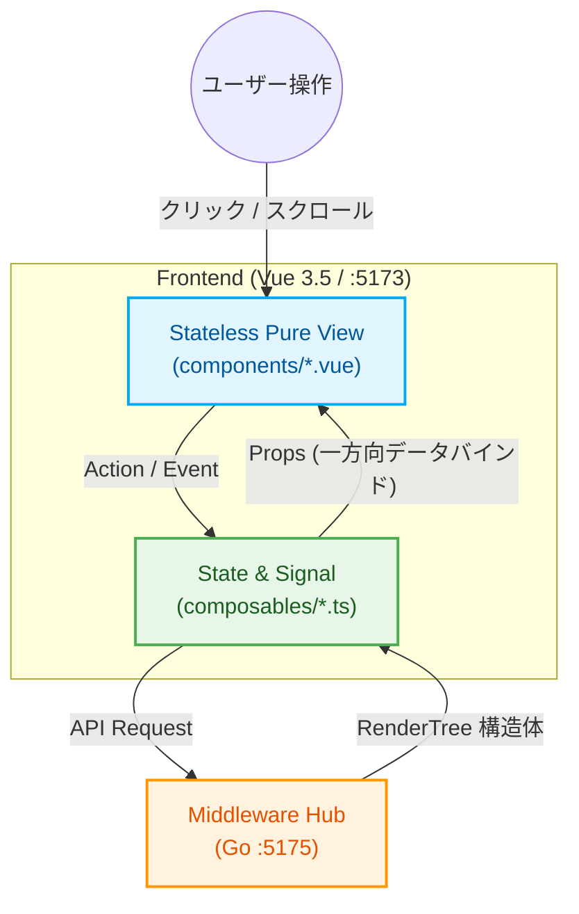

[[← 前の章: 第3編第1章：データベース設計と仮想ストレージプール|part3_01_database_design]] | [[📚 目次 (Home)|Home]] | [[次の章: 第3編第3章：ミドルウェア層インデックス →|part3_03_0_middleware_index]]

# 第3編 第2章：フロントエンド層概論（Pure Dumb UI Framework）

**プロジェクト名** : dozou_katanuki (Wails-Stash Hybrid "土蔵・型抜き" Multi-Format Local Archival System)  
**ドキュメントID** : SPEC-FRONTEND-001  
**バージョン** : 4.0.0 (Wailsキメラデスクトップ統合仕様)  
**作成日** : 2026-08-18  
**ステータス** : 正式仕様（Dumb UI一般化・シグナル・UDF原則、設定管理系コンポーネント、SVGプレースホルダーフィラー出し分け）

---

## 2.1 宣言型UIと単一データフロー（UDF）パラダイム
本システムのフロントエンド（Vue 3.5）は、特定のSNSプラットフォームに依存する自律的なビジネスロジックや複雑なURL組み立てを一切持たず、Goミドルウェア（:5175）から受領した汎用的なデータ構造 `RenderTree` を忠実に描画する**「純粋なプレゼンテーション層（Foolish Frontend）」**として設計されています [35, 36]。
従来の特定のプラットフォームに依存した設計（MVVM等）から、高い予測可能性と優れたテスタビリティを両立する「宣言型UI ＋ 単一データフロー（UDF）＋ シグナル」パターンへと完全に純化し、以下の3大原則を徹底します [35, 36]。

### 1. 宣言型レンダリング (Declarative Rendering) [35, 36]
*   「どうDOMを操作するか」「どう状態を遷移させるか」という手続き的な処理を完全に排除します [36]。
*   View（`frontend/src/components/`）は、受け取った `RenderTree` の状態がこうであれば、こう表示するという宣言的テンプレート（`<template>`）のみで記述される **Dumb Component (Stateless Pure View)** とします [36]。
*   View内でのアバター画像のURL解決（`/assets/...`）やStashプロキシURL（`/stash-proxy/...`）の組み立て、テキストの加工（改行、ハッシュタグ、リンク解決など）は**厳格に禁止**し、すべて上流の Middleware Hub (:5175) が事前処理した完成データ（`RenderTree`）をそのままバインドします [36]。

### 2. シグナル（Signals-based Reactive）の活用 [36]
*   Vue 3 Composition API の `ref` / `reactive` / `computed` を、ピンポイント高速更新を行う「シグナル」として位置づけます [36]。
*   ローカル環境ならではのゼロ・レイテンシを最大限に活かし、いいね（お気に入り）ボタンのトグルや翻訳トグルが発生した際、関係するカード（コンポーネント）のシグナル状態のみをピンポイントで超高速に再描画し、タイムライン全体の不要な再レンダリングや遅延（ラグ）を極限まで排除します [36]。

### 3. 単一データフロー (Unidirectional Data Flow / UDF) の徹底 [37]
*   データは常に **[Go Middleware Hub (:5175)] ➔ [Composable (State) :5173] ➔ [View (Props)]** の一方向（Top-to-Bottom）のみに流れます [37]。
*   下流のコンポーネントがPropsや共有状態を直接書き換える「双方向データバインディングによる暗黙的な状態破壊」を完全に禁止します [37]。
*   ユーザー操作（クリック、スクロール、トグル等）は、すべて「イベント（Action）」として上流の Composable または Skin Controller へ通知され、APIリクエストを介して状態（シグナル）が更新された後、再び新しいProps（`RenderTree`）としてViewへ一方向に流れます [37]。



---

## 2.2 プラットフォーム共通 URL ルーティング体系（Vue Router / History API） [38]
本システムでは、すべての画面を単一URLで表示するアドホックな設計を全廃し、本家SNSと高い互換性・ポータビリティを持つ汎用的なURLルーティング体系を Vue Router (HTML5 History API) によって構築しています [38]。
これにより、特定の投稿（Article）や特定アカウントのタイムラインを「ブックマーク保存」したり、ブラウザから直接URLを指定してアクセスすることが可能になっています [38]。

| 画面種別 | パス形式 (Path Segment) | 実例URL | 動作・描画仕様 |
| ------ | ------ | ------ | ------ |
| **統合タイムライン** | `/:platform` または `/` | `http://localhost:5173/twitter` | 登録・有効化されている全アカウントの投稿を時系列に結合したタイムラインを表示 [38]。 |
| **個別ユーザーTL** | `/:platform/:username/` | `http://localhost:5173/twitter/msluo14/` | 指定ユーザーのプロフィールヘッダー、Bio、および個別投稿タイムラインを表示 [38]。 |
| **個別詳細画面** | `/:platform/:username/status/:id` | `http://localhost:5173/twitter/msluo14/status/1879382757924868404` | 対象投稿（ID: `1879382757924868404`）の個別詳細、会話ツリー（上位リプライ・下位スレッド）を表示 [38]。 |
| **管理・設定画面** | `/settings` | `http://localhost:5173/settings` | 各種統計、Stash接続状態、ホワイトリスト管理、個別サルベージジョブおよび Scraper View 監視UI [38]。 |

*   **SPA Fallback ルーティングとの連携** [39]:
    ユーザーがブラウザで上記の個別詳細URL（例: `/:platform/:username/status/...`）を直接URL欄に入力してアクセス（直打ち）したり、F5キーでリロードした際、Webサーバーが 404 Not Found を返すのを防ぐため、Middleware Hub (:5175) が 404 リクエストを全て `index.html` にルーティング中継（Fallback）します [39]。フロントエンドに到着後、Vue Router がパスを解決して正確な画面を描画します [39]。

---

## 2.3 主要フロントエンド型定義 (RenderTree / RenderMedia Status)
フロントエンドとミドルウェアを繋ぐ、契約（SSOT / Single Source of Truth）としての共通型定義（TypeScript）です [39]。すべての UI コンポーネントはこの型定義に従って描画を決定します。
データベース上で定義された **3段階メディア確保ライフサイクルの状態値** が添付メディアに統合され、フロントエンドでのインジケーター表示を統治します [33]。

```typescript
// frontend/src/models/RenderTree.ts

/**
 * タイムライン描画の最小単位となる投稿（アセット・記事）のデータ表現
 */
export interface RenderTree {
  id: string;                     // プラットフォーム固有の投稿ID (string化)
  conversation_id: string;        // 会話スレッドグループID
  created_at: string;             // ISO 8601 形式の投稿日時 (UTC)
  content: {
    original: string;             // HTMLリンク・タグ整形済みの生本文（原本）
    ja?: string;                  // HTMLリンク・タグ整形済みの日本語訳 (存在時のみ)
    en?: string;                  // HTMLリンク・タグ整形済みの英語訳
    zh?: string;                  // HTMLリンク・タグ整形済みの中国語訳
  };
  author: RenderAuthor;           // 投稿者（アカウント）データ
  media: RenderMedia[];           // 添付メディアの配列 (0〜4件)
  metrics: RenderMetrics;         // エンゲージメント指標（いいね、RT数など）
  source_url: string;             // アーカイブ元（Wayback Machine等）の魚拓URL
  is_liked: boolean;              // ローカルでのお気に入り（ブックマーク）登録フラグ
  is_pinned: boolean;             // ローカルでのピン留めフラグ
  parent_id?: string;             // 返信先の親投稿ID (スレッド展開用)
}

/**
 * 投稿者（作成者）のメタデータ表現
 */
export interface RenderAuthor {
  numeric_id: string;             // 内部管理用のユニークID
  handle: string;                 // スクリーンネーム / ユーザーID (例: @msluo14)
  display_name: string;           // 表示名 (名前)
  avatar_url: string;             // 仮想解決されたアバター相対パス (/assets/twitter/msluo14_avatar_001.jpg)
  bio: string;                    // プロフィール自己紹介文
}

/**
 * メディア要素（画像・動画・GIF）のデータ表現
 * (ミドルウェアおよびドライバー層で完全相対URL化して配信)
 */
export interface RenderMedia {
  id: string;                     // メディア一意ID
  type: 'image' | 'video' | 'gif';// メディアの種別
  download_status: 'QUEUED' | 'COMPLETED' | 'DEAD_404' | 'OUTSOURCED' | 'RETAINED'; // メディア確保ステータス [33, 42]
  failed_reason?: string;         // ダウンロード失敗・保留時の具体的なエラー原因 (存在する場合のみ) [33]
  urls: {
    stream: string;               // 動画再生ストリーム相対パス (/stash-proxy/scene/{stash_scene_id}/m3u8 または stream)
    image: string;                // 静止画フル解像度相対パス (/stash-proxy/image/{stash_image_id}/image)
    thumbnail: string;            // サムネイル軽量画像相対パス (/stash-proxy/image/{stash_image_id}/thumbnail)
    original: string;             // 外部Wayback / CDNのフォールバック用オリジナルURL
  };
  width?: number;                 // メディアの横幅 (px)
  height?: number;                // メディアの縦幅 (px)
}

/**
 * 収集したアセットの統計指標（エンゲージメント）
 */
export interface RenderMetrics {
  replies: number;                // 返信/リプライ数
  retweets: number;               // リツイート/リポスト/シェア数
  likes: number;                  // いいね/お気に入り数
  views?: number;                 // インプレッション表示数
}
```

---

## 2.4 Skin Controller 共通インターフェース規格 [100]
各プラットフォーム（Twitter、Instagram等）固有の動作・インタラクション（スレッドツリー探索、カルーセルスワイプ、ダブルタップいいねなど）を、ホストである Vue のコアシステムから完全に切り離してプラグインパッケージ化するための統一インターフェース定義です [100]。
これは、Goミドルウェア（:5175）側が管理する **RendererPlugin** （データ変換プラグイン）と完全な1対1の対称性（Symmetry）を持つようにマッピングされます。

```typescript
// frontend/src/models/SkinController.ts

import { RenderTree, RenderMedia } from './RenderTree';

/**
 * プラガブルUIスキンパッケージが実装すべきコントローラー契約
 */
export interface SkinController {
  // 1. 初期化 (Vue側からルーター、共通APIクライアント、リアクティブ状態を注入)
  init(ctx: SkinContext): void;

  // 2. ライフサイクル・マウントフック
  onMount?(containerElement: HTMLElement): void;
  onUnmount?(): void;

  // 3. ユーザーアクションの汎用ハンドラ
  handleItemClick?(item: RenderTree, event: Event): void;
  handleMediaClick?(media: RenderMedia, index: number): void;

  // 4. プラットフォーム固有のアクションマップ (Vue側から動的にキーキック可能)
  actions: Record<string, (item: RenderTree, ...args: any[]) => Promise<any> | void>;
}

/**
 * Vue（ホスト側）からスキンパッケージへ供給されるコンテキスト情報
 */
export interface SkinContext {
  router: {
    push: (path: string) => void;
  };
  api: {
    fetchRelated: (id: string) => Promise<RenderTree[]>;
    toggleLike: (id: string) => Promise<boolean>;
  };
  showToast: (msg: string) => void;
  state: any; // タイムライン全体のリアクティブシグナル状態への参照
}
```

---

## 2.5 ディレクトリ構造とコンポーネント配置ルール
「1ファイル100行以下ルール」および「宣言型UI/UDF」を完全に守るため、フロントエンドのディレクトリ配置を以下のように厳密かつ抽象的に構造化します [40]。特定のSNSを表す単語は排除され、あらゆるプラットフォームに対応可能です。

```text
frontend/src/
├── components/                  ★ Stateless Pure View (Dumb Component / 100行以下厳守)
│   ├── layout/                  （AppSidebar.vue, StatusBanner.vue, AppHeader.vue 等）
│   ├── article/                 （ArticleCard.vue, ArticleHeader.vue, Avatar.vue, ArticleBody.vue, ArticleStats.vue）
│   ├── media/                   （MediaGrid.vue, MediaOverlay.vue, StashPlayer.vue）
│   └── settings/                ★ 設定・管理用 7大コンポーネントピース (第10章 10.3節 と完全マージ)
│       ├── JobController.vue    （インポート非同期起動・進捗バー）
│       ├── ScraperView.vue      （【新規】進行中ジョブの StdoutPROGRESS リアルタイム監視疑似ターミナル ＆ ログ履歴）
│       ├── WhitelistGrid.vue    （whitelistテーブル CRUD グリッド）
│       ├── ArticleEditor.vue    （GORM multi-lang 翻訳テキスト手動微調整・上書き保存パネル）
│       ├── CssEditor.vue        （design.css 直接物理編集コードエディタ）
│       ├── FontPanel.vue        （font_family_* 動的バインド微調整パネル）
│       └── StashTogglor.vue     （stash_enabled 軽量ローカルモード設定トグル）
│
├── composables/                 ★ State & Signal Layer (UDF Composable)
│   ├── useTimeline.ts           （タイムライン状態・ページネーション・UDFフェッチ）
│   ├── useMediaOverlay.ts       （画像/動画全画面オーバーレイのシグナル状態）
│   └── useArticleTranslation.ts （多言語事前キャッシュ切り替えシグナル状態ホルダー）
│
├── models/                      ★ 不変の型定義・契約定義
│   ├── RenderTree.ts
│   └── SkinController.ts
│
└── utils/                       ★ 副作用ゼロの純粋関数（Pure Functions）
    ├── formatters.ts            （日付フォーマット、数字の略表記：K, M等）
    └── parser.ts                （テキスト内アセット要素のパース処理ヘルパー）
```

---

## 2.6 主要コンポーネントの実装規約
### 1. コンポーネント分割の実践例（`ArticleCard` の100行解体） [19]
タイムラインの投稿を表す `ArticleCard.vue` が肥大化して「1ファイル100行」を超過する場合、以下の順序で Stateless Sub-Components に機械的に分解します [19]。これによりコンテキストがコンパクト化され、AIによる保守性が飛躍的に向上します [19]。

1.  **`ArticleCard.vue`** (親コンポーネント、レイアウトコンテナとしての役割のみ。Propsを子へ流す) [19]
2.  ➔ **`ArticleHeader.vue`** (表示名、ハンドル名、および `Avatar.vue` 呼び出しに特化) [19]
3.  ➔ **`Avatar.vue`** (アバター画像の円形切り抜きおよび世代表示に特化) [19]
4.  ➔ **`ArticleBody.vue`** (本文テキスト表示、翻訳表示トグルの統合) [19]
5.  ➔ **`ArticleStats.vue`** (いいね、リツイート、リプライ等のエンゲージメント数値表示) [19]
6.  ➔ **`MediaGrid.vue`** (添付メディア数 [1〜4] に応じたCSSグリッド/ギャラリー描画) [19]

### 2. メディア確保ステータス（download_status）に基づく宣言型描画ルール [33]
`MediaGrid.vue` は、Propsとして受け取る `RenderMedia` オブジェクトの `download_status` に従い、以下の描画パターンを100%宣言的に出し分けるものとします [33, 36]。

特に、**`COMPLETED` 以外のすべてのステータスにおいては、ブラウザのフリーズや非接続環境での画像崩れを防ぐため、外部魚拓（Wayback直接読み込み）の自動読み込みを行わず、SVGフィラーを用いた軽量プレースホルダーを表示**します。このプレースホルダーは、対象メディアが画像（`image`）、動画（`video`）、またはGIFアニメーション（`gif`）であるか一瞬で判別できるように、グラフィカルかつ視覚的に出し分けられます。

#### A. `COMPLETED` の場合（ローカル確保完了）
*   CORSを回避して再生・読み込みが保証された完全相対プロキシURL（`/stash-proxy/...`）を用いて、動画再生プレイヤー（`StashPlayer.vue`）またはフル解像度静止画をLightBox等で美しく描画します [54, 71, 7.6]。

#### B. `COMPLETED` 以外（`QUEUED`, `DEAD_404`, `OUTSOURCED`, `RETAINED`）の場合のSVGフィラー描画
*   各アセット枠には、メディア種別（`type`）に連動した以下の**「SVGプレースホルダー・フィラー」**を宣言的に表示し、パルスアニメーション（`animate-pulse`）と合わせてロード状態を表現します。

1.  **画像（`type == 'image'`）用SVGフィラー仕様**：
    *   **背景デザイン**：明るめのライトグレー調グラデーションモック（`bg-neutral-100 dark:bg-neutral-800 animate-pulse`）
    *   **SVGアイコン**：カメラまたは写真フレームを象った美しいモダンフラットアイコン（例：`feather-image` 互換の美しい24pxパス線）。
    *   **UI挙動**：アッシュグレー of 静的な印象を与えつつ、現在のステータスバッジ（例：`[OUTSOURCED] 外部APPダウンロード中`）を重ねます。

2.  **動画（`type == 'video'`）用SVGフィラー仕様**：
    *   **背景デザイン**：深みのあるチャコール調ダークグラデーションモック（`bg-neutral-200 dark:bg-neutral-900 animate-pulse`）
    *   **SVGアイコン**：再生（Play）の三角形、あるいはビデオカメラ・映画フィルムを象ったグラフィカルなSVGアイコン（例：中央に大きく配置されたシャドウ付きPlayシンボル）。
    *   **UI挙動**：動画アセットであることを明確に示すため、底面に「シークバー風プレースホルダーライン」を薄く重ねて描画します。

3.  **GIFアニメーション（`type == 'gif'`）用SVGフィラー仕様**：
    *   **背景デザイン**：少し点滅スピードを速めたアクティブパルス背景（`bg-neutral-150 dark:bg-neutral-850 animate-pulse-fast`）
    *   **SVGアイコン**：四角いボーダーフレームで「GIF」の文字マークを囲ったアイコン、あるいは円環ループ矢印マークを組み合わせたグラフィカルなSVG。
    *   **UI挙動**：通常の静止画や動画と一瞬で混同なく判別できるよう、角に「GIF」と記した軽量のピルマークバッジを配置します。

#### C. 失敗・保留ステータス（`DEAD_404`, `OUTSOURCED`, `RETAINED`）の重ね描き＆再試行（Retry）トグラー
*   上記の各SVGフィラーの上に、現在のステータス（例：`DEAD_404: 外部アクセスエラー`）と具体的なエラー理由（`failed_reason`）を薄いブラー付き半透明のオーバーレイシートとして重ねて表示します。
*   このオーバーレイ領域内には、ユーザーがいつでも手動で再ダウンロードを非同期要求できる「**再試行（Retry）**」トグラーボタン（これも美しいリロード回転矢印SVGを埋め込んだもの）を提供し、Dumb UI内の自己完結したアクションとして統治します。

---

## 2.7 フロントエンド専用外部プラグイン ＆ 共通コアライブラリ仕様
本システムのフロントシェル（:5173）は、スタンドアロン（デスクトップ）アプリとして極めてレスポンシブかつ美しく動作し、Stashapp（:9999）が中継配信する高画質な動画・画像ストリーミングをゼロ・レイテンシで再生・表示するため、以下のフロントエンド専用ライブラリおよびプラグインを静的にバンドル・統合します [2, 118]。

### 1. 高密度 HLS ビデオプレイヤー（`StashPlayer.vue` の静的統合仕様）
Stashapp（:9999）がリアルタイムにデコード・トランスコードする HLS（`.m3u8`）アダプティブストリーミング [14] を、ブラウザ側のCORS制約を完全に中和したプロキシポート **:9998** を通じてサクサクと遅延なく再生するため、ビデオプレイヤーは以下のライブラリ群を統合して構成します [54, 71, 7.6]。
*   **hls.js** （軽量なJS製 HLS デコーダ）:
    *   ブラウザがネイティブで HLS 再生に対応していない環境（Chromium 系の多くのデスクトップブラウザ等）において、メディアバッファをパケット単位でオーバーレイデコードして再生を可能にします。
    *   プロキシ（:9998）から返却される `.ts` チャンクファイルに対して、動的バッファサイズ調整（Adaptive Bitrate / ABR）を最適化して接続します [7.6]。
*   **plyr** （洗練されたモダンビデオプレイヤー UI）:
    *   HTML5 標準ビデオタグの野暮ったいコントロールをすべて排除し、CSS（Tailwindと調和させたダークカスタムテーマ）で統一された美しいレスポンシブシークバー、音量、再生、最大10秒スキップ、ピクチャー・イン・ピクチャー、および全画面表示ボタンを提供します。

### 2. ライトボックス＆ジェスチャ拡大オーバーレイ（`MediaOverlay.vue` 仕様）
タイムライン（`ArticleCard`）上の静止画や動画、GIFをクリックした際、画面いっぱいに美しいブラー背景とともに展開され、拡大縮小（ピンチズーム）や前後アセット送り（カルーセルスワイプ）を可能にするメディアビューアです。
*   **fslightbox-vue** または **自作軽量ジェスチャモジュール**:
    *   バンドルのポータビリティを最優先し、モバイル端末でのスワイプ距離（`touchstart` / `touchend`）や、キーボードの `Esc`（閉じる）、`ArrowLeft` / `ArrowRight`（前後アセット切り替え）をフックします [132]。
*   **一方向データフロー（UDF）での状態同期**:
    *   オーバーレイが開いている状態（`isOpen`）や現在アクティブなアセットインデックス（`activeIndex`）は、 `useMediaOverlay.ts` という Composable（シグナル状態）で厳密に管理され、コンポーネントへ Props として一方向供給されます [41]。

### 3. 高効率 SVG アイコンシステム (FontAwesome ＆ Lucide-Vue-Next)
Dumbコンポーネントが、1ファイル100行以下のルールを守りながら、動作時の描画オーバーヘッドを限りなくゼロにするために、アイコンアセットのロード仕様を規定します [18, 36]。
*   **@fortawesome/vue-fontawesome** (FontAwesome SVG Core):
    *   全アイコン（数MBの重厚なライブラリ）の丸ごと一括ロードを **厳格に禁止** します。
    *   `frontend/src/plugins/fontawesome.ts` 等のプラグインファイルにて、使用する特定のアイコン（例: `faHeart`, `faRetweet`, `faComment`, `faBookmark`, `faRotate`）のみを `library.add` に明示的にインポート・登録し、個別登録された軽量な SVG-Core のみから動的に呼び出します。
*   **lucide-vue-next** (Feather Icons の Vue 3 用ラッパー):
    *   Vue の Tree Shaking 機能が100%機能するように、 `import { Image, Video, Film, RefreshCw } from 'lucide-vue-next'` のようにコンポーネント単位でピンポイント個別インポートし、Dumb Component 内にマウントして描画します。

### 4. 共通ヘルパー＆レイアウト YAML パーサー
*   **lodash-es** (ESモジュール版 Lodash):
    *   動的レイアウト解決（`layout.yaml` の `props_mapping`）において、ネストされたデータ構造から値を安全に引っ張るため、 `import { get } from 'lodash-es'` を用いてバインディングエラーを100%防止（ゼロ・ポインター回避）します [85]。
*   **js-yaml** (フロントエンド向け YAML パーサー):
    *   ミドルウェア（:5175）の `GET /api/plugins/{platform}/skin/layout` からプレーンテキストで中継サーブされた `layout.yaml` を、フロントエンド内で瞬時に型安全な JSON オブジェクトへとパース・デシリアライズします [50, 6.2.3]。

---

[[← 前の章: 第3編第1章：データベース設計と仮想ストレージプール|part3_01_database_design]] | [[📚 目次 (Home)|Home]] | [[次の章: 第3編第3章：ミドルウェア層インデックス →|part3_03_0_middleware_index]]
