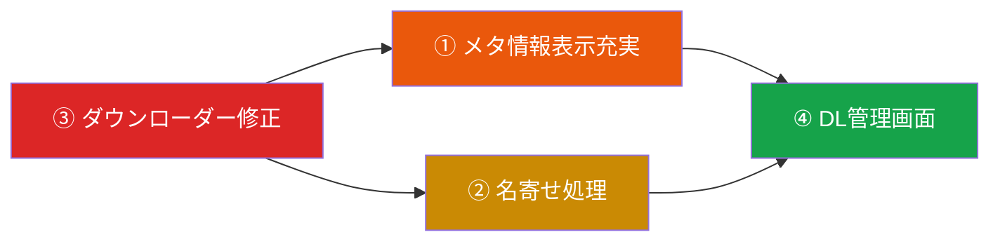

# 🏯 土蔵・型抜き：4課題の優先順位分析

先輩！コードベース全体を精査した結果、以下の優先順位を提案させていただきます。

---

## 📊 推奨優先順位

| 順位 | 課題 | 影響度 | 工数 | 依存関係 |
|:---:|:---|:---:|:---:|:---|
| **🥇 1st** | ③ ダウンローダーへの委託 | 🔴 致命的 | 中 | データパイプラインの根幹 |
| **🥈 2nd** | ① メディア情報画面のメタ不足 | 🟠 高 | 小〜中 | ③の結果を表示する側 |
| **🥉 3rd** | ② アカウント名寄せ処理 | 🟡 中 | 中 | データ品質改善 |
| **4th** | ④ ダウンロード管理画面 | 🟢 低〜中 | 大 | ③①②が安定してから |

---

## 🔍 各課題の現状分析

### 🥇 課題③ ダウンローダーへの委託 — **最優先**

> [!CAUTION]
> ここが壊れている＝メディアが永遠に取得できない。全機能の生命線。

**現状の問題点:**

[base_downloader.py](file:///d:/Projects/10_tools/dozou_katanuki/dozou_katanuki/plugins/base/scraper/core/base_downloader.py) の3段階パイプラインを精査した結果：

1. **第1段階 (`_try_download_and_escalate`)**: `requests` 直接DL → Stash注入。基本ロジックは実装済みだが：
   - `resolve_media_url` で `:large`/`:orig` サフィックス除去はされるが、**Wayback CDX APIから取得したメディアURLの正規化が不十分**（`web.archive.org/web/...` 形式のまま取得を試みている可能性）
   - タイムアウト8秒は動画DLには短すぎる

2. **第2段階 (`escalate_dead_media`)**: DEAD_404 → Aria2/Motrix外注。[aria2_client.py](file:///d:/Projects/10_tools/dozou_katanuki/dozou_katanuki/plugins/base/scraper/core/aria2_client.py) は存在するが、**Aria2 RPC接続の実態が不透明**（接続設定のハードコード疑惑）

3. **第3段階 (`poll_outsourced_media`)**: OUTSOURCED → Stash Reconcile。[stash_reconciler.py](file:///d:/Projects/10_tools/dozou_katanuki/dozou_katanuki/plugins/base/scraper/core/stash_reconciler.py) に委託されているが、**Go側の `EnqueueMediaPoll` → Python `--mode poll` の連携が片方向**（Python→DBのステータス更新のみで、Go→フロントエンドへの完了通知が不完全）

4. **Go側の委託起動**: [job_queue.go](file:///d:/Projects/10_tools/dozou_katanuki/dozou_katanuki/middleware/job_queue.go) の `EnqueueMediaDownload` / `EnqueueMediaPoll` は `main.py --mode download/poll` をサブプロセスで叩くだけ。**バッチ制御（同時実行数、レート制限）が存在しない**

**やるべきこと:**
- Aria2 RPC接続設定を `config.json` に統合
- DLタイムアウトの段階的延長（画像8s / 動画30s）
- `PROGRESS:` プロトコルでGo側にリアルタイム進捗を返す整備
- 3段階ステートマシンの遷移テスト

---

### 🥈 課題① メディア情報画面のメタ情報不足

**現状の問題点:**

[MediaInspectorPanel.vue](file:///d:/Projects/10_tools/dozou_katanuki/dozou_katanuki/frontend/src/components/admin/database/MediaInspectorPanel.vue) は3パネル構成（Account / Stash / SQLite）で、基本は揃っている。しかし：

- **[MediaInspectorAccount.vue](file:///d:/Projects/10_tools/dozou_katanuki/dozou_katanuki/frontend/src/components/admin/database/MediaInspectorAccount.vue)**: `avatar_url`, `username`, `display_name`, `created_at`, `full_text` のみ表示。**以下が欠落**：
  - `media_id` （ファイル名特定に必須）
  - `download_url` （原本URL）
  - `width` × `height` （解像度情報）
  - `type` （image/video/gif）
  - `download_status` の遷移履歴
  - `wayback_url` （原本アーカイブURL）

- **[MediaCard.vue](file:///d:/Projects/10_tools/dozou_katanuki/dozou_katanuki/frontend/src/components/admin/database/MediaCard.vue)**: グリッド表示のカードにも `download_url` や解像度がない

- **[RenderMedia](file:///d:/Projects/10_tools/dozou_katanuki/dozou_katanuki/models/rendertree.go#L31-L43)**: Go側の `RenderMedia` 構造体には `Width`/`Height` は存在するが、**フロントエンドでほぼ使われていない**

**やるべきこと:**
- MediaInspectorPanel に `media_id`, `download_url`, `width×height`, `type` の表示セクション追加
- MediaCard のコンパクトビューにも解像度バッジ追加
- DB検索クエリに `wayback_url` のJOIN追加（現在のメディア管理クエリで `articles.wayback_url` を結合しているか要確認）

> [!TIP]
> ③のダウンローダー修正後にステータス遷移が正しくなれば、ここの表示も自然と充実します。だから③が先。

---

### 🥉 課題② アカウント名寄せ処理

**現状の問題点:**

[account.go](file:///d:/Projects/10_tools/dozou_katanuki/dozou_katanuki/models/account.go) / [repo_accounts.go](file:///d:/Projects/10_tools/dozou_katanuki/dozou_katanuki/driver/repo_accounts.go):

- `alias_of` フィールドは存在するが、**名寄せのための自動マッチングロジックが不在**
- `whitelists` テーブルに `alias_of` があるが、これは**UIからの手動設定のみ**
- [AccountDetailCard.vue](file:///d:/Projects/10_tools/dozou_katanuki/dozou_katanuki/frontend/src/components/admin/database/AccountDetailCard.vue): 編集UIに `alias_of` / `group_name` の設定フィールドが**無い**
- SPEC仕様書の外部アカウント登録（§2.3 (2)）: `ext_{username}` 形式の暫定ID → **後から本物のnumeric_idが判明した場合のマージ処理が未実装**

**やるべきこと:**
- AccountDetailCard に `group_name` / `alias_of` 編集フィールド追加
- username/display_name の類似度マッチング（レーベンシュタイン距離 or 完全一致）による名寄せ候補サジェスト
- `ext_` プレフィックスIDの正規IDへの統合マイグレーション

---

### 4th 課題④ ダウンロード管理画面

**現状:**

- 既存の [JobController.vue](file:///d:/Projects/10_tools/dozou_katanuki/dozou_katanuki/frontend/src/components/admin/JobController.vue) と [MediaCockpitHeader.vue](file:///d:/Projects/10_tools/dozou_katanuki/dozou_katanuki/frontend/src/components/admin/database/MediaCockpitHeader.vue) で**最低限のジョブ管理は可能**
- `job:progress` / `job:log` イベントでリアルタイム進捗もある
- MediaManagementView の `startDownload` / `startPoll` ボタンでトリガーも可能

**ただし不足している点:**
- ダウンロードキュー全体の俯瞰ビュー（QUEUED/DOWNLOADING/COMPLETED/DEAD_404 の件数サマリー）
- 個別メディアの DL 進捗（％ / 速度 / ETA）
- Aria2/Motrix との連携ステータスの可視化

> [!NOTE]
> これは「あると嬉しい」レベル。③①②が安定すれば、既存のJobControllerで運用可能。余力があれば後から専用画面を作ればOK。

---

## 🗺️ 推奨アクションプラン

### Phase 1: ③ ダウンローダー基盤修正（推定 2-3h）
- Aria2 RPC設定の外出し
- DLタイムアウト調整
- ステータス遷移の正確化とテスト

### Phase 2: ① メタ情報表示（推定 1-2h）
- MediaInspectorPanel への項目追加
- MediaCard の解像度バッジ

### Phase 3: ② 名寄せ（推定 2-3h）
- AccountDetailCard の alias_of/group_name 編集
- 名寄せサジェストロジック

### Phase 4: ④ DL管理画面（推定 4-6h）
- 専用ダッシュボード新設（必要に応じて）

---

先輩、どの課題から着手しましょうか？ 🛡️✨
